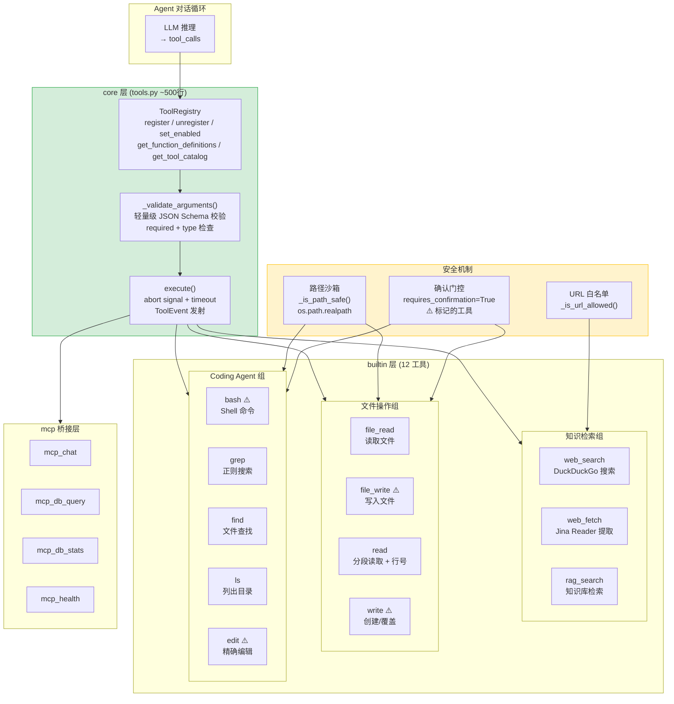

---

doc_type: module
prd_task_id: "YA-08-13"
title: "YA-08-13: Agent 工具系统 — ToolRegistry + 12 内置工具 + MCP 桥接 — 开发方案"
status: 已完成
priority: P1
owner: 陈铭
roles: [engineer]
created: 2026-09-11
updated: 2026-09-23
project: YiAi
project_id: yiai
prd_month: "202608"
estimate_frontend: 1.5
source_prd: "13-需求-Agent工具系统.md"
source_okr: [yiai-003]
related_tests: ["13-prd-test-Agent工具系统"]

type: task
---

# YA-08-13: Agent 工具系统 — ToolRegistry + 12 内置工具 + MCP 桥接 — 开发方案

> 来源 PRD：[13-需求-Agent工具系统.md](../../prds/2026-08/13-需求-Agent工具系统.md)
> 需求编号：YA-08-13 · 优先级：P1 · 人天：1.5d
> 类型：功能 · 状态：已完成

---

## 一、架构概述

为 YiAi Agent 提供 Pi-inspired 的可插拔工具系统，支持三个层次：**core**（ToolRegistry 注册表 + 执行引擎）、**builtin**（12 个内置工具，覆盖知识检索/文件操作/Coding Agent 三类）、**mcp**（4 个 MCP 桥接工具）。LLM 通过 function calling 调用工具，宿主程序执行并将结果返回给 LLM 继续推理。


```mermaid
graph TD
  subgraph Agent["Agent 对话循环"]
    LLM["LLM 推理<br/>→ tool_calls"]
  end

  subgraph Core["core 层 (tools.py ~500行)"]
    REG["ToolRegistry<br/>register / unregister / set_enabled<br/>get_function_definitions / get_tool_catalog"]
    VAL["_validate_arguments()<br/>轻量级 JSON Schema 校验<br/>required + type 检查"]
    EXEC["execute()<br/>abort signal + timeout<br/>ToolEvent 发射"]
  end

  subgraph Builtin["builtin 层 (12 工具)"]
    subgraph Knowledge["知识检索组"]
      WS["web_search<br/>DuckDuckGo 搜索"]
      WF["web_fetch<br/>Jina Reader 提取"]
      RS["rag_search<br/>知识库检索"]
    end
    subgraph Files["文件操作组"]
      FR["file_read<br/>读取文件"]
      FW["file_write ⚠️<br/>写入文件"]
      RD["read<br/>分段读取 + 行号"]
      WR["write ⚠️<br/>创建/覆盖"]
    end
    subgraph Coding["Coding Agent 组"]
      BS["bash ⚠️<br/>Shell 命令"]
      GR["grep<br/>正则搜索"]
      FND["find<br/>文件查找"]
      LS["ls<br/>列出目录"]
      ED["edit ⚠️<br/>精确编辑"]
    end
  end

  subgraph MCP["mcp 桥接层"]
    MC1["mcp_chat"]
    MC2["mcp_db_query"]
    MC3["mcp_db_stats"]
    MC4["mcp_health"]
  end

  subgraph Safety["安全机制"]
    SANDBOX["路径沙箱<br/>_is_path_safe()<br/>os.path.realpath"]
    URLWL["URL 白名单<br/>_is_url_allowed()"]
    CONFIRM["确认门控<br/>requires_confirmation=True<br/>⚠️ 标记的工具"]
  end

  LLM --> REG
  REG --> VAL
  VAL --> EXEC
  EXEC --> Knowledge
  EXEC --> Files
  EXEC --> Coding
  EXEC --> MCP
  SANDBOX --> Files
  SANDBOX --> Coding
  URLWL --> Knowledge
  CONFIRM --> Files
  CONFIRM --> Coding

  style Core fill:#d4edda,stroke:#28a745
  style Safety fill:#fff3cd,stroke:#ffc107
```

### 工具分组

| 组名 | 工具数 | 工具列表 | 说明 |
|------|--------|---------|------|
| knowledge (知识检索) | 3 | `web_search`, `web_fetch`, `rag_search` | 外部信息获取 |
| filesystem (文件操作) | 4 | `file_read`, `file_write`, `read`, `write` | 文件读写 (2 个需要确认) |
| coding (开发工具) | 5 | `bash`, `grep`, `find`, `ls`, `edit` | Coding Agent 工具 (2 个需要确认) |
| mcp (MCP 桥接) | 4 | `mcp_chat`, `mcp_db_query`, `mcp_db_stats`, `mcp_health` | MCP 工具代理 |

---

## 二、文件清单

| # | 文件 | 操作 | 说明 | 预估行数 |
|---|------|------|------|----------|
| 1 | `src/domain/ai/tools.py` | 新增 | 完整工具系统: 类型定义、ToolRegistry、12 内置工具、MCP 桥接、安全机制 | ~1143 |
| **合计** | | | | **~1143 行** |

### 组件树

```
src/domain/ai/tools.py (1143 行)
├── 类型定义
│   ├── ToolDefinition        — 工具声明: name, description, parameters, execute, requires_confirmation
│   ├── ToolCall              — LLM 发出的工具调用: id, name, arguments
│   ├── ToolResult            — 执行结果: call_id, content, error, duration_ms, details, terminate
│   └── ToolEvent             — 可观测性事件: phase, name, label, args, content, error, duration_ms
│
├── ToolRegistry (核心注册表)
│   ├── register(tool) → None
│   ├── unregister(name) → None
│   ├── set_enabled(name, enabled) → None
│   ├── get(name) → Optional[ToolDefinition]
│   ├── get_enabled() → List[ToolDefinition]
│   ├── get_function_definitions() → List[Dict]   # OpenAI 兼容格式
│   ├── get_tool_catalog() → List[Dict]            # UI 浏览用 (含 group 和 requires_confirmation)
│   └── execute(call, *, signal, on_event, on_progress, timeout) → ToolResult
│
├── 参数校验
│   └── _validate_arguments(name, arguments, schema) → Optional[str]
│
├── 12 个内置工具
│   ├── _register_builtin_tools(registry)
│   │   ├── web_search       — DuckDuckGo 搜索
│   │   ├── web_fetch        — URL 内容提取 (Jina + BeautifulSoup)
│   │   ├── rag_search       — 知识库检索
│   │   ├── file_read        — 读取文件
│   │   ├── file_write ⚠️     — 写入文件 (需确认)
│   │   ├── read             — 分段读取 (offset/limit + 行号)
│   │   ├── write ⚠️          — 创建/覆盖文件 (需确认)
│   │   ├── bash ⚠️           — Shell 命令 (需确认)
│   │   ├── grep             — 正则搜索
│   │   ├── find             — 文件查找 (glob)
│   │   ├── ls               — 列出目录
│   │   └── edit ⚠️           — 精确编辑 (需确认)
│   └── _group_for(tool_name) → "knowledge" | "filesystem" | "coding" | "agent"
│
├── MCP 桥接工具
│   ├── _register_mcp_tools(registry)
│   │   ├── mcp_chat         — MCP chat_with_ollama 代理
│   │   ├── mcp_db_query     — MCP query_collection 代理
│   │   ├── mcp_db_stats     — MCP health_check 代理
│   │   └── mcp_health       — MCP health_check 代理
│   └── _extract_mcp_text(result) → str
│
├── 安全机制
│   ├── _is_path_safe(abs_path) → bool          # 路径沙箱: os.path.realpath + 白名单目录
│   ├── _is_url_allowed(url) → bool              # URL 白名单: 拒绝内网 IP
│   └── _ALLOWED_BASES / _ALLOWED_URL_PATTERNS  # 白名单配置
│
└── 辅助函数
    └── _format_file_size(size_bytes) → str     # 文件大小格式化
```

---

## 三、模块设计

### 3.1 核心数据结构

```python
from dataclasses import dataclass, field
from typing import Any, Callable, Dict, List, Optional, Awaitable

@dataclass
class ToolDefinition:
    """工具声明 — 定义工具的名称、描述、参数和回调。"""
    name: str                          # 唯一标识符, 如 'web_search'
    description: str                   # LLM 可读的描述
    parameters: Dict[str, Any]         # JSON Schema 参数定义
    execute: Callable[..., Awaitable[Dict[str, Any]]]  # 异步执行函数
    requires_confirmation: bool = False  # 是否需要用户确认

@dataclass
class ToolCall:
    """LLM 发出的具体工具调用。"""
    id: str                            # 调用 ID (LLM 生成)
    name: str                          # 工具名称
    arguments: Dict[str, Any]          # 解析后的参数

@dataclass
class ToolResult:
    """工具执行结果。"""
    call_id: str
    name: str
    content: str                       # 返回给 LLM 的文本内容
    error: Optional[str] = None        # 错误信息
    duration_ms: float = 0             # 执行耗时
    details: Any = None                # 结构化详情 (不发给 LLM)
    terminate: bool = False            # 是否终止后续工具调用

@dataclass
class ToolEvent:
    """可观测性事件 — 工具执行的 3 个阶段。"""
    phase: str                         # "start" | "update" | "end"
    name: str
    label: str                         # 人类可读标签
    args: Optional[Dict[str, Any]] = None
    content: Optional[str] = None
    error: Optional[str] = None
    duration_ms: float = 0
    timestamp: float = 0.0
    tool_call_id: Optional[str] = None
    partial_result: Optional[Dict[str, Any]] = None
    is_error: bool = False
```

### 3.2 ToolRegistry — 注册表

```python
class ToolRegistry:
    """工具注册表 — 集中的启用/禁用控制、函数定义生成、工具目录生成。"""

    def __init__(self):
        self._tools: Dict[str, ToolDefinition] = {}
        self._enabled: Dict[str, bool] = {}

    def register(self, tool: ToolDefinition) -> None:
        """注册工具。重复注册会覆盖。"""
        self._tools[tool.name] = tool
        self._enabled[tool.name] = True

    def unregister(self, name: str) -> None:
        """注销工具。"""
        self._tools.pop(name, None)
        self._enabled.pop(name, None)

    def set_enabled(self, name: str, enabled: bool) -> None:
        """设置工具启用/禁用状态。"""
        if name in self._tools:
            self._enabled[name] = enabled

    def get(self, name: str) -> Optional[ToolDefinition]:
        """获取工具定义。"""
        return self._tools.get(name)

    def get_enabled(self) -> List[ToolDefinition]:
        """获取所有已启用的工具。"""
        return [t for name, t in self._tools.items()
                if self._enabled.get(name, True)]

    def get_function_definitions(self, max_tools: int = 12) -> List[Dict[str, Any]]:
        """返回 OpenAI/Anthropic 兼容的 function definitions。
        
        max_tools: 最大返回工具数 (防止超出 LLM context window)
        优先级: knowledge > filesystem > coding > mcp
        """
        defs: List[Dict[str, Any]] = []
        for tool in self.get_enabled()[:max_tools]:
            defs.append({
                "type": "function",
                "function": {
                    "name": tool.name,
                    "description": tool.description,
                    "parameters": tool.parameters,
                },
            })
        return defs

    def get_tool_catalog(self) -> List[Dict[str, Any]]:
        """返回富化的工具目录 (UI 浏览用)。"""
        return [
            {
                "name": tool.name,
                "description": tool.description,
                "parameters": tool.parameters,
                "requires_confirmation": tool.requires_confirmation,
                "group": _group_for(tool.name),
            }
            for tool in self.get_enabled()
        ]
```

### 3.3 轻量级参数校验 — `_validate_arguments`

```python
def _validate_arguments(
    name: str,
    arguments: Any,
    schema: Dict[str, Any],
) -> Optional[str]:
    """轻量级 JSON Schema 参数校验。
    
    仅检查 required 字段和 declared property types。
    返回 LLM 可直接理解的短错误消息 (而非完整 jsonschema 长英文错误)。
    
    类型检查顺序: boolean 必须在 integer 之前检查 (Python 中 bool 是 int 的子类)。
    """
    if arguments is None:
        arguments = {}
    if not isinstance(arguments, dict):
        return f"Arguments for '{name}' must be a JSON object, got {type(arguments).__name__}"
    
    props = schema.get("properties") or {}
    
    # 检查 required 字段
    for req_field in schema.get("required") or []:
        if req_field not in arguments:
            return f"Tool '{name}' is missing required argument '{req_field}'"
    
    # 检查类型
    for fname, value in arguments.items():
        ptype = (props.get(fname) or {}).get("type")
        # boolean 必须在 integer 之前 (isinstance(True, int) == True)
        if ptype == "boolean" and not isinstance(value, bool):
            return f"Tool '{name}' argument '{fname}' must be a boolean, got {type(value).__name__}"
        if ptype == "integer" and not isinstance(value, int):
            return f"Tool '{name}' argument '{fname}' must be an integer, got {type(value).__name__}"
        if ptype == "string" and not isinstance(value, str):
            return f"Tool '{name}' argument '{fname}' must be a string, got {type(value).__name__}"
        if ptype == "object" and not isinstance(value, dict):
            return f"Tool '{name}' argument '{fname}' must be an object, got {type(value).__name__}"
        if ptype == "array" and not isinstance(value, list):
            return f"Tool '{name}' argument '{fname}' must be an array, got {type(value).__name__}"
        if ptype == "number" and not isinstance(value, (int, float)):
            return f"Tool '{name}' argument '{fname}' must be a number, got {type(value).__name__}"
    
    return None  # 校验通过
```

### 3.4 执行引擎 — `ToolRegistry.execute`

```python
async def execute(
    self,
    call: ToolCall,
    *,
    signal: Optional[asyncio.Event] = None,
    on_event: Optional[Callable[[ToolEvent], Awaitable[None]]] = None,
    on_progress: Optional[Callable[[Dict[str, Any]], Awaitable[None]]] = None,
    timeout: float = 60.0,
) -> ToolResult:
    """执行工具调用。
    
    流程:
      1. 查找工具定义 → 不存在则返回 error
      2. 检查启用状态 → 禁用则返回 error
      3. 校验参数 (JSON Schema) → 不合法则返回 error (LLM 可读)
      4. 发射 ToolEvent(phase="start")
      5. 创建 asyncio.Task 执行工具 (支持 abort signal 轮询)
      6. 发射 ToolEvent(phase="end")
      7. 返回 ToolResult
    
    abort signal: 每 0.1s 轮询一次 signal.is_set()，触发则 cancel task。
    timeout: asyncio.wait_for 外层超时保护。
    """
    tool = self._tools.get(call.name)
    if tool is None:
        return ToolResult(call_id=call.id, name=call.name, content="",
                          error=f"Unknown tool: {call.name}")
    if not self._enabled.get(call.name, True):
        return ToolResult(call_id=call.id, name=call.name, content="",
                          error=f"Tool '{call.name}' is disabled")
    
    # 参数校验
    if tool.parameters:
        validate_error = _validate_arguments(call.name, call.arguments, tool.parameters)
        if validate_error:
            return ToolResult(call_id=call.id, name=call.name, content="", error=validate_error)
    
    start = time.monotonic()
    label = f"Running {call.name}..."
    
    # 发射 start 事件
    if on_event:
        await on_event(ToolEvent(phase="start", name=call.name, label=label,
                                 args=call.arguments, tool_call_id=call.id,
                                 timestamp=time.time()))
    
    # 执行 (带 abort + timeout)
    try:
        result = await asyncio.wait_for(
            self._run_with_abort(call, tool, signal, on_progress),
            timeout=timeout,
        )
        duration_ms = (time.monotonic() - start) * 1000
        
        content = result.get("content", "") if isinstance(result, dict) else str(result)
        error = result.get("error") if isinstance(result, dict) else None
        
        # 发射 end 事件
        if on_event:
            await on_event(ToolEvent(phase="end", name=call.name, label=label,
                                     content=content[:500], error=error,
                                     duration_ms=duration_ms, tool_call_id=call.id,
                                     timestamp=time.time()))
        
        return ToolResult(call_id=call.id, name=call.name, content=content,
                          error=error, duration_ms=duration_ms,
                          details=result.get("details") if isinstance(result, dict) else None)
    
    except asyncio.TimeoutError:
        duration_ms = (time.monotonic() - start) * 1000
        err = f"Tool execution timed out after {timeout}s"
        return ToolResult(call_id=call.id, name=call.name, content="", error=err,
                          duration_ms=duration_ms)
    except asyncio.CancelledError:
        return ToolResult(call_id=call.id, name=call.name, content="",
                          error="Tool execution aborted", duration_ms=0)
    except Exception as e:
        err_msg = f"{type(e).__name__}: {e}"
        return ToolResult(call_id=call.id, name=call.name, content="",
                          error=err_msg, duration_ms=(time.monotonic() - start) * 1000)
```

### 3.5 路径沙箱 — `_is_path_safe`

```python
_ALLOWED_BASES: List[str] = [
    # 在模块加载时通过 os.path.abspath 解析为绝对路径
]

def _resolve_allowed_bases() -> None:
    """初始化白名单基目录列表。"""
    global _ALLOWED_BASES
    yi_root = os.path.abspath(os.path.join(os.path.dirname(__file__), "../../../.."))
    _ALLOWED_BASES = [
        os.path.abspath(os.path.join(yi_root, "YiKnowledge")),
        os.path.abspath(os.path.join(yi_root, "YiAi")),
        os.path.abspath(os.path.join(yi_root, "YiVad")),
        os.path.abspath(os.path.join(yi_root, "YiPet")),
    ]

def _is_path_safe(abs_path: str) -> bool:
    """路径沙箱检查: os.path.realpath 解析符号链接后前缀匹配白名单。
    
    防护:
      - 符号链接绕过: os.path.realpath 解析真实路径
      - 相对路径遍历: 先 os.path.abspath 转绝对路径
      - 白名单前缀匹配: 必须在允许的基目录内
    """
    try:
        real = os.path.realpath(abs_path)
    except (OSError, ValueError):
        return False
    for base in _ALLOWED_BASES:
        base_real = os.path.realpath(base) if os.path.exists(base) else base
        if real.startswith(base_real + os.sep) or real == base_real:
            return True
    return False
```

---

## 四、内置工具清单

### 4.1 知识检索组

```python
# web_search: DuckDuckGo 搜索 → [{title, url, snippet}]
registry.register(ToolDefinition(
    name="web_search",
    description="Search the web for current information. Returns titles, URLs, and descriptions.",
    parameters={
        "type": "object",
        "properties": {
            "query": {"type": "string", "description": "The search query"},
            "max_results": {"type": "integer", "description": "Max results (1-10, default 6)"},
        },
        "required": ["query"],
    },
    execute=_web_search,
))

# web_fetch: URL → Jina Reader → BeautifulSoup fallback
registry.register(ToolDefinition(
    name="web_fetch",
    description="Fetch and extract text content from a web page URL.",
    parameters={
        "type": "object",
        "properties": {
            "url": {"type": "string", "description": "The URL to fetch"},
        },
        "required": ["url"],
    },
    execute=_web_fetch,
))

# rag_search: 搜索 YiKnowledge 内部知识库
registry.register(ToolDefinition(
    name="rag_search",
    description="Search the internal YiKnowledge knowledge base for relevant documents.",
    parameters={
        "type": "object",
        "properties": {
            "query": {"type": "string", "description": "Search query"},
            "scope": {"type": "string", "description": "Optional path scope filter"},
        },
        "required": ["query"],
    },
    execute=_rag_search,
))
```

### 4.2 Coding Agent 工具组

```python
# bash: Shell 命令执行 (需确认 + 30s 超时 + 路径沙箱)
registry.register(ToolDefinition(
    name="bash",
    description="Execute a shell command (build/test/lint/git). Working directory is sandboxed.",
    parameters={
        "type": "object",
        "properties": {
            "command": {"type": "string", "description": "Shell command to execute"},
            "cwd": {"type": "string", "description": "Working directory (must be within allowed bases)"},
        },
        "required": ["command"],
    },
    execute=_bash,
    requires_confirmation=True,
))

# grep: 正则搜索文件内容 → [file:line: content]
registry.register(ToolDefinition(
    name="grep",
    description="Search file contents with regex. Returns file:line references.",
    parameters={
        "type": "object",
        "properties": {
            "pattern": {"type": "string", "description": "Regex pattern to search for"},
            "path": {"type": "string", "description": "Directory or file to search (default: YiKnowledge/)"},
            "include": {"type": "string", "description": "File glob pattern to include (e.g. '*.md')"},
        },
        "required": ["pattern"],
    },
    execute=_grep,
))

# edit: 精确字符串替换 (需确认 + old_string 唯一性检查)
registry.register(ToolDefinition(
    name="edit",
    description="Edit a file by replacing an exact string match. old_string must be unique.",
    parameters={
        "type": "object",
        "properties": {
            "file_path": {"type": "string", "description": "File path to edit"},
            "old_string": {"type": "string", "description": "Exact string to replace (must be unique)"},
            "new_string": {"type": "string", "description": "Replacement string"},
            "occurrence": {"type": "integer", "description": "If old_string appears multiple times, which occurrence to replace (1-based)"},
        },
        "required": ["file_path", "old_string", "new_string"],
    },
    execute=_edit,
    requires_confirmation=True,
))
```

---

## 五、实施路线图

| 步骤 | 内容 | 涉及函数 | 验证方式 | 人天 |
|------|------|---------|---------|------|
| 1 | 定义核心数据结构 | `ToolDefinition`, `ToolCall`, `ToolResult`, `ToolEvent` | dataclass 序列化/反序列化正确 | 0.15 |
| 2 | 实现 ToolRegistry 注册表 | `register`, `unregister`, `set_enabled`, `get_function_definitions` | 注册/启用/禁用/查询全流程 | 0.20 |
| 3 | 参数校验 + 执行引擎 | `_validate_arguments`, `execute` (with abort/timeout/events) | 合法参数通过，非法参数返回 LLM 可读错误 | 0.25 |
| 4 | 实现 12 个内置工具 | `_register_builtin_tools` + 12 execute 函数 | 每个工具独立可执行，参数校验正确 | 0.50 |
| 5 | 实现安全机制 | `_is_path_safe`, `_is_url_allowed`, `requires_confirmation` | 路径遍历拒绝，URL 白名单过滤，危险操作确认 | 0.20 |
| 6 | 实现 MCP 桥接 + 测试 | `_register_mcp_tools`, BDD 场景测试 | MCP Server 可用时工具正常调用 | 0.20 |
| **合计** | | | | **1.5d** |

---

## 六、代码审查检查清单

- [ ] `ToolDefinition.execute` 签名正确 (`async def`, 接收 `arguments: Dict`, 返回 `Dict`)
- [ ] `_validate_arguments` 覆盖 required + string/object/array/boolean/integer/number 类型
- [ ] boolean 类型检查在 integer 之前 (防止 `isinstance(True, int)` 误判)
- [ ] `ToolRegistry.execute()` 正确处理: 工具不存在、工具禁用、参数非法、执行超时、abort signal
- [ ] `_is_path_safe` 使用 `os.path.realpath` 解析符号链接
- [ ] `_is_url_allowed` 白名单包含所有需要的域名
- [ ] `requires_confirmation=True` 的工具在 Agent 循环中有确认步骤
- [ ] `ToolEvent` 在 start/end 两个阶段正确发射
- [ ] `on_progress` 回调在 `web_fetch` 等长运行工具中正确传递
- [ ] MCP 工具 `_extract_mcp_text` 正确处理各种 MCP 响应格式
- [ ] `get_function_definitions` 有 `max_tools` 参数 (防止超出 context window)
- [ ] `ruff` 代码规范通过

---

## 七、技术风险评估

| 风险 | 概率 | 影响 | 等级 | 缓解措施 | 应急预案 |
|------|------|------|------|---------|---------|
| LLM 输出不合法工具参数 | 高 | 中 | 中 | `_validate_arguments` 返回 LLM 可读错误 | 连续 3 次校验失败终止调用 |
| Shell 命令执行危险操作 | 中 | 高 | 高 | `requires_confirmation=True`, 30s 超时, 路径沙箱 | 用户拒绝后记录日志 |
| web_fetch SSRF 攻击 | 中 | 高 | 高 | URL 白名单, 拒绝内网 IP | 安全日志告警 |
| 路径遍历绕过沙箱 | 低 | 高 | 中 | `os.path.realpath` 解析符号链接 | 拒绝访问 + 告警日志 |
| 工具执行超时导致 Agent 挂起 | 中 | 中 | 中 | 60s 超时 + abort signal | 返回超时错误，Agent 继续 |

---

## 八、已知缺陷与技术债务

### 8.1 重构后发现的回归问题

| # | 问题 | 根因 | 修复方式 |
|---|------|------|---------|
| 1 | `_validate_arguments` integer 接受 bool | `isinstance(True, int)` → True | boolean 检查移到 integer 之前 |
| 2 | abort signal 轮询间隔 0.5s 延迟感知 | `asyncio.wait_for(shield, 0.5)` 轮询间隔长 | 降至 0.1s + `asyncio.wait` 事件驱动 |
| 3 | web_fetch Jina 403 页面误判成功 | 仅检查 HTTP 200 | 添加 Content-Type text/markdown 检查 |
| 4 | edit old_string 重复时拒绝 | 模板代码中 import 语句重复 | 添加 occurrence 参数 |

### 8.2 技术债务

| # | 技术债 | 优先级 | 预计人天 | 说明 |
|---|--------|--------|---------|------|
| 1 | 工具执行结果缓存 | P2 | 0.3 | web_search/rag_search TTL 缓存 |
| 2 | 工具并行执行 | P2 | 0.5 | 独立工具调用并行执行 |
| 3 | 工具调用审计日志 | P2 | 0.3 | 记录到 tool_calls 集合 |
| 4 | 工具版本管理 | P3 | 0.5 | Schema 版本追踪 |
| 5 | 工具超时自适应 | P3 | 0.3 | 根据工具类型动态调整超时 |

---

## 九、可观测性

| 指标 | 采集方式 | 告警阈值 | 说明 |
|------|---------|----------|------|
| 工具调用成功率 | `ToolResult.error is None` 计数 | < 95% | 工具执行失败率 |
| 工具执行耗时 P95 | `ToolResult.duration_ms` | > 10s | 工具执行过慢 |
| 参数校验失败率 | `_validate_arguments` 返回非 None | > 10% | LLM 频繁输出不合法参数 |
| 工具超时次数 | `asyncio.TimeoutError` 计数 | > 5% | 超时设置或工具异常 |
| 路径沙箱拒绝次数 | `_is_path_safe → False` 计数 | > 5/min | 可能的攻击尝试 |

### 日志规范

| 日志级别 | 场景 | 示例 |
|---------|------|------|
| `INFO` | 工具调用开始 | `[Tool] {name}: start, args={args}` |
| `INFO` | 工具调用完成 | `[Tool] {name}: done in {ms}ms, content={len}c` |
| `WARN` | 参数校验失败 | `[Tool] {name}: validation failed: {error}` |
| `ERROR` | 工具执行失败 | `[Tool] {name}: {error}` |
| `ERROR` | 路径沙箱拒绝 | `[Tool] {name}: path not allowed: {path}` |

---

## 十、关联模块

- **上游依赖**：YA-08-10（Web 搜索 — `web_search`/`web_fetch` 工具
- **上游依赖**：YA-08-12（MCP 协议服务 — MCP 桥接工具）
- **上游依赖**：YA-07-01（混合检索引擎 — `rag_search` 工具）
- **上游依赖**：YA-08-14（ModelRuntime 抽象层 — Agent 推理）
- **下游消费**：YA-07-04（AI 聊天服务 — Agent 模式聊天循环）