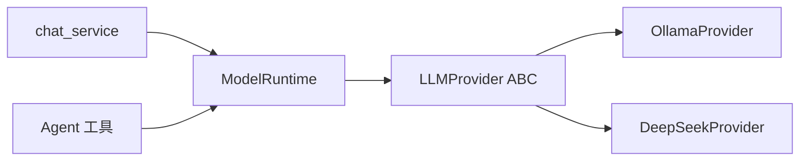

# YA-08-14: ModelRuntime 抽象层 — 多 Provider 统一流式接口 — 开发方案

> 来源 PRD：[14-需求-ModelRuntime抽象层.md](../../prds/2026-08/14-需求-ModelRuntime抽象层.md)
> 需求编号：YA-08-14 · 优先级：P1 · 人天：1.5d
> 类型：架构 · 状态：已完成

---

## 一、方案概述

在 `LLMProvider` 之上封装 `ModelRuntime`——提供统一的流式接口 `stream_chat()`，隐藏 Provider 差异。上层调用方（聊天服务、Agent）只需依赖 `ModelRuntime`，不感知底层 Provider。



### 与 LLMProvider 的关系

| 层 | 职责 | 调用方 |
|----|------|--------|
| `LLMProvider` | 单个 Provider 的 `chat()` / `chat_stream()` 实现 | `ModelRuntime` |
| `ModelRuntime` | 多 Provider 路由、重试、fallback | 聊天服务、Agent |

---

## 二、核心接口

```python
class ModelRuntime:
    def __init__(self, primary: str = "ollama", fallback: str | None = None):
        self.primary = self._get_provider(primary)
        self.fallback = self._get_provider(fallback) if fallback else None

    async def stream_chat(self, messages: list, **kwargs) -> AsyncGenerator[str, None]:
        try:
            async for token in self.primary.chat_stream(messages, **kwargs):
                yield token
        except ProviderError:
            if self.fallback:
                async for token in self.fallback.chat_stream(messages, **kwargs):
                    yield token
            else:
                raise
```

---

## 三、实施步骤

| 步骤 | 内容 | 验证 | 人天 |
|------|------|------|------|
| 1 | ModelRuntime 封装 + Provider 路由 | Provider 切换正确 | 0.5 |
| 2 | fallback 自动切换 | 主 Provider 故障时自动切 | 0.5 |
| 3 | 集成到 chat_service + 测试 | 聊天服务透明使用 | 0.5 |

**合计：1.5d**。

---

## 四、关联模块

- 依赖：[YA-08-02 Multi-Provider LLM](./02-prd-task-Multi-Provider-LLM.md)
- 消费：[YA-07-04 AI 聊天服务](../2026-07/04-prd-task-AI聊天服务.md)
- 消费：[YA-08-13 Agent 工具系统](./13-prd-task-Agent工具系统.md)