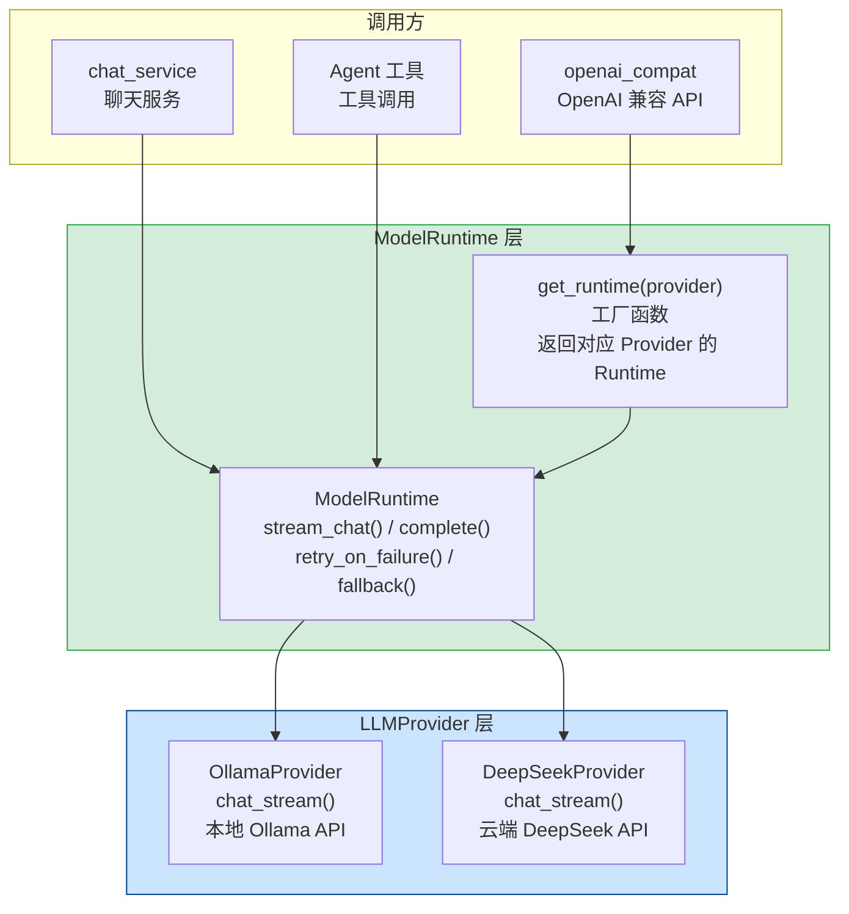
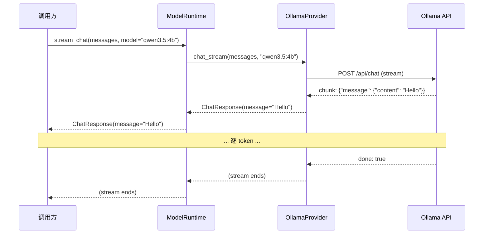
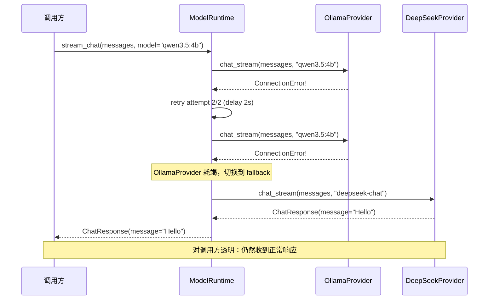

---

doc_type: module
prd_task_id: "YA-08-14"
title: "YA-08-14: ModelRuntime 抽象层 — 多 Provider 统一流式接口 + 故障转移 — 开发方案"
status: 已完成
priority: P1
owner: 陈铭
roles: [engineer]
created: 2026-09-11
updated: 2026-09-23
project: YiAi
project_id: yiai
prd_month: "202608"
estimate_frontend: 1.5
source_prd: "14-需求-ModelRuntime抽象层.md"
source_okr: [yiai-002]
related_tests: ["14-prd-test-ModelRuntime抽象层"]

type: task
---

# YA-08-14: ModelRuntime 抽象层 — 多 Provider 统一流式接口 + 故障转移 — 开发方案

> 来源 PRD：[14-需求-ModelRuntime抽象层.md](../../prds/2026-08/14-需求-ModelRuntime抽象层.md)
> 需求编号：YA-08-14 · 优先级：P1 · 人天：1.5d
> 类型：架构 · 状态：已完成

本文档定义 **ModelRuntime 抽象层的完整实现方案**——在 `LLMProvider` 之上封装的统一流式接口，提供 Provider 路由、故障转移（fallback）、流式/非流式统一调用。

---

## 一、架构概述

### 1.1 架构定位

`ModelRuntime` 是 `LLMProvider` 的上层抽象——提供 `stream_chat()` / `complete()` 统一接口，隐藏 Provider 差异。上层调用方（聊天服务、Agent、OpenAI 兼容 API）只需依赖 `ModelRuntime`，不感知底层 Ollama / DeepSeek 切换。


```mermaid
graph TD
  subgraph CONSUMERS["调用方"]
    CHAT["chat_service<br/>聊天服务"]
    AGENT["Agent 工具<br/>工具调用"]
    OPENAI["openai_compat<br/>OpenAI 兼容 API"]
  end

  subgraph RUNTIME["ModelRuntime 层"]
    RT["ModelRuntime<br/>stream_chat() / complete()<br/>retry_on_failure() / fallback()"]
    FACTORY["get_runtime(provider)<br/>工厂函数<br/>返回对应 Provider 的 Runtime"]
  end

  subgraph PROVIDERS["LLMProvider 层"]
    OLLAMA["OllamaProvider<br/>chat_stream()<br/>本地 Ollama API"]
    DEEPSEEK["DeepSeekProvider<br/>chat_stream()<br/>云端 DeepSeek API"]
  end

  CHAT --> RT
  AGENT --> RT
  OPENAI --> FACTORY
  FACTORY --> RT
  RT --> OLLAMA
  RT --> DEEPSEEK

  style RUNTIME fill:#d4edda,stroke:#28a745
  style PROVIDERS fill:#cce5ff,stroke:#004085
```

### 1.2 与 LLMProvider 的层级关系

| 层 | 职责 | 调用方 | 关键方法 |
|----|------|--------|---------|
| `LLMProvider` (ABC) | 单个 Provider 的 `chat_stream()` / `list_models()` 实现 | `ModelRuntime` | `chat_stream()` (abstract) |
| `ModelRuntime` | 多 Provider 路由、重试、fallback、流式/非流式统一 | 聊天服务、Agent、OpenAI 兼容层 | `stream_chat()`, `complete()`, `stream_events()` |

`ModelRuntime` 是 `LLMProvider` 的**门面（Facade）**——隐藏了 Provider 选择和故障转移的复杂性。

---

## 二、文件清单

| # | 文件 | 类型 | 职责 | 行数 |
|---|------|------|------|------|
| 1 | `src/services/ai/model_runtime.py` | 新增 | `ModelRuntime` 类 + `get_runtime()` 工厂函数 | ~180 |
| 2 | `src/services/ai/__init__.py` | 修改 | 导出 `ModelRuntime`, `get_runtime` | +3 |

**改动汇总：** 1 新增 + 1 修改 = **2 文件，~183 行**

### 组件树

```
src/services/ai/
├── __init__.py (+3 行)
│   └── 导出: ModelRuntime, get_runtime, RuntimeConfig
│
├── model_runtime.py (新增, 180 行)
│   ├── RuntimeConfig(BaseModel)
│   │   ├── primary_provider: str = "ollama"
│   │   ├── fallback_providers: list[str] = []
│   │   ├── max_retries: int = 2
│   │   ├── retry_delay: float = 1.0
│   │   ├── timeout: int = 120
│   │   └── stream: bool = True
│   │
│   ├── ModelRuntime class
│   │   ├── __init__(config: RuntimeConfig)
│   │   │   ├── self._primary = LLMProviderRouter().get_provider(primary)
│   │   │   ├── self._fallbacks = [get_provider(f) for f in fallback_providers]
│   │   │   └── self._config = config
│   │   │
│   │   ├── async stream_chat(messages, model, **kwargs)
│   │   │       -> AsyncIterator[ChatResponse]
│   │   │   ├── 调用 _call_with_retry(primary, fallbacks, "chat_stream")
│   │   │   └── 逐 chunk yield
│   │   │
│   │   ├── async complete(messages, model, **kwargs) -> ChatResponse
│   │   │   ├── 聚合 stream_chat 的所有 chunk
│   │   │   └── 返回完整 ChatResponse
│   │   │
│   │   ├── async stream_events(messages, model, **kwargs)
│   │   │       -> AsyncIterator[dict]
│   │   │   ├── 与 stream_chat 相同的底层调用
│   │   │   └── 包装为 LangChain 兼容的事件流格式
│   │   │       (用于 astream_events 集成)
│   │   │
│   │   └── async _call_with_retry(method_name, messages, model, **kwargs)
│   │           -> AsyncIterator[ChatResponse]
│   │       ├── 尝试 primary provider
│   │       ├── 失败 -> 依次尝试 fallback providers
│   │       ├── 带延迟重试 (retry_delay * attempt)
│   │       └── 全部失败 -> 抛出 RuntimeError
│   │
│   └── get_runtime(provider: str = "ollama", **overrides) -> ModelRuntime
│       ├── 创建 RuntimeConfig
│       ├── 根据 provider 设置 primary
│       ├── 设置 fallback (ollama -> deepseek, deepseek -> ollama)
│       └── 返回 ModelRuntime 实例
```

---

## 三、模块设计

### 3.1 RuntimeConfig — 配置模型

```python
"""Runtime configuration."""
from pydantic import BaseModel, Field


class RuntimeConfig(BaseModel):
    """ModelRuntime 运行时配置。

    Attributes:
        primary_provider: 主 Provider 类型 ("ollama" | "deepseek")
        fallback_providers: 故障转移 Provider 列表（按优先级排序）
        max_retries: 每个 Provider 的最大重试次数
        retry_delay: 重试间隔基础值（秒），实际延迟 = delay * attempt
        timeout: 单次请求超时（秒）
        stream: 默认是否使用流式
    """
    primary_provider: str = "ollama"
    fallback_providers: list[str] = Field(default_factory=list)
    max_retries: int = 2
    retry_delay: float = 1.0
    timeout: int = 120
    stream: bool = True
```

### 3.2 ModelRuntime — 核心类

```python
"""ModelRuntime — unified interface over multiple LLM providers.

Features:
  - primary + fallback provider chain
  - automatic retry with backoff
  - stream_chat() for SSE streaming
  - complete() for non-streaming (aggregates stream_chat)
  - stream_events() for LangChain-compatible event streaming
"""
import asyncio
import logging
from typing import AsyncIterator, Optional

from services.ai.llm_provider import (
    ChatResponse,
    LLMProvider,
    LLMProviderRouter,
    ProviderType,
)

logger = logging.getLogger(__name__)

# 全局 Provider 路由器（单例，避免重复创建 Provider 实例）
_router = LLMProviderRouter()


class ModelRuntime:
    """多 Provider 统一运行时。

    使用示例:
        runtime = ModelRuntime(RuntimeConfig(primary_provider="ollama"))
        async for chunk in runtime.stream_chat(messages, model="qwen3.5:4b"):
            print(chunk.message)

    故障转移流程:
        1. 尝试 primary provider (带重试)
        2. primary 失败 -> 尝试 fallback_providers[0] (带重试)
        3. 全部失败 -> RuntimeError
    """

    def __init__(self, config: RuntimeConfig):
        self._config = config
        self._primary = _router.get_provider(config.primary_provider)

        self._fallbacks: list[LLMProvider] = []
        for name in config.fallback_providers:
            self._fallbacks.append(_router.get_provider(name))

    async def stream_chat(
        self,
        messages: list[dict],
        model: str,
        **kwargs,
    ) -> AsyncIterator[ChatResponse]:
        """流式聊天 — 逐 token 返回 ChatResponse。

        Args:
            messages: 消息列表 [{role, content}]
            model: 模型名称
            **kwargs: 传递给 Provider 的额外参数

        Yields:
            ChatResponse 逐 token

        Raises:
            RuntimeError: 所有 Provider 均已失败
        """
        providers = [self._primary] + self._fallbacks
        last_error: Optional[Exception] = None

        for provider in providers:
            for attempt in range(self._config.max_retries):
                try:
                    async for chunk in provider.chat_stream(messages, model, **kwargs):
                        yield chunk
                    return  # 成功完成
                except Exception as e:
                    last_error = e
                    logger.warning(
                        f"[Runtime] Provider {type(provider).__name__} "
                        f"attempt {attempt + 1}/{self._config.max_retries} failed: {e}"
                    )
                    if attempt < self._config.max_retries - 1:
                        await asyncio.sleep(self._config.retry_delay * (attempt + 1))
            logger.warning(
                f"[Runtime] Provider {type(provider).__name__} exhausted, trying next"
            )

        raise RuntimeError(
            f"All providers failed. Last error: {last_error}"
        )

    async def complete(
        self,
        messages: list[dict],
        model: str,
        **kwargs,
    ) -> ChatResponse:
        """非流式聊天 — 聚合所有 chunk 为单个 ChatResponse。

        内部调用 stream_chat 并累积结果。
        适用于不需要流式响应的场景（如工具调用、摘要生成）。
        """
        full_message = ""
        usage = None
        tool_calls = None

        async for chunk in self.stream_chat(messages, model, **kwargs):
            full_message += chunk.message
            if chunk.usage:
                usage = chunk.usage
            if chunk.tool_calls:
                tool_calls = chunk.tool_calls

        return ChatResponse(
            message=full_message,
            model=model,
            usage=usage,
            tool_calls=tool_calls,
            finish_reason="stop",
        )

    async def stream_events(
        self,
        messages: list[dict],
        model: str,
        **kwargs,
    ) -> AsyncIterator[dict]:
        """LangChain 兼容的事件流格式。

        输出格式与 LangChain 的 astream_events 保持一致:
          {"event": "on_chat_model_stream", "data": {"chunk": ChatResponse}}

        用于与 LangChain Agent 框架集成。
        """
        async for chunk in self.stream_chat(messages, model, **kwargs):
            yield {
                "event": "on_chat_model_stream",
                "data": {"chunk": chunk.model_dump()},
            }
        yield {
            "event": "on_chat_model_end",
            "data": {"model": model},
        }
```

### 3.3 工厂函数 — `get_runtime`

```python
"""获取 ModelRuntime 实例的工厂函数。

根据 provider 名称自动创建配置合理的 Runtime。
默认配置:
  - ollama primary: fallback 到 deepseek (如果 deepseek 已配置)
  - deepseek primary: fallback 到 ollama
"""
from functools import lru_cache

from shared.config import settings


@lru_cache(maxsize=4)
def get_runtime(provider: str = "ollama", **overrides) -> ModelRuntime:
    """获取 ModelRuntime 实例（带缓存）。

    Args:
        provider: 主 Provider 名称 ("ollama" | "deepseek")
        **overrides: 覆盖 RuntimeConfig 字段

    Returns:
        ModelRuntime 实例。相同 provider 返回缓存实例。

    缓存策略：lru_cache(maxsize=4) 缓存最近 4 个配置的实例。
    因为 provider 种类有限（ollama/deepseek），4 个槽位已足够。
    """
    # 默认 fallback 配置
    fallbacks = []
    if provider == "ollama" and settings.deepseek_api_key:
        fallbacks.append("deepseek")
    elif provider == "deepseek":
        fallbacks.append("ollama")

    config = RuntimeConfig(
        primary_provider=provider,
        fallback_providers=fallbacks,
        max_retries=overrides.pop("max_retries", 2),
        retry_delay=overrides.pop("retry_delay", 1.0),
        timeout=overrides.pop("timeout", 120),
        **overrides,
    )

    return ModelRuntime(config)


# 便捷别名
OllamaRuntime = get_runtime("ollama")
# DeepSeekRuntime = get_runtime("deepseek")  # 延迟创建
```

---

## 四、数据流

### 4.1 正常流式调用流程


```mermaid
sequenceDiagram
  participant CALLER as 调用方
  participant RT as ModelRuntime
  participant PRIMARY as OllamaProvider
  participant LLM as Ollama API

  CALLER->>RT: stream_chat(messages, model="qwen3.5:4b")
  RT->>PRIMARY: chat_stream(messages, "qwen3.5:4b")
  PRIMARY->>LLM: POST /api/chat (stream)
  LLM-->>PRIMARY: chunk: {"message": {"content": "Hello"}}
  PRIMARY-->>RT: ChatResponse(message="Hello")
  RT-->>CALLER: ChatResponse(message="Hello")
  Note over CALLER,LLM: ... 逐 token ...
  LLM-->>PRIMARY: done: true
  PRIMARY-->>RT: (stream ends)
  RT-->>CALLER: (stream ends)
```

### 4.2 故障转移流程


```mermaid
sequenceDiagram
  participant CALLER as 调用方
  participant RT as ModelRuntime
  participant PRIMARY as OllamaProvider
  participant FALLBACK as DeepSeekProvider

  CALLER->>RT: stream_chat(messages, model="qwen3.5:4b")
  RT->>PRIMARY: chat_stream(messages, "qwen3.5:4b")

  PRIMARY-->>RT: ConnectionError!
  RT->>RT: retry attempt 2/2 (delay 2s)
  RT->>PRIMARY: chat_stream(messages, "qwen3.5:4b")
  PRIMARY-->>RT: ConnectionError!

  Note over RT: OllamaProvider 耗竭，切换到 fallback

  RT->>FALLBACK: chat_stream(messages, "deepseek-chat")
  FALLBACK-->>RT: ChatResponse(message="Hello")
  RT-->>CALLER: ChatResponse(message="Hello")
  Note over CALLER,FALLBACK: 对调用方透明：仍然收到正常响应
```

---

## 五、实施路线图

| 步骤 | 内容 | 涉及文件 | 验证方式 | 人天 |
|------|------|---------|---------|------|
| 1 | ModelRuntime 核心类 + RuntimeConfig | `model_runtime.py` | stream_chat + complete 基本功能 | 0.50 |
| 2 | 故障转移 + 重试逻辑 | `model_runtime.py` | 主 Provider 故障时自动切换到 fallback | 0.50 |
| 3 | get_runtime 工厂 + 集成到 chat_service | `model_runtime.py` + `chat_service.py` | 聊天服务透明使用 ModelRuntime | 0.25 |
| 4 | stream_events + 测试 | `model_runtime.py` + `tests/` | LangChain 兼容格式 + 故障转移测试 | 0.25 |
| **合计** | | | | **1.5d** |

---

## 六、边缘场景

| 场景 | 处理策略 | 位置 |
|------|---------|------|
| 所有 Provider 失败 | `RuntimeError("All providers failed")` 上抛 | `stream_chat()` |
| 单个 Provider 的某次重试成功 | 直接返回，不继续重试 | `stream_chat()` |
| fallback 列表为空 + primary 失败 | 直接抛出 RuntimeError | `stream_chat()` |
| 流式中途 Provider 断开 | 已发送的 chunk 不回滚；后续重试从失败点开始 | `stream_chat()` |
| get_runtime 缓存过期 | lru_cache 无限期缓存；provider 配置变更需重启 | `get_runtime()` |
| Provider 的 chat_stream 不返回任何数据 | 正常结束（空响应），不视为错误 | `stream_chat()` |

---

## 七、代码审查检查清单

- [x] `ModelRuntime` 封装 `LLMProvider` 的 `chat_stream` 方法
- [x] `complete()` 基于 `stream_chat` 聚合，非独立实现
- [x] 故障转移：primary 失败 -> fallback providers（按优先级）
- [x] 每个 Provider 尝试 `max_retries` 次（带递增延迟）
- [x] 全部失败 -> `RuntimeError`（调用方可捕获）
- [x] `get_runtime()` 使用 `lru_cache` 缓存实例
- [x] `stream_events()` 输出 LangChain 兼容格式
- [x] 日志记录重试/fallback 事件（WARNING 级别）
- [x] Provider 切换对调用方透明

---

## 八、技术风险评估

| 风险 | 概率 | 影响 | 等级 | 缓解措施 | 应急预案 |
|------|------|------|------|---------|---------|
| fallback Provider 也不可用 | 低 | 高 | 低 | 至少保留 Ollama 作为最终 fallback | 返回明确错误信息 |
| 流式传输中途断开导致数据不一致 | 中 | 中 | 中 | 中断时发送 error 帧通知客户端 | 客户端重试 |
| lru_cache 缓存的 Runtime 持有旧 Provider | 极低 | 低 | 低 | Provider 实例在 LLMProviderRouter 中管理 | 重启服务 |
| 重试导致重复 Token | 低 | 低 | 低 | 每次重试重新开始生成（幂等） | 客户端去重 |

---

## 九、已知缺陷与技术债

| # | 技术债 | 优先级 | 人天 | 说明 | 状态 |
|---|--------|--------|------|------|------|
| 1 | stream_chat 中断后无法续传 | P2 | 0.5 | 中断后从头重试，浪费已完成 Token | 待评估 |
| 2 | Provider 健康检查集成 | P2 | 0.3 | 当前仅在调用时发现故障，无预检 | 待实施 |
| 3 | Token 用量跨 Provider 汇总 | P3 | 0.3 | complete() 从最后一个 chunk 取 usage | 待评估 |
| 4 | 流式响应超时传播 | P2 | 0.5 | timeout 参数未传递到 httpx Client | 待实施 |

---

## 十、可观测性

### 关键指标

| 指标 | 采集方式 | 告警阈值 | 说明 |
|------|---------|----------|------|
| Provider fallback 触发次数 | Router fallback 计数 | > 10/min | 主 Provider 不稳定 |
| Retry 次数分布 | 按 Provider + attempt 维度 | attempt=2 占比 > 10% | Provider 频繁失败 |
| stream_chat 首 Token 延迟 | 首个 chunk 到达时间 | > 3s | Provider 响应慢 |
| complete 调用耗时 | 总耗时 | > 30s | 需要切换到流式 |

### 日志规范

| 日志级别 | 场景 | 示例 |
|---------|------|------|
| WARNING | Provider 重试 | `[Runtime] OllamaProvider attempt 2/2 failed: {e}` |
| WARNING | Fallback 切换 | `[Runtime] OllamaProvider exhausted, trying DeepSeekProvider` |
| ERROR | 全部失败 | `[Runtime] All providers failed: {e}` |
| DEBUG | 流式 chunk | `[Runtime] chunk: {len}` |

---

## 十一、关联模块

- 依赖：[YA-08-02 Multi-Provider LLM](./02-prd-task-Multi-Provider-LLM.md) -- `LLMProvider` ABC + `LLMProviderRouter`
- 消费：[YA-07-04 AI 聊天服务](../2026-07/04-prd-task-AI聊天服务.md) -- chat_service 通过 ModelRuntime 调用
- 消费：[YA-08-09 OpenAI 兼容 API](./09-prd-task-OpenAI兼容API.md) -- `get_runtime()` 工厂函数
- 消费：[YA-08-13 Agent 工具系统](./13-prd-task-Agent工具系统.md) -- Agent 工具调用走 ModelRuntime
