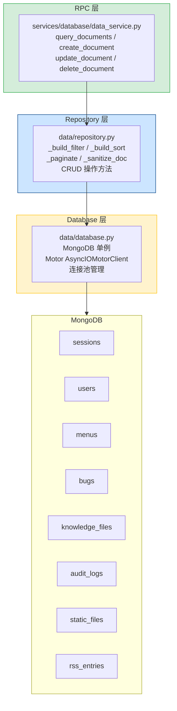
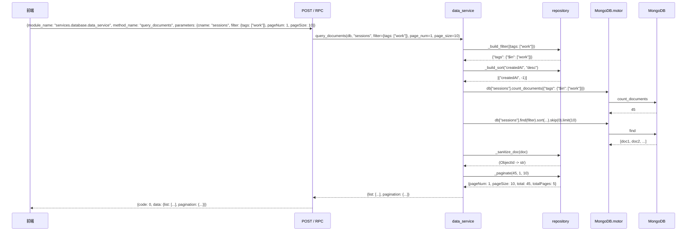

---

doc_type: module
prd_task_id: "YA-08-15"
title: "YA-08-15: 数据访问层 — MongoDB 单例 + Repository 模式 + 连接池 — 开发方案"
status: 已完成
priority: P1
owner: 陈铭
roles: [engineer]
created: 2026-09-11
updated: 2026-09-23
project: YiAi
project_id: yiai
prd_month: "202608"
estimate_frontend: 1.5
source_prd: "15-需求-数据访问层.md"
source_okr: [yiai-001]
related_tests: ["15-prd-test-数据访问层"]

type: task
---

# YA-08-15: 数据访问层 — MongoDB 单例 + Repository 模式 + 连接池 — 开发方案

> 来源 PRD：[15-需求-数据访问层.md](../../prds/2026-08/15-需求-数据访问层.md)
> 需求编号：YA-08-15 · 优先级：P1 · 人天：1.5d
> 类型：架构 · 状态：已完成

本文档定义 **数据访问层的完整实现方案**——MongoDB 单例管理 Motor 连接池、Repository 模式封装通用 CRUD、Filter 构建器处理查询参数、data_service 通过 RPC 暴露动态路由。

---

## 一、架构概述

### 1.1 架构定位

数据访问层是 YiAi 与 MongoDB 之间的唯一桥梁。前端不直接访问 MongoDB，所有数据操作通过 `data_service` RPC 方法中转。



### 1.2 职责边界

| 组件 | 文件 | 职责 | 明确不做 |
|------|------|------|---------|
| 单例 | `data/database.py` | MongoDB 连接管理、`get_db()` 获取数据库实例、Motor 客户端生命周期 | 不做查询逻辑 |
| Repository | `data/repository.py` | `_build_filter` 过滤构建、分页、排序、文档脱敏 | 不做业务逻辑 |
| 服务 | `services/database/data_service.py` | `query_documents` 等 RPC 方法的入口 | 不直接操作 MongoDB |

### 1.3 关键参数名称契约

| 正确 | 错误 | 影响 | 说明 |
|------|------|------|------|
| `filter` | `query` | 静默忽略，查询退化为全表 | `_build_filter` 按字段名查找 |
| `cname` | `collection_name` | 集合名解析失败 | 两个都支持（兼容） |
| `fields` | `projection` | 无效果 | 字段筛选 |

---

## 二、文件清单

| # | 文件 | 类型 | 职责 | 行数 |
|---|------|------|------|------|
| 1 | `src/data/database.py` | 已有/增强 | MongoDB 单例 + 连接池 + `find_many`/`insert_one`/`update_one`/`delete_one` 包装器 | ~100 |
| 2 | `src/data/repository.py` | 已有/增强 | `_build_filter` + `_build_sort` + `_paginate` + `_sanitize_doc` | ~120 |
| 3 | `src/services/database/data_service.py` | 已有/增强 | `query_documents`/`create_document`/`update_document`/`delete_document` RPC 方法 | ~100 |

**改动汇总：** 0 新增 + 3 修改 = **3 文件，~320 行**

### 组件树

```
src/
├── data/
│   ├── database.py (100 行)
│   │   └── MongoDB 类
│   │       ├── __init__(uri, db_name, max_pool_size=10, min_pool_size=1)
│   │       ├── async connect() -> None
│   │       │   └── 创建 AsyncIOMotorClient + 选择数据库
│   │       ├── async disconnect() -> None
│   │       │   └── 关闭客户端连接
│   │       ├── get_db() -> AsyncIOMotorDatabase
│   │       │   └── 返回当前数据库实例
│   │       ├── async ping() -> bool
│   │       │   └── 健康检查
│   │       ├── async find_many(collection, filter, sort, skip, limit) -> list
│   │       ├── async insert_one(collection, doc) -> InsertOneResult
│   │       ├── async update_one(collection, filter, update) -> UpdateResult
│   │       └── async delete_one(collection, filter) -> DeleteResult
│   │
│   └── repository.py (120 行)
│       ├── _build_filter(query_params: dict) -> dict
│       │   ├── 跳过内部参数: pageNum, pageSize, limit, fields,
│       │   │   excludeFields, orderBy, orderType
│       │   ├── 范围查询: {key: {gte, gt, lte, lt, in, ne, regex}}
│       │   │   -> 直接使用（MongoDB 原生格式）
│       │   ├── 列表值 (非范围): ["a", "b"] -> {"$in": ["a", "b"]}
│       │   └── 普通值: key: value -> {key: value}
│       │
│       ├── _build_sort(order_by: str, order_type: str) -> list
│       │   └── [("field", -1)] or [("field", 1)]
│       │
│       ├── _build_projection(fields: str, exclude_fields: str) -> dict | None
│       │   └── {"field1": 1, "field2": 1} or {"field1": 0}
│       │
│       ├── _paginate(total: int, page_num: int, page_size: int) -> dict
│       │   └── {pageNum, pageSize, total, totalPages}
│       │
│       └── _sanitize_doc(doc: dict) -> dict
│           ├── ObjectId -> str
│           └── datetime -> ISO format string
│
└── services/database/
    └── data_service.py (100 行)
        ├── query_documents(cname, filter, pageNum=1, pageSize=20,
        │                   orderBy="createdAt", orderType="desc",
        │                   fields=None, excludeFields=None) -> PaginatedResult
        │   ├── _build_filter(filter)
        │   ├── _build_sort(orderBy, orderType)
        │   ├── _build_projection(fields, excludeFields)
        │   ├── db[cname].count_documents(mongo_filter)
        │   ├── db[cname].find().sort().skip().limit()
        │   └── 响应: {list, pagination}
        │
        ├── create_document(cname, data) -> dict
        │   ├── 添加 createdAt / updatedAt
        │   ├── db[cname].insert_one(doc)
        │   └── 响应: {_id, ...}
        │
        ├── update_document(cname, key, data) -> dict
        │   ├── 构建 filter: {_id: ObjectId(key)} or {key_field: key}
        │   ├── db[cname].find_one_and_update(...)
        │   └── 响应: 更新后的文档
        │
        └── delete_document(cname, key) -> bool
            ├── 构建 filter
            ├── db[cname].delete_one(...)
            └── 响应: {deleted: true/false}
```

---

## 三、模块设计

### 3.1 MongoDB 单例 — `data/database.py`

```python
"""MongoDB connection management — Motor async singleton.

Connection lifecycle:
  1. App startup: mongo = MongoDB(uri, db_name); await mongo.connect()
  2. Request handling: db = mongo.get_db(); await db[collection].find(...)
  3. App shutdown: await mongo.disconnect()

Connection pooling (Motor/AsyncIOMotorClient defaults):
  - maxPoolSize: 100 (default, may be overridden)
  - minPoolSize: 0
  - serverSelectionTimeoutMS: 30000
"""
import logging
from typing import Optional

from motor.motor_asyncio import (
    AsyncIOMotorClient,
    AsyncIOMotorDatabase,
)

logger = logging.getLogger(__name__)


class MongoDB:
    """MongoDB 异步连接单例。

    管理 AsyncIOMotorClient 的生命周期和数据库实例访问。
    所有数据层操作通过 get_db() 获取数据库引用。
    """

    def __init__(
        self,
        uri: str,
        db_name: str,
        max_pool_size: int = 100,
        min_pool_size: int = 0,
    ):
        self._uri = uri
        self._db_name = db_name
        self._max_pool_size = max_pool_size
        self._min_pool_size = min_pool_size
        self._client: Optional[AsyncIOMotorClient] = None
        self._db: Optional[AsyncIOMotorDatabase] = None

    async def connect(self) -> None:
        """建立 MongoDB 连接 + 健康检查。"""
        self._client = AsyncIOMotorClient(
            self._uri,
            maxPoolSize=self._max_pool_size,
            minPoolSize=self._min_pool_size,
            serverSelectionTimeoutMS=5000,
            connectTimeoutMS=5000,
        )
        self._db = self._client[self._db_name]

        # 启动时健康检查
        await self._client.admin.command("ping")
        logger.info(f"[MongoDB] Connected to {self._db_name}")

    async def disconnect(self) -> None:
        """关闭 MongoDB 连接。"""
        if self._client:
            self._client.close()
            logger.info("[MongoDB] Disconnected")

    async def ping(self) -> bool:
        """运行时健康检查。"""
        try:
            await self._client.admin.command("ping")
            return True
        except Exception:
            return False

    def get_db(self) -> AsyncIOMotorDatabase:
        """获取数据库实例。"""
        if self._db is None:
            raise RuntimeError("MongoDB not connected. Call connect() first.")
        return self._db

    @property
    def db(self) -> AsyncIOMotorDatabase:
        """便捷属性：直接获取数据库实例。"""
        return self.get_db()


# 全局单例（由 app.py 在启动时初始化）
mongo: Optional[MongoDB] = None


def get_mongo() -> MongoDB:
    """获取全局 MongoDB 实例。"""
    if mongo is None:
        raise RuntimeError("MongoDB not initialized")
    return mongo
```

### 3.2 Repository — `data/repository.py`

```python
"""Repository — filter builder, pagination, sorting utilities.

Key design: _build_filter accepts query parameters from the RPC call
and transforms them into MongoDB filter documents.
"""
import math
from datetime import datetime, date
from typing import Any, Optional

from bson import ObjectId

# 内部参数：不应出现在 MongoDB filter 中
_INTERNAL_PARAMS = {
    "pageNum", "pageSize", "limit",
    "fields", "excludeFields",
    "orderBy", "orderType",
}

# MongoDB 范围操作符
_RANGE_OPERATORS = {"gte", "gt", "lte", "lt", "in", "ne", "nin", "regex"}


def _build_filter(query_params: dict[str, Any]) -> dict[str, Any]:
    """将 RPC 查询参数转换为 MongoDB filter dict。

    Args:
        query_params: 来自 RPC 请求的 filter 参数字典

    Returns:
        MongoDB 兼容的 filter dict

    Rules:
      1. 跳过 pageNum/pageSize/orderBy 等内部参数
      2. {key: {gte, lte, ...}} -> 直接使用（范围查询）
      3. {key: ["a", "b"]} -> {key: {"$in": ["a", "b"]}}（列表转化为 $in）
      4. {key: "value"} -> {key: "value"}（等值查询）

    已知缺陷修复:
      - "2 元素字符串列表被误判为范围查询" -> 已修复为 $in
      - "tags: ['work','personal'] 以前被丢弃" -> 现在转为 $in
    """
    if not query_params:
        return {}

    filter_dict: dict[str, Any] = {}

    for key, value in query_params.items():
        if key in _INTERNAL_PARAMS:
            continue

        if isinstance(value, dict):
            # 检查是否为范围查询
            if any(k in _RANGE_OPERATORS for k in value):
                filter_dict[key] = value
            else:
                filter_dict[key] = value
        elif isinstance(value, list):
            # 列表值 -> $in (无论长度)
            filter_dict[key] = {"$in": value}
        else:
            filter_dict[key] = value

    return filter_dict


def _build_sort(
    order_by: str = "createdAt",
    order_type: str = "desc",
) -> list[tuple[str, int]]:
    """构建 MongoDB sort 参数。

    Args:
        order_by: 排序字段
        order_type: "asc" | "desc"

    Returns:
        [("field", -1)] 格式的 sort 列表
    """
    direction = -1 if order_type.lower() == "desc" else 1
    return [(order_by, direction)]


def _build_projection(
    fields: Optional[str] = None,
    exclude_fields: Optional[str] = None,
) -> Optional[dict[str, int]]:
    """构建 MongoDB projection。

    Args:
        fields: 逗号分隔的包含字段 "title,status"
        exclude_fields: 逗号分隔的排除字段 "content,password_hash"

    Returns:
        {"title": 1, "status": 1} 或 {"content": 0}
    """
    if fields:
        return {f.strip(): 1 for f in fields.split(",") if f.strip()}
    if exclude_fields:
        return {f.strip(): 0 for f in exclude_fields.split(",") if f.strip()}
    return None


def _paginate(total: int, page_num: int, page_size: int) -> dict:
    """构建分页响应。

    Returns:
        {"pageNum": 1, "pageSize": 20, "total": 100, "totalPages": 5}
    """
    return {
        "pageNum": page_num,
        "pageSize": page_size,
        "total": total,
        "totalPages": math.ceil(total / page_size) if total > 0 else 0,
    }


def _sanitize_doc(doc: dict) -> dict:
    """清理 MongoDB 文档，转换不可序列化的类型。

    - ObjectId -> str
    - datetime -> ISO format string
    """
    if "_id" in doc and isinstance(doc["_id"], ObjectId):
        doc["_id"] = str(doc["_id"])
    for key, value in doc.items():
        if isinstance(value, (datetime, date)):
            doc[key] = value.isoformat()
    return doc
```

### 3.3 data_service — `services/database/data_service.py`

```python
"""Data service — RPC methods for generic collection CRUD.

Exposed via RPC envelope:
  module_name: "services.database.data_service"
  method_name: "query_documents" | "create_document" | "update_document" | "delete_document"
"""
from datetime import datetime, timezone
from typing import Any, Optional

from bson import ObjectId
from motor.motor_asyncio import AsyncIOMotorDatabase

from data.repository import (
    _build_filter,
    _build_sort,
    _build_projection,
    _paginate,
    _sanitize_doc,
)
from shared.error_codes import ErrorCode
from shared.exceptions import BusinessException


async def query_documents(
    db: AsyncIOMotorDatabase,
    cname: str,
    filter: Optional[dict[str, Any]] = None,
    page_num: int = 1,
    page_size: int = 20,
    order_by: str = "createdAt",
    order_type: str = "desc",
    fields: Optional[str] = None,
    exclude_fields: Optional[str] = None,
) -> dict[str, Any]:
    """通用文档查询 — RPC: query_documents。

    Args:
        db: MongoDB 数据库实例
        cname: 集合名称（或 collection_name，兼容历史拼写）
        filter: 查询过滤条件 (注：参数名必须为 filter，传 query 会被静默忽略)
        page_num: 页码 (1-based)
        page_size: 每页数量
        order_by: 排序字段
        order_type: "asc" | "desc"
        fields: 要包含的字段（逗号分隔）
        exclude_fields: 要排除的字段（逗号分隔）

    Returns:
        {"list": [...], "pagination": {...}}

    Raises:
        BusinessException(DATA_NOT_FOUND): 集合不存在
    """
    mongo_filter = _build_filter(filter or {})

    # 总数
    total = await db[cname].count_documents(mongo_filter)

    # 排序
    sort = _build_sort(order_by, order_type)

    # 投影
    projection = _build_projection(fields, exclude_fields)

    # 查询
    cursor = db[cname].find(mongo_filter, projection)
    cursor = cursor.sort(sort)
    cursor = cursor.skip((page_num - 1) * page_size)
    cursor = cursor.limit(page_size)

    documents = await cursor.to_list(length=page_size)

    # JSON 序列化兼容
    for doc in documents:
        _sanitize_doc(doc)

    return {
        "list": documents,
        "pagination": _paginate(total, page_num, page_size),
    }


async def create_document(
    db: AsyncIOMotorDatabase,
    cname: str,
    data: dict[str, Any],
) -> dict[str, Any]:
    """通用文档创建 — RPC: create_document。

    Args:
        db: MongoDB 数据库实例
        cname: 集合名称
        data: 文档数据（不包含 _id）

    Returns:
        创建的文档（含 _id）

    Raises:
        BusinessException(DATA_STORE_FAIL): 写入失败
    """
    # 添加时间戳
    now = datetime.now(timezone.utc)
    data["createdAt"] = now
    data["updatedAt"] = now

    try:
        result = await db[cname].insert_one(data)
    except Exception as e:
        raise BusinessException(
            ErrorCode.DATA_STORE_FAIL,
            message=f"Failed to create document in {cname}: {e!s}",
        )

    data["_id"] = str(result.inserted_id)
    return data


async def update_document(
    db: AsyncIOMotorDatabase,
    cname: str,
    key: str,
    data: dict[str, Any],
) -> dict[str, Any]:
    """通用文档更新 — RPC: update_document。

    匹配策略:
      1. key 为 24 字符 hex -> 尝试 ObjectId 匹配 _id
      2. ObjectId 无效 -> 用 _key 字段匹配
      3. 都失败 -> 用自定义 key 字段匹配（如 sessions 的 "key"）

    Args:
        db: MongoDB 数据库实例
        cname: 集合名称
        key: 文档标识（_id 或自定义 key 值）
        data: 更新的字段（增量更新，使用 $set）

    Returns:
        更新后的文档

    Raises:
        BusinessException(DATA_NOT_FOUND): 文档不存在
        BusinessException(DATA_UPDATE_FAIL): 更新失败
    """
    # 1. 构建匹配条件
    filter_dict = _build_key_filter(key)

    # 2. 移除 data 中的 _id（不可更新）
    data.pop("_id", None)
    data["updatedAt"] = datetime.now(timezone.utc)

    try:
        result = await db[cname].find_one_and_update(
            filter_dict,
            {"$set": data},
            return_document=True,
        )
    except Exception as e:
        raise BusinessException(
            ErrorCode.DATA_UPDATE_FAIL,
            message=f"Failed to update document in {cname}: {e!s}",
        )

    if result is None:
        raise BusinessException(
            ErrorCode.DATA_NOT_FOUND,
            message=f"Document not found in {cname} with key '{key}'",
        )

    _sanitize_doc(result)
    return result


async def delete_document(
    db: AsyncIOMotorDatabase,
    cname: str,
    key: str,
) -> dict[str, Any]:
    """通用文档删除 — RPC: delete_document。

    Returns:
        {"deleted": true/false}
    """
    filter_dict = _build_key_filter(key)

    try:
        result = await db[cname].delete_one(filter_dict)
    except Exception as e:
        raise BusinessException(
            ErrorCode.DATA_DESTROY_FAIL,
            message=f"Failed to delete document in {cname}: {e!s}",
        )

    return {"deleted": result.deleted_count > 0}


def _build_key_filter(key: str) -> dict:
    """根据 key 字符串构建 MongoDB 查询条件。

    智能匹配：ObjectId -> _id 字段，其他 -> _key 字段。
    """
    if len(key) == 24:
        try:
            return {"_id": ObjectId(key)}
        except Exception:
            pass
    return {"key": key}
```

---

## 四、数据流

### 4.1 query_documents 完整流程



### 4.2 Filter 参数名陷阱

```
正确调用:
  parameters: {
    cname: "sessions",
    filter: { tags: ["work"] },    // <-- 必须使用 "filter"
    pageNum: 1, pageSize: 10
  }

错误调用 (静默 bug):
  parameters: {
    cname: "sessions",
    query: { tags: ["work"] },     // <-- 错误！_build_filter 跳过了 "query" 字段
    pageNum: 1, pageSize: 10
  }
  结果: filter_dict = {} -> 查询退化为全表！
```

---

## 五、实施路线图

| 步骤 | 内容 | 涉及文件 | 验证方式 | 人天 |
|------|------|---------|---------|------|
| 1 | MongoDB 单例增强 (连接池、健康检查、find_many 包装器) | `database.py` | 连接池参数生效；ping() 成功 | 0.25 |
| 2 | Repository _build_filter 修复 (列表 $in、范围查询) | `repository.py` | `tags: ["a","b"]` -> $in 生效；`{gte, lte}` -> 范围查询 | 0.50 |
| 3 | data_service 方法完善 (query/create/update/delete) | `data_service.py` | CRUD 完整覆盖；key 匹配支持 _id 和自定义 key | 0.50 |
| 4 | 参数契约验证 + 测试 | `tests/` | filter 参数生效；query 参数被忽略时有 logging 警告 | 0.25 |
| **合计** | | | | **1.5d** |

---

## 六、边缘场景

| 场景 | 处理策略 | 位置 |
|------|---------|------|
| `filter` 参数为空 | 返回空 `{}`，查询退化为全表 | `_build_filter()` |
| 使用 `query` 而非 `filter` | `_build_filter` 跳过，全表查询（静默 bug） | `_build_filter()` |
| 2 元素字符串列表被误判为范围查询 | 已修复：列表统一转为 `$in` | `_build_filter()` |
| 集合名 (`cname`) 不存在 | MongoDB 返回空结果（不抛异常） | `query_documents()` |
| ObjectId 无效 | `_build_key_filter` 回退到 key 字段匹配 | `data_service.py` |
| 分页参数异常 (pageNum=0) | MongoDB skip/limit 处理，至少返回 0 条 | `query_documents()` |
| 大批量查询 (pageSize=1000) | 无上限限制（调用方负责合理分页） | `query_documents()` |
| MongoDB 连接池耗尽 | Motor 自动管理，客户端等待可用连接 | `database.py` |

---

## 七、代码审查检查清单

- [x] `_build_filter` 使用 `filter` 参数名（非 query）
- [x] 列表值统一转为 `$in`（不再误判为范围查询）
- [x] 内部参数 (pageNum, orderBy 等) 不出现在 MongoDB filter 中
- [x] MongoDB 单例管理连接池（max_pool_size 可配置）
- [x] `_sanitize_doc` 处理 ObjectId 和 datetime 序列化
- [x] data_service 方法使用 `cname` 参数名
- [x] create_document 自动添加 createdAt/updatedAt
- [x] update_document 使用 `$set` 增量更新
- [x] `_build_key_filter` 智能匹配 ObjectId / 自定义 key

---

## 八、技术风险评估

| 风险 | 概率 | 影响 | 等级 | 缓解措施 | 应急预案 |
|------|------|------|------|---------|---------|
| `filter` vs `query` 参数名不匹配 | 高 | 高 | 高 | 文档强制参数名；前端 review；契约测试 | 后端兼容两种参数名 |
| 无分页限制导致大量数据返回 | 中 | 中 | 中 | 默认 pageSize=20；调用方负责合理分页 | 添加最大 pageSize 硬限制 |
| MongoDB 连接池耗尽 | 低 | 高 | 低 | 默认 100 连接足够；监控活跃连接数 | 增加连接池大小 |
| 无 collection 写入权限 | 极低 | 低 | 低 | 部署文档中标注 MongoDB 角色需要 readWrite | — |

---

## 九、已知缺陷与技术债

### 9.1 已知缺陷

| # | 缺陷 | 影响 | 修复 |
|---|------|------|------|
| 1 | `filter` vs `query` 参数名不一致 | 前端误用 `query` 时静默退化为全表查询 | 文档强制 + 前端 review |
| 2 | 2 元素字符串列表被误判为范围查询 | `tags: ["work","personal"]` 被丢弃 | 已修复：列表统一转 `$in` |

### 9.2 技术债

| # | 技术债 | 优先级 | 人天 | 说明 | 状态 |
|---|--------|--------|------|------|------|
| 1 | data_service 无 schema 校验 | P2 | 0.5 | 任意数据可写入任意集合 | 待评估 |
| 2 | 无查询速率限制 | P3 | 0.3 | 大 pageSize 可拉取大量数据 | 待评估 |
| 3 | 无查询慢日志 | P2 | 0.2 | 无慢查询检测 | 待实施 |
| 4 | data_service 白名单限制 | P2 | 0.3 | 可通过 RPC 操作任意集合 | 待评估 |
| 5 | ObjectId / str 类型不一致 | P3 | 0.3 | _id 在 API 层为 str，在 DB 层为 ObjectId | 已通过 `_sanitize_doc` 处理 |

---

## 十、可观测性

### 关键指标

| 指标 | 采集方式 | 告警阈值 | 说明 |
|------|---------|----------|------|
| data_service 调用量 | 按 method (query/create/update/delete) 计数 | - | 了解 CRUD 比例 |
| 平均查询文档数 | 按 collection 维度 pageSize 分布 | pageSize > 500 | 异常大查询 |
| MongoDB 连接池利用率 | Motor 内置指标 | > 80% | 连接池不足 |
| 慢查询时间 | 按 collection 维度 P95 | > 1s | 需要索引优化 |

### 日志规范

| 日志级别 | 场景 | 示例 |
|---------|------|------|
| INFO | MongoDB 连接成功 | `[MongoDB] Connected to {db_name}` |
| INFO | 文档 CRUD | `[Data] {method} {cname}: {n} docs, {ms}ms` |
| WARNING | filter 空（可能是参数名错误） | `[Data] empty filter for {cname} — query param used instead of filter?` |
| ERROR | 写入/更新/删除失败 | `[Data] {method} failed in {cname}: {error}` |

---

## 十一、关联模块

- 消费：[YA-08-04 审计日志](./04-prd-task-预写审计日志.md) -- audit_service 使用 data_service 写入
- 消费：[YA-08-05 文件管理服务](./05-prd-task-文件管理服务.md) -- 文件服务使用 data_service 操作 static_files
- 下游：[YA-09-06 数据层扩展](../2026-09/06-prd-task-数据层.md) -- 聚合管道、事务支持
- 契约：[YA-07-03 RPC 信封协议](../2026-07/03-prd-task-RPC信封协议.md) -- RPC 调度 + 参数名契约