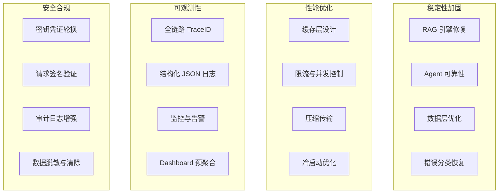

# YA-09-00: YiAi 九月迭代总览 — 稳定性加固 + RAG 优化 + Agent 可靠性 + 安全合规 — 开发方案

> **文档职责**：本文档定义**怎么做、为什么这么做、实际做成什么样**（HOW），不含产品目标与测试用例。

> 来源 PRD：[00-需求总览.md](../../prds/2026-09/00-需求总览.md)
> 需求编号：YA-09-00 · 优先级：P0 · 人天：200+
> 类型：迭代总览 · 状态：迭代中

---

## 一、迭代主题

九月迭代从"功能扩展"转向**深度优化**——四个主题贯穿全部 233 个模块：

### 与七月/八月的关系

| 迭代 | 主题 | 关键词 |
|------|------|--------|
| 七月 | 基础架构 | RPC · AI 聊天 · RAG 引擎 · 知识库管线 |
| 八月 | 能力扩展 | Multi-LLM · GraphQL · 审计 · Dashboard · Agent |
| **九月** | **深度优化** | **稳定性 · 性能 · 可观测性 · 安全** |

---

## 二、核心模块（前 20）

| 编号 | 模块 | 优先级 | 人天 |
|------|------|--------|------|
| YA-09-01 | [检索基础体系](./01-prd-task-检索基础体系.md) | P2 | 6.3 |
| YA-09-02 | [检索排序与优化](./02-prd-task-检索排序与优化.md) | P2 | 5.0 |
| YA-09-03 | [检索高级技术](./03-prd-task-检索高级技术.md) | P2 | 5.5 |
| YA-09-04 | [检索数据管理](./04-prd-task-检索数据管理.md) | P2 | 4.0 |
| YA-09-05 | [RAG 引擎稳定性修复](./05-prd-task-RAG引擎.md) | P0 | 3.0 |
| YA-09-06 | [数据层优化](./06-prd-task-数据层.md) | P1 | 3.0 |
| YA-09-07 | [Agent 可靠性](./07-prd-task-Agent可靠性.md) | P0 | 2.5 |
| YA-09-08 | [API 契约校验](./08-prd-task-API契约校验.md) | P0 | 2.0 |
| YA-09-09 | [审计日志查询](./09-prd-task-审计日志.md) | P1 | 1.5 |
| YA-09-10 | [全局搜索服务](./10-prd-task-全局搜索服务.md) | P1 | 2.5 |
| YA-09-11 | [用户管理服务](./11-prd-task-用户管理服务.md) | P1 | 1.5 |
| YA-09-12 | [代码健康分析](./12-prd-task-代码健康分析服务.md) | P2 | 2.0 |
| YA-09-13 | [上下文压缩服务](./13-prd-task-上下文压缩服务.md) | P1 | 2.0 |
| YA-09-14 | [RPC 契约测试](./14-prd-task-RPC契约测试与类型同步.md) | P0 | 2.5 |
| YA-09-15 | [ModelRuntime 性能基准](./15-prd-task-ModelRuntime抽象层性能基准.md) | P2 | 1.5 |
| YA-09-16 | [API 限流与并发控制](./16-prd-task-API限流与并发控制.md) | P1 | 2.5 |
| YA-09-17 | [SSE 流式背压控制](./17-prd-task-SSE流式背压控制与缓冲策略.md) | P1 | 2.0 |
| YA-09-18 | [Agent 工具缓存](./18-prd-task-Agent工具调用结果缓存.md) | P2 | 1.5 |
| YA-09-19 | [Prompt 模板管理](./19-prd-task-LLM-Prompt模板管理与版本控制.md) | P2 | 2.0 |
| YA-09-20 | [健康检查与就绪探针](./20-prd-task-服务健康检查与就绪探针.md) | P1 | 1.0 |

---

## 三、关联文档

- 上游：[八月迭代总览](../2026-08/00-prd-task-00-需求总览.md)
- 需求：[00-需求总览.md](../../prds/2026-09/00-需求总览.md)