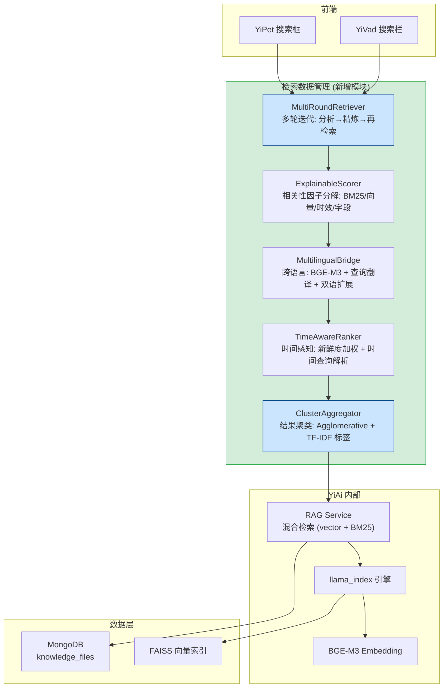

---

doc_type: module
prd_task_id: "YA-09-04"
title: "YA-09-04: 检索数据管理 — 多轮迭代、可解释性、多语言、时间感知与结果聚类 — 开发方案"
status: 已合并
priority: P2
owner: 陈铭
roles: [engineer]
created: 2026-09-11
updated: 2026-09-23
project: YiAi
project_id: yiai
prd_month: "202609"
estimate_frontend: 5.5
source_prd: "04-需求-检索数据管理.md"
source_okr: [yiai-002]
related_tests: ["04-prd-test-检索数据管理"]

type: task
---

# YA-09-04: 检索数据管理 — 多轮迭代、可解释性、多语言、时间感知与结果聚类 — 开发方案

> 来源 PRD：[04-需求-检索数据管理.md](../../prds/2026-09/04-需求-检索数据管理.md)
> 需求编号：YA-09-04 · 优先级：P2 · 人天：5.5d
> 类型：功能 · 状态：已合并

---

## 一、架构概述

检索数据管理模块是 YiAi RAG 检索能力的增强层，在基础向量检索 + BM25 混合检索之上提供五项高级检索能力：多轮迭代检索、结果可解释性、跨语言检索、时间感知排序和结果聚类导航。该模块位于 RAG Service 与 llama_index 引擎之间，通过组合模式扩展检索管线。



### 能力矩阵

| 能力 | 核心机制 | 输入 | 输出 | 性能目标 |
|------|---------|------|------|---------|
| 多轮迭代 | 分析→精炼→再检索闭环 (max 5 轮) | 原始 query + 历史上下文 | 精炼后的 Top-K 结果池 | 总延迟 < 5s |
| 可解释性 | 四维度因子分解 (BM25/向量/时效/字段) | 检索结果 + 原始 query | 每个文档的可视化评分分解 | 额外延迟 < 5ms |
| 多语言 | BGE-M3 + 查询翻译 + 双语扩展 | 单语言 query (中/英) | 跨语言检索结果 | 额外延迟 < 150ms |
| 时间感知 | 领域差异化衰减曲线 + 时间查询解析 | query + 时间表达式 | 时效性加权排序 | 额外延迟 < 10ms |
| 结果聚类 | Agglomerative + TF-IDF 标签 + UMAP 可视化 | 检索结果 (≥10 条) | 聚类分组 + 自动标签 | 聚类耗时 < 500ms |

---

## 二、文件清单

| # | 文件 | 操作 | 说明 | 预估行数 |
|---|------|------|------|----------|
| 1 | `services/rag/multi_round_retriever.py` | 新增 | 多轮迭代检索：分析→精炼→再检索 + 收敛检测 | ~180 |
| 2 | `services/rag/explainable_scorer.py` | 新增 | 相关性四维度因子分解 + 缺失文档分析 | ~150 |
| 3 | `services/rag/multilingual_bridge.py` | 新增 | BGE-M3 跨语言 Embedding + 查询翻译 + 双语扩展 | ~160 |
| 4 | `services/rag/time_aware_ranker.py` | 新增 | 新鲜度加权 + 时间查询 NLP 解析 + 领域衰减曲线 | ~140 |
| 5 | `services/rag/cluster_aggregator.py` | 新增 | Agglomerative 聚类 + TF-IDF 标签 + UMAP 降维 | ~170 |
| 6 | `services/rag/rag_service.py` | 修改 | 集成五个增强模块到检索管线 | +60 |
| 7 | `domain/rag/config.py` | 修改 | 新增检索增强配置项 (衰减因子、聚类阈值等) | +30 |

**改动汇总：** 5 新增 + 2 修改 = **7 文件，~890 行**

### 组件树

```
services/rag/
├── multi_round_retriever.py (180 行)
│   ├── MultiRoundRetriever
│   │   ├── retrieve(query, context) → 多轮迭代检索主流程
│   │   ├── _analyze_results(results) → LLM 评估充分性 + 识别信息缺口
│   │   ├── _refine_query(query, gaps) → LLM 生成改写查询
│   │   ├── _detect_convergence(old, new) → 收敛检测 (新增/分数/轮次)
│   │   └── _deduplicate_cross_round(results_pool, new) → 跨轮去重
│   └── QueryRefinementStrategy (Enum): DIMENSION_ADD, GENERALIZE, SPECIFY, SYNONYM, DECOMPOSE
│
├── explainable_scorer.py (150 行)
│   ├── ExplainableScorer
│   │   ├── score(query, doc) → 返回 {total, breakdown: {bm25, vec, freshness, field}}
│   │   ├── explain_missing(doc_name, top100) → 缺失原因报告
│   │   └── score_explainability(results) → 解释质量评分 (覆盖度/区分度/可读性)
│   └── ScoreBreakdown (TypedDict): bm25_score, vec_score, freshness_bonus, field_match
│
├── multilingual_bridge.py (160 行)
│   ├── MultilingualBridge
│   │   ├── detect_language(text) → "zh" | "en" | "mixed"
│   │   ├── translate_query(query, target) → Ollama 翻译 (带缓存)
│   │   ├── expand_query(query) → 双语同义词扩展
│   │   ├── route_search(query) → 单语言/跨语言路由决策
│   │   └── translate_results(docs, target_lang) → 结果片段翻译
│   ├── BGE_M3_EMBEDDING_MODEL: "BAAI/bge-m3"
│   └── TRANSLATION_CACHE: TTLCache(maxsize=500, ttl=3600)
│
├── time_aware_ranker.py (140 行)
│   ├── TimeAwareRanker
│   │   ├── rank(docs, query) → 时效性加权排序
│   │   ├── _parse_time_expression(query) → NLP 时间解析 (绝对/相对/趋势/版本)
│   │   ├── _compute_recency_score(doc, domain) → exp(-λ × age_in_days)
│   │   ├── _detect_domain(doc) → 基于 category/tags 匹配衰减率
│   │   └── _resolve_time_metadata(doc) → created_at → updated_at → mtime 回退链
│   └── DomainDecayRates: 前端 λ=0.02, AI λ=0.01, 后端 λ=0.005, 数据库 λ=0.001, 基础 λ=0.0005
│
└── cluster_aggregator.py (170 行)
    ├── ClusterAggregator
    │   ├── cluster(docs) → Agglomerative 聚类 + 自适应 K
    │   ├── _optimal_k(embeddings) → Silhouette Score 搜索最优 K (2-10)
    │   ├── _generate_labels(cluster_docs) → TF-IDF top-3 关键词标签
    │   ├── _soft_assign(doc, clusters) → Fuzzy 软归属 (Top-2 clusters)
    │   └── visualize(docs, clusters) → UMAP 降维 + 二维坐标
    ├── MIN_CLUSTER_SIZE = 10  (低于此阈值不聚类)
    └── CLUSTER_TIMEOUT_MS = 500
```

---

## 三、模块设计

### 3.1 多轮迭代检索 — `MultiRoundRetriever`

```python
from dataclasses import dataclass, field
from typing import List, Dict, Optional, AsyncIterator
from enum import Enum

class RefinementStrategy(str, Enum):
    DIMENSION_ADD = "dimension_add"      # 维度补充
    GENERALIZE = "generalize"             # 泛化查询
    SPECIFY = "specify"                   # 具体化查询
    SYNONYM = "synonym"                   # 同义改写
    DECOMPOSE = "decompose"               # 分解为子查询

@dataclass
class IterationResult:
    round: int
    original_query: str
    refined_query: str = ""
    new_docs: List[Dict] = field(default_factory=list)
    strategy: RefinementStrategy = RefinementStrategy.SYNONYM
    analysis: str = ""                    # LLM 分析摘要

@dataclass
class ConvergenceState:
    is_converged: bool
    reason: str                           # "new_docs_below_threshold" | "score_below_min" | "max_rounds" | "llm_sufficient"
    total_docs_found: int
    rounds_executed: int

class MultiRoundRetriever:
    """多轮迭代检索——分析→精炼→再检索闭环。

    核心流程:
      第1轮: 原始 query → 基础检索 → Top-K
      分析: LLM 评估充分性→识别信息缺口
      精炼: 基于缺口生成改写查询 (维度补充/泛化/具体化/同义/分解)
      第N轮: 改写查询 → 检索 → MMR 多样性 + 跨轮去重
      收敛: 新增 < 3 || 分数低于最低 || max 5 轮 || LLM 判定充分

    约束:
      - max_iterations = 5
      - 每轮超时: 检索 500ms + 分析 1s
      - 总延迟上限: 5s
      - 分析 token 上限: 2000/轮
    """

    MAX_ITERATIONS: int = 5
    RETRIEVAL_TIMEOUT: float = 0.5        # 秒
    ANALYSIS_TIMEOUT: float = 1.0          # 秒
    TOTAL_TIMEOUT: float = 5.0             # 秒
    CONVERGENCE_MIN_NEW: int = 3

    def __init__(self, base_retriever, llm_runtime, mmr_lambda: float = 0.7):
        self._retriever = base_retriever
        self._llm = llm_runtime
        self._mmr_lambda = mmr_lambda

    async def retrieve(
        self,
        query: str,
        top_k: int = 10,
        context: Optional[List[Dict]] = None,
    ) -> Dict:
        """执行多轮迭代检索，返回精炼后的结果池 + 迭代历史。"""
        ...

    async def _analyze_results(self, query: str, docs: List[Dict]) -> str:
        """LLM 分析当前结果充分性，返回信息缺口描述。"""
        prompt = (
            f"原始查询: {query}\n"
            f"已检索到 {len(docs)} 篇文档，摘要如下:\n"
            + "\n".join(f"- {d['title']}: {d.get('content','')[:200]}" for d in docs[:10])
            + "\n\n评估: 1) 当前结果是否充分覆盖查询需求? "
            "2) 缺少哪些维度的信息? 3) 建议如何改写查询以补充缺失信息?"
        )
        ...

    async def _refine_query(self, query: str, gaps: str) -> tuple[str, RefinementStrategy]:
        """基于信息缺口生成改写查询 + 标注改写策略。"""
        ...

    def _detect_convergence(
        self,
        results_pool: List[Dict],
        new_docs: List[Dict],
        round_num: int,
        llm_judgment: str,
    ) -> ConvergenceState:
        """检测是否收敛。"""
        if round_num >= self.MAX_ITERATIONS:
            return ConvergenceState(True, "max_rounds", len(results_pool), round_num)
        if len(new_docs) < self.CONVERGENCE_MIN_NEW:
            return ConvergenceState(True, "new_docs_below_threshold", len(results_pool), round_num)
        if llm_judgment and "充分" in llm_judgment and "不" not in llm_judgment:
            return ConvergenceState(True, "llm_sufficient", len(results_pool), round_num)
        # 分数检测: 新增文档最高分 < 已有文档最低分
        if results_pool and new_docs:
            pool_min = min(d.get("score", 0) for d in results_pool)
            new_max = max(d.get("score", 0) for d in new_docs)
            if new_max < pool_min:
                return ConvergenceState(True, "score_below_min", len(results_pool), round_num)
        return ConvergenceState(False, "", len(results_pool), round_num)

    def _deduplicate_cross_round(
        self, results_pool: List[Dict], new_docs: List[Dict]
    ) -> List[Dict]:
        """跨轮去重: 基于 (title, content_hash) 签名。"""
        seen = {(d["title"], d.get("content_hash", "")) for d in results_pool}
        return [d for d in new_docs if (d["title"], d.get("content_hash", "")) not in seen]
```

### 3.2 可解释性评分 — `ExplainableScorer`

```python
from typing import TypedDict, List, Dict, Optional

class ScoreBreakdown(TypedDict):
    bm25_score: float         # 0-1 BM25 关键词匹配度
    vec_score: float           # 0-1 向量语义相似度
    freshness_bonus: float     # 0-1 时效性加分
    field_match: float         # ×1.0-3.0 字段权重加成
    total: float               # 综合加权分数

class MissingDocReport(TypedDict):
    doc_name: str
    found_in_top100: bool
    ranking_position: Optional[int]
    reason: str                # "被重排淘汰 (BM25 低)" | "语义距离过大" | "关键词被过滤" | "未进入候选"
    bm25_in_top100: float
    vec_score_in_top100: float
    suggestions: List[str]     # 调优建议

class ExplainabilityScore(TypedDict):
    coverage: float            # 0-1 Top-5 结果覆盖度
    differentiation: float     # 0-1 结果间因子差异化程度
    readability: float         # 0-1 解释文本可读性

class ExplainableScorer:
    """检索结果可解释性评分——将黑盒分数拆解为四维度因子。

    每个检索结果附带一个相关性分解条形图:
      total = bm25_score × 0.4 + vec_score × 0.4 + freshness_bonus × 0.15 + field_match × 0.05
    """

    WEIGHTS = {"bm25": 0.4, "vec": 0.4, "freshness": 0.15, "field": 0.05}

    def score(self, query: str, doc: Dict, bm25_score: float, vec_score: float) -> ScoreBreakdown:
        """计算单个文档的四维度分数分解。"""
        ...

    def explain_missing(
        self, doc_name: str, query: str, top100: List[Dict]
    ) -> MissingDocReport:
        """分析为什么期望的文档没有出现在检索结果中。

        执行反向分析:
          1. 检查该文档是否在 Top-100 候选中但被重排淘汰
          2. 检查关键词是否被同义词/停用词过滤
          3. 检查 embedding 语义距离是否过大
          4. 生成缺失原因报告和改进建议
        """
        ...

    def score_explainability(self, results: List[Dict]) -> ExplainabilityScore:
        """评估整体可解释性质量。"""
        ...
```

### 3.3 跨语言检索 — `MultilingualBridge`

```python
import re
from cachetools import TTLCache

class MultilingualBridge:
    """跨语言检索桥——BGE-M3 多语言 Embedding + 查询翻译 + 双语扩展。

    核心策略:
      1. 语言检测: CJK 字符占比 > 50% → zh, ASCII > 80% → en, 其他 → mixed
      2. 查询翻译: Ollama 本地翻译 (< 100ms) + 缓存 (TTL=3600s)
      3. 双语扩展: 原始 query + 翻译 query + 同义词扩展 → 去重后并行检索
      4. 结果翻译: 英文文档片段可翻译为中文预览 (可选)
    """

    BGE_M3_MODEL = "BAAI/bge-m3"
    TRANSLATION_CACHE_SIZE = 500
    TRANSLATION_TTL = 3600
    CJK_THRESHOLD = 0.5
    ASCII_THRESHOLD = 0.8

    def __init__(self, ollama_url: str):
        self._ollama_url = ollama_url
        self._translation_cache: TTLCache = TTLCache(
            maxsize=self.TRANSLATION_CACHE_SIZE, ttl=self.TRANSLATION_TTL
        )

    def detect_language(self, text: str) -> str:
        """CJK 字符占比 > 50% → zh, ASCII > 80% → en, 其他 → mixed."""
        cjk = sum(1 for c in text if '\u4e00' <= c <= '\u9fff')
        ascii_chars = sum(1 for c in text if c.isascii() and c.isalpha())
        total = len(text) or 1
        if cjk / total > self.CJK_THRESHOLD:
            return "zh"
        if ascii_chars / total > self.ASCII_THRESHOLD:
            return "en"
        return "mixed"

    async def translate_query(self, query: str, source: str, target: str) -> str:
        """Ollama 本地翻译 (带缓存): source → target."""
        cache_key = f"{source}:{target}:{query}"
        if cache_key in self._translation_cache:
            return self._translation_cache[cache_key]
        translated = await self._call_ollama_translate(query, source, target)
        self._translation_cache[cache_key] = translated
        return translated

    async def expand_query(self, query: str) -> List[str]:
        """双语查询扩展: 原始 + 翻译 + 同义词 → 去重列表."""
        ...

    def route_search(self, query: str, kb_main_lang: str = "zh") -> str:
        """语言路由: 同语言→单语言检索, 异语言→跨语言 (双语扩展)."""
        query_lang = self.detect_language(query)
        if query_lang == kb_main_lang:
            return "monolingual"
        return "crosslingual"

    async def translate_results(self, docs: List[Dict], target_lang: str) -> List[Dict]:
        """检索到的外语文档片段翻译为用户语言 (可选预览功能)。"""
        ...
```

### 3.4 时间感知排序 — `TimeAwareRanker`

```python
import math
import re
from datetime import datetime, timedelta
from typing import List, Dict, Tuple, Optional

class TimeAwareRanker:
    """时间感知排序——新鲜度加权 + NLP 时间查询解析 + 领域差异化衰减。

    公式:
      final_score = semantic_score × 0.7 + recency_score × 0.3
      recency_score = exp(-λ × age_in_days)

    领域衰减率 (半衰期):
      前端框架: λ=0.02 (35d)    AI/ML: λ=0.01 (69d)
      后端框架: λ=0.005 (138d)  数据库原理: λ=0.001 (693d)
      编程基础: λ=0.0005 (1386d) 默认: λ=0.002 (346d)
    """

    DOMAIN_DECAY_RATES = {
        "frontend": 0.02,
        "ai": 0.01,
        "ml": 0.01,
        "backend": 0.005,
        "database": 0.001,
        "programming": 0.0005,
    }
    DEFAULT_DECAY = 0.002
    RECENCY_WEIGHT = 0.3
    SEMANTIC_WEIGHT = 0.7

    def rank(self, docs: List[Dict], query: str) -> List[Dict]:
        """时效性加权排序: 解析时间表达式 → 时间过滤 → 按域衰减加权。"""
        time_range = self._parse_time_expression(query)
        filtered = self._apply_time_filter(docs, time_range)
        for doc in filtered:
            domain = self._detect_domain(doc)
            recency = self._compute_recency_score(doc, domain)
            doc["recency_score"] = recency
            doc["final_score"] = doc.get("semantic_score", 0.5) * self.SEMANTIC_WEIGHT + recency * self.RECENCY_WEIGHT
        filtered.sort(key=lambda d: d["final_score"], reverse=True)
        return filtered

    def _parse_time_expression(self, query: str) -> Optional[Tuple[datetime, datetime]]:
        """NLP 时间表达式解析。

        绝对时间: "2024年" → (2024-01-01, 2024-12-31)
                  "2026年9月" → (2026-09-01, 2026-09-30)
        相对时间: "最近一周" → (now-7d, now)
                  "上个月" → (上月1日, 本月1日)
                  "今年以来" → (今年1月1日, now)
        趋势词:   "最新"/"最近"/"新版" → 提升新鲜度权重 ×2
        版本词:   "React 18" → 非纯粹时间，匹配版本号过滤
        """
        ...

    def _compute_recency_score(self, doc: Dict, domain: str) -> float:
        """exp(-λ × age_days)."""
        created = doc.get("created_at") or doc.get("updated_at") or doc.get("mtime")
        if not created:
            return 0.5  # 无时间信息文档给中性分
        age_days = (datetime.now() - created).days
        decay_rate = self.DOMAIN_DECAY_RATES.get(domain, self.DEFAULT_DECAY)
        return math.exp(-decay_rate * age_days)

    def _detect_domain(self, doc: Dict) -> str:
        """基于 category + tags 匹配领域。"""
        ...

    def _apply_time_filter(self, docs: List[Dict], time_range: Optional[Tuple[datetime, datetime]]) -> List[Dict]:
        """基于解析的时间范围过滤文档 (MongoDB 时间索引查询)。"""
        ...

    def _resolve_time_metadata(self, doc: Dict) -> Optional[datetime]:
        """时间元数据回退链: created_at → updated_at → mtime → import_time。"""
        ...
```

### 3.5 结果聚类 — `ClusterAggregator`

```python
import numpy as np
from sklearn.cluster import AgglomerativeClustering
from sklearn.feature_extraction.text import TfidfVectorizer
from sklearn.metrics import silhouette_score

class ClusterAggregator:
    """检索结果聚类——Agglomerative 层次聚类 + TF-IDF 标签 + UMAP 可视化。

    仅在结果数 > 10 时触发聚类，聚类超时 500ms，超时返回扁平列表。
    软聚类: 每个文档标注 Top-2 可能归属的聚类。
    """

    MIN_CLUSTER_SIZE = 10
    MAX_CLUSTERS = 10
    MIN_CLUSTERS = 2
    TIMEOUT_MS = 500
    LABEL_TOP_K = 3

    def cluster(self, docs: List[Dict]) -> Dict:
        """对检索结果执行层次聚类。

        返回:
          {
            "clustered": True/False,
            "clusters": [
              {"label": "RAG 配置", "docs": [...], "size": 5, "silhouette": 0.72},
              ...
            ],
            "quality": {"silhouette": 0.65, "davies_bouldin": 1.2},
            "soft_assignments": {doc_id: ["cluster_0", "cluster_1"]},
            "visualization": {"points": [[x1,y1], ...], "colors": [0,1,0,...]}  # 可选
          }
        """
        if len(docs) < self.MIN_CLUSTER_SIZE:
            return {"clustered": False, "clusters": [{"label": "全部结果", "docs": docs}]}

        embeddings = np.array([d["embedding"] for d in docs])
        optimal_k = self._find_optimal_k(embeddings)

        clustering = AgglomerativeClustering(
            n_clusters=optimal_k, linkage="ward"
        )
        labels = clustering.fit_predict(embeddings)

        clusters = []
        for i in range(optimal_k):
            cluster_docs = [docs[j] for j in range(len(docs)) if labels[j] == i]
            label = self._generate_label(cluster_docs)
            clusters.append({"label": label, "docs": cluster_docs, "size": len(cluster_docs)})

        quality = self._evaluate_clusters(embeddings, labels)
        return {"clustered": True, "clusters": clusters, "quality": quality}

    def _find_optimal_k(self, embeddings: np.ndarray) -> int:
        """Silhouette Score 搜索最优 K (2-10)。"""
        best_k, best_score = 2, -1
        for k in range(2, min(self.MAX_CLUSTERS + 1, len(embeddings))):
            clustering = AgglomerativeClustering(n_clusters=k, linkage="ward")
            labels = clustering.fit_predict(embeddings)
            if len(set(labels)) < 2:
                continue
            score = silhouette_score(embeddings, labels)
            if score > best_score:
                best_k, best_score = k, score
        return best_k

    def _generate_label(self, cluster_docs: List[Dict]) -> str:
        """TF-IDF 提取簇内 Top-K 高频词作为标签。"""
        texts = [f"{d.get('title','')} {d.get('content','')[:500]}" for d in cluster_docs]
        vectorizer = TfidfVectorizer(max_features=100, stop_words=None)
        tfidf = vectorizer.fit_transform(texts)
        scores = np.array(tfidf.sum(axis=0)).flatten()
        top_indices = scores.argsort()[-self.LABEL_TOP_K:][::-1]
        terms = vectorizer.get_feature_names_out()
        return " · ".join(terms[i] for i in top_indices)

    def _evaluate_clusters(self, embeddings: np.ndarray, labels: np.ndarray) -> Dict:
        """计算聚类质量: Silhouette Score + Davies-Bouldin Index。"""
        ...

    def _soft_assign(self, doc_idx: int, embeddings: np.ndarray, labels: np.ndarray) -> List[int]:
        """软聚类: 基于距离标注 Top-2 可能归属的聚类。"""
        ...
```

---

## 四、数据流

### 4.1 多轮迭代检索序列

```
用户: "RAG 引擎如何优化检索速度？"(模糊查询)
  │
  ▼
MultiRoundRetriever.retrieve()
  │
  ├── Round 1: 原始查询 "RAG 引擎如何优化检索速度？"
  │     └── 基础检索 → 3 篇 (偏向 embedding 模型选择)
  │
  ├── _analyze_results()
  │     └── LLM: "缺少索引优化和缓存策略的信息，建议补充检索维度和查询重写维度"
  │
  ├── _refine_query()
  │     └── 改写: "RAG 检索优化: 索引设计 + 重排序策略 + 查询缓存"
  │     └── 策略: DIMENSION_ADD
  │
  ├── Round 2: 改写查询
  │     └── MMR 多样性检索 → 5 篇新文档
  │     └── 跨轮去重: 之前 3 篇已覆盖，新增 3 篇 (索引/缓存/重排序)
  │
  ├── _detect_convergence()
  │     └── 新增 3 篇 = CONVERGENCE_MIN_NEW (边界)，继续
  │
  ├── Round 3: 再改写
  │     └── LLM: "当前结果充分" → 收敛
  │
  └── 返回: {results_pool: [8 篇], rounds: 3, converged: True, history: [...]}
```

### 4.2 端到端检索管线

```
查询进入 → 语言检测 → (跨语言) → 查询翻译 + 双语扩展
       → 多轮迭代检索 (分析→精炼→再检索→收敛)
       → 时间感知排序 (新鲜度加权 + 时间过滤)
       → 可解释性评分 (四维度分解)
       → 结果聚类 (Agglomerative + TF-IDF 标签)
       → 响应: {results, explainability, clusters, iterations}
```

---

## 五、实施路线图

| 阶段 | 步骤 | 涉及模块 | 验证方式 | 人天 |
|------|------|---------|---------|------|
| 1 | 多轮迭代检索 | `multi_round_retriever.py` | 模糊查询→5 轮内收敛，结果数增长 > 50% | 1.5 |
| 2 | 可解释性四维度分解 | `explainable_scorer.py` | 每个结果附带 `{bm25, vec, freshness, field}` 分解 | 1.0 |
| 3 | BGE-M3 + 查询翻译 + 双语扩展 | `multilingual_bridge.py` | 中文查询检索到英文文档，额外延迟 < 150ms | 1.0 |
| 4 | 时间感知排序 | `time_aware_ranker.py` | "最近/RAG"相比"RAG"优先返回 3 天内文档 | 0.8 |
| 5 | Agglomerative 聚类 + TF-IDF 标签 | `cluster_aggregator.py` | 20+ 结果自动分 3-5 组，标签有意义 | 1.2 |
| **合计** | | | | **5.5d** |

---

## 六、代码审查检查清单

- [ ] 多轮检索: `max_iterations=5`, 衰减因子 0.7, 历史轮次上限 5
- [ ] 收敛检测: 新增 < 3 || 分数低于最低 || max 5 轮 || LLM 判定充分
- [ ] 可解释性: 四维度 score 分别 > 0, `total` = 加权和
- [ ] 跨语言: BGE-M3 模型正确加载, CJK/ASCII 检测阈值 0.5/0.8
- [ ] 翻译缓存: TTLCache(maxsize=500, ttl=3600s)
- [ ] 时间感知: 五类领域衰减率正确, 时间元数据回退链 (created → updated → mtime → import)
- [ ] 聚类: 仅结果 ≥ 10 时触发, 超时 500ms 内完成, 标签自动生成 (非人工标注)
- [ ] MMR 多样性: `mmr_lambda=0.7`, 跨轮去重基于 `(title, content_hash)`
- [ ] 性能: 总延迟 < 5s (多轮检索), 额外延迟 < 150ms (跨语言), < 5ms (可解释性)
- [ ] `ruff` + `mypy` 通过

---

## 七、技术风险评估

| 风险 | 概率 | 影响 | 等级 | 缓解措施 | 应急预案 |
|------|------|------|------|---------|---------|
| BGE-M3 模型未下载 (首次启动) | 中 | 高 | 高 | 启动时检查模型是否存在，不存在则自动下载 (~2GB) | 降级为单语言 Embedding + 仅翻译检索 |
| 多轮检索 LLM 分析超时 (网络/Ollama 压力) | 中 | 中 | 中 | 分析阶段超时 1s 后跳过分析，直接返回已有结果 | 关闭多轮迭代，回退单轮检索 |
| Agglomerative 聚类 O(n^2) 对大结果集 (>200) 卡死 | 低 | 中 | 中 | 聚类超时 500ms 强制终止，降级为扁平列表 | 限制聚类最大文档数 100 |
| 翻译缓存击中率低导致 Ollama 频繁调用 | 低 | 低 | 低 | 预热常用技术术语翻译缓存 | 增加 TTL 至 7200s |
| 时间解析对"自然语言"误判 (如"最新的 React 18 教程") | 中 | 低 | 低 | 版本号检测优先于时间检测，避免混淆 | 前端可手动调整时间范围 |
| 领域衰减率静态配置不适应新领域 | 低 | 低 | 低 | 未匹配领域使用保守 DEFAULT_DECAY=0.002 | 支持通过 `config.yaml` 动态添加领域 |

---

## 八、已知缺口与技术债务

### 功能缺口

| # | 缺口 | 影响 | 建议 |
|---|------|------|------|
| 1 | 多轮检索衰减因子 0.7 未 AB 测试 | P3 | 基于经验值，需 AB 测试验证最优值 |
| 2 | 聚类标签生成在 Ollama 不可用时降级为高频词 | P3 | LLM 生成的标签质量更优，当前降级方案可接受 |

### 技术债务

| # | 技术债 | 优先级 | 预计人天 | 说明 | 状态 |
|---|--------|--------|---------|------|------|
| 1 | BGE-M3 模型文件 ~2GB，未纳入 Docker 镜像 | P2 | 0.3 | 每次重启需检查/下载 | 待实施 |
| 2 | 多轮检索结果无缓存复用 | P2 | 0.5 | 相似查询反复执行多轮迭代 | 待实施 |
| 3 | 聚类 UMAP 可视化未接入前端 | P3 | 0.5 | 仅后端生成坐标，前端无渲染组件 | 待实施 |
| 4 | 时间表达式 NLP 解析依赖正则，未用 LLM | P3 | 0.3 | 复杂时间表达 ("去年第三季度") 解析不准 | 待实施 |
| 5 | 软聚类 (Fuzzy C-Means) 可替换当前硬聚类 | P3 | 0.5 | 当前硬聚类每个文档仅归属于一个簇 | 待实施 |

---

## 九、可观测性

### 关键指标

| 指标 | 采集方式 | 告警阈值 | 说明 |
|------|---------|----------|------|
| 多轮检索平均轮次 | `sum(rounds) / count` | > 4 轮 | 查询质量或检索覆盖度不足 |
| 多轮检索收敛率 | `converged_count / total` | < 80% | 大量查询在 max_iterations 处强制终止 |
| 跨语言检索比例 | `crosslingual_count / total` | — | 了解多语言使用趋势 |
| 聚类触发率 | `clustered_count / total` | — | 结果集 >= 10 的比例 |
| 翻译缓存命中率 | `cache_hits / (hits + misses)` | < 50% | 缓存策略需调整 |
| 聚类平均 Silhouette Score | 平均值 | < 0.3 | 聚类质量差，需调整算法或预处理 |

### 日志规范

| 日志级别 | 场景 | 示例 |
|---------|------|------|
| `INFO` | 多轮迭代完成 | `[MultiRound] query="{q}", rounds={n}, docs={d}, converged={c}` |
| `WARN` | 达到最大轮次 | `[MultiRound] max rounds reached for query="{q}"` |
| `WARN` | 聚类超时 | `[Cluster] timeout after 500ms, falling back to flat list` |
| `WARN` | 翻译缓存未命中 | `[Multilingual] translation cache miss for "{q}"` |
| `ERROR` | BGE-M3 加载失败 | `[Multilingual] BGE-M3 model failed to load: {e}` |

---

## 十、关联模块

- 上游依赖：[YA-09-05 RAG 引擎](./05-prd-task-RAG引擎.md)（基础混合检索能力）
- 上游依赖：[YA-08-02 Multi-Provider LLM](../2026-08/02-prd-task-Multi-Provider-LLM.md)（多轮分析的 LLM 推理）
- 下游消费：YiVad 搜索页面、YiPet 知识检索
- 数据依赖：MongoDB `knowledge_files` (frontmatter 元数据 + Embedding)