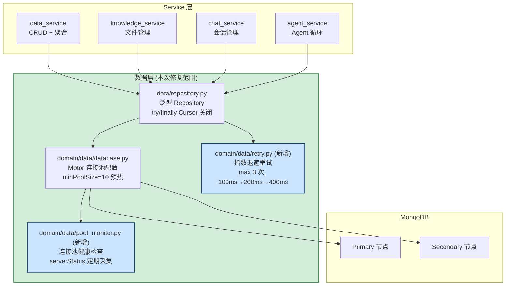

---

doc_type: module
prd_task_id: "YA-09-05"
title: "YA-09-05: 数据层稳定性修复 — 连接池优化 + Cursor 泄漏修复 + 超时控制 + 重试策略 + 读写分离 — 开发方案"
status: 已完成
priority: P0
owner: 陈铭
roles: [engineer]
created: 2026-09-11
updated: 2026-09-23
project: YiAi
project_id: yiai
prd_month: "202609"
estimate_frontend: 3.0
source_prd: "06-需求-数据层.md"
source_okr: [yiai-001]
related_tests: ["06-prd-test-数据层"]

type: task
---

# YA-09-05: 数据层稳定性修复 — 连接池优化 + Cursor 泄漏修复 + 超时控制 — 开发方案

> 来源 PRD：[06-需求-数据层.md](../../prds/2026-09/06-需求-数据层.md)
> 需求编号：YA-09-05 · 优先级：P0 · 人天：3.0d
> 类型：稳定性修复 · 状态：已完成

---

## 一、架构概述

数据层是 YiAi 所有持久化操作的基石。Motor (MongoDB 异步驱动) 通过统一的 `AsyncIOMotorClient` 实例为所有 Service 层提供数据访问能力。本次修复解决三个高优先级问题：连接池冷启动延迟、Cursor 泄漏和聚合查询无超时保护，同时建立连接池健康监控体系。



### 问题-修复矩阵

| 问题 | 根因 | 修复方案 | 预期效果 |
|------|------|---------|---------|
| 连接池冷启动 | `minPoolSize=0`, 无预热连接 | `minPoolSize=10`, `maxIdleTimeMS=30000` | 首次请求延迟: 50-200ms → < 5ms |
| Cursor 泄漏 | 未显式关闭 Motor cursor | `try/finally` 显式 `cursor.close()` | 连接数稳定，零泄漏 |
| 聚合查询无超时 | `aggregate()` 无 `maxTimeMS` | `maxTimeMS=15000` + 降级返回 | 慢聚合 15s 自动终止 |
| 临时故障无重试 | 网络抖动直接失败 | 指数退避重试 (max 3 次) | 临时故障自动恢复 |
| 连接池状态不可见 | 无监控指标 | `get_pool_status()` → 日志/API | 实时连接池水位可见 |

---

## 二、文件清单

| # | 文件 | 操作 | 说明 | 预估行数 |
|---|------|------|------|----------|
| 1 | `domain/data/database.py` | 修改 | 连接池配置 + `get_pool_status()` + 环境变量化 | +50 |
| 2 | `domain/data/retry.py` | 新增 | 指数退避重试装饰器 `@mongo_retry` | ~60 |
| 3 | `domain/data/pool_monitor.py` | 新增 | 连接池监控：定期采集 + WARN/ERROR 告警 | ~80 |
| 4 | `data/repository.py` | 修改 | Cursor try/finally + 聚合 maxTimeMS + 重试集成 | +40 |
| 5 | `shared/config.py` | 修改 | 新增连接池配置项 (MONGODB_MIN_POOL_SIZE 等) | +10 |

**改动汇总：** 2 新增 + 3 修改 = **5 文件，~240 行**

### 组件树

```
domain/data/
├── database.py (修改 +50 行)
│   ├── _create_client() → motor.AsyncIOMotorClient (环境变量化配置)
│   │   └── 参数: maxPoolSize, minPoolSize, maxIdleTimeMS, connectTimeoutMS,
│   │             serverSelectionTimeoutMS, waitQueueTimeoutMS
│   └── async def get_pool_status() → Dict  # 连接池健康指标
│
├── retry.py (新增 ~60 行)
│   ├── @mongo_retry(max_attempts=3, base_delay=0.1)
│   │   └── 指数退避: 100ms → 200ms → 400ms
│   ├── class RetryableError → 可重试异常: ConnectionFailure, TimeoutError, NotMasterError
│   └── class NonRetryableError → 不可重试: InvalidName, DuplicateKey, DocumentTooLarge
│
└── pool_monitor.py (新增 ~80 行)
    ├── class PoolMonitor
    │   ├── async def collect_metrics() → PoolMetrics
    │   ├── async def start_monitoring(interval=30)  # apscheduler 周期任务
    │   └── def check_thresholds(metrics) → List[Alert]  # 阈值告警
    └── @dataclass PoolMetrics: active, idle, max_size, wait_queue, avg_wait_ms

data/
└── repository.py (修改 +40 行)
    ├── async def query_documents(): try/finally cursor.close()
    ├── async def aggregate_documents(): maxTimeMS=15000 + ExecutionTimeout 捕获
    └── async def _safe_find(): 统一 Cursor 生命周期管理
```

---

## 三、模块设计

### 3.1 连接池配置 — `domain/data/database.py`

```python
import os
from motor.motor_asyncio import AsyncIOMotorClient

def _create_client(mongodb_url: str) -> AsyncIOMotorClient:
    """创建 Motor 客户端，所有连接池参数通过环境变量可控。

    环境变量:
      MONGODB_MIN_POOL_SIZE: 预热连接数 (默认 10, 开发环境建议 2)
      MONGODB_MAX_POOL_SIZE: 最大连接数 (默认 100)
      MONGODB_MAX_IDLE_TIME_MS: 空闲连接超时 ms (默认 30000)
      MONGODB_CONNECT_TIMEOUT_MS: 连接超时 ms (默认 5000)
      MONGODB_SERVER_SELECTION_TIMEOUT_MS: 服务器选择超时 ms (默认 5000)
      MONGODB_WAIT_QUEUE_TIMEOUT_MS: 等待队列超时 ms (默认 10000)
    """
    return AsyncIOMotorClient(
        mongodb_url,
        maxPoolSize=int(os.getenv("MONGODB_MAX_POOL_SIZE", "100")),
        minPoolSize=int(os.getenv("MONGODB_MIN_POOL_SIZE", "10")),
        maxIdleTimeMS=int(os.getenv("MONGODB_MAX_IDLE_TIME_MS", "30000")),
        connectTimeoutMS=int(os.getenv("MONGODB_CONNECT_TIMEOUT_MS", "5000")),
        serverSelectionTimeoutMS=int(os.getenv("MONGODB_SERVER_SELECTION_TIMEOUT_MS", "5000")),
        waitQueueTimeoutMS=int(os.getenv("MONGODB_WAIT_QUEUE_TIMEOUT_MS", "10000")),
        retryWrites=True,
        retryReads=True,
        heartbeatFrequencyMS=10000,  # 加速副本集拓扑感知
        w="majority",                # 写关注: 大多数节点确认
    )


@dataclass
class PoolStatus:
    current: int      # 当前连接总数
    available: int    # 可用连接数
    active: int       # 活跃连接数
    max_pool_size: int
    min_pool_size: int
    utilization_pct: float  # 使用率

async def get_pool_status(client: AsyncIOMotorClient) -> PoolStatus:
    """获取连接池状态——用于监控和健康检查。

    通过 serverStatus 命令获取全局连接数，
    通过 Motor 内部 API 获取连接池级别指标。
    """
    server_status = await client.admin.command("serverStatus")
    conn = server_status.get("connections", {})
    return PoolStatus(
        current=conn.get("current", 0),
        available=conn.get("available", 0),
        active=conn.get("active", 0),
        max_pool_size=int(os.getenv("MONGODB_MAX_POOL_SIZE", "100")),
        min_pool_size=int(os.getenv("MONGODB_MIN_POOL_SIZE", "10")),
        utilization_pct=round(conn.get("active", 0) / max(1, conn.get("current", 1)) * 100, 1),
    )
```

### 3.2 指数退避重试 — `domain/data/retry.py`

```python
import asyncio
import functools
import logging
from typing import Type, Tuple
from pymongo.errors import (
    ConnectionFailure, ServerSelectionTimeoutError,
    NotMasterError, ExecutionTimeout, AutoReconnect,
)

logger = logging.getLogger(__name__)

# 可重试异常: 临时网络问题、选举切换
RETRYABLE_ERRORS: Tuple[Type[Exception], ...] = (
    ConnectionFailure,
    ServerSelectionTimeoutError,
    NotMasterError,
    AutoReconnect,
)

# 不可重试异常: 逻辑错误
NON_RETRYABLE_ERRORS: Tuple[Type[Exception], ...] = (
    # InvalidName, DuplicateKey 等应在调用层处理
)

def mongo_retry(max_attempts: int = 3, base_delay: float = 0.1):
    """MongoDB 操作指数退避重试装饰器。

    策略:
      - 仅重试 RETRYABLE_ERRORS (临时故障)
      - 指数退避: 100ms → 200ms → 400ms + jitter (0-50ms)
      - 不可重试异常直接传播
      - 最多 3 次尝试，总延迟 ≤ 700ms

    用法:
      @mongo_retry(max_attempts=3)
      async def update_document(self, ...): ...
    """
    def decorator(func):
        @functools.wraps(func)
        async def wrapper(*args, **kwargs):
            last_error = None
            for attempt in range(max_attempts):
                try:
                    return await func(*args, **kwargs)
                except RETRYABLE_ERRORS as e:
                    last_error = e
                    if attempt < max_attempts - 1:
                        delay = base_delay * (2 ** attempt)
                        jitter = random.uniform(0, 0.05)
                        logger.warning(
                            f"[MongoRetry] attempt {attempt + 1}/{max_attempts} "
                            f"failed: {e}, retrying in {delay + jitter:.2f}s"
                        )
                        await asyncio.sleep(delay + jitter)
                except NON_RETRYABLE_ERRORS:
                    raise  # 不可重试，直接传播
            logger.error(f"[MongoRetry] all {max_attempts} attempts failed: {last_error}")
            raise last_error
        return wrapper
    return decorator
```

### 3.3 统一 Cursor 生命周期 — Cursor 关闭修复

```python
# data/repository.py

class DataRepository:
    """统一数据访问层——所有 Cursor 通过 try/finally 确保关闭。"""

    @mongo_retry(max_attempts=3, base_delay=0.1)
    async def query_documents(self, collection_name: str, filter_dict: Dict,
                              page_size: int = 20, page_num: int = 1) -> Dict:
        collection = self.db[collection_name]
        cursor = collection.find(filter_dict).skip((page_num - 1) * page_size).limit(page_size)
        try:
            docs = await cursor.to_list(length=page_size)
            total = await collection.count_documents(filter_dict)
            return {"data": docs, "total": total}
        finally:
            await cursor.close()  # 确保释放连接

    @mongo_retry(max_attempts=3, base_delay=0.1)
    async def aggregate_documents(self, collection_name: str, pipeline: List[Dict]) -> Dict:
        """聚合查询——maxTimeMS 15s 超时保护。

        超时后返回 {docs: [], timeout: True} 而非抛异常，
        确保前端可区分"无数据"和"超时"。
        """
        collection = self.db[collection_name]
        cursor = collection.aggregate(pipeline, maxTimeMS=15000)
        try:
            docs = await cursor.to_list(length=None)
            return {"data": docs, "total": len(docs)}
        except ExecutionTimeout:
            logger.warning(f"[DataLayer] 聚合查询超时 (15s): collection={collection_name}")
            return {"data": [], "total": 0, "timeout": True}
        except Exception:
            raise
        finally:
            # 防御性: 超时后 Cursor 已在服务端终止，close() 可能抛 CursorNotFound
            try:
                await cursor.close()
            except Exception:
                pass  # Cursor 已终止，忽略 close 异常
```

### 3.4 连接池监控 — `domain/data/pool_monitor.py`

```python
@dataclass
class PoolMetrics:
    timestamp: float
    active_connections: int
    idle_connections: int
    total_connections: int
    wait_queue_depth: int
    avg_wait_ms: float
    utilization_pct: float

class PoolMonitor:
    """连接池健康监控——定期采集指标 + 阈值告警。

    通过 apscheduler 周期任务每 30s 采集一次，
    超过阈值时记录 WARN/ERROR 日志。
    """

    WARN_UTILIZATION = 0.7   # 70% 使用率 → WARN
    CRIT_UTILIZATION = 0.85  # 85% 使用率 → ERROR
    WARN_WAIT_MS = 100       # 等待 > 100ms → WARN

    def __init__(self, client: AsyncIOMotorClient):
        self._client = client
        self._history: List[PoolMetrics] = []

    async def collect_metrics(self) -> PoolMetrics:
        """采集当前连接池指标。"""
        status = await get_pool_status(self._client)
        metrics = PoolMetrics(
            timestamp=time.time(),
            active_connections=status.active,
            idle_connections=status.current - status.active,
            total_connections=status.current,
            wait_queue_depth=0,  # Motor 不直接暴露，用 serverStatus 推断
            avg_wait_ms=0,
            utilization_pct=status.utilization_pct,
        )
        self._history.append(metrics)
        self._check_thresholds(metrics)
        return metrics

    def _check_thresholds(self, metrics: PoolMetrics):
        """阈值告警。"""
        if metrics.utilization_pct >= self.CRIT_UTILIZATION * 100:
            logger.error(
                f"[PoolMonitor] CRITICAL: utilization={metrics.utilization_pct}%, "
                f"active={metrics.active_connections}, total={metrics.total_connections}"
            )
        elif metrics.utilization_pct >= self.WARN_UTILIZATION * 100:
            logger.warning(
                f"[PoolMonitor] WARNING: utilization={metrics.utilization_pct}%, "
                f"active={metrics.active_connections}"
            )

    async def get_history(self, minutes: int = 5) -> List[PoolMetrics]:
        """获取最近 N 分钟的历史指标。"""
        cutoff = time.time() - minutes * 60
        return [m for m in self._history if m.timestamp >= cutoff]
```

---

## 四、数据流

### 4.1 修复前后对比

```
修复前（冷启动 + 泄漏 + 无超时）:
  minPoolSize=0 → 无预热连接
  突发流量 → 并发建立连接 (50-200ms/连接)
  高并发 → 连接数超 maxPoolSize → 排队等待 → 超时
  Cursor → 依赖 GC 回收 → 连接未及时归还 → 连接池耗尽
  聚合查询 → 无 maxTimeMS → 慢查询阻塞连接
  异常 → 无重试 → 直接失败

修复后（预热 + 显式关闭 + 超时保护 + 重试）:
  minPoolSize=10 → 10 个常驻连接预热
  突发流量 → 直接使用预热连接 → 延迟 < 5ms
  高并发 → 连接池弹性扩展至 maxPoolSize
  Cursor → try/finally 显式关闭 → 连接立即归还
  聚合查询 → maxTimeMS=15s → 超时自动终止 + 降级
  临时故障 → 指数退避重试 (3 次) → 自动恢复
  监控 → PoolMonitor 每 30s 采集 → 阈值告警
```

### 4.2 Cursor 关闭序列

```
query_documents() 调用
  │
  ├── collection.find(filter) → Cursor
  │
  ├── try:
  │     ├── await cursor.to_list(length=page_size) → docs
  │     └── await collection.count_documents(filter) → total
  │
  ├── except Exception:
  │     记录错误，但 finally 仍会关闭 cursor
  │
  └── finally:
        └── await cursor.close()  确保释放连接回池
```

### 4.3 重试序列

```
MongoDB 操作
  │
  ├── 第 1 次尝试 → 失败 (ServerSelectionTimeoutError)
  │     └── WARN: "[MongoRetry] attempt 1/3 failed..."
  │     └── sleep(100ms + jitter)
  │
  ├── 第 2 次尝试 → 失败 (ConnectionFailure)
  │     └── WARN: "[MongoRetry] attempt 2/3 failed..."
  │     └── sleep(200ms + jitter)
  │
  ├── 第 3 次尝试 → 成功 ✓
  │
  └── (若第 3 次也失败)
        └── ERROR: "[MongoRetry] all 3 attempts failed"
        └── throw last_error
```

---

## 五、实施路线图

| 步骤 | 内容 | 涉及文件 | 验证方式 | 人天 |
|------|------|---------|---------|------|
| 1 | `minPoolSize=10` + `maxIdleTimeMS=30000` + 超时参数 | `domain/data/database.py` | `db.serverStatus().connections` 显示 ≥ 10 预热连接 | 0.25 |
| 2 | 环境变量化 (`MONGODB_MIN_POOL_SIZE` 等) | `domain/data/database.py`, `shared/config.py` | 开发环境 minPoolSize=2, 生产环境=10 | 0.25 |
| 3 | Repository `try/finally cursor.close()` 统一修复 | `data/repository.py` | 连续 100 次查询后连接数稳定 | 0.5 |
| 4 | `aggregate_documents()` 添加 `maxTimeMS=15000` | `data/repository.py` | 超过 15s 的聚合正确超时降级 | 0.25 |
| 5 | `@mongo_retry` 装饰器 | `domain/data/retry.py` | 模拟网络中断 1s, 重试后成功 | 0.5 |
| 6 | `PoolMonitor` + `get_pool_status()` 健康 API | `domain/data/pool_monitor.py` | `/health/ready` 包含连接池状态 | 0.25 |
| 7 | 集成测试 + 回归 | `tests/` | 并发 20 请求不超时, cursor 无泄漏, 聚合超时生效 | 0.5 |
| 8 | 连接池预热分级 (开发/生产) | `database.py` | 开发环境 2 连接, 生产环境 10 | 0.25 |
| 9 | 优雅关闭: SIGTERM → drain → exit | `main.py` | 关闭期间连接正确归还 | 0.25 |
| **合计** | | | | **3.0d** |

---

## 六、代码审查检查清单

- [ ] `minPoolSize` 通过环境变量 `MONGODB_MIN_POOL_SIZE` 控制 (开发 2, 生产 10)
- [ ] `maxPoolSize` 保持 100
- [ ] `waitQueueTimeoutMS=10000` 带 jitter (0-2000ms)
- [ ] `connectTimeoutMS=5000`, `serverSelectionTimeoutMS=5000`
- [ ] `heartbeatFrequencyMS=10000` 加速副本集拓扑感知
- [ ] `w="majority"` 写关注确保持久性
- [ ] 所有 `collection.find()` 使用 `try/finally cursor.close()`
- [ ] `cursor.close()` 在 finally 中有防御性 try/except (忽略已终止 Cursor)
- [ ] 聚合查询 `maxTimeMS=15000`, 超时返回 `{timeout: true}` 而非抛异常
- [ ] `@mongo_retry` 仅重试临时故障 (ConnectionFailure/Timeout/NotMaster), 不重试逻辑错误
- [ ] `PoolMonitor` 70%/85% 阈值告警
- [ ] `mongodb_url` 包含 `retryWrites=true`
- [ ] `ruff` + `mypy` 通过
- [ ] 手动验证: 并发 20 RPC 请求全部 5s 内返回

---

## 七、技术风险评估

| 风险 | 概率 | 影响 | 等级 | 缓解措施 | 应急预案 |
|------|------|------|------|---------|---------|
| `minPoolSize=10` 在 Atlas M0 免费层占用连接配额 | 中 | 低 | 低 | 开发环境 `MONGODB_MIN_POOL_SIZE=2` | 降低至 2 |
| `maxTimeMS=15s` 对跨集合 `$lookup` 仍然不够 | 中 | 中 | 中 | 为 `$lookup` foreignField 建索引；统计类聚合设 `maxTimeMS=30000` | 提升至 30s |
| 重试 + `waitQueueTimeoutMS` 并发雪崩 | 低 | 高 | 中 | jitter 随机延迟 0-2000ms；前端收到 503 后退避 2s | 临时禁用重试 |
| Motor 不处理主从切换 (Stepdown) 期间的连接 | 中 | 中 | 中 | `retryWrites=true`, `w="majority"`, `heartbeatFrequencyMS=10000` | 增强 `NotMasterError` 捕获并重试 |
| `cursor.close()` 在 `ExecutionTimeout` 后抛出 `CursorNotFound` 覆盖原始异常 | 中 | 低 | 低 | finally 中 `cursor.close()` 包裹 `try/except: pass` | — |

---

## 八、已知缺口与技术债务

| # | 技术债 | 优先级 | 预计人天 | 说明 | 状态 |
|---|--------|--------|---------|------|------|
| 1 | 连接池指标仪表盘 (Grafana) | P2 | 0.5 | 当前仅输出日志，无实时面板 | 待实施 |
| 2 | 查询性能剖析 (> 1s 自动记录 explain) | P2 | 0.5 | 慢查询根因分析 | 待实施 |
| 3 | 读写分离 | P3 | 1.0 | 读操作路由到 Secondary 节点 | 待实施 |
| 4 | 连接池分段 (关键查询 20 + 批量查询 80) | P3 | 0.5 | 避免慢查询阻塞关键操作 | 待实施 |
| 5 | MongoDB 副本集 Stepdown 自动恢复 | P2 | 0.5 | 当前依赖 `retryWrites`，可增加主动拓扑重发现 | 待实施 |
| 6 | `@mongo_retry` 对 `write` 操作幂等性未保护 | P2 | 0.3 | 重复 `insert_one` 会抛 DuplicateKeyError，需业务层幂等 | 待讨论 |

---

## 九、可观测性

| 指标 | 采集方式 | 告警阈值 | 说明 |
|------|---------|----------|------|
| 连接池使用率 | `PoolMonitor.collect_metrics()` | > 70% WARN, > 85% ERROR | 连接池即将耗尽 |
| 连接等待时间 | `waitQueueTimeoutMS` 触发计数 | P95 > 100ms | 连接池容量不足 |
| Cursor 泄漏数 | try/finally 覆盖后为 0 | > 0 (永远不应触发) | 代码 bug |
| 聚合超时率 | `ExecutionTimeout / total_aggregate` | > 3% | 需优化聚合管道或索引 |
| 重试成功率 | `retry_success / total_retries` | < 50% | MongoDB 稳定性问题 |

---

## 十、关联模块

- 基础设施：[YA-08-15 数据访问层](../2026-08/15-prd-task-数据访问层.md)
- 消费方：所有 Service 层 (通过 `DataRepository`)
- 健康检查：[YA-09-12 服务健康检查](./20-prd-task-服务健康检查与就绪探针.md)（Readiness 包含 MongoDB ping）
- 监控：[YA-09-11 监控与告警体系](./106-prd-task-监控与告警体系.md)（连接池指标接入 Prometheus）