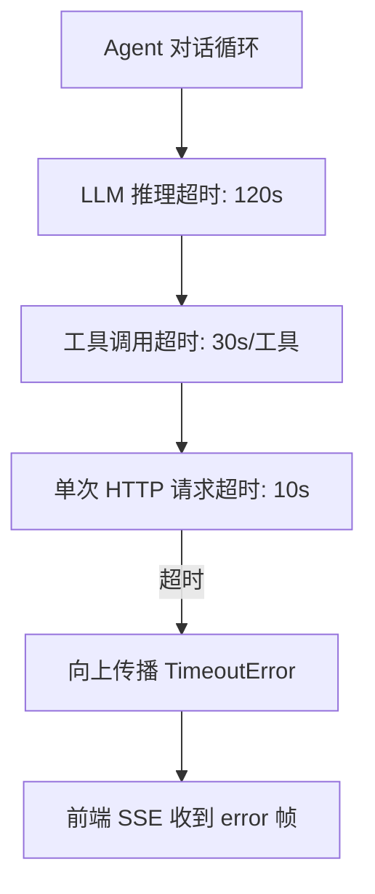

# YA-09-02: Agent 可靠性修复 — 分层超时保护 + SSE 错误传播 — 开发方案

> **文档职责**：本文档定义**怎么做、为什么这么做、实际做成什么样**（HOW），不含产品目标与测试用例。

> 来源 PRD：[07-需求-Agent可靠性.md](../../prds/2026-09/07-需求-Agent可靠性.md)
> 需求编号：YA-09-02 · 优先级：P0 · 人天：2.5d · 状态：已完成

---

## 一、问题背景

Agent 在工具调用和 LLM 推理阶段缺乏超时保护——单次工具调用卡住会导致整个对话循环僵死。SSE 流中的错误也未正确传播到前端。

### 分层超时

---

## 二、实施步骤

| 步骤 | 内容 | 验证 | 人天 |
|------|------|------|------|
| 1 | 分层超时（LLM 120s / 工具 30s / HTTP 10s） | 各层超时正确触发 | 1.0 |
| 2 | SSE 错误帧传播 | 前端收到 `{"error": "..."}` | 0.75 |
| 3 | Agent 循环恢复——超时后继续下一轮 | 不僵死 | 0.75 |

**合计：2.5d**。

---

## 三、关联模块

- 依赖：[YA-08-13 Agent 工具系统](../2026-08/13-prd-task-Agent工具系统.md)
- 关联：[YA-09-17 SSE 流式背压控制](./17-prd-task-SSE流式背压控制与缓冲策略.md)

---

## 已知缺口与技术债

### 功能缺口

| # | 缺口 | 影响 | 建议 |
|---|------|------|------|
| — | 无 | — | — |

### 技术债

| # | 技术债 | 优先级 | 预计人天 | 说明 | 状态 |
|---|--------|--------|---------|------|------|
| 1 | 超时时长硬编码 | P3 | 0.1 | 工具超时默认 30s 未配置化 | 待实施 |
| 2 | SSE 错误无结构化格式 | P3 | 0.1 | 错误信息为纯文本 | 待实施 |
