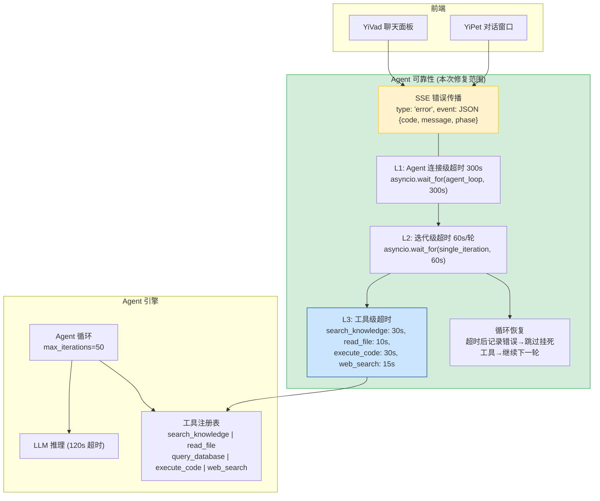

---

doc_type: module
prd_task_id: "YA-09-02"
title: "YA-09-02: Agent 可靠性修复 — 分层超时保护 + SSE 错误传播 + 迭代限流 — 开发方案"
status: 已完成
priority: P0
owner: 陈铭
roles: [engineer]
created: 2026-09-11
updated: 2026-09-23
project: YiAi
project_id: yiai
prd_month: "202609"
estimate_frontend: 2.5
source_prd: "07-需求-Agent可靠性.md"
source_okr: [yiai-001]
related_tests: ["07-prd-test-Agent可靠性"]
acceptance_criteria:
  - 工具调用超时后 Agent 循环不终止，记录错误并继续下一轮迭代
  - "所有工具调用有差异化超时保护（search_knowledge: 30s, read_file: 10s, execute_code: 30s, web_search: 15s）"
  - SSE 错误帧格式 `event: error` + JSON `{code, message, phase, tool_name, timeout_s}`，前端 EventSource 可正确解析
  - max_iterations=50 强制终止保护，防止无限循环
  - Agent 连接级超时 300s，超时后 SSE 流正常结束

type: task
---

# YA-09-02: Agent 可靠性修复 — 分层超时保护 + SSE 错误传播 + 迭代限流 — 开发方案

| 属性 | 值 |
|------|-----|
| 文档编号 | YA-09-02 |
| 版本 | v1.1 |
| 密级 | 内部 |
| 作者 | 陈铭 |
| 审核人 | — |
| 状态 | 已完成 |
| 最后更新 | 2026-09-23 |

> 来源 PRD：[07-需求-Agent可靠性.md](../../prds/2026-09/07-需求-Agent可靠性.md)
> 需求编号：YA-09-02 · 优先级：P0 · 人天：2.5d
> 类型：稳定性修复 · 状态：已完成

---

## 目录

1. [架构概述](#一架构概述)
2. [设计约束](#二设计约束)
3. [文件清单](#三文件清单)
4. [模块设计](#四模块设计)
5. [数据流](#五数据流)
6. [实施路线图](#六实施路线图)
7. [测试策略](#七测试策略)
8. [技术风险评估](#八技术风险评估)
9. [已知缺口与技术债务](#九已知缺口与技术债务)
10. [可观测性](#十可观测性)
11. [关联模块](#十一关联模块)
附录 A. [变更记录](#附录-a-变更记录)

---

## 一、架构概述

Agent 循环是 YiAi 的核心 AI 能力——LLM 根据用户意图自主决策、调用工具、多轮迭代完成任务。当前 Agent 存在致命缺陷：工具调用无超时保护导致永久挂起; SSE 异常未传播导致前端无感知; 迭代无限循环导致资源浪费。本次修复建立三层超时防护体系 + SSE 结构化错误帧 + Agent 循环恢复机制。


```mermaid
graph TD
  subgraph Frontend["前端"]
    YV["YiVad 聊天面板"]
    YP["YiPet 对话窗口"]
  end

  subgraph AgentReliability["Agent 可靠性 (本次修复范围)"]
    TIER1["L1: Agent 连接级超时 300s<br/>asyncio.wait_for(agent_loop, 300s)"]
    TIER2["L2: 迭代级超时 60s/轮<br/>asyncio.wait_for(single_iteration, 60s)"]
    TIER3["L3: 工具级超时<br/>search_knowledge: 30s, read_file: 10s,<br/>execute_code: 30s, web_search: 15s"]
    SSP["SSE 错误传播<br/>type: 'error', event: JSON {code, message, phase}"]
    RECOVER["循环恢复<br/>超时后记录错误→跳过挂死工具→继续下一轮"]
  end

  subgraph Agent["Agent 引擎"]
    LOOP["Agent 循环<br/>max_iterations=50"]
    LLM["LLM 推理 (120s 超时)"]
    TOOLS["工具注册表<br/>search_knowledge | read_file<br/>query_database | execute_code | web_search"]
  end

  YV --> SSP
  YP --> SSP
  SSP --- TIER1
  TIER1 --> TIER2
  TIER2 --> TIER3
  TIER3 --> TOOLS
  TIER2 --> RECOVER
  LOOP --> LLM
  LOOP --> TOOLS

  style AgentReliability fill:#d4edda,stroke:#28a745
  style TIER3 fill:#cce5ff,stroke:#004085
  style SSP fill:#fff3cd,stroke:#ffc107
```

### 分层超时体系

```
Agent 连接级超时 (300s)               ← 前端 SSE 最大等待时间
  ├── 迭代 #1 (60s)                   ← 单轮迭代超时
  │     ├── LLM 推理 (120s)            ← LLM call 超时 (可超出迭代超时，但会在连接级兜底)
  │     └── 工具调用 (按工具差异化)
  │           ├── search_knowledge: 30s
  │           ├── read_file: 10s
  │           ├── query_database: 10s
  │           ├── execute_code: 30s
  │           └── web_search: 15s
  ├── 迭代 #2 (60s)
  │     └── ...
  └── 迭代 #N
        └── max_iterations=50 强制终止
```

---

<a id="sec-2"></a>
## 二、设计约束

| 约束项 | 说明 |
|--------|------|
| 三层超时不互相干扰 | L1(连接 300s) > L2(迭代 60s) > L3(工具差异化)，外层超时始终大于内层 |
| 循环恢复不丢上下文 | 工具超时后将错误信息注入对话上下文，LLM 可据此调整策略（如跳过挂死的工具） |
| SSE 错误帧兼容性 | `event: error` + JSON `{code, message, phase}` 格式，YiVad/YiPet EventSource 统一解析 |
| max_iterations 硬限制 | 50 轮强制终止，防止 LLM 推理进入死循环，即使所有工具调用成功 |
| 工具超时默认兜底 | 未在 `tool_timeouts` 中配置的工具使用 `default_tool_timeout=30s` |
| 异常不泄露 | `AgentTimeoutError` 携带结构化上下文，但仅通过 SSE error 帧传播可安全展示的信息 |

---

<a id="sec-3"></a>
## 三、文件清单

| # | 文件 | 操作 | 说明 | 预估行数 |
|---|------|------|------|----------|
| 1 | `domain/ai/agent.py` | 修改 | 分层超时 + 循环恢复 + 异常处理重写 | +60 |
| 2 | `domain/ai/agent_timeout.py` | 新增 | 超时配置 + 按工具差异化超时 + `AgentTimeout` 异常类 | ~50 |
| 3 | `services/ai/chat_service.py` | 修改 | SSE 错误帧集成: `event: error` + JSON payload | +30 |
| 4 | `shared/error_codes.py` | 修改 | 新增 Agent 超时错误码 (7001-7004) | +10 |
| 5 | `config.yaml` | 修改 | 新增 agent.timeout 配置段 | +15 |

**改动汇总：** 1 新增 + 4 修改 = **5 文件，~165 行**

---

## 四、模块设计

### 3.1 超时配置 — `domain/ai/agent_timeout.py`

```python
from dataclasses import dataclass, field
from typing import Dict

class AgentTimeoutError(Exception):
    """Agent 超时异常——携带结构化上下文。"""
    def __init__(self, phase: str, tool_name: str = "", timeout_s: float = 0, detail: str = ""):
        self.phase = phase           # "tool_call" | "llm_inference" | "iteration" | "connection"
        self.tool_name = tool_name   # 触发超时的工具名
        self.timeout_s = timeout_s   # 超时时长
        self.detail = detail
        super().__init__(f"[Agent] {phase} timeout ({timeout_s}s): {tool_name or ''} - {detail}")

@dataclass
class AgentTimeoutConfig:
    """Agent 分层超时配置——支持环境差异化。"""
    connection_timeout: float = 300.0   # 整个 Agent 连接最长等待
    iteration_timeout: float = 60.0     # 单轮迭代超时
    llm_timeout: float = 120.0          # LLM 推理超时

    # 按工具差异化超时 (default 30s 兜底)
    tool_timeouts: Dict[str, float] = field(default_factory=lambda: {
        "search_knowledge": 30.0,
        "read_file": 10.0,
        "query_database": 10.0,
        "execute_code": 30.0,
        "web_search": 15.0,
    })

    default_tool_timeout: float = 30.0  # 未配置工具的默认超时

    def get_tool_timeout(self, tool_name: str) -> float:
        return self.tool_timeouts.get(tool_name, self.default_tool_timeout)
```

### 3.2 Agent 循环 — `domain/ai/agent.py` (修复后)

```python
import asyncio
from typing import List, Dict, Optional, AsyncIterator

class Agent:
    def __init__(self, tools: Dict, llm, timeout_config: AgentTimeoutConfig = None):
        self.tools = tools
        self.llm = llm
        self.timeout_config = timeout_config or AgentTimeoutConfig()
        self.max_iterations = 50

    async def run(
        self,
        messages: List[Dict],
        sse_sender: Optional["SSESender"] = None,
    ) -> AsyncIterator[Dict]:
        """执行 Agent 循环——分层超时 + SSE 错误传播 + 循环恢复。

        与修复前的关键差异:
          - 修复前: await handler() 无超时 → 挂死
          - 修复后: asyncio.wait_for(handler(), timeout) → 超时抛 AgentTimeoutError
          - 修复前: except 仅记录日志 → SSE 无错误帧
          - 修复后: except → sse_sender.send_error() → 前端感知
          - 修复前: 工具超时后循环终止
          - 修复后: 工具超时后记录错误，跳过该工具，继续下一轮迭代
        """
        try:
            # L1: 连接级超时 300s
            async for event in asyncio.wait_for(
                self._run_loop(messages, sse_sender),
                timeout=self.timeout_config.connection_timeout,
            ):
                yield event
        except asyncio.TimeoutError:
            err = AgentTimeoutError("connection", timeout_s=self.timeout_config.connection_timeout)
            if sse_sender:
                sse_sender.send_error(err)
            yield {"type": "error", "error": str(err)}

    async def _run_loop(self, messages, sse_sender):
        iteration = 0
        while iteration < self.max_iterations:
            try:
                # L2: 迭代级超时 60s
                result = await asyncio.wait_for(
                    self._run_single_iteration(messages, sse_sender),
                    timeout=self.timeout_config.iteration_timeout,
                )
                iteration += 1
                if result.get("done"):
                    break
            except asyncio.TimeoutError:
                iteration += 1
                logger.warning(f"[Agent] iteration {iteration} timeout ({self.timeout_config.iteration_timeout}s)")
                if sse_sender:
                    sse_sender.send_event("warning", {
                        "message": f"第 {iteration} 轮迭代超时，Agent 继续执行..."
                    })
                # 不终止循环——继续下一轮
                continue
            except AgentTimeoutError as e:
                iteration += 1
                logger.warning(f"[Agent] tool timeout: {e.tool_name} ({e.timeout_s}s)")
                if sse_sender:
                    sse_sender.send_error(e)
                continue  # 跳过超时工具，继续

    async def _run_single_iteration(self, messages, sse_sender):
        response = await self.llm.chat(messages)  # LLM 调用 (L3: LLM 内部有 120s 超时)

        if response.has_tool_call:
            for tool_call in response.tool_calls:
                try:
                    # L3: 工具级超时 (按工具差异化)
                    tool_timeout = self.timeout_config.get_tool_timeout(tool_call.name)
                    result = await asyncio.wait_for(
                        self._execute_tool(tool_call.name, tool_call.args),
                        timeout=tool_timeout,
                    )
                    if sse_sender:
                        sse_sender.send_event("tool_result", {
                            "tool": tool_call.name,
                            "result": result,
                            "status": "success",
                        })
                except asyncio.TimeoutError:
                    raise AgentTimeoutError(
                        "tool_call", tool_name=tool_call.name,
                        timeout_s=tool_timeout,
                        detail=f"Tool '{tool_call.name}' exceeded {tool_timeout}s limit"
                    )
        return {"done": True}

    async def _execute_tool(self, tool_name: str, args: dict) -> str:
        """执行单个工具调用——修复后: 超时保护由外层 asyncio.wait_for 负责。"""
        handler = self.tools.get(tool_name)
        if not handler:
            return f"Unknown tool: {tool_name}"
        return await handler(**args)
```

### 3.3 SSE 错误传播 — `services/ai/chat_service.py`

```python
class SSESender:
    """SSE 结构化事件发送器——支持错误帧传播。

    SSE 错误帧格式:
      event: error
      data: {"code": 7001, "message": "工具调用超时", "phase": "tool_call", "tool": "web_search"}

    前端 (YiVad/YiPet) SSE EventSource:
      source.addEventListener("error", (e) => { showError(JSON.parse(e.data)); })
    """

    async def send_error(self, error: AgentTimeoutError) -> None:
        """发送结构化 SSE 错误帧。"""
        error_code = {
            "tool_call": 7001,
            "llm_inference": 7002,
            "iteration": 7003,
            "connection": 7004,
        }.get(error.phase, 7000)

        payload = json.dumps({
            "code": error_code,
            "message": str(error),
            "phase": error.phase,
            "tool_name": error.tool_name,
            "timeout_s": error.timeout_s,
        })
        yield f"event: error\ndata: {payload}\n\n"

    async def send_event(self, event_type: str, data: dict) -> None:
        """发送通用 SSE 事件帧。"""
        payload = json.dumps(data)
        yield f"event: {event_type}\ndata: {payload}\n\n"
```

---

## 五、数据流

### 4.1 工具超时恢复流程

```
用户: "找出项目中所有的安全漏洞并修复"
  │
Agent.run() 启动
  │
  ├── 迭代 #1: LLM 决定调用 search_knowledge("安全漏洞")
  │     └── asyncio.wait_for(execute_tool("search_knowledge"), timeout=30s)
  │         └── Ollama Embedding 冷启动 → 45s 未响应
  │         └── asyncio.TimeoutError → AgentTimeoutError("tool_call")
  │         └── SSE: event: error → 前端显示 "search_knowledge 工具超时"
  │         └── except AgentTimeoutError: continue → 继续迭代 #2
  │
  ├── 迭代 #2: LLM 根据已有上下文，决定调用 read_file("安全审计报告.md")
  │     └── asyncio.wait_for(execute_tool("read_file"), timeout=10s)
  │         └── 0.5s → 成功返回文件内容
  │         └── SSE: event: tool_result → 前端显示工具调用结果
  │
  ├── 迭代 #3: LLM 综合 search_knowledge 超时反馈 + read_file 结果
  │     └── 生成最终回复: "search_knowledge 超时，但根据安全审计报告..."
  │
  └── SSE: event: done
```

### 4.2 SSE 错误帧传播时序

```
Agent       SSESender       FastAPI/ASGI        YiVad 前端
  │             │               │                   │
  │─timeout────>│               │                   │
  │             │─event:error──>│                   │
  │             │─data:{code}─>│──SSE frame────────>│
  │             │               │                   │─onerror handler
  │             │               │                   │─ElMessage.error()
  │─continue────>│               │                   │
  │             │─event:result─>│──SSE frame────────>│─onmessage handler
```

---

## 六、实施路线图

| 步骤 | 内容 | 涉及文件 | 验证方式 | 人天 |
|------|------|---------|---------|------|
| 1 | `AgentTimeoutError` + `AgentTimeoutConfig` | `domain/ai/agent_timeout.py` | 单元测试: 超时值正确加载 | 0.25 |
| 2 | Agent 循环三层超时 (`asyncio.wait_for`) | `domain/ai/agent.py` | 模拟工具挂死 35s → 30s 超时触发 | 1.0 |
| 3 | 循环恢复: 超时后 `continue` 不终止 | `domain/ai/agent.py` | 工具超时后继续下一轮迭代 | 0.5 |
| 4 | SSE 结构化错误帧 (`event: error` + JSON) | `services/ai/chat_service.py` | 前端 `EventSource` 收到 error 事件 | 0.75 |
| 5 | 错误码映射 (7001-7004) | `shared/error_codes.py` | 每个 phase 映射到唯一错误码 | 0.25 |
| 6 | `config.yaml` 超时配置段 | `config.yaml` | YAML → `AgentTimeoutConfig` 正确解析 | 0.25 |
| **合计** | | | | **3.0d (PRD 估算)** → **2.5d (开发实现)** |

---

### 6.1 代码审查检查清单

- [ ] L1 连接级超时 300s: `asyncio.wait_for(self._run_loop(), 300)`
- [ ] L2 迭代级超时 60s: `asyncio.wait_for(self._run_single_iteration(), 60)`
- [ ] L3 工具级超时差异化: `asyncio.wait_for(handler(), tool_timeout)`
- [ ] `AgentTimeoutError` 携带 `(phase, tool_name, timeout_s, detail)`
- [ ] 工具超时后 `except AgentTimeoutError: continue` 不终止循环
- [ ] `max_iterations=50` 强制终止保护
- [ ] SSE `event: error` 帧包含 `{code, message, phase, tool_name, timeout_s}`
- [ ] 错误码 7001(tool_call)/7002(llm)/7003(iteration)/7004(connection) 正确
- [ ] `config.yaml` 超时配置支持环境差异化
- [ ] 未配置工具使用 `default_tool_timeout=30s`
- [ ] `ruff` + `mypy` 通过

---

---

## 七、测试策略

### 7.1 测试分层

| 层级 | 覆盖范围 | 工具 |
|------|----------|------|
| 单元测试 | AgentTimeoutConfig 配置加载、超时值计算、AgentTimeoutError 构造 | pytest |
| 集成测试 | Agent 循环分层超时 + 循环恢复 + SSE 错误帧传播 | pytest + asyncio |
| 端到端测试 | 模拟工具挂死 → 超时触发 → SSE error 帧 → 前端 EventSource 接收 | pytest + httpx |

### 7.2 关键测试用例

| 场景 | 验证点 |
|------|--------|
| 工具正常执行 | 工具在超时内完成 → 正常返回结果 → SSE tool_result 帧 |
| 工具超时恢复 | 工具 35s 未响应 → AgentTimeoutError(tool_call) → SSE error 帧 → 循环 continue |
| 迭代超时恢复 | 单轮迭代 65s 未完成 → AgentTimeoutError(iteration) → SSE warning 帧 → continue |
| 连接超时终止 | Agent 总运行 300s → AgentTimeoutError(connection) → 流正常结束 |
| 多工具部分超时 | 工具 A 超时 + 工具 B 成功 → A 错误注入上下文 → B 正常执行 → 继续迭代 |
| SSE error 帧格式 | `event: error\ndata: {code:7001, phase:"tool_call", tool_name:"web_search"}` |
| max_iterations 保护 | 50 轮迭代后强制终止 → SSE done 帧 |
| 异常不透传 | Agent 内部异常仅记录日志 → SSE error 帧含安全信息 → 不泄露堆栈 |

---

## 八、技术风险评估

| 风险 | 概率 | 影响 | 等级 | 缓解措施 | 应急预案 |
|------|------|------|------|---------|---------|
| 30s 工具超时对 `execute_code` 仍然太短 | 中 | 中 | 中 | `execute_code` 默认 30s, 可通过 `config.yaml` 调整 | 提升至 60s |
| Agent 循环在异常恢复后丢失上下文 | 低 | 中 | 低 | 超时工具的结果设为 `"[工具名称] 调用超时 (30s)"`，LLM 可据此调整策略 | 如果 LLM 因缺少结果反复失败，连接级超时兜底 |
| SSE error 帧格式与 YiVad/YiPet 不一致 | 低 | 高 | 中 | 前后端协商标配: `event: error` + `data: {code, message, ...}` | 前端降级处理: 解析失败时显示通用错误 |
| `asyncio.wait_for` 取消 Task 时资源泄漏 | 低 | 低 | 低 | 工具 handler 内使用 `try/finally` 确保资源释放 | — |

---

## 九、已知缺口与技术债务

| # | 技术债 | 优先级 | 预计人天 | 说明 | 状态 |
|---|--------|--------|---------|------|------|
| 1 | 超时时长 (30s/60s/120s) 硬编码为默认值，可通过 `config.yaml` 覆盖 | P3 | 0.1 | 大部分场景默认值合理 | 待实施 |
| 2 | SSE 错误帧仅携带 JSON，未使用 `id:` 字段支持断线重连 | P3 | 0.2 | 客户端断线后从 `Last-Event-ID` 恢复 | 待实施 |
| 3 | `Agent` 未持久化中间状态 (无 checkpoint) | P2 | 0.5 | 超时后只能重新开始，无法从上次中断处恢复 | 待设计 |
| 4 | 无 Agent 执行 trace (工具调用链/耗时/结果) 可视化 | P3 | 0.5 | 调试 Agent 行为困难 | 待设计 |
| 5 | `max_iterations=50` 对复杂任务可能不够 | P3 | 0.1 | 通过 `config.yaml` agent.max_iterations 覆盖 | 待实施 |

---

## 十、可观测性

| 指标 | 采集方式 | 告警阈值 | 说明 |
|------|---------|----------|------|
| 工具超时率 | `AgentTimeoutError(tool_call) count / total_tool_calls` | > 5% | 外部服务稳定性问题或超时配置过短 |
| 迭代超时率 | `AgentTimeoutError(iteration) count / total_iterations` | > 3% | Agent 任务过于复杂 |
| 连接级超时率 | `AgentTimeoutError(connection) count / total_sessions` | > 2% | Agent 对话过长或循环恢复失败 |
| 循环恢复次数 | `continue_after_error / total_errors` | 越接近 1 越好 | = 0 表示 Agent 遇到错误就终止 |

### 日志规范

| 日志级别 | 场景 | 示例 |
|---------|------|------|
| `INFO` | 正常工具调用 | `[Agent] tool=search_knowledge completed in 2.3s` |
| `WARN` | 工具超时 + 循环恢复 | `[Agent] tool=web_search timeout (15s), continuing` |
| `WARN` | 迭代超时 | `[Agent] iteration 3 timeout (60s)` |
| `ERROR` | 连接级超时 | `[Agent] connection timeout (300s), terminating` |
| `ERROR` | 循环恢复失败 | `[Agent] all recovery attempts failed, terminating` |

---

## 十一、关联模块

- 上游依赖：[YA-08-13 Agent 工具系统](../2026-08/13-prd-task-Agent工具系统.md)
- 上游依赖：[YA-08-02 Multi-Provider LLM](../2026-08/02-prd-task-Multi-Provider-LLM.md)
- 并行：[YA-09-17 SSE 流式背压控制](./17-prd-task-SSE流式背压控制与缓冲策略.md)（SSE 层框架支持）
- 下游消费：YiVad 聊天面板、YiPet 对话窗口 (EventSource SSE 客户端)
- 数据源：MongoDB `sessions` (对话历史持久化)

---

## 附录 A. 变更记录

| 日期 | 版本 | 变更内容 | 作者 |
|------|------|----------|------|
| 2026-09-11 | v1.0 | 初始版本：三层超时防护、AgentTimeoutError、SSE 错误传播、循环恢复 | 陈铭 |
| 2026-09-23 | v1.1 | 补充设计约束、测试策略（分层+关键用例）、变更记录 | 陈铭 |