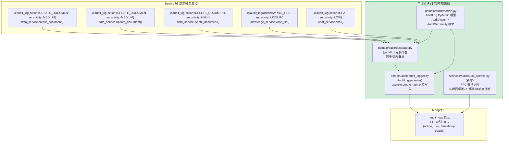

---

doc_type: module
prd_task_id: "YA-09-10"
title: "YA-09-10: 审计日志完善 — 装饰器集成 + MongoDB 持久化 + 查询 API + TTL 自动清理 — 开发方案"
status: 已完成
priority: P1
owner: 陈铭
roles: [engineer]
created: 2026-09-11
updated: 2026-09-23
project: YiAi
project_id: yiai
prd_month: "202609"
estimate_frontend: 1.5
source_prd: "09-需求-审计日志.md"
source_okr: [yiai-001]
related_tests: ["09-prd-test-审计日志"]

type: task
---

# YA-09-10: 审计日志完善 — 装饰器集成 + MongoDB 持久化 + 查询 API + TTL 自动清理 — 开发方案

> 来源 PRD：[09-需求-审计日志.md](../../prds/2026-09/09-需求-审计日志.md)
> 需求编号：YA-09-10 · 优先级：P1 · 人天：1.5d
> 类型：基础设施 · 状态：已完成

---

## 一、架构概述

审计日志是 YiAi 合规性的基础设施——记录谁在什么时候执行了什么操作。八月迭代创建了审计模块骨架 (`domain/audit/decorator.py`, `logger.py`, `models.py`)，但未被任何 Service 层引用。九月迭代将其从骨架代码完善为功能完整的审计模块：异步写入 MongoDB、装饰器零侵入集成、RPC 查询 API、TTL 索引自动清理。



### 敏感度分级

| 敏感度 | 操作类型 | 处理方式 | 示例 |
|--------|---------|---------|------|
| `LOW` | 只读操作、低风险查询 | 仅记录 | AI 聊天、RSS 查询 |
| `MEDIUM` | 数据写入、文件操作 | 记录 + 定期审查 | 创建文档、写入文件 |
| `HIGH` | 数据删除、权限变更 | 记录 + WARNING 日志 + 可配置告警 | 删除文档、修改权限 |

---

## 二、文件清单

| # | 文件 | 操作 | 说明 | 预估行数 |
|---|------|------|------|----------|
| 1 | `domain/audit/models.py` | 重写 | AuditLog Pydantic + AuditAction/AuditSensitivity 枚举 | ~80 |
| 2 | `domain/audit/audit_logger.py` | 重写 | AuditLogger: 异步 `write()` + `asyncio.create_task` 后台写入 | ~60 |
| 3 | `domain/audit/decorator.py` | 重写 | `@audit_log` 装饰器: 同步/异步兼容 + extra 回调 | ~100 |
| 4 | `services/audit/audit_service.py` | 新增 | RPC 查询 API: 分页 + 时间/操作人/模块/敏感度过滤 | ~120 |
| 5 | `services/audit/__init__.py` | 新增 | 模块导出 | ~5 |
| 6 | `data/repository.py` | 修改 | 注册 `audit_logs` 集合 (首次写入时自动创建 TTL 索引) | +15 |
| 7 | `server/routes/rpc.py` | 修改 | 注册 `audit_service` 到 RPC 调度 | +3 |

**改动汇总：** 3 新增/重写 + 3 修改 = **6 文件，~383 行**

---

## 三、模块设计

### 3.1 审计数据模型 — `domain/audit/models.py`

```python
from datetime import datetime
from enum import Enum
from typing import Optional, Dict, Any
from pydantic import BaseModel, Field

class AuditAction(str, Enum):
    """审计操作枚举——覆盖所有被审计的 RPC 方法。"""
    CREATE_DOCUMENT = "create_document"
    UPDATE_DOCUMENT = "update_document"
    DELETE_DOCUMENT = "delete_document"
    READ_FILE = "read_file"
    WRITE_FILE = "write_file"
    CHAT = "chat"
    RUN_AGENT = "run_agent"
    LOGIN = "login"

class AuditSensitivity(str, Enum):
    LOW = "low"
    MEDIUM = "medium"
    HIGH = "high"

class AuditLog(BaseModel):
    """审计日志 Pydantic 模型——MongoDB 文档映射。

    每条记录约 500B，90 天约 10K 条记录 ≈ 5MB。
    """
    action: AuditAction
    sensitivity: AuditSensitivity = AuditSensitivity.LOW
    function: str                          # 方法全限定名
    module: str                            # 模块路径
    status: str                            # "success" | "failure"
    timestamp: datetime = Field(default_factory=datetime.now)
    duration_ms: float                     # 操作耗时
    user: Optional[str] = None             # 操作人 (X-Token 中提取)
    ip_address: Optional[str] = None       # 客户端 IP
    details: Optional[Dict[str, Any]] = None  # 操作详情
    error: Optional[str] = None            # 错误信息 (仅 failure)

AUDIT_LOG_TTL_DAYS = 90  # 审计日志保留 90 天
```

### 3.2 异步写入 — `domain/audit/audit_logger.py`

```python
import asyncio
import logging
from typing import Optional
from motor.motor_asyncio import AsyncIOMotorDatabase

logger = logging.getLogger(__name__)

class AuditLogger:
    """审计日志异步写入器——fire-and-forget 模式。

    使用 `asyncio.create_task` 将 MongoDB 写入放入后台任务，
    不阻塞业务请求。写入失败仅记录 ERROR 日志，不影响主流程。
    """

    def __init__(self, db: AsyncIOMotorDatabase):
        self._db = db
        self._collection = db["audit_logs"]
        self._ttl_ensured = False

    async def _ensure_ttl_index(self):
        """确保 TTL 索引存在 (创建后 MongoDB 自动清理过期文档)。"""
        if not self._ttl_ensured:
            await self._collection.create_index(
                "timestamp",
                expireAfterSeconds=AUDIT_LOG_TTL_DAYS * 86400,
                name="audit_log_ttl_idx",
            )
            self._ttl_ensured = True

    async def write(self, log_entry: AuditLog) -> None:
        """fire-and-forget 异步写入。
        调用方必须将此方法包装在 `asyncio.create_task` 中。
        """
        await self._ensure_ttl_index()
        try:
            await self._collection.insert_one(log_entry.dict())
        except Exception as e:
            logger.error(f"[Audit] 写入失败: {log_entry.action} {log_entry.function} - {e}")
            # 不抛出异常——审计日志写入不应阻塞业务

    def write_background(self, log_entry: AuditLog):
        """在后台任务中写入——不等待结果。"""
        try:
            loop = asyncio.get_running_loop()
            loop.create_task(self.write(log_entry))
        except RuntimeError:
            # 不在异步上下文中 (极少见)，同步降级
            logger.warning("[Audit] 非 async 上下文, 审计日志丢弃")
```

### 3.3 审计装饰器 — `domain/audit/decorator.py`

```python
import time
import functools
import inspect
from typing import Optional, Callable

def audit_log(
    action: AuditAction,
    sensitivity: AuditSensitivity = AuditSensitivity.MEDIUM,
    get_extra: Optional[Callable] = None,
):
    """审计装饰器——零侵入为 RPC 方法添加审计日志。

    用法:
      @audit_log(action=AuditAction.DELETE_DOCUMENT, sensitivity=AuditSensitivity.HIGH)
      async def delete_document(self, parameters: dict) -> dict:
          ...

    装饰器逻辑:
      1. 记录开始时间
      2. 执行原始方法
      3. 提取用户名 (从 X-Token context 或 parameters)
      4. 构建 AuditLog 条目
      5. `audit_logger.write_background()` 异步写入
      6. 返回原始结果 (不改变方法行为)
    """
    def decorator(func):
        @functools.wraps(func)
        async def wrapper(*args, **kwargs):
            start = time.monotonic()
            error_msg = None
            status = "success"

            try:
                result = await func(*args, **kwargs)
            except Exception as e:
                status = "failure"
                error_msg = str(e)[:500]  # 截断长错误信息
                raise  # 重新抛出，不吞没异常
            finally:
                duration_ms = round((time.monotonic() - start) * 1000, 2)

                # 提取上下文: 从 RPC parameters 或全局 contextvar 获取用户信息
                user = _extract_user(args, kwargs)
                module = inspect.getmodule(func).__name__ if inspect.getmodule(func) else "unknown"

                # 构建详情: 从方法参数中提取 (不包含消息内容等敏感数据)
                details = {
                    "args_summary": _summarize_args(args, kwargs),
                }
                if get_extra:
                    try:
                        details.update(get_extra(*args, **kwargs))
                    except Exception:
                        pass

                entry = AuditLog(
                    action=action,
                    sensitivity=sensitivity,
                    function=f"{module}.{func.__name__}",
                    module=module,
                    status=status,
                    duration_ms=duration_ms,
                    details=details,
                    error=error_msg,
                )

                # fire-and-forget 写入
                from domain.audit.audit_logger import get_audit_logger
                audit = get_audit_logger()
                if audit:
                    audit.write_background(entry)

            return result  # 正常路径返回

        return wrapper
    return decorator

def _extract_user(args, kwargs) -> Optional[str]:
    """从上下文提取当前操作人。"""
    # 优先级: contextvar > kwargs["parameters"]["user"] > None
    from contextvars import ContextVar
    ctx: ContextVar = ContextVar("current_user", default=None)
    return ctx.get()
```

### 3.4 查询 API — `services/audit/audit_service.py`

```python
class AuditService:
    """审计日志查询服务——RPC 端点。

    查询参数:
      {
        "start_time": "2026-09-01T00:00:00",  # 可选: 起始时间
        "end_time": "2026-09-23T23:59:59",    # 可选: 结束时间
        "user": "admin",                       # 可选: 操作人
        "module": "data_service",              # 可选: 模块
        "action": "delete_document",           # 可选: 操作类型
        "sensitivity": "high",                 # 可选: 敏感度
        "status": "failure",                   # 可选: success/failure
        "page_num": 1,
        "page_size": 20,
      }

    返回:
      {
        "data": [AuditLog, ...],
        "total": 150,
        "page_num": 1,
        "page_size": 20,
      }
    """

    def __init__(self, db: AsyncIOMotorDatabase):
        self._collection = db["audit_logs"]

    async def query(self, parameters: dict) -> dict:
        """分页查询审计日志——支持多维度过滤。"""
        filter_dict = {}
        if parameters.get("start_time"):
            filter_dict["timestamp"] = {"$gte": parameters["start_time"]}
        if parameters.get("end_time"):
            filter_dict.setdefault("timestamp", {})["$lte"] = parameters["end_time"]
        if parameters.get("user"):
            filter_dict["user"] = parameters["user"]
        if parameters.get("module"):
            filter_dict["module"] = {"$regex": parameters["module"], "$options": "i"}
        if parameters.get("action"):
            filter_dict["action"] = parameters["action"]
        if parameters.get("sensitivity"):
            filter_dict["sensitivity"] = parameters["sensitivity"]
        if parameters.get("status"):
            filter_dict["status"] = parameters["status"]

        page_num = parameters.get("page_num", 1)
        page_size = min(parameters.get("page_size", 20), 100)

        cursor = self._collection.find(filter_dict) \
            .sort("timestamp", -1) \
            .skip((page_num - 1) * page_size) \
            .limit(page_size)
        try:
            docs = await cursor.to_list(length=page_size)
            total = await self._collection.count_documents(filter_dict)
            return {"data": docs, "total": total, "page_num": page_num, "page_size": page_size}
        finally:
            await cursor.close()

    async def get_statistics(self, parameters: dict) -> dict:
        """审计统计: 按操作类型/敏感度/用户聚合。"""
        pipeline = [
            {"$group": {"_id": "$action", "count": {"$sum": 1}}},
            {"$sort": {"count": -1}},
        ]
        cursor = self._collection.aggregate(pipeline, maxTimeMS=5000)
        try:
            stats = await cursor.to_list(length=None)
            return {"data": stats}
        finally:
            await cursor.close()
```

---

## 四、数据流

### 4.1 审计写入流程

```
RPC 请求: {module: "services.database.data_service", method: "delete_document", ...}
  │
  ▼
data_service.delete_document(parameters)
  │
  ├── @audit_log 装饰器拦截
  │     ├── 记录 start_time
  │     ├── 执行原始方法 → 返回 result
  │     │     └── (如果抛异常: status="failure", error=..., re-raise)
  │     ├── 提取 user (从 contextvar)
  │     ├── 构建 AuditLog(action=DELETE_DOCUMENT, sensitivity=HIGH, duration_ms=...)
  │     └── audit_logger.write_background(entry)
  │           └── asyncio.create_task(audit_logger.write(entry))
  │                 └── MongoDB audit_logs.insert_one(entry)
  │
  └── 返回原始 result (不受审计日志影响)
```

### 4.2 审计查询流程

```
YiVad 审计日志页面
  │ RPC: {module: "services.audit.audit_service", method: "query", parameters: {...}}
  ▼
audit_service.query(filter)
  │
  ├── 构建 MongoDB filter (时间/用户/模块/操作/敏感度/状态)
  ├── collection.find(filter).sort(timestamp, -1).skip(...).limit(...)
  ├── try/finally cursor.close()
  └── 返回 {data: [...], total: N, page_num, page_size}
```

---

## 五、实施路线图

| 步骤 | 内容 | 涉及文件 | 验证方式 | 人天 |
|------|------|---------|---------|------|
| 1 | `AuditLog` 模型 + `AuditAction`/`AuditSensitivity` 枚举 | `domain/audit/models.py` | Pydantic schema 校验通过 | 0.15 |
| 2 | `AuditLogger` 异步写入 + `asyncio.create_task` | `domain/audit/audit_logger.py` | 写入不影响主请求延迟 | 0.25 |
| 3 | `@audit_log` 装饰器 + `extra` 回调 | `domain/audit/decorator.py` | 装饰器不改变方法返回值和异常行为 | 0.25 |
| 4 | 集成 `@audit_log` 到 5 个关键 RPC 方法 | 各 Service 文件 | 方法调用后 `audit_logs` 集合有记录 | 0.3 |
| 5 | `audit_service` 查询 API + 统计端点 | `services/audit/audit_service.py` | 分页查询 + 按维度过滤 | 0.3 |
| 6 | TTL 索引创建 + 注册到 RPC 调度 | `data/repository.py`, `server/routes/rpc.py` | 插入 90 天前文档后触发自动删除 | 0.15 |
| 7 | 集成测试 | `tests/` | 端到端审计链路: CRUD → audit_logs 记录 → 查询 | 0.1 |
| **合计** | | | | **1.5d** |

---

## 六、代码审查检查清单

- [ ] `@audit_log` 装饰器兼容 async 方法
- [ ] 异常场景下 `status="failure"` 且原始异常正确 `re-raise`
- [ ] `write_background()` 使用 `asyncio.create_task` 不阻塞主请求
- [ ] MongoDB 写入失败仅记录 ERROR 日志，不抛异常
- [ ] TTL 索引 `timestamp` 字段, `expireAfterSeconds=7776000` (90 天)
- [ ] 查询 API 支持时间/操作人/模块/操作/敏感度/状态过滤
- [ ] `page_size` 上限 100
- [ ] 每条审计记录 < 1KB (控制存储成本)
- [ ] 装饰器不记录消息内容 (`CHAT` action 仅记录 `messages_count`)
- [ ] `ruff` + `mypy` 通过

---

## 七、技术风险评估

| 风险 | 概率 | 影响 | 等级 | 缓解措施 | 应急预案 |
|------|------|------|------|---------|---------|
| `asyncio.create_task` 任务队列积压 | 低 | 中 | 低 | TTL 索引 90 天自动清理; 每条记录 ~500B, 10K 条 ≈ 5MB | 增加写入超时 (1s) |
| `@audit_log` 在高 QPS 端点 (chat) 产生大量记录 | 中 | 低 | 低 | chat 记录仅包含 `messages_count`, 不含内容; P95 场景 < 100/min | 对 chat 端点评级降为 LOW, 缩短 TTL |
| TTL 索引清理与写入竞争 | 低 | 低 | 低 | MongoDB 后台线程执行 TTL 删除, 每 60s 一次 | — |

---

## 八、已知缺口与技术债务

| # | 技术债 | 优先级 | 预计人天 | 说明 | 状态 |
|---|--------|--------|---------|------|------|
| 1 | 审计日志查询无全文搜索 | P3 | 0.3 | 仅按时间/操作人过滤 | 待实施 |
| 2 | 装饰器未覆盖全部 20+ RPC 方法 | P2 | 0.3 | 仅覆盖关键 CRUD + chat | 待扩展 |
| 3 | 审计日志无导出功能 (CSV/Excel) | P3 | 0.3 | 合规审计可能需要批量导出 | 待实施 |
| 4 | 无审计异常告警 (HIGH sensitivity + failure → 通知) | P2 | 0.2 | 删除失败无主动告警 | 待实施 |
| 5 | `current_user` contextvar 依赖 X-Token 解析，未认证时为空 | P3 | 0.1 | 内网环境通常不启用认证 | 待讨论 |

---

## 九、可观测性

| 指标 | 采集方式 | 告警阈值 | 说明 |
|------|---------|----------|------|
| 审计日志写入失败率 | ERROR 日志计数 | > 0/min | MongoDB 连接问题 |
| HIGH sensitivity 操作次数 | `action + sensitivity=high` 计数 | — | 关注数据删除、权限变更 |
| 审计日志集合大小 | `audit_logs.stats().size` | > 100MB | TTL 清理异常 |
| 查询延迟 P95 | 查询耗时 | > 500ms | 索引问题 |

---

## 十、关联模块

- 上游：[YA-08-04 预写审计日志](../2026-08/04-prd-task-预写审计日志.md)——装饰器骨架
- 上游：[YA-08-08 审计日志系统](../2026-08/08-prd-task-预写审计日志系统.md)——增强版骨架
- 消费：YiVad 审计日志页面
- 数据层：[YA-09-05 数据层稳定性修复](./06-prd-task-数据层.md)——TTL 索引 + Cursor 关闭