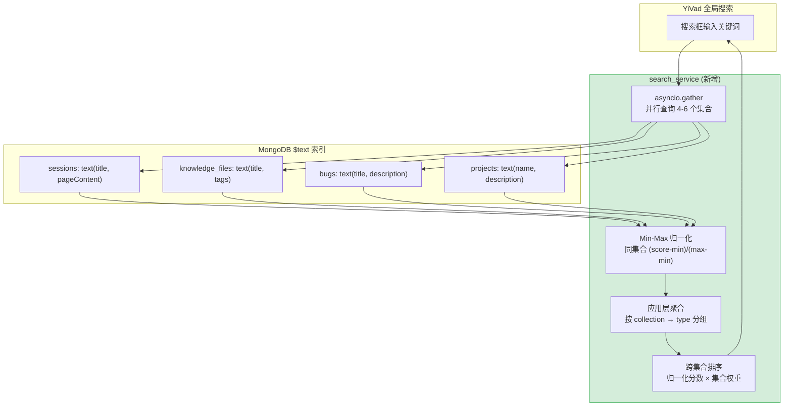

---

doc_type: module
prd_task_id: "YA-09-06"
title: "YA-09-06: 全局搜索服务 — 跨集合 MongoDB $text 索引 + 应用层聚合 + Min-Max 分数归一化 — 开发方案"
status: 已完成
priority: P1
owner: 陈铭
roles: [engineer]
created: 2026-09-11
updated: 2026-09-23
project: YiAi
project_id: yiai
prd_month: "202609"
estimate_frontend: 2.5
source_prd: "10-需求-全局搜索服务.md"
source_okr: [yiai-001]
related_tests: ["10-prd-test-全局搜索服务"]

type: task
---

# YA-09-06: 全局搜索服务 — 跨集合全文检索 + 搜索结果聚合 — 开发方案

> 来源 PRD：[10-需求-全局搜索服务.md](../../prds/2026-09/10-需求-全局搜索服务.md)
> 需求编号：YA-09-06 · 优先级：P1 · 人天：2.5d
> 类型：功能 · 状态：已完成

---

## 一、架构概述

YiVad 管理后台需要全局搜索——用户在一个搜索框中搜索所有类型的数据（项目、缺陷、知识文件、会话、RSS）。当前各集合独立查询，用户需要切换页面分别搜索。本次实现基于 MongoDB `$text` 索引 + 应用层并行查询 + Min-Max 分数归一化聚合排序，无需额外部署 Elasticsearch。



### 搜索字段与权重矩阵

| 集合 | 搜索字段 | 索引类型 | 集合权重 | 结果类型标识 |
|------|---------|---------|---------|-------------|
| `sessions` | `title`, `pageContent` | `$text` | 1.0 (高) | `session` |
| `requirements` | `title`, `description`, `tags` | `$text` | 0.85 | `requirement` |
| `bugs` | `title`, `description`, `module`, `severity` | `$text` | 0.9 | `bug` |
| `knowledge_files` | `title`, `tags`, `category`, `content_preview` | `$text` | 0.8 | `knowledge` |
| `projects` | `name`, `description`, `key` | `$text` | 1.0 (高) | `project` |
| `rss_entries` | `title`, `summary`, `tags` | `$text` | 0.6 | `rss` |

---

## 二、文件清单

| # | 文件 | 操作 | 说明 | 预估行数 |
|---|------|------|------|----------|
| 1 | `services/search/search_service.py` | 新增 | 全局搜索核心: 并行查询 + 归一化 + 聚合排序 | ~180 |
| 2 | `services/search/__init__.py` | 新增 | 模块导出 | ~5 |
| 3 | `domain/data/search_indices.py` | 新增 | MongoDB `$text` 索引创建脚本 | ~60 |
| 4 | `server/routes/rpc.py` | 修改 | 注册 `search_service` 到 RPC 调度 | +3 |
| 5 | `data/repository.py` | 修改 | 新增 `text_search()` 泛型方法 | +30 |

**改动汇总：** 3 新增 + 2 修改 = **5 文件，~278 行**

---

## 三、模块设计

### 3.1 搜索配置 — `services/search/search_service.py`

```python
from dataclasses import dataclass, field
from typing import List, Dict, Optional
import asyncio
import math
from motor.motor_asyncio import AsyncIOMotorDatabase

@dataclass
class SearchableCollection:
    """可搜索集合配置。"""
    name: str                          # MongoDB collection 名称
    fields: List[str]                  # 参与 $text 检索的字段
    weight: float                      # 集合权重 (0-1, 跨集合排序时应用)
    result_type: str                   # 前端展示的类型标识
    limit_per_collection: int = 15     # 每个集合返回的最大结果数

SEARCHABLE_COLLECTIONS: Dict[str, SearchableCollection] = {
    "sessions": SearchableCollection(
        name="sessions",
        fields=["title", "pageContent"],
        weight=1.0,
        result_type="session",
    ),
    "bugs": SearchableCollection(
        name="bugs",
        fields=["title", "description", "module", "severity"],
        weight=0.9,
        result_type="bug",
    ),
    "knowledge_files": SearchableCollection(
        name="knowledge_files",
        fields=["title", "tags", "category", "content_preview"],
        weight=0.8,
        result_type="knowledge",
    ),
    "projects": SearchableCollection(
        name="projects",
        fields=["name", "description", "key"],
        weight=1.0,
        result_type="project",
    ),
    "rss_entries": SearchableCollection(
        name="rss_entries",
        fields=["title", "summary", "tags"],
        weight=0.6,
        result_type="rss",
    ),
}
```

### 3.2 核心搜索 — `global_search()`

```python
class GlobalSearchService:
    """全局搜索服务——跨集合 $text 检索 + Min-Max 归一化聚合。

    搜索策略:
      1. 并行查询所有 (或指定) 集合
      2. 每个集合的 BM25 $textScore 通过 $meta 获取
      3. 集合内 Min-Max 归一化: (score - min) / (max - min)
      4. 跨集合排序: 归一化分数 × 集合权重
      5. 聚合返回: 按 type 分组 + 整体排序列表
    """

    def __init__(self, db: AsyncIOMotorDatabase):
        self._db = db

    async def search(
        self,
        query: str,
        collections: Optional[List[str]] = None,
        limit: int = 20,
        page_num: int = 1,
    ) -> Dict:
        """全局搜索入口。

        参数:
          query: 搜索关键词
          collections: 限定搜索的集合列表 (None = 全部)
          limit: 每页条数
          page_num: 页码

        返回:
          {
            "results": [{_id, title, _type, _score, _collection, ...}],
            "total": 45,
            "by_type": {"session": 12, "bug": 8, ...},
            "query": query,
            "time_ms": 85,
          }
        """
        target = collections or list(SEARCHABLE_COLLECTIONS.keys())
        valid_targets = [c for c in target if c in SEARCHABLE_COLLECTIONS]

        start = time.monotonic()

        # 1. 并行查询
        tasks = [self._search_collection(c, query) for c in valid_targets]
        per_collection_results = await asyncio.gather(*tasks, return_exceptions=True)

        # 2. 收集 + 归一化 + 加权
        all_results = []
        by_type = {}
        for cname, results in zip(valid_targets, per_collection_results):
            if isinstance(results, Exception):
                logger.warning(f"[Search] collection '{cname}' failed: {results}")
                continue
            config = SEARCHABLE_COLLECTIONS[cname]
            normalized = self._normalize_scores(results, cname)
            for r in normalized:
                r["_score"] = r.get("_norm_score", 0) * config.weight
                r["_type"] = config.result_type
                r["_collection"] = cname
            all_results.extend(normalized)
            by_type[config.result_type] = len(normalized)

        # 3. 跨集合排序 + 分页
        all_results.sort(key=lambda r: r["_score"], reverse=True)
        total = len(all_results)
        paged = all_results[(page_num - 1) * limit : page_num * limit]

        return {
            "results": paged,
            "total": total,
            "by_type": by_type,
            "query": query,
            "time_ms": round((time.monotonic() - start) * 1000, 1),
        }

    async def _search_collection(self, cname: str, query: str) -> List[Dict]:
        """在单个集合中执行 $text 搜索。
        返回: [{_id, title, ..., _score: $textScore}]
        """
        config = SEARCHABLE_COLLECTIONS[cname]
        collection = self._db[cname]

        pipeline = [
            {"$match": {"$text": {"$search": query}}},
            {"$addFields": {"_score": {"$meta": "textScore"}}},
            {"$sort": {"_score": -1}},
            {"$limit": config.limit_per_collection},
            {"$project": {
                "_id": 1, "title": 1, "description": 1,
                "tags": 1, "category": 1, "severity": 1,
                "_score": 1,
            }},
        ]
        cursor = collection.aggregate(pipeline, maxTimeMS=5000)
        try:
            return await cursor.to_list(length=config.limit_per_collection)
        finally:
            await cursor.close()

    def _normalize_scores(self, docs: List[Dict], cname: str) -> List[Dict]:
        """Min-Max 归一化——批内归一化避免全局 min/max 计算。

        归一化公式: (score - min) / (max - min)
        边界: max == min 时全部设为 1.0
             score 为 None 时设为 0
        """
        if not docs:
            return docs

        scores = [d.get("_score", 0) or 0 for d in docs]
        min_s = min(scores)
        max_s = max(scores)
        score_range = max_s - min_s

        for doc in docs:
            raw = doc.get("_score", 0) or 0
            if score_range > 0:
                doc["_norm_score"] = (raw - min_s) / score_range
            else:
                doc["_norm_score"] = 1.0  # 所有文档分数相同
        return docs
```

### 3.3 `$text` 索引创建 — `domain/data/search_indices.py`

```python
"""MongoDB $text 索引创建——支持全局搜索。

运行方式:
  python -m domain.data.search_indices

索引为复合 text 索引，覆盖 SEARCHABLE_COLLECTIONS 中每个集合。
"""

async def create_text_indices(db: AsyncIOMotorDatabase):
    """为所有可搜索集合创建 $text 复合索引。"""
    for cname, config in SEARCHABLE_COLLECTIONS.items():
        collection = db[cname]

        # 检查已有索引
        existing = await collection.index_information()
        text_index_name = f"{'_'.join(config.fields)}_text"

        if text_index_name not in existing:
            text_spec = [(field, "text") for field in config.fields]
            await collection.create_index(text_spec, name=text_index_name)
            logger.info(f"[Search] 创建 $text 索引: {cname} ({', '.join(config.fields)})")
        else:
            logger.info(f"[Search] $text 索引已存在: {cname}")
```

---

## 四、数据流

### 4.1 全局搜索序列

```
YiVad 用户: 输入 "RAG 引擎"
  │
  ▼
RPC: {module: "services.search.search_service", method: "search",
      parameters: {query: "RAG 引擎", collections: null, limit: 20}}
  │
  ▼
GlobalSearchService.search()
  │
  ├── asyncio.gather(并行)
  │     ├── _search_collection("sessions", "RAG 引擎")
  │     │     └── aggregate: [$match: {$text: {search: "RAG 引擎"}},
  │     │                     $addFields: {_score: {$meta: "textScore"}},
  │     │                     $sort: {_score: -1}, $limit: 15]
  │     │     └── → [{title: "RAG 引擎配置", _score: 2.4}, ...]
  │     │
  │     ├── _search_collection("knowledge_files", "RAG 引擎")
  │     │     └── → [{title: "RAG 优化指南", _score: 3.1}, ...]
  │     │
  │     ├── _search_collection("bugs", "RAG 引擎")
  │     │     └── → [{title: "RAG 检索超时 bug", _score: 1.8}, ...]
  │     │
  │     └── _search_collection("projects", "RAG 引擎")
  │           └── → [] (无匹配)
  │
  ├── 归一化: sessions (2.4→0.8), knowledge_files (3.1→0.95), bugs (1.8→0.6)
  ├── 加权: sessions (0.8×1.0=0.8), knowledge (0.95×0.8=0.76), bugs (0.6×0.9=0.54)
  ├── 排序: knowledge (0.76) > session (0.8) > bug (0.54)
  ├── 分组: by_type={session: 5, knowledge: 8, bug: 3, project: 0}
  │
  └── 返回: {results: [...], total: 16, by_type: {...}, time_ms: 85}
```

---

## 五、实施路线图

| 步骤 | 内容 | 涉及文件 | 验证方式 | 人天 |
|------|------|---------|---------|------|
| 1 | MongoDB `$text` 索引创建 (4 个集合) | `domain/data/search_indices.py` | `db.collection.getIndexes()` 包含 text 索引 | 0.5 |
| 2 | `asyncio.gather` 并行查询 + `$text` pipeline | `services/search/search_service.py` | 4 个集合并行查询 < 200ms | 0.75 |
| 3 | Min-Max 归一化 + 集合权重跨集合排序 | `services/search/search_service.py` | 跨集合结果按相关性排序 | 0.5 |
| 4 | `search_service` RPC 封装 + `data/repository` 集成 | `server/routes/rpc.py`, `data/repository.py` | RPC 调用返回聚合结果 | 0.5 |
| 5 | 集成测试: 边界 (空查询/无结果/单集合) | `tests/` | 空查询返回空列表, 单集合仅返回该集合 | 0.25 |
| **合计** | | | | **2.5d** |

---

## 六、代码审查检查清单

- [ ] 所有 6 个可搜索集合都已创建 `$text` 索引
- [ ] `asyncio.gather` 并行查询，单个集合失败不影响其他集合
- [ ] Min-Max 归一化正确处理 `max == min` (全部 1.0) 和 `score=None` (设 0)
- [ ] 集合权重 0.6-1.0 已按业务重要性分配
- [ ] 空查询直接返回空结果 (不执行 `$text` 搜索)
- [ ] `limit_per_collection=15`, 总 limit=20
- [ ] 聚合 pipeline 使用 `maxTimeMS=5000` 防止慢查询
- [ ] Cursor 在 `finally` 中关闭
- [ ] `$text` 搜索不支持中文分词 (MongoDB 限制), 依赖精确词匹配或前缀匹配
- [ ] `ruff` + `mypy` 通过

---

## 七、技术风险评估

| 风险 | 概率 | 影响 | 等级 | 缓解措施 | 应急预案 |
|------|------|------|------|---------|---------|
| MongoDB `$text` 不支持中文分词 | 高 | 中 | 中 | 中文搜索依赖精确字符匹配；可扩展 jieba 分词预处理 | 引入 Elasticsearch 或 Atlas Search |
| 大集合 (10K+ 文档) `$text` 扫描慢 | 中 | 中 | 中 | `limit_per_collection=15` 限制每个集合扫描量；聚合 `maxTimeMS=5s` | 对大集合增加 `$match` 前置过滤 |
| 归一化后同分文档排序不稳定 | 低 | 低 | 低 | 第二排序键: `_id` (确定性排序) | — |
| 6 个集合并行查询 MongoDB 连接池压力 | 中 | 低 | 低 | 连接池 `minPoolSize=10` 预热；每个查询 < 200ms | 降低并行度: 分两批查询 |

---

## 八、已知缺口与技术债务

| # | 技术债 | 优先级 | 预计人天 | 说明 | 状态 |
|---|--------|--------|---------|------|------|
| 1 | 搜索结果无缓存 | P3 | 0.2 | 相同查询重复搜索，浪费 MongoDB 资源 | 待实施 |
| 2 | `$text` 无法高亮匹配词 | P3 | 0.3 | 前端无法展示搜索词在结果中的位置 | 待实施 |
| 3 | 无搜索建议/自动补全 | P3 | 0.5 | 用户输入时无实时建议 | 待实施 |
| 4 | 权限过滤未实现 | P2 | 0.5 | 不同用户可见数据范围不同，当前全量搜索 | 待设计 |

---

## 九、关联模块

- 上游依赖：[YA-09-05 数据层稳定性](./06-prd-task-数据层.md)（连接池 + Cursor + 聚合超时）
- 下游消费：[YiVad 全局搜索页面](../../yivad/)
- 数据源：MongoDB sessions, knowledge_files, bugs, projects, rss_entries, requirements