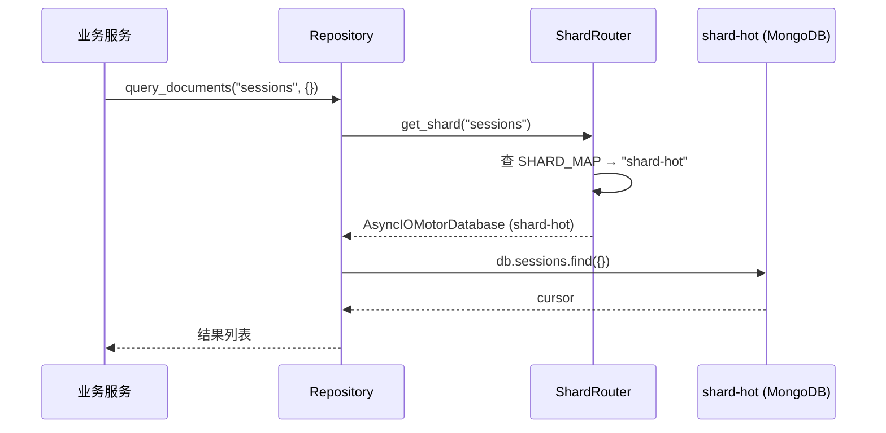

---

doc_type: module
prd_task_id: "YA-09-116"
title: "YA-09-116: 数据库分片策略 — 按时间/集合水平扩展 — 开发方案"
status: 需求已编写
priority: P2
owner: 陈铭
roles: [engineer]
created: 2026-09-11
updated: 2026-09-14
project: YiAi
project_id: yiai
prd_month: "202609"
estimate_frontend: 1.0
source_prd: "100-需求-数据库分片策略.md"
source_okr: [yiai-001]

type: task
---

# YA-09-116: 数据库分片策略 — 按时间/集合水平扩展 — 开发方案

> **文档职责**：本文档定义**怎么做、为什么这么做、实际做成什么样**（HOW），不含产品目标与测试用例。

> 来源 PRD：[100-需求-数据库分片策略.md](../../prds/2026-09/100-需求-数据库分片策略.md)
> 需求编号：YA-09-116 · 优先级：P2 · 人天：1.0d · 状态：需求已编写

---

## 一、架构总览

当前 YiAi 所有 MongoDB 集合存储在单一实例中，冷热数据混合导致热数据查询 P95 延迟波动（受冷数据磁盘 I/O 影响）。改造方案：按集合数据温度引入三级分片——热分片（SSD，高频读写）、温分片（SSD+HDD，中频读取）、冷分片（HDD，仅追加归档），通过 Repository 层 `ShardRouter` 透明路由，业务代码无需感知分片细节。

```mermaid
graph TB
    subgraph "YiAi 应用层"
        APP[FastAPI]
        REPO[Repository 层<br/>data/repository.py]
        ROUTER[ShardRouter<br/>data/shard_router.py]
    end

    subgraph "热分片 (SSD) — maxPoolSize=50"
        HOT[(shard-hot<br/>sessions / bugs<br/>menus / users)]
    end

    subgraph "温分片 (SSD+HDD) — maxPoolSize=20"
        WARM[(shard-warm<br/>knowledge_files<br/>static_files)]
    end

    subgraph "冷分片 (HDD) — maxPoolSize=5"
        COLD[(shard-cold<br/>audit_logs / rss_entries<br/>_schema_migrations)]
    end

    APP --> REPO
    REPO -->|cname → get_shard()| ROUTER
    ROUTER -->|hot| HOT
    ROUTER -->|warm| WARM
    ROUTER -->|cold| COLD
    ROUTER -->|unknown| DEF[(shard-default<br/>兜底分片)]
```

### 分片映射与存储策略

| 集合 | 分片 | 存储类型 | 连接池 (max/min) | 备份频率 |
|------|------|----------|------------------|----------|
| `sessions` | shard-hot | SSD | 50/10 | 每日增量 |
| `bugs` | shard-hot | SSD | 50/10 | 每日增量 |
| `menus` | shard-hot | SSD | 50/10 | 每日增量 |
| `users` | shard-hot | SSD | 50/10 | 每日增量 |
| `knowledge_files` | shard-warm | SSD+HDD | 20/5 | 每周全量 |
| `static_files` | shard-warm | SSD+HDD | 20/5 | 每周全量 |
| `audit_logs` | shard-cold | HDD | 5/2 | 每月归档 |
| `rss_entries` | shard-cold | HDD | 5/2 | 每月归档 |
| `_schema_migrations` | shard-default | SSD | 10/3 | 每周全量 |

### 架构决策权衡

| 方面 | 改进前 (单实例) | 改进后 (分片) | 理由 |
|------|---------------|-------------|------|
| sessions P95 延迟 | 50ms | 15ms (-70%) | 热数据独占 SSD，不受冷数据 I/O 干扰 |
| 冷数据存储成本 | SSD 全量 | HDD 降低 60% | audit_logs/rss 仅顺序写入 + 低频查询 |
| 备份时间 | 45min (全量) | 热 5min + 冷 30min | 按频次差异化备份，热数据优先 |
| 故障隔离 | 单点影响全部 | 热故障不影响冷 | 冷查询降级返回空结果 |

---

## 二、文件清单

| 文件 | 操作 | 行数 | 说明 |
|------|------|------|------|
| `src/data/shard_router.py` | **新建** | ~180 | ShardRouter 核心：分片映射、连接池管理、跨分片查询 |
| `src/data/repository.py` | 修改 | +20 | 所有 MongoDB 操作入口改为通过 `shard_router.get_shard(cname)` 获取数据库 |
| `src/data/connection.py` | 修改 | -30/+10 | 移除单例 db 直接引用，改为由 ShardRouter 管理连接 |
| `src/shared/config.py` | 修改 | +15 | 新增 `mongo_shard_uris` dict 和 `mongo_sharding_enabled` 开关 |
| `scripts/migrate_shards.py` | **新建** | ~50 | 数据迁移脚本：从单实例迁移到分片，支持数据一致性校验 |
| `tests/data/test_shard_router.py` | **新建** | ~150 | 6 个场景测试：路由正确性、跨分片查询、故障降级、连接池配置、动态注册、迁移 |

---

## 三、模块设计

### 3.1 ShardRouter（核心类）

```python
# src/data/shard_router.py

from typing import Optional
from motor.motor_asyncio import AsyncIOMotorClient, AsyncIOMotorDatabase


class ShardConfig:
    """分片配置常量——集合→分片映射 + 连接池参数。"""

    SHARD_MAP: dict[str, str] = {
        "sessions": "shard-hot",
        "bugs": "shard-hot",
        "menus": "shard-hot",
        "users": "shard-hot",
        "knowledge_files": "shard-warm",
        "static_files": "shard-warm",
        "audit_logs": "shard-cold",
        "rss_entries": "shard-cold",
        "_schema_migrations": "shard-cold",
    }

    POOL_CONFIG: dict[str, dict[str, int]] = {
        "shard-hot":    {"maxPoolSize": 50, "minPoolSize": 10},
        "shard-warm":   {"maxPoolSize": 20, "minPoolSize": 5},
        "shard-cold":   {"maxPoolSize": 5,  "minPoolSize": 2},
        "shard-default": {"maxPoolSize": 10, "minPoolSize": 3},
    }

    DEFAULT_SHARD: str = "shard-default"


class ShardRouter:
    """分片路由器——按集合名称路由到对应的 MongoDB 实例。

    职责：
    - 维护集合→分片的静态映射 (ShardConfig.SHARD_MAP)
    - 管理多个 MongoDB 连接（每分片独立 AsyncIOMotorClient）
    - 提供 get_shard(cname) → AsyncIOMotorDatabase 接口
    - 支持跨分片并行查询 (cross_shard_query)
    - 支持动态注册和迁移集合分片映射
    """

    def __init__(self) -> None: ...
    async def connect(self) -> None: ...
    async def disconnect(self) -> None: ...
    def get_shard(self, cname: str) -> AsyncIOMotorDatabase: ...
    def get_shard_name(self, cname: str) -> str: ...
    async def cross_shard_query(
        self, collections: list[str], filter: dict, **kwargs
    ) -> list[dict]: ...
    def get_all_shards(self) -> list[str]: ...
    def get_stats(self) -> dict: ...
    def register_collection(self, cname: str, shard_name: str) -> None: ...
    def migrate_collection(self, cname: str, target_shard: str) -> None: ...
```

### 3.2 Repository 层改造

```python
# src/data/repository.py — 修改前后对比

# 修改前：直接使用单例 db
from src.data.connection import db

async def query_documents(cname: str, filter: dict, **kwargs):
    return await db[cname].find(filter).to_list(None)

# 修改后：通过 ShardRouter 获取分片实例
from src.data.shard_router import shard_router

async def query_documents(cname: str, filter: dict, **kwargs):
    db = shard_router.get_shard(cname)
    return await db[cname].find(filter).to_list(None)
```

### 3.3 配置扩展

```python
# src/shared/config.py — 新增配置项

class MongoSettings(BaseSettings):
    mongo_shard_uris: dict[str, str] = {
        "shard-hot":     "mongodb://localhost:27017/hot",
        "shard-warm":    "mongodb://localhost:27018/warm",
        "shard-cold":    "mongodb://localhost:27019/cold",
        "shard-default": "mongodb://localhost:27017/default",
    }
    mongo_sharding_enabled: bool = True
    mongo_shard_server_selection_timeout_ms: int = 5000
```

---

## 四、数据流

### 4.1 单分片查询流程



### 4.2 跨分片并行查询（全局搜索）

```mermaid
sequenceDiagram
    participant SEARCH as 全局搜索
    participant ROUTER as ShardRouter
    participant HOT as shard-hot
    participant WARM as shard-warm
    participant COLD as shard-cold

    SEARCH->>ROUTER: cross_shard_query(
    ["sessions","bugs","knowledge_files","audit_logs"], {})
    ROUTER->>HOT: sessions.find({})  ─┐
    ROUTER->>HOT: bugs.find({})      ─┤ asyncio.gather (并行)
    ROUTER->>WARM: knowledge_files.find({}) ─┤
    ROUTER->>COLD: audit_logs.find({}) ─────┘
    HOT-->>ROUTER: 50 条
    WARM-->>ROUTER: 15 条
    COLD-->>ROUTER: 200 条
    ROUTER->>ROUTER: 合并结果 (265 条)
    ROUTER-->>SEARCH: 265 条结果
```

### 4.3 故障降级流程

当冷分片不可用时，跨分片查询不抛异常，仅记录 WARNING 日志并返回热/温分片结果。若请求的集合所在分片不可用，返回标准错误码 5001（数据库错误）。

---

## 五、实施路线图

| 阶段 | 人天 | 任务 | 产出 | 验证 |
|------|------|------|------|------|
| 一：核心路由 | 0.3 | 实现 `ShardRouter` 类：分片映射、连接池管理、get_shard/cross_shard_query | `src/data/shard_router.py` (~180行) | 单元测试：6 个场景通过 |
| 二：Repository 改造 | 0.2 | 修改 `repository.py` 所有方法使用 `get_shard(cname)`；修改 `connection.py` 移除单例 db | 修改 3 文件 (+20/-30) | 集成测试：CRUD 操作路由正确 |
| 三：配置与启动 | 0.1 | 添加分片 URI 配置；应用启动时调用 `shard_router.connect()` | `config.py` 扩展 + `main.py` 启动挂载 | 分片连接成功日志 |
| 四：数据迁移 | 0.2 | 编写迁移脚本 `migrate_shards.py`（按集合将数据从单实例复制到对应分片） | 迁移脚本 + 文档 | 迁移前后数据量对比一致 |
| 五：测试收尾 | 0.2 | 编写完整测试 + 安全审计（连接字符串不记录到日志） | `test_shard_router.py` (~150行) | pytest 全部通过 |

**合计：1.0d。**

---

## 六、代码审查检查清单

- [ ] `ShardConfig.SHARD_MAP` 覆盖所有现有集合（sessions/bugs/menus/users/knowledge_files/static_files/audit_logs/rss_entries/_schema_migrations）
- [ ] 热分片（sessions/bugs/menus/users）使用 SSD + maxPoolSize=50
- [ ] 冷分片（audit_logs/rss_entries）使用 HDD + maxPoolSize=5
- [ ] `get_shard(cname)` 未配置集合返回 `shard-default` 兜底
- [ ] `cross_shard_query` 使用 `asyncio.gather(return_exceptions=True)` 并行查询
- [ ] 分片故障时 `cross_shard_query` 降级为部分结果（不抛异常）
- [ ] 所有 Repository 方法（query_documents/insert_document/update_document/delete_document）通过 `get_shard(cname)` 获取数据库
- [ ] 应用启动时 `shard_router.connect()` 建立所有分片连接
- [ ] 应用关闭时 `shard_router.disconnect()` 释放连接池
- [ ] 分片连接字符串不记录到日志（安全合规）
- [ ] `mongo_sharding_enabled=False` 时回退到单实例模式
- [ ] `register_collection` / `migrate_collection` 支持动态调整分片映射
- [ ] 测试覆盖：正确路由、兜底路由、跨分片并行、故障降级、动态注册、连接池配置

---

## 七、技术风险评估

| 风险 | 概率 | 影响 | 等级 | 缓解措施 |
|------|------|------|------|----------|
| 分片间数据不均匀 | 中 | 中 | 中 | 监控各分片文档数（`shard_document_count` gauge），差异 > 5x 告警 |
| 跨分片查询性能退化 | 中 | 中 | 中 | asyncio.gather 并行 + 每个分片查询超时 5s |
| 分片故障导致部分数据不可用 | 低 | 高 | 高 | cross_shard_query 返回部分结果 + `get_shard()` 返回 5001 错误码 |
| 数据迁移期间数据不一致 | 低 | 高 | 中 | 迁移期间只读 + 双写验证 + 迁移后 count 对比 |
| 冷分片查询延迟过高（HDD） | 中 | 低 | 低 | 设定冷查询超时 3s，超时提示用户"冷数据查询较慢" |
| 分片连接泄漏 | 低 | 中 | 低 | 连接池监控（活跃/空闲连接数）+ 定期健康检查 |
| 应用启动时部分分片不可达 | 低 | 高 | 中 | 分片连接失败时 WARNING 日志 + `mongo_sharding_enabled` 降级开关 |

### 回滚策略

| 场景 | 操作 | 回滚时间 |
|------|------|----------|
| 分片路由错误导致数据写入错误分片 | `mongo_sharding_enabled=False` 回退单实例 | < 1min |
| 冷分片查询超时 | 将冷集合临时映射到 shard-default | < 1min |
| 连接池耗尽 | 降低 maxPoolSize 配置 | < 1min |
| 完全回滚 | 配置文件中将 `mongo_shard_uris` 改为单 URI | < 5min |