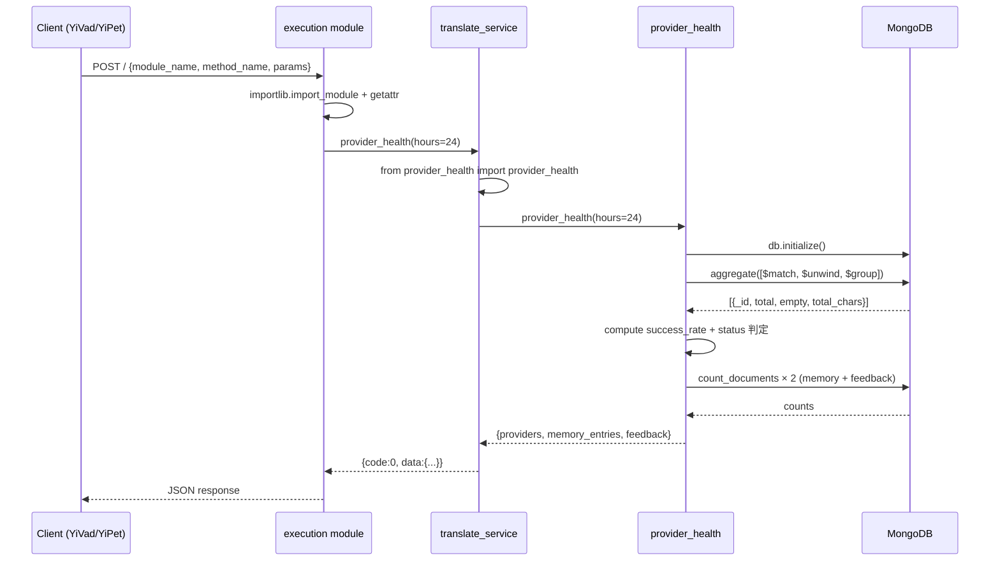

---

doc_type: task
prd_task_id: "YA-09-100"
title: "YA-09-100: 翻译分析增强 — 供应商健康监控 + 分析趋势 — 技术设计"
status: 已完成
priority: P2
owner: Claude
roles: [engineer]
created: 2026-09-23
updated: 2026-09-23
project: YiAi
project_id: yiai
prd_month: "202609"
estimate: 0.5
source_prd: "100-需求-翻译分析增强.md"
tags: [translation, analytics, monitoring, mongodb-aggregation]

type: task
---

# YA-09-100: 翻译分析增强 — 技术设计

> **版本**：v3.0 · **人天**：0.5d · **PRD**：[100-需求-翻译分析增强.md](../../prds/2026-09/100-需求-翻译分析增强.md)

---

## 1. 业务上下文（Business Context）

YiPet 通过 YiAi RPC 执行翻译，`translation_records` 集合已累积结构化数据。本设计为 YiAi 新增供应商健康监控和趋势分析能力，所有数据通过 MongoDB 聚合管道实时计算，通过 RPC 信封暴露给 YiVad Dashboard 消费。

**PRD**：[YA-09-100](../../prds/2026-09/100-需求-翻译分析增强.md)

## 2. 架构（Architecture）

### 系统架构图

```
YiVad TranslationAnalytics.vue
  │ RPC: provider_health / hourly_trend / provider_breakdown / top_language_pairs
  ▼
YiAi execution module (POST /)
  │ module_name: "services.translation.translate_service"
  │ method_name: "provider_health" | "hourly_trend" | ...
  ▼
translate_service.py (4 个 RPC 代理方法)
  │ 延迟导入 → provider_health.py
  ▼
provider_health.py
  │ MongoDB aggregation pipeline
  ▼
MongoDB translation_records / translation_memory / translation_feedback
```

### 组件清单

| 组件 | 职责 | 技术栈 | 文件 |
|------|------|--------|------|
| provider_health.py | 4 个聚合查询函数 | Python 3.10+ / Motor | `services/translation/provider_health.py` |
| translate_service.py | RPC 代理透出 | Python / FastAPI | `services/translation/translate_service.py` |
| MongoDB | 数据存储 + 聚合计算 | MongoDB 7+ | `translation_records` 等集合 |

### API 契约

所有接口通过 RPC 信封调用，无新增 REST 端点：

```
POST /
Request:  { module_name: "services.translation.translate_service",
            method_name: "provider_health"|"hourly_trend"|"provider_breakdown"|"top_language_pairs",
            parameters: { hours?: 24, days?: 7, limit?: 20 } }
Response: { code: 0, message: "ok", data: <见各接口> }
Errors:   MongoDB 不可达 → { code: 0, data: <空结果> }（优雅降级，不抛异常）
```

### 调用序列图



## 3. 实现细节（Implementation Detail）

### 文件变更

| 文件 | 操作 | 行数 |
|------|------|------|
| `services/translation/provider_health.py` | 新增 | ~90 |
| `services/translation/translate_service.py` | 修改 | +20 |

### provider_health.py 核心算法

**健康状态判定**：成功率 = success / total，阈值判定 → healthy(≥0.95) / degraded(≥0.70) / down(<0.70)

**趋势聚合**：`$dateToString` + `$group` 按小时分组，`$sort` 按时间升序

**性能关键路径**：所有聚合利用 `translation_records.created_at` 降序索引（性能优化第七轮已添加）

### 错误处理

```python
try:
    await db.initialize()
    pipeline = [...] 
    rows = await db.db[COLLECTION].aggregate(pipeline).to_list(length=None)
    return parsed_result
except Exception as e:
    logger.warning(f"Operation failed: {e!s}")
    return default_empty  # 空 dict/list，确保前端不崩溃
```

## 4. 非功能需求（Non-functional Requirements）

| 维度 | 要求 | 实现 |
|------|------|------|
| 性能 | 聚合 <100ms | 利用现有索引 + MongoDB 聚合管道 |
| 可用性 | MongoDB 不可达 → 空结果 | try/except + logger.warning |
| 可观测性 | 异常记 warning 日志 | 集成现有 logging 系统 |
| 安全 | 复用认证中间件 | 无新增认证逻辑 |
| 测试 | 16 个 pytest 用例 | `tests/unit/services/test_provider_health.py` |