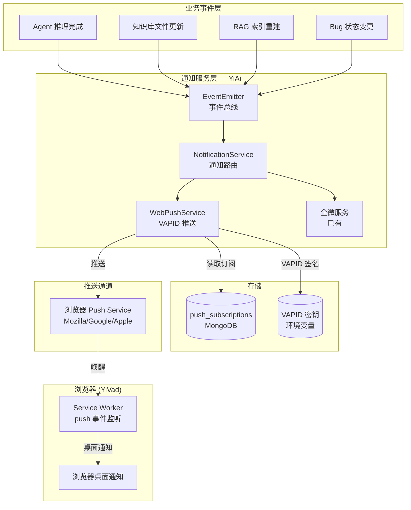
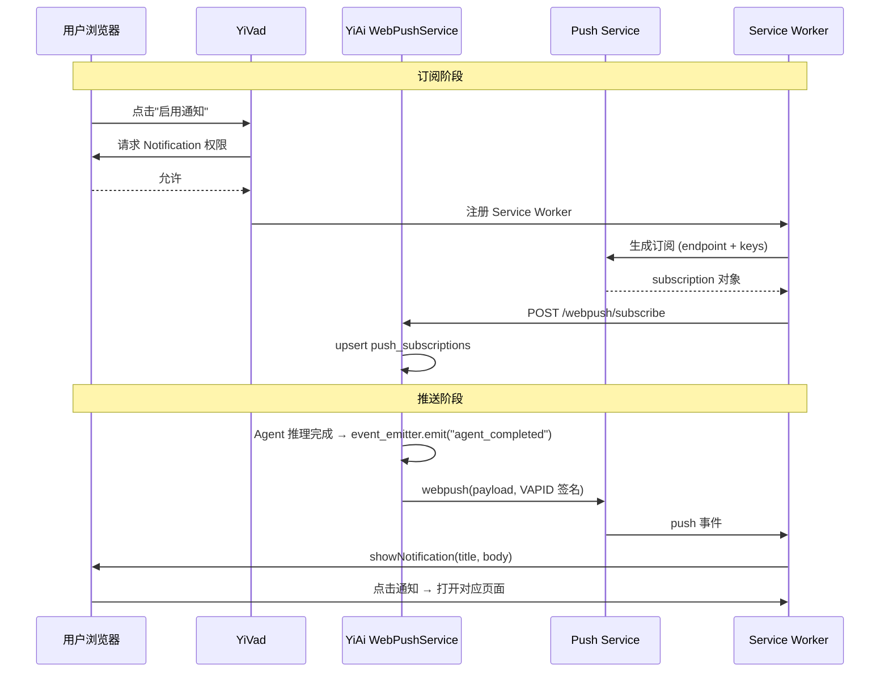

---

doc_type: module
prd_task_id: "YA-09-118"
title: "YA-09-118: Web Push 通知 — VAPID + 浏览器推送 — 开发方案"
status: 需求已编写
priority: P2
owner: 陈铭
roles: [engineer]
created: 2026-09-11
updated: 2026-09-14
project: YiAi
project_id: yiai
prd_month: "202609"
estimate_frontend: 0.5
source_prd: "101-需求-WebPush通知.md"
source_okr: [yiai-001]

type: task
---

# YA-09-118: Web Push 通知 — VAPID + 浏览器推送 — 开发方案

> **文档职责**：本文档定义**怎么做、为什么这么做、实际做成什么样**（HOW），不含产品目标与测试用例。

> 来源 PRD：[101-需求-WebPush通知.md](../../prds/2026-09/101-需求-WebPush通知.md)
> 需求编号：YA-09-118 · 优先级：P2 · 人天：0.5d · 状态：需求已编写

---

## 一、架构总览

YiAi 当前仅有企业微信通知渠道。当用户在浏览器中工作时（YiVad SPA），依赖企业微信查看通知割裂了工作流。方案：基于 Web Push API + VAPID 开放标准，实现浏览器桌面通知——无需用户保持页面打开，Service Worker 后台接收 push 事件。通过 EventEmitter（发布-订阅模式）解耦业务事件与通知渠道，新增通知渠道无需修改业务代码。



### 订阅与推送时序



---

## 二、文件清单

| 文件 | 操作 | 行数 | 说明 |
|------|------|------|------|
| `src/services/webpush_service.py` | **新建** | ~200 | WebPushService：订阅管理、单用户推送、事件广播推送、过期清理 |
| `src/domain/notification/__init__.py` | **新建** | ~5 | 通知领域模块初始化 |
| `src/domain/notification/event_emitter.py` | **新建** | ~40 | EventEmitter：轻量发布-订阅，`on(event, listener)` + `emit(event, data)` |
| `src/server/routes/webpush_routes.py` | **新建** | ~60 | API 端点：POST /subscribe, POST /unsubscribe, GET /subscriptions |
| `src/shared/config.py` | 修改 | +10 | 新增 `vapid_private_key`、`vapid_public_key`、`vapid_contact_email` |
| `scripts/gen_vapid_keys.py` | **新建** | ~20 | VAPID 密钥对生成脚本 |
| `YiVad/src/service/notification.ts` | 修改 | ~80 | 前端：Service Worker 注册、权限请求、订阅管理 |
| `tests/services/test_webpush_service.py` | **新建** | ~150 | 6 场景测试：订阅/推送/过滤/过期清理/取消订阅/批量推送 |

---

## 三、模块设计

### 3.1 PushSubscription（数据模型）

```python
# src/services/webpush_service.py

from dataclasses import dataclass, field


@dataclass
class PushSubscription:
    """浏览器推送订阅信息。"""
    endpoint: str                              # Push Service endpoint URL
    keys: dict                                 # {p256dh: str, auth: str}
    user_id: str                               # 用户标识
    project: str                               # 'yivad' | 'yipet'
    enabled_events: list[str] = field(         # 订阅的事件类型
        default_factory=lambda: [
            "agent_completed",
            "knowledge_updated",
            "rag_build_completed",
        ]
    )
    created_at: float = 0.0
    last_push_at: float = 0.0
```

### 3.2 WebPushService（核心服务）

```python
class WebPushService:
    """Web Push 通知服务——基于 VAPID 协议。

    职责：
    - 管理浏览器推送订阅 (push_subscriptions 集合)
    - 通过 pywebpush 推送 VAPID 签名通知
    - 处理 410 Gone 过期订阅自动清理
    - 支持按用户/事件类型过滤推送
    - 30 天未推送的僵尸订阅定期清理
    """

    COLLECTION: str = "push_subscriptions"

    def __init__(self) -> None:
        self._vapid_private_key: str = settings.vapid_private_key
        self._vapid_claims: dict = {"sub": f"mailto:{settings.vapid_contact_email}"}

    async def subscribe(self, subscription: PushSubscription) -> str: ...
    async def unsubscribe(self, endpoint: str, user_id: str) -> None: ...
    async def get_user_subscriptions(self, user_id: str) -> list[dict]: ...
    async def send_to_user(
        self, user_id: str, title: str, body: str,
        event_type: str = "general",
        data: dict | None = None,
        url: str | None = None,
    ) -> dict: ...
    async def send_to_event_subscribers(
        self, event_type: str, title: str, body: str,
        data: dict | None = None,
        url: str | None = None,
    ) -> dict: ...
    async def _push_one(self, subscription: dict, payload: str) -> None: ...
    async def cleanup_expired(self, max_age_days: int = 30) -> None: ...
    def get_vapid_public_key(self) -> str: ...
```

### 3.3 EventEmitter（事件总线）

```python
# src/domain/notification/event_emitter.py

from typing import Callable, Awaitable


Listener = Callable[[str, dict], Awaitable[None]]


class EventEmitter:
    """轻量事件发布-订阅——解耦业务逻辑与通知渠道。

    使用方式：
    - 业务点发射：await event_emitter.emit("agent_completed", {"session_key": "..."})
    - 通知服务订阅：event_emitter.on("agent_completed", webpush_service.on_agent_completed)
    """

    def __init__(self) -> None: ...
    def on(self, event: str, listener: Listener) -> None: ...
    async def emit(self, event: str, data: dict) -> None: ...


# 全局单例
event_emitter = EventEmitter()
```

### 3.4 API 端点

```python
# src/server/routes/webpush_routes.py

router = APIRouter(prefix="/webpush", tags=["webpush"])

@router.post("/subscribe")
async def subscribe(subscription: PushSubscription) -> dict:
    """保存浏览器推送订阅。前端 Service Worker 注册后调用。"""

@router.post("/unsubscribe")
async def unsubscribe(endpoint: str, user_id: str) -> dict:
    """取消订阅。用户关闭通知或浏览器撤销权限时调用。"""

@router.get("/subscriptions/{user_id}")
async def get_subscriptions(user_id: str) -> dict:
    """获取用户的所有订阅列表。"""

@router.get("/vapid-public-key")
async def get_vapid_public_key() -> dict:
    """获取 VAPID 公钥。前端 Service Worker 注册时需要。"""
```

---

## 四、数据流

### 4.1 事件驱动通知流程

```
业务事件触发
  └→ event_emitter.emit("agent_completed", data)
      └→ NotificationService.on_agent_completed(event, data)
          ├→ WebPushService.send_to_event_subscribers("agent_completed", title, body)
          │   ├→ 查询 push_subscriptions (enabled_events 包含 "agent_completed")
          │   ├→ 过滤：跳过未订阅该事件的用户
          │   └→ 并行推送：asyncio.gather(_push_one(sub, payload))
          │       └→ pywebpush.webpush(sub_info, payload, VAPID keys)
          │           ├→ 200: success += 1, 更新 last_push_at
          │           └→ 410: 订阅过期 → unsubscribe() → expired += 1
          └→ WeworkService.send(message) (已有渠道)
```

### 4.2 订阅生命周期

```
用户启用通知
  → 浏览器请求 Notification.permission
  → 注册 Service Worker → pushManager.subscribe()
  → 获得 subscription {endpoint, keys}
  → POST /webpush/subscribe → MongoDB upsert
  → 定期推送 (last_push_at 更新)
  → 过期检测：410 Gone / 30天未推送 → 自动删除
  → 用户主动取消 → POST /webpush/unsubscribe → 删除
```

---

## 五、实施路线图

| 阶段 | 人天 | 任务 | 产出 | 验证 |
|------|------|------|------|------|
| 一：VAPID 基础设施 | 0.05 | 生成 VAPID 密钥对；配置环境变量 | `scripts/gen_vapid_keys.py` + config | 公钥/私钥对生成成功 |
| 二：核心推送服务 | 0.15 | 实现 WebPushService（订阅管理 + 推送 + 过期清理） | `webpush_service.py` (~200行) | 单元测试：6 个场景通过 |
| 三：事件总线 | 0.05 | 实现 EventEmitter；注册通知监听器 | `event_emitter.py` (~40行) | 事件发射 → 监听器被调用 |
| 四：API + 业务集成 | 0.15 | 订阅管理 API；在 Agent/Knowledge/Bug 事件点发射事件 | routes + 3 处事件发射 | 端到端：Agent 完成 → 收到推送 |
| 五：前端 Service Worker | 0.05 | YiVad 注册 SW、权限请求、订阅 API 调用 | `notification.ts` (~80行) | 浏览器验证：通知权限弹窗 + 推送展示 |
| 六：测试收尾 | 0.05 | 整理测试 + 过期清理定时任务 | `test_webpush_service.py` | pytest 通过 |

**合计：0.5d。**

---

## 六、代码审查检查清单

- [ ] WebPushService 通过 pywebpush + VAPID 私钥签名推送
- [ ] 通知事件类型：agent_completed / knowledge_updated / rag_build_completed / bug_status_changed
- [ ] 用户可按事件类型配置通知偏好（enabled_events 列表）
- [ ] VAPID 密钥安全存储（环境变量，不硬编码，不记录日志）
- [ ] EventEmitter 解耦业务逻辑和通知——新增通知渠道无需改业务代码
- [ ] 过期订阅自动清理：410 Gone 即时删除 + 30 天定时清理
- [ ] 批量推送使用 asyncio.gather 并行（不串行等待）
- [ ] 推送失败不影响业务逻辑（try/except 包裹，仅记录日志）
- [ ] 推送内容仅标题+摘要，敏感详情通过 URL 跳转
- [ ] 浏览器不支持 Web Push 时降级到 in-app 通知
- [ ] 订阅管理 API 需要认证（X-Token）
- [ ] 前端 Service Worker 注册 + Notification.permission 请求
- [ ] apscheduler 定时任务：每日 3:00 执行 cleanup_expired()

---

## 七、技术风险评估

| 风险 | 概率 | 影响 | 等级 | 缓解措施 |
|------|------|------|------|----------|
| 浏览器不支持 Web Push | 中 | 中 | 中 | 检测 `'PushManager' in window`，降级到 in-app 通知 + 企微 |
| 用户拒绝通知权限 | 高 | 低 | 低 | 引导重新授权，提供"稍后开启"选项，不强制 |
| VAPID 密钥泄露 | 低 | 高 | 高 | 私钥仅存环境变量；定期轮换（90 天）；泄露后立即重新生成 |
| Push Service 不可用 | 低 | 中 | 低 | 推送失败 catch 异常继续，不影响业务逻辑 |
| 僵尸订阅膨胀 | 中 | 低 | 低 | 30 天定时清理 + 410 Gone 即时清理 |
| Safari 推送限制 | 中 | 中 | 中 | 检测 Safari，提示"需要 macOS 13+ Safari 16.4+" |
| 批量推送时部分失败阻塞整体 | 低 | 中 | 低 | `asyncio.gather(return_exceptions=True)` + 单次推送超时 5s |

### 回滚策略

| 场景 | 操作 | 回滚时间 |
|------|------|----------|
| 推送导致服务异常 | 设置 `WEBPUSH_ENABLED=False` 禁用推送 | < 1min |
| 密钥泄露 | 重新生成 VAPID 密钥对 + 更新环境变量 + 重启 | < 30min |
| 订阅数据损坏 | 清空 `push_subscriptions` 集合 + 用户重新订阅 | < 5min |
| 完全回滚 | 移除 webpush 模块注册 | < 10min |