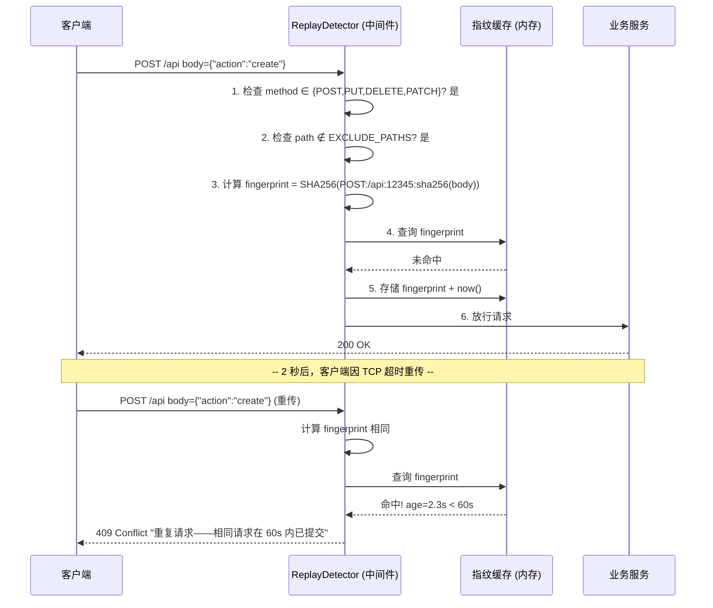

---

doc_type: module
prd_task_id: "YA-09-98"
title: "YA-09-98: 服务端请求重放检测 — 基于请求指纹的重复提交检测与幂等性保障 — 开发任务"
status: 需求已编写
priority: P2
owner: 陈铭
roles: [engineer]
created: 2026-09-11
updated: 2026-09-11
project: YiAi
project_id: yiai
prd_month: "202609"
estimate_frontend: 0.5
source_prd: "102-需求-请求重放检测.md"
source_okr: [yiai-001]

type: task
---

# YA-09-98: 服务端请求重放检测 — 基于请求指纹的重复提交检测与幂等性保障 — 开发任务

> **文档职责**：本文档定义**怎么做、为什么这么做、实际做成什么样**（HOW），不含产品目标与测试用例。

> 来源 PRD：[102-需求-请求重放检测.md](../../prds/2026-09/102-需求-请求重放检测.md)
> 需求编号：YA-09-98 · 优先级：P2 · 人天：0.5d · 状态：需求已编写

---

## 一、架构总览

YA-09-35（幂等写入保护）依赖客户端主动携带 `Idempotency-Key` header，但网络重传、前端 retry bug、用户双击等无意识的重复请求客户端不自知。方案：在中间件链中插入 `ReplayDetector`，基于 SHA256 请求指纹在 60 秒窗口内被动检测重复请求。仅检测写操作（POST/PUT/DELETE/PATCH），排除 SSE 流式路径。使用内存 OrderedDict 存储指纹，LRU 淘汰 + 定期清理防止内存泄漏。

```mermaid
graph TB
    subgraph "请求入口"
        REQ[HTTP 请求]
    end

    subgraph "中间件链 — 按执行顺序"
        TRACE[TraceID 注入<br/>YA-09-113]
        REPLAY[ReplayDetector<br/>← 本模块]
        RATE[RateLimiter<br/>YA-09-16]
        ROUTE[RPC 路由]
    end

    subgraph "ReplayDetector 内部"
        FINGER[指纹计算<br/>SHA256(method+path+time_bucket+body_hash)]
        CACHE[(指纹缓存<br/>OrderedDict<br/>TTL 60s / LRU 10K)]
        CLEAN[定期清理<br/>每 30s 清理过期指纹]
    end

    subgraph "响应"
        OK[正常放行]
        DUP[409 Conflict<br/>code: 1003<br/>"重复请求"]
    end

    REQ --> TRACE
    TRACE --> REPLAY
    REPLAY -->|第一步：跳过检测?| SKIP{GET/SSE?}
    SKIP -->|是| RATE
    SKIP -->|否| FINGER
    FINGER --> CACHE
    CACHE -->|命中 (< 60s)| DUP
    CACHE -->|未命中| RATE
    RATE --> ROUTE

    CLEAN -->|清理 > 60s| CACHE
```

### 检测时序



---

## 二、文件清单

| 文件 | 操作 | 行数 | 说明 |
|------|------|------|------|
| `src/shared/replay_detector.py` | **新建** | ~170 | ReplayDetector：指纹计算、窗口去重、LRU 淘汰、定期清理 |
| `src/server/middleware.py` | 修改 | +40 | 在中间件链中添加 `replay_detection_middleware` |
| `src/shared/config.py` | 修改 | +10 | 新增 `REPLAY_WINDOW_SEC`、`REPLAY_MAX_FINGERPRINTS` 配置项 |
| `tests/shared/test_replay_detector.py` | **新建** | ~150 | 7 个场景测试 |

---

## 三、模块设计

### 3.1 ReplayDetector（核心类）

```python
# src/shared/replay_detector.py

import hashlib
import time
import asyncio
from collections import OrderedDict
from typing import Optional


class ReplayDetector:
    """请求重放检测器——基于 SHA256 指纹 + 时间窗去重。

    设计要点：
    - 指纹 = SHA256(method + path + time_bucket + body_sha256)
    - time_bucket = timestamp // 60，确保同一请求在不同分钟有不同指纹
    - 仅检测写操作 (POST/PUT/DELETE/PATCH)
    - 排除 SSE 流式路径 (/chat, /agent/stream)
    - 内存 OrderedDict 存储，LRU 淘汰 + 30s 定期清理
    - asyncio.Lock 保护并发访问

    职责：
    - compute_fingerprint: 计算请求指纹
    - is_replay: 检查是否为窗口内重放
    - get_stats: 获取统计信息
    """

    DETECT_METHODS: set[str] = {"POST", "PUT", "DELETE", "PATCH"}
    EXCLUDE_PATHS: set[str] = {"/chat", "/agent/stream"}

    def __init__(
        self,
        window_sec: int = 60,
        max_fingerprints: int = 10000,
        cleanup_interval_sec: int = 30,
    ) -> None: ...

    def compute_fingerprint(
        self, method: str, path: str, body: bytes,
        timestamp_bucket: int | None = None,
    ) -> str: ...
    async def is_replay(
        self, method: str, path: str, body: bytes,
    ) -> bool: ...
    async def _maybe_cleanup(self) -> None: ...
    def get_stats(self) -> dict: ...
    def clear(self) -> None: ...
```

### 3.2 中间件集成

```python
# src/server/middleware.py — 新增中间件

from src.shared.replay_detector import replay_detector


@app.middleware("http")
async def replay_detection_middleware(request: Request, call_next):
    """重放检测中间件——在 RateLimiter 之前执行。"""
    body = await request.body()

    is_replay = await replay_detector.is_replay(
        method=request.method,
        path=request.url.path,
        body=body,
    )

    if is_replay:
        return JSONResponse(
            status_code=409,
            content={
                "code": 1003,
                "message": "重复请求——相同请求在 60s 内已提交",
                "data": None,
            },
        )

    # 重新构造请求体（FastAPI body 只能读一次）
    async def receive():
        return {"type": "http.request", "body": body}
    request._receive = receive
    return await call_next(request)
```

### 3.3 配置项

```python
# src/shared/config.py — 新增

class SecuritySettings(BaseSettings):
    replay_detection_enabled: bool = True
    replay_window_sec: int = 60
    replay_max_fingerprints: int = 10000
```

---

## 四、数据流

### 4.1 指纹计算流程

```
输入: method="POST", path="/api/data", body=b'{"action":"create"}'

步骤 1: time_bucket = int(time.time()) // 60  (例: 12345678)
步骤 2: body_hash = sha256(body).hexdigest()  (例: "a1b2c3...")
步骤 3: raw = f"POST:/api/data:12345678:a1b2c3..."
步骤 4: fingerprint = sha256(raw).hexdigest()  (64 char hex)

输出: "e4d5f6a7b8c9..."
```

### 4.2 检测判定矩阵

| 场景 | method | path | 距上次提交 | 结果 | 说明 |
|------|--------|------|-----------|------|------|
| 正常首次请求 | POST | /api | N/A | 放行 | 指纹不存在，存储后放行 |
| 2 秒后重复 | POST | /api | 2s | **409 拦截** | 指纹存在且 < 60s |
| 61 秒后重试 | POST | /api | 61s | 放行 | 指纹过期（> 60s）或 time_bucket 不同 |
| GET 请求 | GET | /api | — | 放行 | GET 天然幂等，不检测 |
| SSE 流式 | POST | /chat | — | 放行 | /chat 在 EXCLUDE_PATHS 中 |
| 不同 body | POST | /api | — | 放行 | body 不同 → 指纹不同 |

---

## 五、实施路线图

| 阶段 | 人天 | 任务 | 产出 | 验证 |
|------|------|------|------|------|
| 一：核心实现 | 0.15 | 实现 ReplayDetector 类：指纹计算、窗口去重、LRU 淘汰、定期清理 | `replay_detector.py` (~170行) | 单元测试：7 个场景通过 |
| 二：中间件集成 | 0.10 | 在 `middleware.py` 中添加 `replay_detection_middleware`；处理 body 重用 | 中间件链更新 | 集成测试：重复请求返回 409 |
| 三：配置 + 测试 | 0.10 | 添加配置项；编写完整测试用例 | config 扩展 + test | pytest 全部通过 |
| 四：压测验证 | 0.10 | 高 QPS 下指纹计算延迟 + 内存占用测量；与 YA-09-35 幂等保护联合验证 | 性能报告 | P99 延迟 < 0.5ms |
| 五：边界收尾 | 0.05 | 大 body 场景（> 1MB）指纹计算性能；中间件 body 重用验证 | 边界测试 | 所有边界通过 |

**合计：0.5d。**

---

## 六、代码审查检查清单

- [ ] 请求指纹 = SHA256(method + path + time_bucket + body_sha256)
- [ ] time_bucket = `int(time.time()) // 60`，确保不同分钟请求有不同指纹
- [ ] 指纹窗口 60s——超出窗口的请求视为新请求
- [ ] 重复指纹返回 409 Conflict (code: 1003)
- [ ] 仅对 POST/PUT/DELETE/PATCH 检测（GET/HEAD/OPTIONS 跳过）
- [ ] SSE 流式路径 (/chat, /agent/stream) 排除在检测外
- [ ] 与 `Idempotency-Key` header 不冲突——两者独立生效
- [ ] LRU 淘汰：超过 max_fingerprints(10000) 时删除最旧指纹
- [ ] 定期清理：每 30s 清理 > 60s 的过期指纹
- [ ] asyncio.Lock 保护指纹字典并发访问
- [ ] 指纹计算使用 SHA256（性能 > HMAC，碰撞概率 2^-256 可忽略）
- [ ] 中间件读取 body 后正确重构 `request._receive`，不影响下游处理
- [ ] 重放检测统计信息可通过 `get_stats()` 暴露
- [ ] `replay_detection_enabled=False` 时完全跳过检测

---

## 七、技术风险评估

| 风险 | 概率 | 影响 | 等级 | 缓解措施 |
|------|------|------|------|----------|
| 合法重试被误判为重放 | 中 | 中 | 中 | 60s 窗口 + time_bucket 机制；合法重试通常间隔 > 60s |
| 指纹存储内存泄漏 | 低 | 中 | 低 | LRU 淘汰 (max=10000) + 定期清理 (30s)；内存占用 < 2MB |
| 大 body 导致指纹计算慢 | 低 | 低 | 低 | 先对 body 做 SHA256（O(n)），再拼接到指纹计算；限制 body 大小 (YA-09-50) |
| 中间件 body 读取影响下游 | 中 | 高 | 中 | body 读取后通过 `request._receive` 重构；测试验证下游正常获取 body |
| 分布式环境指纹不同步 | 低 | 中 | 低 | 当前单实例部署；多实例时切换 Redis 存储指纹 |
| 正常高频请求被误判 | 低 | 低 | 低 | 仅检测写操作 EXCLUDE_PATHS 排除 SSE |

### 回滚策略

| 场景 | 操作 | 回滚时间 |
|------|------|----------|
| 误判率过高 | `REPLAY_WINDOW_SEC` 缩小到 10s | < 1min |
| 性能影响大 | 从中间件链移除 `replay_detection_middleware` | < 1min |
| 内存占用过高 | 降低 `max_fingerprints` 到 1000 | < 1min |
| 完全回滚 | `replay_detection_enabled=False` 注释中间件 | < 5min |