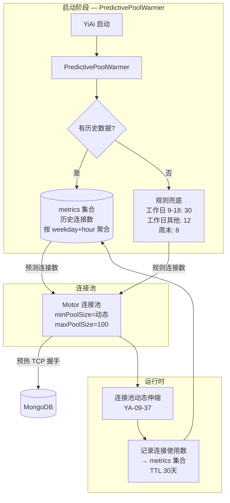

---

doc_type: module
prd_task_id: "YA-09-101"
title: "YA-09-101: 服务端数据库连接池预热策略 — 基于启动流量的自适应连接数预测分配 — 开发任务"
status: 需求已编写
priority: P2
owner: 陈铭
roles: [engineer]
created: 2026-09-11
updated: 2026-09-11
project: YiAi
project_id: yiai
prd_month: "202609"
estimate_frontend: 0.5
source_prd: "107-需求-连接池预热自适应.md"
source_okr: [yiai-001]

type: task
---

# YA-09-101: 数据库连接池预热策略 — 基于启动流量的自适应连接数预测分配 — 开发任务

> **文档职责**：本文档定义**怎么做、为什么这么做、实际做成什么样**（HOW），不含产品目标与测试用例。

> 来源 PRD：[107-需求-连接池预热自适应.md](../../prds/2026-09/107-需求-连接池预热自适应.md)
> 需求编号：YA-09-101 · 优先级：P2 · 人天：0.5d · 状态：需求已编写

---

## 一、架构总览

当前 Motor 连接池使用固定 `minPoolSize=10`，不同时段启动时的流量差异巨大：工作日 9:00 启动需要 40-50 连接（前 30 秒延迟高），凌晨 3:00 仅需 3-5 连接（10 个空闲连接浪费 MongoDB 资源）。方案：在 YiAi 启动阶段通过 `PredictivePoolWarmer` 查询历史流量数据（metrics 集合）预测连接需求，混合模式：有历史数据取工作日+时段峰值 60%，无历史数据降级到规则（工作日 9-18 时 = 30 连接，其他 = 8 连接）。



### 预热策略表

| 条件 | 时段 | 预测方式 | 预热连接数 |
|------|------|----------|-----------|
| 有历史数据 | 任意 | `SELECT AVG(max_connections) FROM metrics WHERE weekday=X AND hour=Y` * 0.6 | 动态 |
| 无历史数据 | Mon-Fri 09:00-12:00 | 规则：早高峰 | 30 |
| 无历史数据 | Mon-Fri 14:00-18:00 | 规则：午高峰 | 20 |
| 无历史数据 | Mon-Fri 其他 | 规则：工作日正常 | 12 |
| 无历史数据 | 周末 | 规则：低峰 | 8 |

---

## 二、文件清单

| 文件 | 操作 | 行数 | 说明 |
|------|------|------|------|
| `src/data/pool_warmer.py` | **新建** | ~100 | PredictivePoolWarmer：历史查询、规则兜底、minPoolSize 设置 |
| `src/data/connection.py` | 修改 | +10 | 启动时调用 `pool_warmer.warmup()` |
| `src/data/repository.py` | 修改 | +10 | 运行时记录连接使用数到 metrics 集合 |
| `src/shared/config.py` | 修改 | +10 | 新增预热配置项 |
| `tests/data/test_pool_warmer.py` | **新建** | ~80 | 4 场景测试 |

---

## 三、模块设计

### 3.1 PredictivePoolWarmer（核心类）

```python
# src/data/pool_warmer.py

from datetime import datetime, timedelta


class PredictivePoolWarmer:
    """连接池预测预热器。

    职责：
    - 启动时根据历史流量或规则预测所需连接数
    - 设置 Motor 连接池 minPoolSize
    - 运行时记录实际连接使用数到 metrics 集合（供下次启动参考）
    - 混合模式：历史数据优先，规则兜底

    预测公式：
      predicted = MAX(history_peak * 0.6, rule_default)
      final = CLAMP(predicted, min_pool=5, max_pool=50)
    """

    METRICS_COLLECTION: str = "connection_metrics"
    DEFAULT_WEEKDAY_PEAK: int = 30
    DEFAULT_WEEKDAY_NORMAL: int = 12
    DEFAULT_WEEKEND: int = 8
    PEAK_RATIO: float = 0.6      # 预热到历史峰值的 60%
    MIN_POOL: int = 5
    MAX_POOL: int = 50

    def __init__(self) -> None: ...

    async def warmup(self) -> int:
        """执行预热：查询历史 → 预测连接数 → 设置 minPoolSize。

        Returns:
            实际设置的 minPoolSize
        """
        ...

    async def _get_historical_peak(self) -> int | None:
        """查询同 weekday+hour 的历史最大连接数。

        SELECT AVG(max_connections) FROM connection_metrics
        WHERE weekday = current_weekday AND hour = current_hour
        """
        ...

    def _rule_based_default(self) -> int:
        """基于规则的兜底预测。"""
        now = datetime.now()
        if now.weekday() >= 5:  # 周末
            return self.DEFAULT_WEEKEND
        if 9 <= now.hour < 12:
            return self.DEFAULT_WEEKDAY_PEAK
        if 14 <= now.hour < 18:
            return self.DEFAULT_WEEKDAY_NORMAL + 8
        return self.DEFAULT_WEEKDAY_NORMAL

    def _clamp_pool_size(self, predicted: int) -> int: ...
    async def record_connection_count(self, active_count: int) -> None: ...
```

### 3.2 连接初始化集成

```python
# src/data/connection.py — 修改启动逻辑

from src.data.pool_warmer import pool_warmer

async def init_database():
    global db, client
    client = AsyncIOMotorClient(settings.mongo_uri)
    db = client.get_default_database()

    # 新增：预热连接池
    min_pool = await pool_warmer.warmup()
    logger.info(f"连接池预热完成: minPoolSize={min_pool}")
```

---

## 四、数据流

### 4.1 启动预热流程

```
YiAi 启动
  → PredictivePoolWarmer.warmup()
    → 获取当前 weekday=X, hour=Y
    → 查询 metrics 集合:
        db.connection_metrics.aggregate([
          {$match: {weekday: X, hour: Y}},
          {$group: {_id: null, avg_max: {$avg: "$max_connections"}}}
        ])
    → 有历史数据? peak = avg_max * 0.6
    → 无历史数据: peak = rule_based_default()
    → clamped = CLAMP(peak, 5, 50)
    → 设置 Motor client 的 minPoolSize = clamped
    → 建立 clamped 个 TCP 连接 (预热完成)
```

### 4.2 运行时记录

```
每个请求完成后 (YA-09-37 伸缩检查点)
  → pool = client.get_io_loop()
  → active = len(pool.sockets) - len(pool.free_sockets)
  → pool_warmer.record_connection_count(active)
    → db.connection_metrics.insert_one({
        weekday: now.weekday(),
        hour: now.hour,
        max_connections: active,
        timestamp: now,
      })
    → TTL 索引: 30 天后自动删除
```

---

## 五、实施路线图

| 阶段 | 人天 | 任务 | 产出 | 验证 |
|------|------|------|------|------|
| 一：核心预热器 | 0.15 | 实现 PredictivePoolWarmer（历史查询 + 规则兜底 + 预热逻辑） | `pool_warmer.py` (~100行) | 单元测试：4 场景通过 |
| 二：连接层集成 | 0.10 | 修改 `connection.py` 启动流程；运行时记录连接数 | connection + repository 修改 | 集成测试：启动后 minPoolSize 正确 |
| 三：metrics 集合 | 0.10 | 创建 connection_metrics 集合 + TTL 索引 + 聚合查询 | MongoDB schema | 历史数据正确写入和查询 |
| 四：测试验证 | 0.10 | 首次启动（规则兜底）、多次启动（历史数据）、周末、跨时段 | test + 日志 | pytest 通过 |
| 五：压测验证 | 0.05 | 高峰期启动冷启动延迟对比 | 性能报告 | 首次请求 P95 < 50ms |

**合计：0.5d。**

---

## 六、代码审查检查清单

- [ ] 预热使用混合模式：历史数据优先，规则兜底
- [ ] 历史数据查询同 weekday + hour 的 `AVG(max_connections)`
- [ ] 预热到历史峰值的 60%（`PEAK_RATIO=0.6`）
- [ ] 规则兜底：工作日 9-12 时 = 30，14-18 时 = 20，其他 = 12，周末 = 8
- [ ] `minPoolSize` 范围 [5, 50]，受 `MIN_POOL`/`MAX_POOL` 约束
- [ ] `connection_metrics` 集合设置 TTL 索引（30 天自动清理）
- [ ] 启动时预热的连接数记录 INFO 日志
- [ ] 首次启动（无历史数据）不报错，降级到规则
- [ ] `record_connection_count` 不阻塞请求（异步写入，失败不影响业务）
- [ ] 预热不修改 maxPoolSize（由 YA-09-37 管理）
- [ ] 配合 YA-09-37 动态伸缩，预热仅在启动时执行一次

---

## 七、技术风险评估

| 风险 | 概率 | 影响 | 等级 | 缓解措施 |
|------|------|------|------|----------|
| 首次启动无历史数据预测不准 | 高 | 中 | 中 | 规则兜底覆盖常见时段；运行 1 天后数据自动积累 |
| 历史数据不反映当前流量（紧急发布后） | 中 | 中 | 中 | 峰值系数 0.6 保守；YA-09-37 运行时伸缩补充 |
| metrics 集合无限增长 | 低 | 中 | 低 | TTL 索引 30 天自动清理 |
| 预热连接建立慢（TCP 握手） | 低 | 低 | 低 | 50 连接以内建立 < 500ms |
| weekend=5/6 与 Python weekday() 语义冲突 | 低 | 低 | 低 | 明确 Python weekday() 中 Monday=0, Sunday=6 |

### 回滚策略

| 场景 | 操作 | 回滚时间 |
|------|------|----------|
| 预热连接数过高浪费资源 | 降低 `PEAK_RATIO` 到 0.3 | < 1min |
| 预测严重不准 | 禁用预热（固定 minPoolSize=10） | < 1min |
| 完全回滚 | 注释 warmup() 调用 | < 5min |