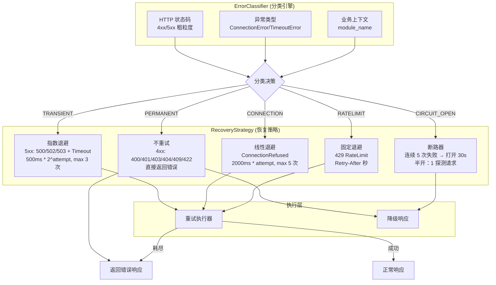

---

doc_type: module
prd_task_id: "YA-09-115"
title: "YA-09-115: 错误分类与自动恢复 — 5xx/4xx 差异化处理 — 开发方案"
status: 需求已编写
priority: P2
owner: 陈铭
roles: [engineer]
created: 2026-09-11
updated: 2026-09-14
project: YiAi
project_id: yiai
prd_month: "202609"
estimate_frontend: 0.5
source_prd: "109-需求-错误分类自动恢复.md"
source_okr: [yiai-001]
acceptance_criteria:
  - 4xx 客户端错误（400/401/403/404/409/422）被正确分类为 PERMANENT，不执行重试
  - 5xx 服务端错误（500/502/503/504）被正确分类为 TRANSIENT，执行指数退避重试（500ms * 2^n，最多 3 次）
  - 断路器连续 5 次失败后打开，30s 后半开探测，探测成功恢复关闭
  - 未识别的异常类型默认兜底为 PERMANENT（安全默认），不执行重试
  - 异常分类决策 < 0.1ms（纯内存查表）

type: task
---

# YA-09-115: 错误分类与自动恢复 — 5xx/4xx 差异化处理 — 开发方案

| 属性 | 值 |
|------|-----|
| 文档编号 | YA-09-115 |
| 版本 | v1.1 |
| 密级 | 内部 |
| 作者 | 陈铭 |
| 审核人 | — |
| 状态 | 需求已编写 |
| 最后更新 | 2026-09-23 |

> 来源 PRD：[109-需求-错误分类自动恢复.md](../../prds/2026-09/109-需求-错误分类自动恢复.md)
> 需求编号：YA-09-115 · 优先级：P2 · 人天：0.5d

---

## 目录

1. [架构总览](#一架构总览)
2. [设计约束](#二设计约束)
3. [文件清单](#三文件清单)
4. [模块设计](#四模块设计)
5. [数据流](#五数据流)
6. [实施路线图](#六实施路线图)
7. [测试策略](#七测试策略)
8. [技术风险评估](#八技术风险评估)
附录 A. [变更记录](#附录-a-变更记录)

---

## 一、架构总览

YiAi 当前对所有错误使用统一的重试策略（3 次固定重试），4xx 客户端错误不应重试却被浪费资源，5xx 瞬态错误重试不足，下游故障时无断路器保护。方案：通过 `ErrorClassifier`（状态码 + 异常类型 + 上下文混合分类）识别错误类别，应用差异化恢复策略——4xx 永久错误不重试直接返回；5xx 瞬态错误指数退避（`500ms * 2^attempt`）；连接拒绝线性退避；限流遵循 Retry-After。下游服务连续 5 次失败触发断路器（30s 打开 + 半开探测）。



### 错误分类决策表

| 错误类型 | HTTP 码 | 异常 | 分类 | 策略 | 退避 | 最大重试 |
|----------|---------|------|------|------|------|----------|
| 参数验证失败 | 400/422 | ValidationError | PERMANENT | 不重试 | - | 0 |
| 认证/鉴权失败 | 401/403 | AuthError | PERMANENT | 不重试 | - | 0 |
| 资源不存在 | 404 | NotFoundError | PERMANENT | 不重试 | - | 0 |
| 冲突 | 409 | ConflictError | PERMANENT | 不重试 | - | 0 |
| 服务端内部错误 | 500 | RuntimeError | TRANSIENT | 指数退避 | 500ms*2^n | 3 |
| Bad Gateway | 502 | - | TRANSIENT | 指数退避 | 500ms*2^n | 3 |
| Service Unavailable | 503 | - | TRANSIENT | 指数退避 | 1000ms*2^n | 3 |
| 超时 | - | TimeoutError | TRANSIENT | 指数退避 | 1000ms*2^n | 3 |
| 连接拒绝 | - | ConnectionRefused | CONNECTION | 线性退避 | 2000ms*1 | 5 |
| 限流 | 429 | - | RATELIMIT | 固定退避 | Retry-After | 3 |
| 断路器打开 | - | CircuitBreakerOpen | CIRCUIT_OPEN | 不重试 | 等待恢复 | 0 |

---

<a id="sec-2"></a>
## 二、设计约束

| 约束项 | 说明 |
|--------|------|
| 安全默认 | 未识别的异常类型兜底为 PERMANENT，宁可少重试也不错重试 |
| 纯内存分类 | ErrorClassifier 使用 dict 查表，分类决策 O(1)，不引入外部依赖 |
| 断路器独立隔离 | 每个 `module_name + method_name` 独立断路器，一个下游故障不影响其他 |
| 退避精度 | 指数退避 `500ms * 2^attempt`，线性退避 `2000ms * attempt`，固定退避遵循 Retry-After |
| 不改变异常语义 | 重试耗尽后 re-raise 原始异常，不包装、不吞没 |
| 可扩展分类规则 | 支持 `register_exception(name, category)` 和 `register_http_status(status, category)` 动态注册 |

---

<a id="sec-3"></a>
## 三、文件清单

| 文件 | 操作 | 行数 | 说明 |
|------|------|------|------|
| `src/shared/error_classifier.py` | **新建** | ~100 | ErrorClassifier：分类决策、错误类型注册 |
| `src/shared/error_recovery.py` | **新建** | ~120 | RecoveryStrategy：指数退避/线性退避/断路器/重试执行 |
| `src/server/middleware.py` | 修改 | +20 | 集成错误分类到异常处理中间件 |
| `src/shared/exceptions.py` | 修改 | +20 | 新增 YiAiError 基类 + 各子类 |
| `tests/shared/test_error_classifier.py` | **新建** | ~100 | 7 场景测试 |

---

## 四、模块设计

### 3.1 ErrorClassifier

```python
# src/shared/error_classifier.py

from enum import Enum
from typing import Optional


class ErrorCategory(str, Enum):
    PERMANENT = "PERMANENT"       # 不可重试
    TRANSIENT = "TRANSIENT"       # 可重试（指数退避）
    CONNECTION = "CONNECTION"     # 连接失败（线性退避）
    RATELIMIT = "RATELIMIT"       # 限流（固定退避）
    CIRCUIT_OPEN = "CIRCUIT_OPEN" # 断路器打开


class ErrorClassifier:
    """错误分类引擎 — 混合分类（HTTP 状态码 + 异常类型 + 业务上下文）。

    分类优先级：
    1. 异常类型匹配 (最高优先级)
    2. HTTP 状态码匹配
    3. 业务上下文 (module_name)
    4. 默认分类 → PERMANENT
    """

    # 状态码 → 分类映射
    HTTP_CLASSIFICATION: dict[int, ErrorCategory] = {
        400: ErrorCategory.PERMANENT,
        401: ErrorCategory.PERMANENT,
        403: ErrorCategory.PERMANENT,
        404: ErrorCategory.PERMANENT,
        409: ErrorCategory.PERMANENT,
        422: ErrorCategory.PERMANENT,
        429: ErrorCategory.RATELIMIT,
        500: ErrorCategory.TRANSIENT,
        502: ErrorCategory.TRANSIENT,
        503: ErrorCategory.TRANSIENT,
        504: ErrorCategory.TRANSIENT,
    }

    # 异常类型 → 分类映射
    EXCEPTION_CLASSIFICATION: dict[str, ErrorCategory] = {
        "ConnectionRefusedError": ErrorCategory.CONNECTION,
        "ConnectionResetError": ErrorCategory.CONNECTION,
        "TimeoutError": ErrorCategory.TRANSIENT,
        "ServerSelectionTimeoutError": ErrorCategory.TRANSIENT,
        "CircuitBreakerOpenError": ErrorCategory.CIRCUIT_OPEN,
    }

    def classify(
        self,
        error: Exception,
        http_status: int | None = None,
        module_name: str | None = None,
    ) -> ErrorCategory: ...
    def register_exception(self, name: str, category: ErrorCategory) -> None: ...
    def register_http_status(self, status: int, category: ErrorCategory) -> None: ...
```

### 3.2 RecoveryStrategy

```python
# src/shared/error_recovery.py

import asyncio
from dataclasses import dataclass, field


@dataclass
class RetryConfig:
    max_retries: int = 3
    base_delay_ms: int = 500
    backoff_type: str = "exponential"  # exponential | linear | fixed


class CircuitBreaker:
    """断路器 — 计数模式 + 半开状态。

    状态转换：
    CLOSED → (连续失败 5 次) → OPEN (30s)
    OPEN → (30s 到期) → HALF_OPEN
    HALF_OPEN → (成功) → CLOSED
    HALF_OPEN → (失败) → OPEN
    """

    def __init__(self, failure_threshold: int = 5, timeout_sec: int = 30) -> None: ...
    async def call(self, fn, *args, **kwargs): ...
    def _transition_to_open(self) -> None: ...
    def _transition_to_half_open(self) -> None: ...
    def _transition_to_closed(self) -> None: ...


class ErrorRecoveryManager:
    """错误恢复管理器 — 根据 ErrorCategory 执行差异化恢复。"""

    # 恢复策略配置
    STRATEGIES: dict[ErrorCategory, RetryConfig] = {
        ErrorCategory.PERMANENT: RetryConfig(max_retries=0),
        ErrorCategory.TRANSIENT: RetryConfig(max_retries=3, base_delay_ms=500, backoff_type="exponential"),
        ErrorCategory.CONNECTION: RetryConfig(max_retries=5, base_delay_ms=2000, backoff_type="linear"),
        ErrorCategory.RATELIMIT: RetryConfig(max_retries=3, base_delay_ms=1000, backoff_type="fixed"),
        ErrorCategory.CIRCUIT_OPEN: RetryConfig(max_retries=0),
    }

    def __init__(self) -> None:
        self._circuit_breakers: dict[str, CircuitBreaker] = {}

    async def recover(
        self, error: Exception, category: ErrorCategory,
        retry_fn, *args, **kwargs,
    ) -> Any: ...
    def _compute_delay(self, config: RetryConfig, attempt: int) -> float: ...
    def get_circuit_breaker(self, key: str) -> CircuitBreaker: ...
```

### 3.3 中间件集成

```python
# src/server/middleware.py — 修改异常处理

from src.shared.error_classifier import error_classifier, ErrorCategory
from src.shared.error_recovery import error_recovery_manager

@app.middleware("http")
async def error_handling_middleware(request: Request, call_next):
    try:
        return await call_next(request)
    except Exception as e:
        category = error_classifier.classify(
            e,
            http_status=getattr(e, 'status_code', None),
            module_name=getattr(request.state, 'module_name', None),
        )
        try:
            result = await error_recovery_manager.recover(
                e, category,
                retry_fn=lambda: call_next(request),
            )
            return result
        except MaxRetriesExceeded:
            return JSONResponse(
                status_code=getattr(e, 'status_code', 500),
                content={"code": 9999, "message": str(e), "data": None},
            )
```

---

## 五、数据流

### 4.1 错误分类 → 恢复流程

```
异常抛出
  → ErrorClassifier.classify(error, http_status, module_name)
    → 优先查 EXCEPTION_CLASSIFICATION (异常类型)
    → 其次查 HTTP_CLASSIFICATION (状态码)
    → 兜底: PERMANENT (安全默认)
  → RecoveryManager.recover(error, category, retry_fn)
    → PERMANENT: 不重试，直接 raise
    → TRANSIENT: for attempt in 1..3:
        await asyncio.sleep(500ms * 2^attempt)
        try: return retry_fn()
    → CONNECTION: for attempt in 1..5:
        await asyncio.sleep(2000ms * attempt)
        try: return retry_fn()
    → RATELIMIT: for attempt in 1..3:
        await asyncio.sleep(Retry-After 秒)
        try: return retry_fn()
    → CIRCUIT_OPEN: 直接 raise CircuitBreakerOpenError
```

### 4.2 断路器状态机

```
CLOSED (正常)
  → 每次失败: failure_count++
  → failure_count >= 5: 转 OPEN

OPEN (熔断, 30s)
  → 所有请求直接拒绝 (CIRCUIT_OPEN)
  → 30s 后: 转 HALF_OPEN

HALF_OPEN (探测)
  → 允许 1 个探测请求
  → 成功: 转 CLOSED (failure_count=0)
  → 失败: 转 OPEN (重新计时 30s)
```

---

## 六、实施路线图

| 阶段 | 人天 | 任务 | 产出 | 验证 |
|------|------|------|------|------|
| 一：错误分类引擎 | 0.10 | 实现 ErrorClassifier + 默认分类规则 | `error_classifier.py` (~100行) | 单元测试：分类决策正确 |
| 二：恢复策略 | 0.15 | 实现指数/线性/固定退避 + 断路器 | `error_recovery.py` (~120行) | 单元测试：重试和熔断行为 |
| 三：中间件集成 | 0.10 | 修改中间件异常处理 + 断路器注册 | `middleware.py` + `exceptions.py` | 集成测试：端到端错误处理 |
| 四：边界测试 | 0.10 | 断路器状态转换、重试耗尽、并发分类、退避精度 | 测试用例 | 7 个场景通过 |
| 五：压测验证 | 0.05 | 高错误率下断路器行为 | 性能报告 | 断路器打开后延迟降低 |

**合计：0.5d。**

---

### 6.1 代码审查检查清单

- [ ] ErrorClassifier 使用混合分类（HTTP 状态码 + 异常类型 + 业务上下文）
- [ ] 4xx 错误 (400/401/403/404/409/422) → PERMANENT → 不重试
- [ ] 5xx 瞬态错误 (500/502/503/504) + TimeoutError → TRANSIENT → 指数退避
- [ ] 连接拒绝 → CONNECTION → 线性退避 (2000ms * attempt)
- [ ] 429 限流 → RATELIMIT → Retry-After header 固定退避
- [ ] 断路器：连续 5 次失败 → OPEN (30s) → HALF_OPEN (1 探测) → CLOSED
- [ ] 退避公式正确：指数 `500*2^attempt`，线性 `2000*attempt`，固定 `Retry-After`
- [ ] 重试总计不超过配置次数（TRANSIENT=3, CONNECTION=5, RATELIMIT=3）
- [ ] 重试失败后返回原始错误（不包装）
- [ ] 断路器按 `module_name + method_name` 键隔离（不同端点独立熔断）
- [ ] 异常类型注册机制：`register_exception(name, category)`
- [ ] 未识别错误默认 PERMANENT（安全兜底）

---

## 七、测试策略

### 7.1 测试分层

| 层级 | 覆盖范围 | 工具 |
|------|----------|------|
| 单元测试 | ErrorClassifier 分类决策（7 种错误类型）、退避公式计算、断路器状态转换 | pytest |
| 集成测试 | 中间件异常处理链路：异常 → classify → recover → 重试/降级 | pytest + httpx |

### 7.2 关键测试用例

| 场景 | 验证点 |
|------|--------|
| 4xx 不重试 | 400/401/403/404/409/422 → PERMANENT → 直接返回错误 |
| 5xx 指数退避 | 500/502/503 → TRANSIENT → 3 次重试，间隔 500ms/1000ms/2000ms |
| 连接拒绝线性退避 | ConnectionRefused → CONNECTION → 5 次重试，间隔 2000ms/4000ms/6000ms |
| 429 固定退避 | 429 + Retry-After: 60 → RATELIMIT → 3 次重试，间隔 60s |
| 断路器打开 | 连续 5 次失败 → CIRCUIT_OPEN → 直接拒绝 |
| 断路器恢复 | OPEN 30s → HALF_OPEN → 探测成功 → CLOSED |
| 未识别异常 | 未知异常类型 → PERMANENT（安全默认） |
| 重试耗尽 | 3 次重试全部失败 → re-raise 原始异常 |

---

## 八、技术风险评估

| 风险 | 概率 | 影响 | 等级 | 缓解措施 |
|------|------|------|------|----------|
| 错误分类不准确（TRANSIENT 误判为 PERMANENT） | 中 | 高 | 中 | 兜底为 PERMANENT 虽保守但安全；分类规则可配置扩展 |
| 断路器半开探测失败延长故障时间 | 低 | 中 | 低 | 半开仅 1 个请求，失败立即重新打开 |
| 多个断路器并发状态管理混乱 | 低 | 低 | 低 | 每个断路器按 key 隔离（dict[str, CircuitBreaker]） |
| 指数退避在高尝试次数下延迟过长 | 低 | 低 | 低 | max_retries=3，最大延迟 500*8=4s |
| Retry-After header 缺失时固定退避无基准 | 中 | 低 | 低 | Retry-After 缺失时使用 base_delay_ms=1000 |

### 回滚策略

| 场景 | 操作 | 回滚时间 |
|------|------|----------|
| 分类误判导致正常请求被拒绝 | 调整对应分类规则 | < 1min |
| 断路器过于敏感 | 增大 `failure_threshold` 到 10 | < 1min |
| 完全回滚 | 关闭 error_classifier，回退到统一重试 | < 5min |

---

## 附录 A. 变更记录

| 日期 | 版本 | 变更内容 | 作者 |
|------|------|----------|------|
| 2026-09-11 | v1.0 | 初始版本：ErrorClassifier 分类引擎、RecoveryStrategy 恢复策略、断路器、中间件集成 | 陈铭 |
| 2026-09-23 | v1.1 | 补充设计约束、测试策略（分层+关键用例）、变更记录 | 陈铭 |