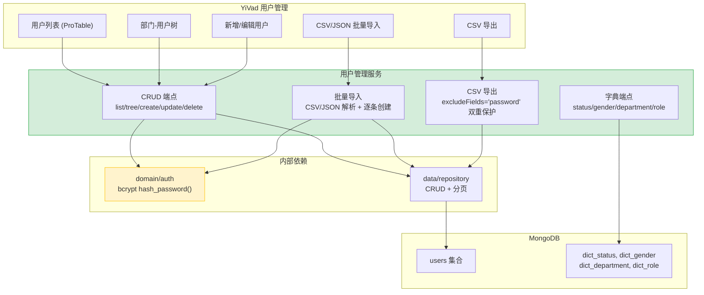

---

doc_type: module
prd_task_id: "YA-09-11"
title: "YA-09-11: 用户管理服务 — 完整 CRUD + CSV 批量导入/导出 + 部门树 + 字典端点 — 开发方案"
status: 已完成
priority: P1
owner: 陈铭
roles: [engineer]
created: 2026-09-11
updated: 2026-09-23
project: YiAi
project_id: yiai
prd_month: "202609"
estimate_frontend: 1.5
source_prd: "11-需求-用户管理服务.md"
source_okr: [yiai-001]
related_tests: ["11-prd-test-用户管理服务"]

type: task
---

# YA-09-11: 用户管理服务 — 完整 CRUD + CSV 批量导入/导出 + 部门树 + 字典端点 — 开发方案

> 来源 PRD：[11-需求-用户管理服务.md](../../prds/2026-09/11-需求-用户管理服务.md)
> 需求编号：YA-09-11 · 优先级：P1 · 人天：1.5d
> 类型：功能 · 状态：已完成

---

## 一、架构概述

用户管理服务扩展 YA-07-06 认证系统的基础用户 CRUD，提供企业级用户管理能力：分页列表 (密码脱敏)、部门-用户树形展示、批量 CSV 导入导出、字典数据端点。密码使用 bcrypt 哈希存储，列表和导出接口双层保护排除密码字段。



### 端点矩阵

| 端点 | 方法 | 功能 | 安全要求 |
|------|------|------|---------|
| `/users/list` | POST | 分页列表 (排除密码) | `excludeFields="password"` |
| `/users/tree` | POST | 部门-用户树 | 数据库投影 `{password: 0}` |
| `/users` | POST | 创建用户 | `hash_password()` bcrypt |
| `/users/{key}` | PUT | 更新用户 | 密码变更时重新哈希 |
| `/users/{key}` | DELETE | 删除用户 | 审计 HIGH sensitivity |
| `/users/batch` | POST | CSV/JSON 批量导入 | 逐条检验 + 重复检测 |
| `/users/export` | POST | CSV 导出 | `excludeFields` + `row.pop("password")` 双重 |
| `/users/dict/{type}` | GET | 字典端点 | 无分页 (数据量 < 100) |

---

## 二、文件清单

| # | 文件 | 操作 | 说明 | 预估行数 |
|---|------|------|------|----------|
| 1 | `server/routes/users.py` | 重写 | 完整 CRUD + CSV 导入导出 + 字典端点 | ~350 |
| 2 | `services/users/user_service.py` | 新增 | 用户业务逻辑: bcrypt 哈希、密码验证、部门树构建 | ~120 |
| 3 | `services/users/__init__.py` | 新增 | 模块导出 | ~5 |
| 4 | `domain/auth/password.py` | 修改 | `hash_password()` + `verify_password()` bcrypt 封装 | +30 |
| 5 | `server/routes/rpc.py` | 修改 | 注册 `user_service` 到 RPC 调度 | +3 |

**改动汇总：** 2 新增 + 3 修改 = **5 文件，~508 行**

---

## 三、模块设计

### 3.1 密码安全 — `domain/auth/password.py`

```python
import bcrypt

# bcrypt 成本因子: 12 (约 250ms 哈希时间, 安全与性能平衡)
BCRYPT_ROUNDS = 12

def hash_password(password: str) -> str:
    """bcrypt 哈希——内置随机盐，防止彩虹表攻击。

    返回: $2b$12$... 格式的哈希字符串 (60 字符)
    耗时: ~250ms (成本因子 12)
    """
    if not password or len(password) < 6:
        raise ValueError("密码至少 6 位")
    salt = bcrypt.gensalt(rounds=BCRYPT_ROUNDS)
    return bcrypt.hashpw(password.encode("utf-8"), salt).decode("utf-8")

def verify_password(password: str, hashed: str) -> bool:
    """验证密码——常量时间比较防止时序攻击。"""
    try:
        return bcrypt.checkpw(password.encode("utf-8"), hashed.encode("utf-8"))
    except (ValueError, TypeError):
        return False  # 哈希格式无效
```

### 3.2 用户服务 — `services/users/user_service.py`

```python
class UserService:
    """用户管理业务逻辑层。

    密码安全: 创建/导入时 bcrypt 哈希; 列表/导出时排除 password 字段。
    部门树: 查询所有用户和部门 → 应用层递归构建 O(n×m)。
    """

    def __init__(self, db: AsyncIOMotorDatabase):
        self._db = db
        self._users = db["users"]
        self._dict_dept = db["dict_department"]

    async def list_users(self, parameters: dict) -> dict:
        """分页查询用户列表——排除密码。

        参数: {page_num, page_size, filter: {keyword, status, department}}
        安全: excludeFields="password" (MongoDB 投影层)
        """
        filter_dict = self._build_user_filter(parameters.get("filter", {}))
        page_num = parameters.get("page_num", 1)
        page_size = min(parameters.get("page_size", 20), 100)

        cursor = self._users.find(
            filter_dict,
            {"password": 0},  # MongoDB 投影: 排除 password
        ).skip((page_num - 1) * page_size).limit(page_size)

        try:
            users = await cursor.to_list(length=page_size)
            total = await self._users.count_documents(filter_dict)
            return {"data": users, "total": total, "page_num": page_num, "page_size": page_size}
        finally:
            await cursor.close()

    async def create_user(self, parameters: dict) -> dict:
        """创建用户——bcrypt 哈希密码 + 重复检测。

        流程:
          1. 检查 username 是否已存在
          2. hash_password(plain_password)
          3. create_document
        """
        username = parameters.get("username", "")
        existing = await self._users.find_one({"username": username})
        if existing:
            raise ValueError(f"用户名 '{username}' 已存在")

        plain_password = parameters.get("password", "")
        if not plain_password:
            raise ValueError("密码不能为空")

        user_data = {**parameters}
        user_data["password"] = hash_password(plain_password)
        user_data["created_at"] = datetime.now()

        result = await self._users.insert_one(user_data)
        user_data["_id"] = result.inserted_id
        user_data.pop("password", None)  # 返回不含密码
        return {"data": user_data}

    async def build_dept_tree(self, parameters: dict) -> dict:
        """构建部门-用户树。

        算法:
          1. 查询所有部门 (dict_department) → departments[]
          2. 查询所有用户 → users[]
          3. 递归构建: 每个部门节点.children = 该部门的用户列表
          复杂度: O(n_dept × m_users), 数据量小 (< 50 部门 × 1000 用户) 可接受
        """
        departments = await self._dict_dept.find().to_list(length=None)
        filter_dict = self._build_user_filter(parameters.get("filter", {}))
        users = await self._users.find(
            filter_dict, {"password": 0}
        ).to_list(length=None)

        # 构建 dept → users 映射
        dept_users: Dict[str, List[Dict]] = {}
        for u in users:
            dept_id = u.get("department", "未分配")
            dept_users.setdefault(dept_id, []).append(u)

        def build_node(dept: dict) -> dict:
            node = {
                "id": dept.get("_id", ""),
                "name": dept.get("name", ""),
                "children": [
                    {"id": u["_id"], "name": u.get("username", ""), "type": "user", **u}
                    for u in dept_users.get(dept.get("_id", ""), [])
                ],
            }
            # 递归子部门
            if "children" in dept:
                node["children"].extend(build_node(child) for child in dept["children"])
            return node

        tree = [build_node(d) for d in departments if not d.get("parent")]
        return {"data": tree}
```

### 3.3 CSV 批量导入 — `services/users/user_service.py` (续)

```python
    async def batch_import(self, file_content: bytes, filename: str) -> dict:
        """CSV/JSON 批量导入用户。

        文件类型检测: .json → JSON 解析, 其他 → CSV 解析
        逐条创建: 单条失败不影响其他记录 (健壮性优先于性能)
        密码处理: 每行 password 字段 bcrypt 哈希
        重复检测: 每行检查 username 是否已存在
        """
        if filename.endswith(".json"):
            records = json.loads(file_content.decode("utf-8"))
        else:
            # CSV 解析: 自动检测 BOM 编码, UTF-8/GBK fallback
            try:
                content = file_content.decode("utf-8-sig")  # 处理 BOM
            except UnicodeDecodeError:
                content = file_content.decode("gbk")
            records = list(csv.DictReader(io.StringIO(content)))

        imported, skipped, errors = 0, 0, []
        for i, row in enumerate(records):
            try:
                username = row.get("username", "").strip()
                if not username:
                    skipped += 1; continue

                # 检查重复
                existing = await self._users.find_one({"username": username})
                if existing:
                    errors.append(f"行 {i+2}: 用户名 '{username}' 已存在")
                    skipped += 1; continue

                # 构建用户文档
                user_data = {
                    "username": username,
                    "password": hash_password(row.get("password", "123456")),
                    "name": row.get("name", username),
                    "email": row.get("email", ""),
                    "department": row.get("department", ""),
                    "status": row.get("status", "active"),
                    "gender": row.get("gender", ""),
                    "created_at": datetime.now(),
                }
                await self._users.insert_one(user_data)
                imported += 1
            except Exception as e:
                errors.append(f"行 {i+2}: {e}")
                skipped += 1

        return {
            "data": {"imported": imported, "skipped": skipped, "total": len(records)},
            "errors": errors[:20],  # 最多返回 20 条错误
        }

    async def export_csv(self, parameters: dict) -> bytes:
        """CSV 导出——双重密码保护。

        保护层 1: MongoDB 投影 {password: 0}
        保护层 2: row.pop("password", None) 防御性删除
        """
        filter_dict = self._build_user_filter(parameters.get("filter", {}))
        users = await self._users.find(
            filter_dict, {"password": 0}  # 层 1
        ).to_list(length=100000)

        output = io.StringIO()
        if users:
            # 收集所有字段名
            fieldnames = list(users[0].keys())
            fieldnames = [f for f in fieldnames if f not in ("_id", "password")]

            writer = csv.DictWriter(output, fieldnames=fieldnames)
            writer.writeheader()
            for row in users:
                row.pop("password", None)  # 层 2: 防御性
                row.pop("_id", None)
                writer.writerow(row)

        return output.getvalue().encode("utf-8-sig")  # BOM 保证 Excel 兼容
```

---

## 四、数据流

### 4.1 创建用户完整流程

```
YiVad: 填写用户表单 → 提交
  │
  ▼
RPC: {module: "services.users.user_service", method: "create_user",
      parameters: {username: "zhangsan", password: "123456", ...}}
  │
  ▼
UserService.create_user()
  │
  ├── 1. 检查 username 是否已存在
  │     └── self._users.find_one({"username": "zhangsan"})
  │         └── None → 通过
  │
  ├── 2. 验证密码 (≥ 6 位)
  │     └── "123456" → 通过
  │
  ├── 3. hash_password("123456")
  │     └── bcrypt(salt=random, rounds=12)
  │         └── "$2b$12$..." (60 字符哈希)
  │
  ├── 4. insert_one(user_data)
  │     └── users 集合新增文档
  │
  └── 5. 返回 user_data (已删除 password 字段)
```

### 4.2 CSV 导入错误处理

```
POST /users/batch (multipart: users.csv)
  │
  ├── 解析 CSV → 100 条记录
  │
  ├── 行 1: username="zhangsan" → 检查不存在 → bcrypt → insert → imported++
  ├── 行 2: username="lisi" → 检查不存在 → bcrypt → insert → imported++
  ├── 行 3: username="zhangsan" → 检查存在 → 错误: "用户名已存在" → skipped++
  ├── ...
  ├── 行 50: password="" → 使用默认 "123456" → imported++
  │
  └── 返回: {imported: 95, skipped: 5, total: 100, errors: [...]}
```

---

## 五、实施路线图

| 步骤 | 内容 | 涉及文件 | 验证方式 | 人天 |
|------|------|---------|---------|------|
| 1 | bcrypt `hash_password()` + `verify_password()` | `domain/auth/password.py` | 哈希验证往返正确 | 0.15 |
| 2 | CRUD 端点 (list/tree/create/update/delete) | `server/routes/users.py`, `services/users/user_service.py` | CRUD + 密码排除正确 | 0.5 |
| 3 | 部门树构建 (递归 O(n×m)) | `services/users/user_service.py` | 部门-用户树结构正确 | 0.25 |
| 4 | CSV 导入/导出 + 编码检测 + 重复检测 | `services/users/user_service.py` | 100 条导入 < 5s, BOM/UTF-8/GBK 自动检测 | 0.3 |
| 5 | 字典端点 (status/gender/department/role) | `server/routes/users.py` | 字典数据与 seed 一致 | 0.15 |
| 6 | 集成测试 | `tests/` | 完整用户生命周期: 创建→列表→更新→删除 | 0.15 |
| **合计** | | | | **1.5d** |

---

## 六、代码审查检查清单

- [ ] bcrypt 成本因子 12, 包含随机盐
- [ ] 密码长度验证 ≥ 6 位
- [ ] 列表查询: `excludeFields="password"` (MongoDB 投影层)
- [ ] 导出: `{password: 0}` 投影 + `row.pop("password", None)` 双重保护
- [ ] 树查询: 数据库投影 `{password: 0}`
- [ ] 创建用户: 先 `hash_password()` 再 `insert_one()`
- [ ] 批量导入: 逐条创建 (健壮性优先), 重复 username 跳过
- [ ] CSV 编码: UTF-8-BOM / UTF-8 / GBK fallback
- [ ] 导出 BOM: `utf-8-sig` 保证 Excel 兼容
- [ ] 返回用户数据前 `pop("password", None)` (第三层防护)
- [ ] `ruff` + `mypy` 通过

---

## 七、技术风险评估

| 风险 | 概率 | 影响 | 等级 | 缓解措施 | 应急预案 |
|------|------|------|------|---------|---------|
| bcrypt 哈希 250ms 在批量导入时累积延迟 | 中 | 低 | 低 | 批量导入通常 < 100 条, 总延迟 < 25s 可接受 | 导入时显示进度条 |
| 部门树 O(n×m) 在大数据量下性能退化 | 低 | 中 | 低 | 当前数据量小 (< 50 部门 × 1000 用户) | MongoDB `$graphLookup` 聚合替代 |
| CSV 编码检测错误 (GBK/UTF-8 误判) | 低 | 低 | 低 | 先尝试 UTF-8-BOM, 再 UTF-8, 最后 GBK | 用户手动选择编码 |
| `password` 字段泄露 (三层防护全部失败) | 极低 | 高 | 低 | 三层防护；代码审查强制检查 | 紧急重置所有用户密码 |
| 批量导入无事务性 (部分失败) | 低 | 低 | 低 | 返回 `{imported, skipped, errors}` 清晰告知 | 用户可手动修复跳过的行 |

---

## 八、已知缺口与技术债务

| # | 技术债 | 优先级 | 预计人天 | 说明 | 状态 |
|---|--------|--------|---------|------|------|
| 1 | CSV 导入无进度回调 (SSE) | P3 | 0.2 | 大批量导入时前端无进度展示 | 待实施 |
| 2 | 部门树构建 O(n×m) 未优化 | P3 | 0.3 | 当前数据量小，大数据量时可用 `$graphLookup` | 待实施 |
| 3 | 路由直接调用 `data.repository`，未完全迁移到 `services/users/` | P2 | 0.5 | 架构债务——领域层应拥有业务逻辑 | 待迁移 |
| 4 | 逐条 `insert_one` 在批量导入时性能低 | P3 | 0.2 | 100 条导入耗时约 25s (bcrypt 250ms × 100) | 待实施 (可用 `insert_many` + 预哈希) |

---

## 九、关联模块

- 扩展：[YA-07-06 认证与授权系统](../2026-07/06-prd-task-认证与授权系统.md)
- 审计集成：[YA-09-10 审计日志](./09-prd-task-审计日志.md)（CRUD 操作记录审计）
- 数据层：[YA-09-05 数据层稳定性](./06-prd-task-数据层.md)（Cursor 关闭 + Cursor 超时）