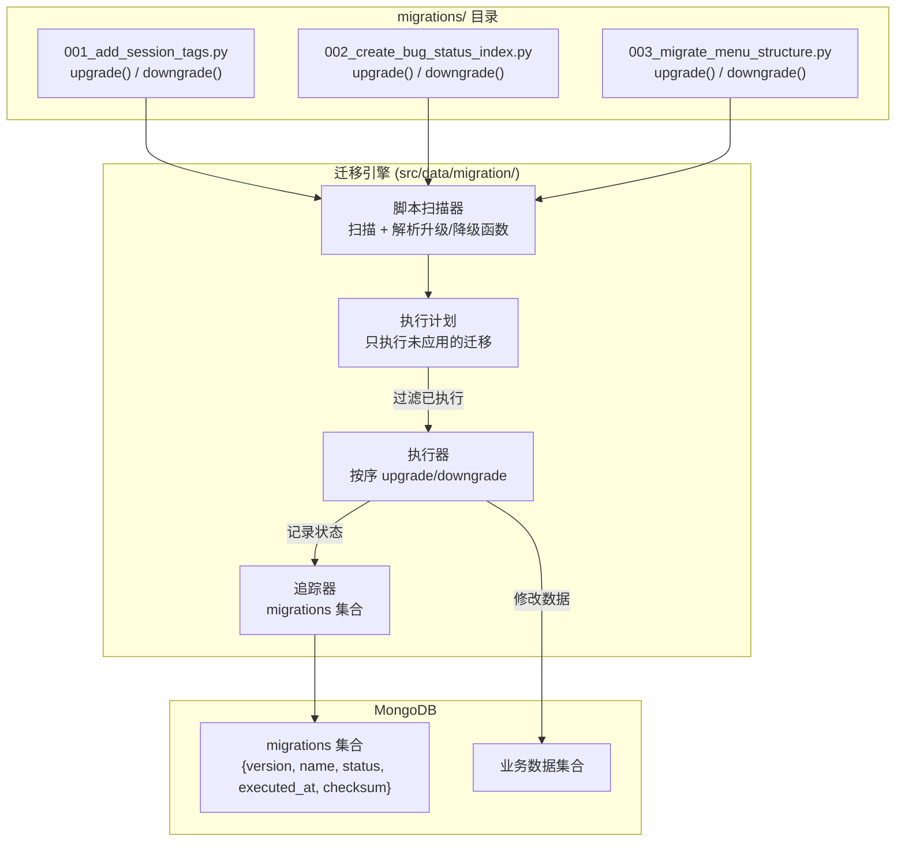

---

doc_type: module
prd_task_id: "YA-09-103"
title: "YA-09-103: 数据库迁移工具 — MongoDB Schema 迁移框架 + 版本化脚本 + 零停机迁移 — 开发任务"
status: 已完成
priority: P2
owner: 陈铭
roles: [engineer]
created: 2026-09-11
updated: 2026-09-11
project: YiAi
project_id: yiai
prd_month: "202609"
estimate_frontend: 1.0
source_prd: "110-需求-数据库迁移工具.md"
source_okr: [yiai-001]

type: task
---

# YA-09-103: 数据库迁移工具 — MongoDB Schema 迁移框架 + 版本化脚本 + 零停机迁移 — 开发任务

> **文档职责**：本文档定义**怎么做、为什么这么做、实际做成什么样**（HOW），不含产品目标与测试用例。

> 来源 PRD：[110-需求-数据库迁移工具.md](../../prds/2026-09/110-需求-数据库迁移工具.md)
> 需求编号：YA-09-103 · 优先级：P2 · 人天：1.0d · 状态：已完成

---

## 一、架构总览

YiAi 当前 MongoDB Schema 变更通过手动执行 mongo shell 命令完成——无版本追踪、无回滚能力、环境不一致。方案：自建轻量级迁移框架（Python + Motor 异步），每个迁移脚本为独立文件定义 `upgrade()` 和 `downgrade()` 函数，通过 `migrations` 集合追踪执行状态。生产环境手动执行 `python -m yiai migrate`，开发环境可选 `AUTO_MIGRATE=true` 启动时自动执行。支持零停机迁移：大集合分批处理，每批 1000 条 + 写入延迟 100ms，不影响正常读写。



### 迁移脚本格式

```python
# migrations/001_add_session_tags.py
"""添加 sessions 集合的 tags 字段默认值。"""

from motor.motor_asyncio import AsyncIOMotorDatabase

MIGRATION_ID = "001"
MIGRATION_NAME = "add_session_tags"


async def upgrade(db: AsyncIOMotorDatabase) -> None:
    """升级：为所有 sessions 添加 tags 字段（默认空数组）。"""
    await db.sessions.update_many(
        {"tags": {"$exists": False}},
        {"$set": {"tags": []}},
    )


async def downgrade(db: AsyncIOMotorDatabase) -> None:
    """降级：移除 sessions 的 tags 字段。"""
    await db.sessions.update_many(
        {"tags": {"$exists": True}},
        {"$unset": {"tags": ""}},
    )
```

---

## 二、文件清单

| 文件 | 操作 | 行数 | 说明 |
|------|------|------|------|
| `src/data/migration/__init__.py` | **新建** | ~10 | 迁移引擎包初始化 |
| `src/data/migration/engine.py` | **新建** | ~150 | MigrationEngine：扫描、规划、执行、追踪 |
| `src/data/migration/cli.py` | **新建** | ~60 | CLI：`python -m yiai migrate [up|down|status]` |
| `migrations/__init__.py` | **新建** | ~5 | 迁移脚本包 |
| `migrations/001_example.py` | **新建** | ~20 | 示例迁移脚本 |
| `src/shared/config.py` | 修改 | +5 | 新增 `AUTO_MIGRATE` 环境变量 |
| `src/main.py` | 修改 | +10 | 应用启动时可选自动迁移 |
| `tests/data/test_migration_engine.py` | **新建** | ~120 | 5 场景测试 |

---

## 三、模块设计

### 3.1 MigrationEngine（核心类）

```python
# src/data/migration/engine.py

from dataclasses import dataclass
from typing import Callable, Awaitable
from motor.motor_asyncio import AsyncIOMotorDatabase

UpgradeFn = Callable[[AsyncIOMotorDatabase], Awaitable[None]]
DowngradeFn = Callable[[AsyncIOMotorDatabase], Awaitable[None]]


@dataclass
class MigrationScript:
    """单个迁移脚本。"""
    version: str                      # "001"
    name: str                         # "add_session_tags"
    description: str                  # 脚本 docstring
    upgrade: UpgradeFn                # 升级函数
    downgrade: DowngradeFn            # 降级函数
    checksum: str                     # SHA256 校验和
    file_path: str                    # 文件路径


@dataclass
class MigrationRecord:
    """迁移执行记录（migrations 集合文档）。"""
    version: str
    name: str
    status: str                       # "applied" | "rolled_back" | "failed"
    checksum: str
    executed_at: str                  # ISO 8601
    execution_time_ms: float


class MigrationEngine:
    """MongoDB Schema 迁移引擎。

    职责：
    - 扫描 migrations/ 目录中的所有脚本
    - 对比 migrations 集合记录，确定待执行脚本
    - 按版本号顺序执行 upgrade() 或 downgrade()
    - 记录执行状态到 migrations 集合
    - 支持 dry-run 模式
    - 支持零停机迁移（分批处理大集合）

    安全机制：
    - 迁移前检查脚本 checksum 一致性
    - 迁移失败时标记状态，阻止后续迁移
    - 脚本未变化不允许重复执行
    """

    COLLECTION: str = "_schema_migrations"

    def __init__(self, db: AsyncIOMotorDatabase) -> None: ...
    async def scan_scripts(self, directory: str = "migrations") -> list[MigrationScript]: ...
    async def get_applied_versions(self) -> set[str]: ...
    async def plan(self) -> list[MigrationScript]: ...
    async def migrate_up(self, target_version: str | None = None, dry_run: bool = False) -> dict: ...
    async def migrate_down(self, target_version: str, dry_run: bool = False) -> dict: ...
    async def status(self) -> list[dict]: ...
    async def _execute_script(self, script: MigrationScript, direction: str) -> None: ...
    async def _record_result(self, script: MigrationScript, status: str, duration_ms: float) -> None: ...
    async def _verify_checksum(self, script: MigrationScript) -> bool: ...

    @staticmethod
    async def _batch_process(
        db: AsyncIOMotorDatabase,
        collection: str,
        filter: dict,
        update: dict,
        batch_size: int = 1000,
        delay_ms: int = 100,
    ) -> int: ...
```

### 3.2 CLI

```python
# src/data/migration/cli.py

import asyncio
import argparse

async def main():
    parser = argparse.ArgumentParser(description="YiAi MongoDB 迁移工具")
    parser.add_argument("action", choices=["up", "down", "status"])
    parser.add_argument("--target", "-t", help="目标版本号")
    parser.add_argument("--dry-run", action="store_true", help="预览模式")
    args = parser.parse_args()

    engine = MigrationEngine(get_database())

    if args.action == "up":
        result = await engine.migrate_up(args.target, args.dry_run)
    elif args.action == "down":
        result = await engine.migrate_down(args.target, args.dry_run)
    elif args.action == "status":
        result = await engine.status()

    print(json.dumps(result, indent=2, ensure_ascii=False))
```

---

## 四、数据流

### 4.1 迁移执行流程

```
$ python -m yiai migrate up
  → MigrationEngine.scan_scripts("migrations/")
    → importlib.import_module("migrations.001_add_session_tags")
    → 提取 upgrade/downgrade + docstring
    → 计算 SHA256 checksum → MigrationScript
  → get_applied_versions()
    → db._schema_migrations.find({status: "applied"}) → {"001", "002"}
  → plan() → [003_migrate_menu_structure] (仅未执行)
  → for script in plan:
      → _execute_script(script, "up")
        → await script.upgrade(db)
        → _record_result(script, "applied", duration)
  → 输出: {"applied": ["003"], "duration_ms": 1250}
```

### 4.2 零停机分批迁移

```
大集合 (10万条) 迁移:
  _batch_process(
    db, "sessions",
    filter={"tags": {"$exists": False}},
    update={"$set": {"tags": []}},
    batch_size=1000,    # 每批 1000 条
    delay_ms=100,        # 每批间隔 100ms
  )
  → for offset in range(0, 100000, 1000):
      db.sessions.updateMany(filter, update, limit=1000)
      await asyncio.sleep(0.1)
  → 总计耗时: 100000/1000 * 0.1s = 10s
  → 期间正常读写不受影响
```

---

## 五、实施路线图

| 阶段 | 人天 | 任务 | 产出 | 验证 |
|------|------|------|------|------|
| 一：框架设计 | 0.15 | 定义 MigrationScript/MigrationRecord 数据结构；设计 migrations 集合 schema | 数据结构 + 集合 schema | 方案评审通过 |
| 二：核心引擎 | 0.35 | 实现 MigrationEngine（扫描 + 执行 + 追踪 + 校验） | `engine.py` (~150行) | 单元测试：脚本执行和追踪 |
| 三：CLI + 安全 | 0.15 | 实现 CLI 命令；添加 checksum 校验 | `cli.py` (~60行) | CLI 可正常执行迁移 |
| 四：零停机迁移 | 0.15 | 实现 `_batch_process` 分批处理 + 延迟控制 | engine.py 扩展 | 大集合迁移不阻塞读写 |
| 五：测试 + 文档 | 0.20 | 编写完整测试（幂等性、失败恢复、checksum 不匹配） | `test_migration_engine.py` (~120行) | pytest 通过 |

**合计：1.0d。**

---

## 六、代码审查检查清单

- [ ] 迁移脚本格式：`migrations/NNN_name.py`，包含 `upgrade(db)` 和 `downgrade(db)` 两个 async 函数
- [ ] 迁移版本号严格递增（001, 002, 003...），不可重用
- [ ] 迁移引擎启动时自动创建 `_schema_migrations` 集合
- [ ] 每个迁移执行前检查 checksum 一致性（防止脚本被修改）
- [ ] 迁移失败时标记 `status="failed"`，阻止后续迁移执行
- [ ] 已执行的迁移不可重复执行（幂等性检查）
- [ ] 生产环境默认手动执行（`python -m yiai migrate up`）
- [ ] 开发环境可选 `AUTO_MIGRATE=true` 启动时自动执行
- [ ] `_batch_process` 使用 batch_size=1000 + delay_ms=100
- [ ] dry-run 模式输出将要执行的迁移列表
- [ ] `status` 命令列出所有迁移及执行状态
- [ ] 迁移执行前备份提醒（WARNING 日志："建议先执行数据库备份"）

---

## 七、技术风险评估

| 风险 | 概率 | 影响 | 等级 | 缓解措施 |
|------|------|------|------|----------|
| 迁移脚本 checksum 变化（已执行脚本被修改） | 中 | 高 | 高 | 校验 checksum，不匹配时拒绝执行并报错 |
| 迁移执行到一半失败 | 中 | 高 | 中 | 标记 failed + 阻止后续迁移；downgrade 回滚 |
| 大集合迁移阻塞正常读写 | 低 | 高 | 中 | 分批处理 + 延迟控制（batch_size=1000, delay=100ms） |
| downgrade 未实现或数据不可逆 | 中 | 中 | 中 | 强制要求 downgrade 函数；文档标注不可逆迁移 |
| 开发环境 AUTO_MIGRATE 误触发生产迁移 | 低 | 极高 | 高 | 检查 `ENV != "production"` 才允许自动迁移 |

### 回滚策略

| 场景 | 操作 | 回滚时间 |
|------|------|----------|
| 迁移失败 | `python -m yiai migrate down --target 002` | < 5min |
| 误执行迁移 | downgrade 到目标版本 + 数据库备份恢复 | 5-30min |
| 完全回滚 | 从备份恢复 + 重置 migrations 集合 | < 60min |

## 已知缺口与技术债

| # | 技术债 | 优先级 | 预计人天 | 说明 | 状态 |
|---|--------|--------|---------|------|------|
| 1 | 迁移锁机制（防止多人同时执行迁移） | 低 | 0.5 | 单运维场景暂不需要 | 未开始 |
| 2 | 迁移后自动验证数据完整性 | 低 | 0.5 | 依赖手动验证 | 未开始 |