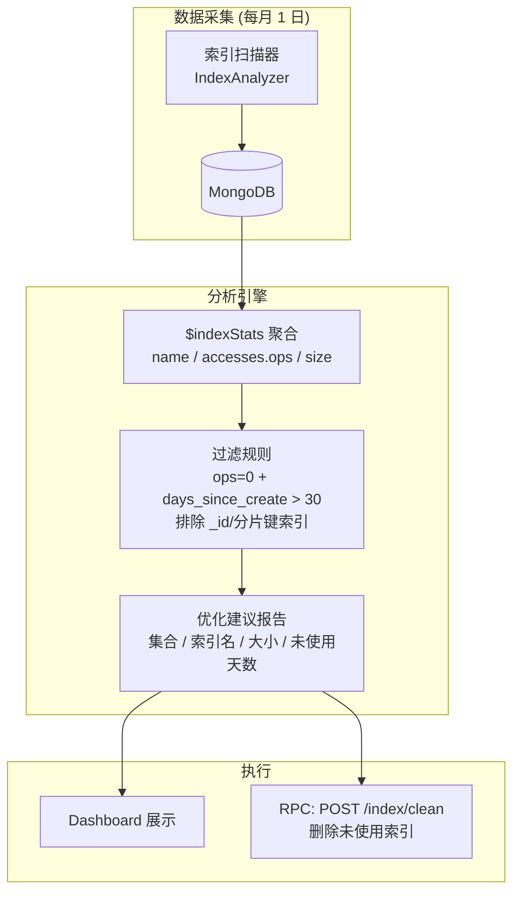

---

doc_type: module
prd_task_id: "YA-09-119"
title: "YA-09-119: 索引使用统计 — 未使用索引检测与清理 — 开发方案"
status: 需求已编写
priority: P2
owner: 陈铭
roles: [engineer]
created: 2026-09-11
updated: 2026-09-14
project: YiAi
project_id: yiai
prd_month: "202609"
estimate_frontend: 0.5
source_prd: "112-需求-索引使用统计优化.md"
source_okr: [yiai-001]

type: task
---

# YA-09-119: 索引使用统计 — 未使用索引检测与清理 — 开发方案

> **文档职责**：本文档定义**怎么做、为什么这么做、实际做成什么样**（HOW），不含产品目标与测试用例。

> 来源 PRD：[112-需求-索引使用统计优化.md](../../prds/2026-09/112-需求-索引使用统计优化.md)
> 需求编号：YA-09-119 · 优先级：P2 · 人天：0.5d · 状态：需求已编写

---

## 一、架构总览

YiAi 运行一段时间后，部分索引可能因 Schema 变更或访问模式变化而不再使用。未使用索引不仅占用磁盘空间（通常 5-20MB/个），还降低写入性能（每次 insert/update 需维护索引）。方案：通过 MongoDB `$indexStats` 聚合查询获取各索引的访问计数，30 天未被访问的索引标记为候选清理项，定期生成优化建议报告，支持通过 RPC 端点手动清理。



---

## 二、文件清单

| 文件 | 操作 | 行数 | 说明 |
|------|------|------|------|
| `src/data/index_analyzer.py` | **新建** | ~80 | IndexAnalyzer：$indexStats 采集、未使用索引检测、建议报告生成 |
| `src/server/routes/index_routes.py` | **新建** | ~40 | RPC 端点：GET /index/analysis, POST /index/clean |
| `tests/data/test_index_analyzer.py` | **新建** | ~60 | 3 场景测试 |

---

## 三、模块设计

### 3.1 IndexAnalyzer

```python
# src/data/index_analyzer.py

from dataclasses import dataclass
from datetime import datetime, timedelta
from motor.motor_asyncio import AsyncIOMotorDatabase


@dataclass
class IndexInfo:
    collection: str
    name: str
    key: dict
    ops: int               # 访问次数
    size_bytes: int        # 索引大小
    days_since_creation: int


class IndexAnalyzer:
    """MongoDB 索引使用分析器。

    职责：
    - 通过 $indexStats 获取所有集合的索引访问统计
    - 检测 30 天未访问的索引（排除 _id 和分片键索引）
    - 生成优化建议报告（集合/索引名/大小/未使用天数）
    - 支持安全清理（需人工确认）
    """

    UNUSED_THRESHOLD_DAYS: int = 30
    PROTECTED_INDEXES: set[str] = {"_id_"}  # 永不建议删除的索引

    def __init__(self, db: AsyncIOMotorDatabase) -> None:
        self._db = db

    async def analyze_all(self) -> dict[str, list[IndexInfo]]: ...
    async def get_unused_indexes(self, collection: str | None = None) -> list[IndexInfo]: ...
    async def get_index_size_report(self) -> dict: ...
    async def generate_optimization_suggestions(self) -> str: ...
    async def drop_unused_index(self, collection: str, index_name: str) -> bool: ...

    @staticmethod
    def _is_protected(index_name: str) -> bool: ...
```

---

## 四、数据流

```
触发分析 (每月 1 日 05:00 apscheduler 或手动)
  → for cname in db.list_collection_names():
      → db[cname].aggregate([{"$indexStats": {}}])
      → for idx in stats:
          ops = idx["accesses"]["ops"]
          days = (now - idx.get("creationTime", now)).days
          if ops == 0 and days > 30 and not _is_protected(idx["name"]):
              unused.append(IndexInfo(cname, idx["name"], idx["key"], ops, size, days))
  → 生成报告: "发现 3 个未使用索引, 总计 45MB, 建议清理"
  → Dashboard 展示 + 可选手动清理
```

### 安全清理

```
POST /index/clean {"collection": "sessions", "index": "tags_1"}
  → 检查: 索引确实在未使用列表中
  → 检查: 索引创建时间 > 30 天前
  → 检查: 索引不在 PROTECTED_INDEXES 中
  → db.sessions.dropIndex("tags_1")
  → 返回: {"dropped": "sessions.tags_1", "freed_mb": 15}
```

---

## 五、实施路线图

| 阶段 | 人天 | 任务 | 产出 | 验证 |
|------|------|------|------|------|
| 一：核心分析器 | 0.2 | IndexAnalyzer + $indexStats 聚合 + 过滤规则 | `index_analyzer.py` (~80行) | 单元测试：正确识别未使用索引 |
| 二：RPC 端点 + Dashboard | 0.15 | GET /index/analysis + POST /index/clean + 前端展示 | routes + Dashboard 集成 | 集成测试 |
| 三：定时巡检 | 0.1 | apscheduler 每月 1 日自动分析 + 报告 | scheduler 配置 | 定时任务触发成功 |
| 四：测试收尾 | 0.05 | 边界场景：空集合、无索引、全部保护索引 | 3 场景测试 | pytest 通过 |

**合计：0.5d。**

---

## 六、代码审查检查清单

- [ ] `$indexStats` 聚合查询对所有非 system 集合执行
- [ ] 未使用判断：`accesses.ops == 0` AND `days_since_creation > 30`
- [ ] `_id_` 索引永久排除（PROTECTED_INDEXES）
- [ ] 分片键索引排除（检测 `key` 中的 shard key）
- [ ] 清理操作需人工确认（不自动执行）
- [ ] 清理前检查索引创建时间（30 天前）
- [ ] 清理后计算释放空间（`size_bytes` 累加）
- [ ] Dashboard 展示索引名称、大小、未使用天数
- [ ] 空集合无索引时不出错

---

## 七、技术风险评估

| 风险 | 概率 | 影响 | 等级 | 缓解措施 |
|------|------|------|------|----------|
| 误删仍在使用但低频的索引 | 低 | 高 | 中 | 30 天阈值保守 + 人工确认 + PROTECTED_INDEXES |
| 服务器重启后 ops 计数归零 | 中 | 中 | 低 | 检查索引创建时间而非仅检查 ops |
| $indexStats 在大集合上耗时 | 低 | 低 | 低 | 异步执行，不阻塞请求 |

### 回滚策略：误删索引后通过 `createIndex` 重新创建，恢复时间取决于索引大小。30 天保留阈值 + 人工确认双保险。|