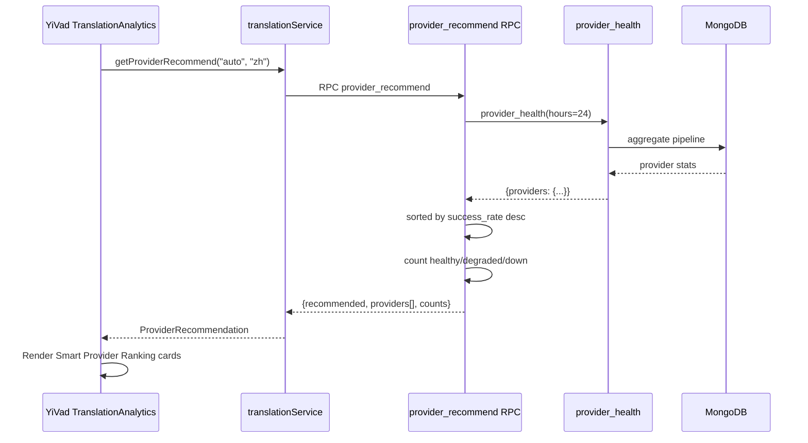

---

doc_type: task
prd_task_id: "YA-09-113"
title: "YA-09-113: 智能供应商推荐 — 技术设计"
status: 已完成
priority: P1
owner: Claude + Linter
roles: [engineer]
created: 2026-09-23
updated: 2026-09-23
project: YiAi
project_id: yiai
prd_month: "202609"
source_prd: "113-需求-智能供应商推荐.md"

type: task
---

# YA-09-113: 智能供应商推荐 — 技术设计

## 实现

**YiAi**: `provider_health.py` → `provider_recommend(from_lang, to_lang)` — 复用 `provider_health()` 结果 → sorted by success_rate desc → 标注 healthy/degraded/down 计数 → 推荐 top 1

**YiAi**: `translate_service.py` → `provider_recommend` RPC 代理

**YiVad**: `translationService.ts` → `getProviderRecommend(from?, to?)` + `ProviderRecommendation` 类型

**YiVad**: `TranslationAnalytics.vue` → Smart Provider Ranking 卡片 — 排名 #1-#N + 状态标签 + success_rate + 调用次数 + "Best" 标记

## 数据流

## 文件变更

| 文件 | 操作 |
|------|------|
| `YiAi: services/translation/provider_health.py` | +30 (provider_recommend) |
| `YiAi: services/translation/translate_service.py` | +15 (RPC proxy) |
| `YiVad: api/modules/translationService.ts` | +25 (getProviderRecommend + types) |
| `YiVad: views/.../TranslationAnalytics.vue` | +40 (Smart Provider Ranking section) |