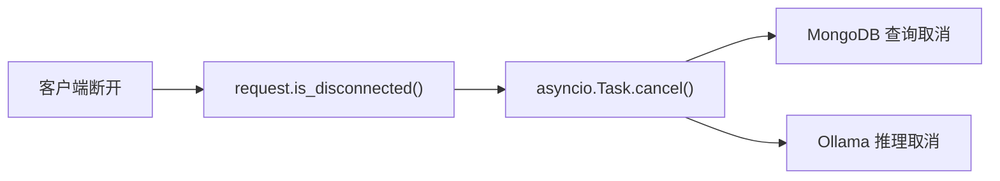

# YA-09-31: 请求超时取消传播 — 客户端断连 → 下游取消 — 开发方案

> **文档职责**：本文档定义**怎么做、为什么这么做、实际做成什么样**（HOW），不含产品目标与测试用例。

> 来源 PRD：[115-需求-请求超时取消传播.md](../../prds/2026-09/115-需求-请求超时取消传播.md)
> 需求编号：YA-09-31 · 优先级：P2 · 人天：0.5d · 状态：需求已编写

---

<a id="sec-1"></a>
## 一、方案

客户端断开 SSE 连接或 HTTP 请求超时时，服务端可能仍在执行 MongoDB 查询或 Ollama 推理——浪费资源。通过 `request.is_disconnected()` 检测并传播取消信号。

```python
@app.middleware("http")
async def cancel_propagation(request, call_next):
    task = asyncio.create_task(call_next(request))
    while not task.done():
        if await request.is_disconnected():
            task.cancel()
            return Response(status_code=499)
        await asyncio.sleep(0.1)
    return await task
```



---

<a id="sec-2"></a>
## 二、实施步骤

| 步骤 | 验证 | 人天 |
|------|------|------|
| 1 | 中间件实现 | 客户端断开后下游任务取消 | 0.25 |
| 2 | MongoDB/Ollama 取消集成 + 测试 | 资源立即释放 | 0.25 |

**合计：0.5d**。

---

<a id="sec-3"></a>
## 三、关联模块

- 集成：[YA-09-19 全局超时](./67-prd-task-全局超时控制.md)
- 关联：[YA-09-13 SSE 背压](./17-prd-task-SSE流式背压控制与缓冲策略.md)