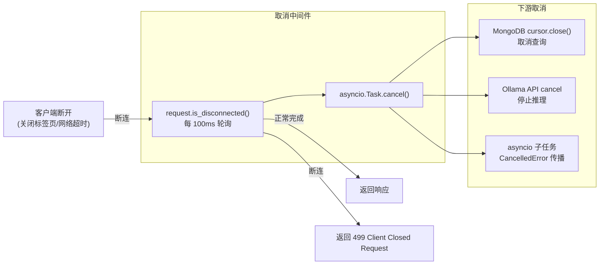

---

doc_type: module
prd_task_id: "YA-09-31"
title: "YA-09-31: 请求超时取消传播 — 客户端断连 → 下游取消 — 开发方案"
status: 需求已编写
priority: P2
owner: 陈铭
roles: [engineer]
created: 2026-09-11
updated: 2026-09-14
project: YiAi
project_id: yiai
prd_month: "202609"
estimate_frontend: 0.5
source_prd: "115-需求-请求超时取消传播.md"
source_okr: [yiai-001]

type: task
---

# YA-09-31: 请求超时取消传播 — 客户端断连 → 下游取消 — 开发方案

> **文档职责**：本文档定义**怎么做、为什么这么做、实际做成什么样**（HOW），不含产品目标与测试用例。

> 来源 PRD：[115-需求-请求超时取消传播.md](../../prds/2026-09/115-需求-请求超时取消传播.md)
> 需求编号：YA-09-31 · 优先级：P2 · 人天：0.5d · 状态：需求已编写

---

## 一、架构总览

客户端断开 HTTP/SSE 连接时，YiAi 服务端可能仍在执行耗时的 MongoDB 查询或 Ollama 推理——白白浪费 CPU/内存/数据库连接。方案：在中间件层通过 `request.is_disconnected()` 轮询检测断连，一旦检测到立即 `asyncio.Task.cancel()` 取消请求协程。配合 MongoDB `cursor.close()` 和 Ollama `/api/generate` 的 `cancel` 信号，实现从 HTTP 层到数据层的完整取消链路。


```mermaid
flowchart LR
    CLIENT["客户端断开<br/>(关闭标签页/网络超时)"]

    subgraph "取消中间件"
        DETECT["request.is_disconnected()<br/>每 100ms 轮询"]
        CANCEL["asyncio.Task.cancel()"]
    end

    subgraph "下游取消"
        MONGO["MongoDB cursor.close()<br/>取消查询"]
        OLLAMA["Ollama API cancel<br/>停止推理"]
        ASYNC["asyncio 子任务<br/>CancelledError 传播"]
    end

    CLIENT -->|断连| DETECT
    DETECT --> CANCEL
    CANCEL --> MONGO
    CANCEL --> OLLAMA
    CANCEL --> ASYNC

    DETECT -->|正常完成| RESP[返回响应]
    DETECT -->|断连| HTTP_499[返回 499 Client Closed Request]
```

### 取消传播链

```
HTTP 层: request.is_disconnected() → True
  → 中间件层: task.cancel() → asyncio.CancelledError
    → 业务层: try/except CancelledError → 清理资源
      → MongoDB 层: cursor.close() → 停止查询
      → Ollama 层: httpx 连接关闭 → 停止推理
        → 子任务: await → CancelledError 自动传播
```

---

## 二、文件清单

| 文件 | 操作 | 行数 | 说明 |
|------|------|------|------|
| `src/server/middleware.py` | 修改 | +25 | 新增 `cancel_propagation_middleware` |
| `src/domain/ai/chat_service.py` | 修改 | +10 | Ollama 推理任务中添加 cancel 处理 |
| `src/data/repository.py` | 修改 | +5 | MongoDB cursor 关闭处理 |
| `tests/server/test_cancel_propagation.py` | **新建** | ~60 | 3 场景测试 |

---

## 三、模块设计

### 3.1 取消传播中间件

```python
# src/server/middleware.py

import asyncio

@app.middleware("http")
async def cancel_propagation_middleware(request: Request, call_next):
    """取消传播中间件：客户端断连 → 取消下游任务。

    实现方式：
    - asyncio.create_task 包裹下游处理
    - 每 100ms 检查 request.is_disconnected()
    - 断连时 task.cancel() 发送 CancelledError
    - 正常完成时返回原始响应
    """
    task = asyncio.create_task(call_next(request))

    try:
        while not task.done():
            if await request.is_disconnected():
                task.cancel()
                logger.warning(
                    "客户端断连, 取消请求",
                    trace_id=get_trace_id(),
                    path=request.url.path,
                )
                return Response(status_code=499)  # 499 Client Closed Request
            await asyncio.sleep(0.1)  # 100ms 轮询间隔

        return await task

    except asyncio.CancelledError:
        task.cancel()
        return Response(status_code=499)
```

### 3.2 业务层取消处理

```python
# src/domain/ai/chat_service.py

async def chat(messages: list, model: str):
    try:
        async for chunk in ollama_client.generate_stream(model, messages):
            yield chunk
    except asyncio.CancelledError:
        logger.info("Ollama 推理取消", model=model)
        # 关闭 HTTP 连接 → Ollama 停止推理
        await ollama_client.close()
        raise  # 重新抛出让上层中间件处理


# src/data/repository.py

async def query_documents(cname: str, filter: dict):
    cursor = db[cname].find(filter)
    try:
        return await cursor.to_list(None)
    except asyncio.CancelledError:
        await cursor.close()  # 释放 MongoDB cursor
        raise
```

---

## 四、数据流

### 完整取消流程

```
客户端 POST /chat (SSE 流式) → YiAi 开始 Ollama 推理
  ├── 客户端关闭标签页 → TCP 连接断开
  ├── FastAPI/Starlette 检测到断连
  ├── cancel_propagation_middleware:
  │     request.is_disconnected() → True
  │     task.cancel() → asyncio.CancelledError 注入
  ├── chat_service.chat():
  │     CancelledError → ollama_client.close()
  │     → Ollama 停止推理 (~100ms)
  ├── repository.query_documents():
  │     CancelledError → cursor.close()
  │     → MongoDB 释放连接 (~10ms)
  └── 中间件返回 499 → 资源释放完成
```

---

## 五、实施路线图

| 阶段 | 人天 | 任务 | 产出 | 验证 |
|------|------|------|------|------|
| 一：中间件实现 | 0.15 | cancel_propagation_middleware + 轮询检测 | middleware.py 修改 | 客户端断开后 task 被 cancel |
| 二：下游取消集成 | 0.15 | chat_service + repository CancelledError 处理 | 业务层修改 | MongoDB/Ollama 资源释放 |
| 三：子任务传播 | 0.1 | 确保 asyncio.create_task() 子任务也能取消 | 子任务处理 | CancelledError 传播到子任务 |
| 四：测试收尾 | 0.1 | 断连取消 + 正常完成 + 边界测试 | 3 场景测试 | pytest 通过 |

**合计：0.5d。**

---

## 六、代码审查检查清单

- [ ] 中间件使用 `asyncio.create_task` 包裹下游，主协程轮询断连
- [ ] 轮询间隔 100ms（平衡响应速度和 CPU 开销）
- [ ] 断连时返回 499 Client Closed Request
- [ ] `task.cancel()` 发送 CancelledError 到下游
- [ ] 业务层捕获 CancelledError 后清理资源（MongoDB cursor、Ollama 连接）
- [ ] 清理资源后重新 raise CancelledError（不吞异常）
- [ ] SSE 流式请求同样适用（`StreamingResponse` 内检测）
- [ ] 正常完成的请求不受影响（额外开销 < 0.1ms）
- [ ] 与全局超时控制（YA-09-19）不冲突

---

## 七、技术风险评估

| 风险 | 概率 | 影响 | 等级 | 缓解措施 |
|------|------|------|------|----------|
| request.is_disconnected() 在某些中间件中不可用 | 低 | 中 | 低 | 降级为不取消（原行为），WARNING 日志 |
| task.cancel() 被吞导致取消无效 | 中 | 低 | 低 | 确保所有 CancelledError handler 最终 re-raise |
| 轮询间隔 100ms 延迟取消 | 低 | 低 | 低 | 100ms 延迟可接受，资源释放时间远大于轮询间隔 |
| Ollama 无法接收 cancel 信号 | 低 | 低 | 低 | 关闭 HTTP 连接即可中断 Ollama 流式响应 |

### 回滚策略：移除 cancel_propagation_middleware 注册，恢复原行为。|