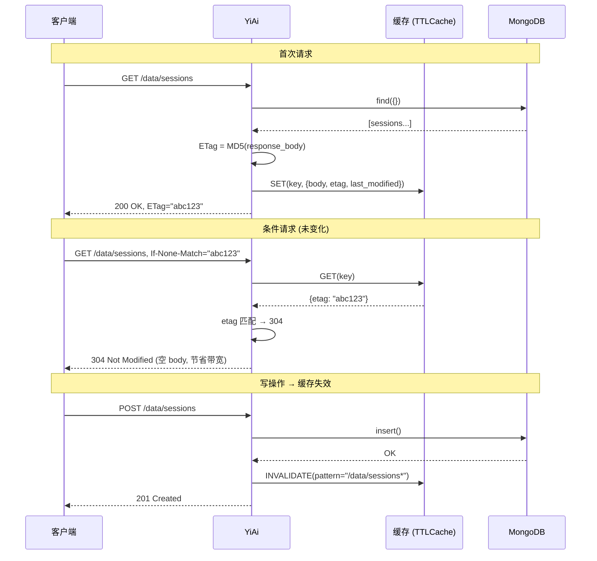

---

doc_type: module
prd_task_id: "YA-09-108"
title: "YA-09-108: 服务端 API 响应缓存一致性 — 基于 ETag + Last-Modified 的强一致性协商缓存 — 开发任务"
status: 需求已编写
priority: P2
owner: 陈铭
roles: [engineer]
created: 2026-09-11
updated: 2026-09-11
project: YiAi
project_id: yiai
prd_month: "202609"
estimate_frontend: 0.5
source_prd: "116-需求-缓存强一致性.md"
source_okr: [yiai-001]

type: task
---

# YA-09-108: API 响应缓存一致性 — 基于 ETag + Last-Modified 的强一致性协商缓存 — 开发任务

> **文档职责**：本文档定义**怎么做、为什么这么做、实际做成什么样**（HOW），不含产品目标与测试用例。

> 来源 PRD：[116-需求-缓存强一致性.md](../../prds/2026-09/116-需求-缓存强一致性.md)
> 需求编号：YA-09-108 · 优先级：P2 · 人天：0.5d · 状态：需求已编写

---

## 一、架构总览

YA-09-108（缓存层设计）引入了服务端缓存，但缓存与数据库的一致性问题未解决——缓存命中可能返回过期数据。方案：基于 HTTP ETag（MD5 内容哈希）+ Last-Modified（MongoDB `updated_at`）实现强一致性协商缓存。写操作（POST/PUT/DELETE）后主动失效相关缓存（cache invalidation），读操作返回 `ETag` header，客户端携带 `If-None-Match` 发起条件请求，匹配时返回 304 Not Modified 节省带宽。



### 缓存失效策略

| 操作 | 失效范围 | 方式 |
|------|---------|------|
| `query_documents("sessions", ...)` 写 | `/data/sessions*` (前缀) | 立即失效 |
| `insert_document` (任意集合) | `/{cname}*` | 立即失效 |
| `update_document` (任意集合) | `/{cname}/{id}` | 精确失效 |
| `delete_document` (任意集合) | `/{cname}*` | 立即失效 |
| 知识库文件变更 | `/knowledge/*` | 事件触发失效 |

---

## 二、文件清单

| 文件 | 操作 | 行数 | 说明 |
|------|------|------|------|
| `src/services/cache_consistency.py` | **新建** | ~100 | CacheConsistencyManager：ETag 生成、304 响应、缓存失效 |
| `src/server/middleware.py` | 修改 | +25 | 新增 `etag_middleware` + `cache_invalidation_middleware` |
| `tests/services/test_cache_consistency.py` | **新建** | ~60 | 3 场景测试 |

---

## 三、模块设计

### 3.1 CacheConsistencyManager

```python
# src/services/cache_consistency.py

import hashlib
from typing import Optional


class CacheConsistencyManager:
    """缓存一致性管理器。

    职责：
    - 为响应体生成 ETag (MD5 内容哈希)
    - 检查 If-None-Match 请求头 → 304 决策
    - 写操作后主动失效缓存（前缀匹配 + 精确匹配）
    - 集成到中间件链（在缓存中间件之后）
    """

    def __init__(self, cache_backend) -> None:
        self._cache = cache_backend  # YA-09-108 缓存实例

    @staticmethod
    def compute_etag(data: bytes) -> str:
        """计算响应体的 ETag（MD5 哈希）。"""
        return hashlib.md5(data).hexdigest()

    def check_conditional(self, request_etag: str, cached_etag: str) -> bool:
        """检查条件请求是否匹配（ETag 强校验）。"""
        return request_etag.strip('"') == cached_etag.strip('"')

    def invalidate_by_prefix(self, prefix: str) -> int:
        """按前缀失效缓存。返回失效条目数。"""

    def invalidate_exact(self, key: str) -> bool:
        """精确失效缓存。返回是否成功。"""

    def invalidate_on_write(self, cname: str, doc_id: Optional[str] = None) -> None:
        """写操作后失效策略：cname 前缀 + 可选 doc_id 精确。"""
```

### 3.2 中间件集成

```python
# src/server/middleware.py

@app.middleware("http")
async def etag_middleware(request: Request, call_next):
    """ETag 协商缓存中间件。"""
    response = await call_next(request)

    if response.status_code == 200:
        etag = CacheConsistencyManager.compute_etag(response.body)
        response.headers["ETag"] = f'"{etag}"'

        # 条件请求检查
        if_none_match = request.headers.get("If-None-Match")
        if if_none_match and if_none_match.strip('"') == etag:
            return Response(status_code=304)  # 空 body

    return response
```

---

## 四、数据流

### 写操作缓存失效流程

```
POST /data {"module_name":"data_service","method_name":"insert_document","parameters":{"cname":"sessions","doc":{...}}}
  → 中间件检测: method ∈ {POST,PUT,DELETE}
  → cache_consistency.invalidate_on_write(cname="sessions")
    → invalidate_by_prefix("/data/sessions")
    → 删除缓存中所有 sessions 相关条目
  → 执行业务逻辑: insert_document()
  → 返回 201 → 新 ETag 由后续 GET 请求重新计算
```

---

## 五、实施路线图

| 阶段 | 人天 | 任务 | 产出 | 验证 |
|------|------|------|------|------|
| 一：ETag 生成 + 304 | 0.15 | compute_etag + check_conditional + 中间件 | `cache_consistency.py` (~60行) | curl -I 可见 ETag + 304 |
| 二：缓存失效 | 0.15 | invalidate_on_write + 前缀/精确失效 | 失效逻辑 | 写操作后缓存被清除 |
| 三：集成测试 | 0.1 | 条件请求 + 写后失效 + ETag 碰撞 | middleware + 缓存 | 集成测试通过 |
| 四：收尾 | 0.1 | 边界场景 + 大 body ETag 性能 | 边界测试 | pytest 通过 |

**合计：0.5d。**

---

## 六、代码审查检查清单

- [ ] ETag = MD5(response_body)，内容变化则 ETag 变化
- [ ] `If-None-Match` 匹配时返回 304 + 空 body
- [ ] 写操作（POST/PUT/DELETE）后按 cname 前缀失效缓存
- [ ] 精确失效支持 `update_document(cname, id)` 场景
- [ ] ETag 使用强校验（双引号包裹）
- [ ] 304 响应也返回原 ETag header
- [ ] MD5 碰撞概率可忽略（用于缓存一致性，非安全性）
- [ ] 与 YA-09-108 缓存层解耦（通过接口）

---

## 七、技术风险评估

| 风险 | 概率 | 影响 | 等级 | 缓解措施 |
|------|------|------|------|----------|
| 大响应体 MD5 计算耗时 | 低 | 低 | 低 | 100KB 响应 MD5 < 1ms |
| 前缀失效过宽误清其他缓存 | 低 | 低 | 低 | 前缀粒度 = cname 级别，足够精确 |
| ETag 与 gzip 压缩的 body 不一致 | 低 | 中 | 低 | ETag 基于原始 body，非压缩后 |

### 回滚策略：移除 etag_middleware 注册，302/ETag 降级为无缓存。|