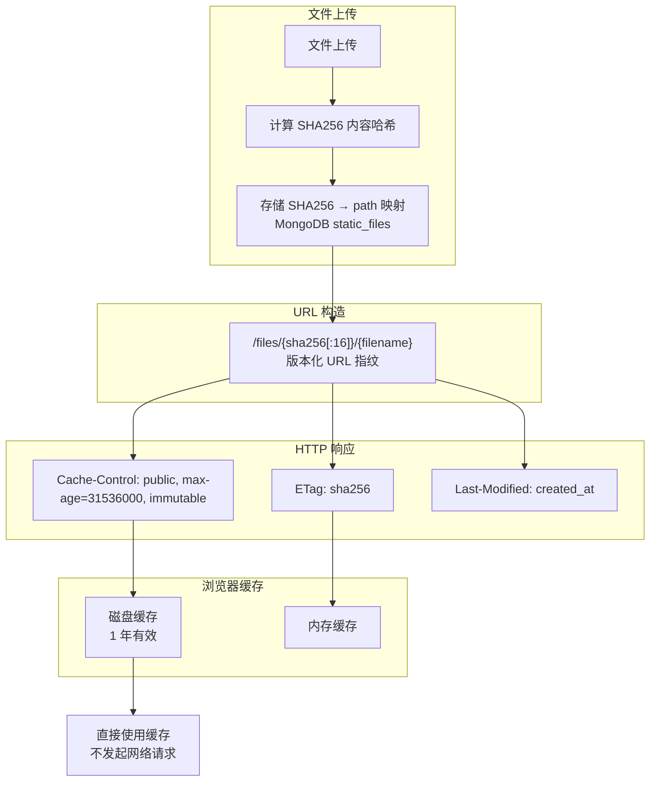

---

doc_type: module
prd_task_id: "YA-09-109"
title: "YA-09-109: 服务端静态资源缓存策略 — 不可变资源的长期缓存与版本化 URL 指纹 — 开发任务"
status: 需求已编写
priority: P2
owner: 陈铭
roles: [engineer]
created: 2026-09-11
updated: 2026-09-11
project: YiAi
project_id: yiai
prd_month: "202609"
estimate_frontend: 0.5
source_prd: "117-需求-静态资源长期缓存.md"
source_okr: [yiai-001]

type: task
---

# YA-09-109: 静态资源长期缓存 — 不可变资源的版本化指纹与 Cache-Control 策略 — 开发任务

> **文档职责**：本文档定义**怎么做、为什么这么做、实际做成什么样**（HOW），不含产品目标与测试用例。

> 来源 PRD：[117-需求-静态资源长期缓存.md](../../prds/2026-09/117-需求-静态资源长期缓存.md)
> 需求编号：YA-09-109 · 优先级：P2 · 人天：0.5d · 状态：需求已编写

---

## 一、架构总览

YiAi 作为后端提供 `static_files` 和知识库文件下载，当前所有文件响应没有缓存头，浏览器每次请求都重新下载。方案：对不可变资源（文件内容不变则 URL 不变）设置 `Cache-Control: public, max-age=31536000, immutable`（1年），对可变资源使用内容哈希作为版本化 URL 指纹（`/files/abc123/document.pdf`）。文件内容变更时哈希变化 → URL 变化 → 浏览器自然重新请求。



### 缓存策略分级

| 资源类型 | 可变性 | Cache-Control | 版本化方式 | 示例 |
|----------|--------|--------------|-----------|------|
| 用户上传文件 | 不可变 | `max-age=31536000, immutable` | SHA256 前 16 位 | `/files/a1b2c3/photo.png` |
| 知识库文件 | 可变 | `max-age=3600` | ETag + Last-Modified | `/knowledge/read-file?target_file=...` |
| API 响应 | 可变 | `no-store` (不缓存) | 无 | `/data` |

---

## 二、文件清单

| 文件 | 操作 | 行数 | 说明 |
|------|------|------|------|
| `src/server/routes/file_routes.py` | 修改 | +30 | 添加 Cache-Control/ETag/Last-Modified 响应头 |
| `src/services/static_file_service.py` | 修改 | +20 | 版本化 URL 生成 + SHA256 哈希映射 |
| `src/shared/cache_headers.py` | **新建** | ~40 | 缓存头工具函数 |
| `tests/server/test_cache_headers.py` | **新建** | ~60 | 3 场景测试 |

---

## 三、模块设计

### 3.1 cache_headers 工具

```python
# src/shared/cache_headers.py

from datetime import datetime
from typing import Optional


class CacheHeaders:
    """HTTP 缓存头生成器。"""

    IMMUTABLE_YEAR = "public, max-age=31536000, immutable"
    MUTABLE_HOUR = "public, max-age=3600"
    NO_CACHE = "no-store"

    @staticmethod
    def for_immutable(etag: Optional[str] = None) -> dict[str, str]:
        """不可变资源：1 年缓存 + ETag。"""
        headers = {"Cache-Control": CacheHeaders.IMMUTABLE_YEAR}
        if etag:
            headers["ETag"] = f'"{etag}"'
        return headers

    @staticmethod
    def for_mutable(
        etag: Optional[str] = None,
        last_modified: Optional[datetime] = None,
    ) -> dict[str, str]:
        """可变资源：1 小时缓存 + ETag + Last-Modified。"""
        headers = {"Cache-Control": CacheHeaders.MUTABLE_HOUR}
        if etag:
            headers["ETag"] = f'"{etag}"'
        if last_modified:
            headers["Last-Modified"] = last_modified.strftime("%a, %d %b %Y %H:%M:%S GMT")
        return headers
```

### 3.2 版本化 URL 端点

```python
# src/server/routes/file_routes.py

@app.get("/files/{sha_prefix}/{filename}")
async def get_file(sha_prefix: str, filename: str):
    """版本化 URL 下载——不可变资源，1 年缓存。"""
    file_doc = await static_file_service.get_by_sha_prefix(sha_prefix)
    if not file_doc:
        raise HTTPException(status_code=404)

    headers = CacheHeaders.for_immutable(etag=file_doc["sha256"])
    return FileResponse(
        file_doc["path"],
        filename=filename,
        headers=headers,
    )
```

---

## 四、数据流

### 版本化 URL 机制

```
文件上传:
  1. 计算 SHA256(content) → "a1b2c3d4e5f6..."
  2. 提取前 16 位 → "a1b2c3d4e5f67890"
  3. MongoDB 存储: {path, sha256, sha_prefix: "a1b2c3d4e5f67890", ...}
  4. 返回 URL: /files/a1b2c3d4e5f67890/report.pdf

文件变更后重新上传:
  1. 新内容 → 新 SHA256 → 新 sha_prefix "b2c3d4e5f6a1b2c3"
  2. 新 URL: /files/b2c3d4e5f6a1b2c3/report.pdf
  3. 旧 URL 的缓存不受影响（不可变资源永远有效）

浏览器行为:
  首次: GET /files/a1b2c3d4e5f67890/report.pdf → 200 + Cache-Control: max-age=31536000
  再次: 从磁盘缓存读取，不发起网络请求（immutable）
```

---

## 五、实施路线图

| 阶段 | 人天 | 任务 | 产出 | 验证 |
|------|------|------|------|------|
| 一：缓存头工具 | 0.1 | CacheHeaders 工具类 | `cache_headers.py` (~40行) | 响应头正确 |
| 二：版本化 URL | 0.15 | 文件上传时生成 sha_prefix + 版本化 URL 端点 | file_routes + service 修改 | curl -I 可见 Cache-Control |
| 三：知识库文件缓存 | 0.1 | /knowledge/read-file 添加 ETag + Last-Modified | knowledge routes 修改 | 条件请求返回 304 |
| 四：测试收尾 | 0.15 | 不可变/可变/版本化 3 场景测试 | 3 场景测试 | pytest 通过 |

**合计：0.5d。**

---

## 六、代码审查检查清单

- [ ] 不可变资源 `Cache-Control: max-age=31536000, immutable`
- [ ] 可变知识库文件 `Cache-Control: max-age=3600` + ETag + Last-Modified
- [ ] API 响应 `Cache-Control: no-store`（不缓存动态数据）
- [ ] 版本化 URL 使用 SHA256 前 16 位（碰撞概率 2^-64，可忽略）
- [ ] 文件变更时 SHA256 重新计算 → URL 自动变化
- [ ] 旧 URL 的缓存不失效（不可变资源永久有效）
- [ ] Last-Modified 使用文件创建时间
- [ ] 跨域场景包含 `Vary: Origin`

---

## 七、技术风险评估

| 风险 | 概率 | 影响 | 等级 | 缓解措施 |
|------|------|------|------|----------|
| SHA256 前 16 位碰撞 | 极低 | 高 | 低 | 2^-64 碰撞概率，可忽略 |
| 文件删除后旧 URL 被缓存 | 低 | 低 | 低 | 返回 404 + `Cache-Control: no-cache` 清除 |
| immutable 导致部署困难 | 低 | 低 | 低 | 版本化 URL 保证新部署内容自动使用新 URL |
| 大文件 SHA256 计算耗时 | 低 | 低 | 低 | 异步计算，不阻塞上传响应 |

### 回滚策略：移除 Cache-Control 头，恢复默认浏览器缓存策略。|