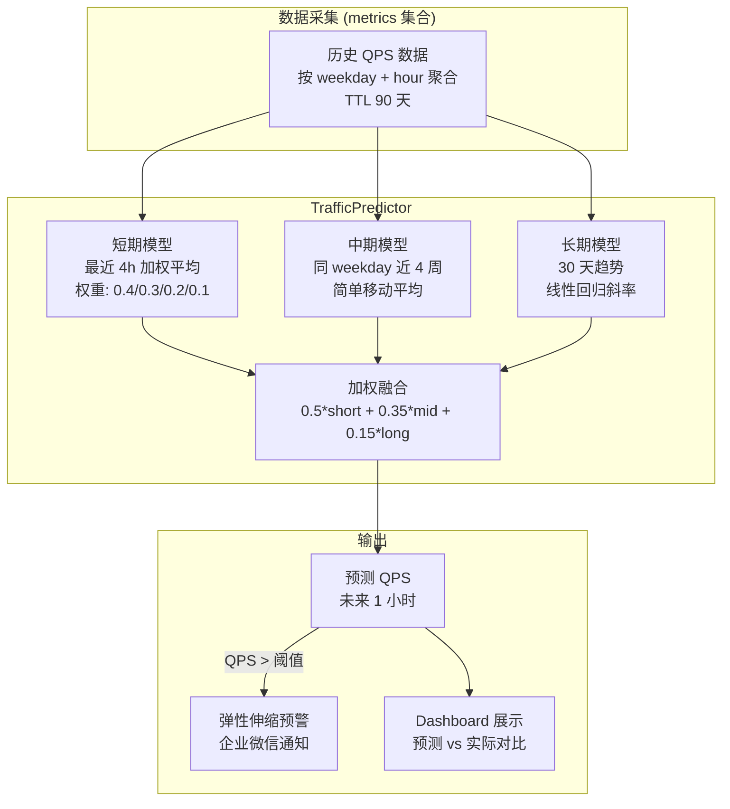

---

doc_type: module
prd_task_id: "YA-09-110"
title: "YA-09-110: 服务端请求速率预测 — 基于时间序列的流量预测与弹性伸缩预警 — 开发任务"
status: 需求已编写
priority: P2
owner: 陈铭
roles: [engineer]
created: 2026-09-11
updated: 2026-09-11
project: YiAi
project_id: yiai
prd_month: "202609"
estimate_frontend: 0.5
source_prd: "118-需求-流量预测弹性伸缩.md"
source_okr: [yiai-001]

type: task
---

# YA-09-110: 流量预测弹性伸缩 — 基于时间序列的流量预测与资源预警 — 开发任务

> **文档职责**：本文档定义**怎么做、为什么这么做、实际做成什么样**（HOW），不含产品目标与测试用例。

> 来源 PRD：[118-需求-流量预测弹性伸缩.md](../../prds/2026-09/118-需求-流量预测弹性伸缩.md)
> 需求编号：YA-09-110 · 优先级：P2 · 人天：0.5d · 状态：需求已编写

---

## 一、架构总览

YA-09-100（动态限流）是被动响应——负载已经升高才调整阈值。本模块提供主动预测——基于历史 QPS 时间序列（metrics 集合，按 weekday+hour 聚合），使用简单移动平均预测未来 1 小时的流量趋势，提前发出弹性伸缩预警（企业微信通知）。预测模型为三层：短期（最近 4 小时加权平均）、中期（同 weekday 过去 4 周平均）、长期（整体趋势）。三模型加权融合输出预测 QPS。



---

## 二、文件清单

| 文件 | 操作 | 行数 | 说明 |
|------|------|------|------|
| `src/services/traffic_predictor.py` | **新建** | ~100 | TrafficPredictor：三模型预测 + 加权融合 + 预警 |
| `tests/services/test_traffic_predictor.py` | **新建** | ~60 | 3 场景测试 |

---

## 三、模块设计

### 3.1 TrafficPredictor

```python
# src/services/traffic_predictor.py

from dataclasses import dataclass
from datetime import datetime, timedelta


@dataclass
class TrafficPrediction:
    predicted_qps: float
    confidence_low: float       # 预测下界 (80% 置信)
    confidence_high: float      # 预测上界
    short_term_trend: float     # 短期趋势 (-1 ~ +1)
    mid_term_baseline: float    # 中期基线
    timestamp: str


class TrafficPredictor:
    """流量预测器——基于时间序列的三模型融合预测。

    职责：
    - 短期预测: 最近 4 小时加权平均（越近权重越高）
    - 中期预测: 同 weekday 近 4 周平均
    - 长期趋势: 30 天线性回归斜率
    - 加权融合输出预测 QPS + 置信区间
    - 预测 QPS 超过历史峰值 80% 时告警
    """

    SHORT_WINDOW_HOURS: int = 4
    MID_WINDOW_WEEKS: int = 4
    LONG_TREND_DAYS: int = 30
    FUSION_WEIGHTS: dict[str, float] = {"short": 0.5, "mid": 0.35, "long": 0.15}
    ALERT_THRESHOLD: float = 0.8  # 预测 QPS / 历史峰值 > 80%

    def __init__(self) -> None: ...

    async def predict_next_hour(self) -> TrafficPrediction: ...
    async def _short_term_predict(self) -> float: ...
    async def _mid_term_predict(self) -> float: ...
    async def _long_term_trend(self) -> float: ...
    def _compute_confidence(self, predictions: list[float]) -> tuple[float, float]: ...
    async def check_alert(self, prediction: TrafficPrediction) -> bool: ...
```

### 3.2 融合公式

```python
# 三模型融合
predicted_qps = (
    0.5 * short_term_predict()   # 最近 4h 加权平均
    + 0.35 * mid_term_predict()   # 同 weekday 近 4 周平均
    + 0.15 * long_term_trend()    # 30 天趋势斜率
)

# 短期加权平均
short = (
    0.4 * qps[-1h]   # 最近 1 小时 (最高权重)
    + 0.3 * qps[-2h]
    + 0.2 * qps[-3h]
    + 0.1 * qps[-4h]
)
```

---

## 四、数据流

```
每小时整点 (apscheduler cron: minute=0)
  → TrafficPredictor.predict_next_hour()
    → 短期: db.qps_metrics.aggregate([
        {$match: {timestamp: {$gte: now-4h}}},
        {$group: {_id: null, avg_qps: {$avg: "$qps"}}}
      ])
    → 中期: db.qps_metrics.aggregate([
        {$match: {weekday: now.weekday(), hour: now.hour}},
        {$sort: {timestamp: -1}}, {$limit: 4},
        {$group: {_id: null, avg_qps: {$avg: "$qps"}}}
      ])
    → 长期: 30 天 QPS 时间序列 → linear_regression.slope
    → fusion: 0.5*short + 0.35*mid + 0.15*(trend_slope * mid)
    → 置信区间: ± 20%
    → 告警: 预测 > 历史峰值 * 0.8 → 企业微信通知
```

---

## 五、实施路线图

| 阶段 | 人天 | 任务 | 产出 | 验证 |
|------|------|------|------|------|
| 一：核心预测器 | 0.2 | 三模型实现 + 加权融合 | `traffic_predictor.py` (~100行) | 单元测试：预测值在合理范围 |
| 二：数据积累 | 0.1 | 确认 metrics 集合有足够历史数据；数据不足时降级 | 数据检查 + 降级逻辑 | 数据不足时不报错 |
| 三：预警集成 | 0.1 | apscheduler 定时预测 + 企业微信通知 | scheduler + notify | 企业微信收到预警 |
| 四：Dashboard | 0.05 | 前端展示预测 vs 实际曲线 | Dashboard 集成 | 可视化正确 |
| 五：测试收尾 | 0.05 | 数据不足/预测准确度/告警 3 场景 | 测试用例 | pytest 通过 |

**合计：0.5d。**

---

## 六、代码审查检查清单

- [ ] 三模型融合权重：短期 0.5 + 中期 0.35 + 长期 0.15
- [ ] 短期模型使用最近 4 小时加权平均（权重递减）
- [ ] 中期模型使用同 weekday 近 4 周平均
- [ ] 长期模型使用 30 天线性回归斜率
- [ ] 预测值附带 80% 置信区间
- [ ] 预测 QPS > 历史峰值 * 0.8 时触发告警
- [ ] 数据不足 4 小时时降级为简单的最近 1 小时平均
- [ ] 首次部署无历史数据时不报错（返回 None + 跳过告警）

---

## 七、技术风险评估

| 风险 | 概率 | 影响 | 等级 | 缓解措施 |
|------|------|------|------|----------|
| 历史数据不足导致预测不准 | 高 | 低 | 低 | 降级到简单移动平均 |
| 突发事件（紧急发布）导致预测失效 | 中 | 中 | 低 | 预测仅作预警参考，不自动执行伸缩 |
| 预测模型过于简单 | 低 | 低 | 低 | 三模型融合 + 短期高权重应对突发 |

### 回滚策略：禁用 traffic_predictor 定时任务，不影响任何业务功能。|