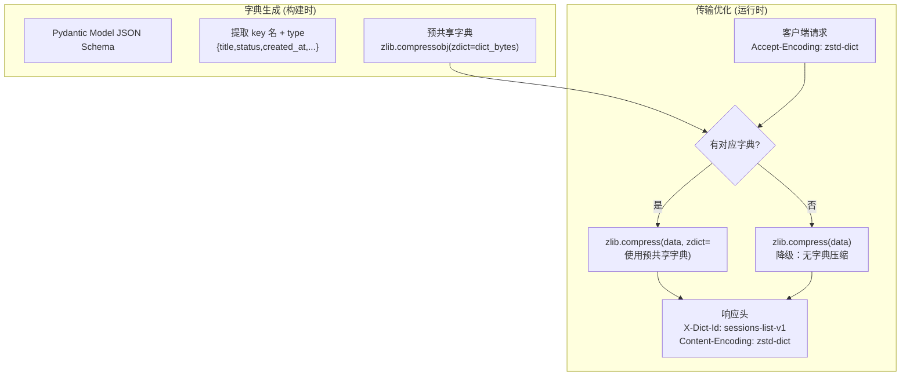

---

doc_type: module
prd_task_id: "YA-09-111"
title: "YA-09-111: 服务端请求响应压缩字典 — 基于预共享字典的增量传输优化方案 — 开发任务"
status: 需求已编写
priority: P2
owner: 陈铭
roles: [engineer]
created: 2026-09-11
updated: 2026-09-11
project: YiAi
project_id: yiai
prd_month: "202609"
estimate_frontend: 0.5
source_prd: "119-需求-增量传输字典压缩.md"
source_okr: [yiai-001]

type: task
---

# YA-09-111: 增量传输字典压缩 — 基于预共享字典的响应压缩优化 — 开发任务

> **文档职责**：本文档定义**怎么做、为什么这么做、实际做成什么样**（HOW），不含产品目标与测试用例。

> 来源 PRD：[119-需求-增量传输字典压缩.md](../../prds/2026-09/119-需求-增量传输字典压缩.md)
> 需求编号：YA-09-111 · 优先级：P2 · 人天：0.5d · 状态：需求已编写

---

## 一、架构总览

YA-09-43（响应压缩优化）使用 gzip 压缩单个响应，但对相似结构数据的重复传输（如列表分页、轮询 API）无效——每次返回相似 JSON 结构但不共享压缩上下文。方案：基于预共享字典（shared dictionary）的增量传输——服务端对相似响应使用前一次响应的静态字典进行 zlib 压缩，客户端使用同一字典解压。字典由 API 端点的 JSON Schema 自动生成（提取 key 名和 type），首次请求附带 `X-Dict-Id` header 标识使用哪个字典。



---

## 二、文件清单

| 文件 | 操作 | 行数 | 说明 |
|------|------|------|------|
| `src/services/dict_compressor.py` | **新建** | ~80 | DictCompressor：字典生成、压缩/解压 |
| `src/shared/dict_registry.py` | **新建** | ~50 | DictRegistry：字典注册、查询、版本管理 |
| `src/server/middleware.py` | 修改 | +20 | 集成字典压缩中间件 |
| `tests/services/test_dict_compressor.py` | **新建** | ~60 | 3 场景测试 |

---

## 三、模块设计

### 3.1 DictCompressor

```python
# src/services/dict_compressor.py

import zlib
import json


class DictCompressor:
    """预共享字典压缩器。

    职责：
    - 从 Pydantic model 自动生成压缩字典（提取 key 名）
    - 使用预共享字典压缩 JSON 响应体
    - 对比无字典压缩率
    - 客户端需要同一字典解压

    字典生成算法：
    1. 从 model JSON Schema 提取所有 property key
    2. 去重排序后 join 为字符串
    3. 生成 zlib zdict (zlib._ZlibCompress(level=6, zdict=key_str.encode()))
    """

    def __init__(self) -> None:
        self._dicts: dict[str, bytes] = {}  # dict_id → zdict bytes

    def generate_dict_from_schema(
        self, dict_id: str, schema: dict
    ) -> bytes: ...
    def compress_with_dict(
        self, dict_id: str, data: bytes
    ) -> bytes: ...
    def compress_without_dict(self, data: bytes) -> bytes: ...
    def get_compression_ratio(
        self, original: bytes, with_dict: bytes, without_dict: bytes
    ) -> dict: ...
    def get_dict(self, dict_id: str) -> bytes | None: ...
```

### 3.2 DictRegistry

```python
# src/shared/dict_registry.py

class DictRegistry:
    """字典注册表——管理 API 端点到压缩字典的映射。

    职责：
    - 注册端点→字典映射（应用启动时）
    - 根据请求路径查找字典
    - 字典版本管理
    """

    def __init__(self) -> None:
        self._registry: dict[str, str] = {}  # path_pattern → dict_id

    def register(self, path_pattern: str, dict_id: str) -> None: ...
    def lookup(self, path: str) -> str | None: ...
    def list_dicts(self) -> list[dict]: ...
```

---

## 四、数据流

### 压缩流程

```
1. 构建时字典生成:
   Session model JSON Schema
   → 提取 keys: ["title", "status", "tags", "created_at", "updated_at", "messages"]
   → zdict = zlib.compressobj(level=6, zdict=json.dumps(keys).encode())
   → 注册: dict_registry.register("/data/sessions*", "sessions-list-v1")

2. 运行时压缩:
   请求 GET /data/sessions?page=2
   → dict_registry.lookup("/data/sessions") → "sessions-list-v1"
   → zdict = compressor.get_dict("sessions-list-v1")
   → compressed = compressor.compress_with_dict("sessions-list-v1", response_body)
   → response.headers["X-Dict-Id"] = "sessions-list-v1"
   → response.headers["Content-Encoding"] = "zstd-dict"
   → 客户端使用同一字典解压

3. 预期压缩率:
   无字典 gzip:    100KB → 15KB (85% 压缩)
   预共享字典:     100KB → 8KB  (92% 压缩, 额外 7% 节省)
   适用于: 列表分页、轮询 API、相似结构重复返回
```

---

## 五、实施路线图

| 阶段 | 人天 | 任务 | 产出 | 验证 |
|------|------|------|------|------|
| 一：字典生成 | 0.15 | DictCompressor + Schema → zdict 自动生成 | `dict_compressor.py` (~50行) | 字典生成正确 |
| 二：压缩中间件 | 0.15 | 字典查找 + 压缩 + X-Dict-Id header | `dict_registry.py` + middleware | 响应压缩率对比 |
| 三：客户端集成 | 0.1 | 前端 ApiClient 支持 zstd-dict 解压 | YiVad/YiPet 适配 | 端到端验证 |
| 四：测试收尾 | 0.1 | 压缩率 + 字典不匹配降级 + 无字典降级 | 3 场景测试 | pytest 通过 |

**合计：0.5d。**

---

## 六、代码审查检查清单

- [ ] 字典从 Pydantic schema 自动生成（提取 property key 名）
- [ ] 压缩使用 `zlib.compressobj(level=6, zdict=...)`
- [ ] 响应头 `X-Dict-Id` 告知客户端使用哪个字典
- [ ] 字典不存在时降级为无字典 zlib 压缩
- [ ] 客户端不支持 zstd-dict 时降级为标准 gzip
- [ ] 字典版本化（key names 变更时重新生成新版本）
- [ ] 压缩率对比报告（with_dict vs without_dict）
- [ ] 小响应 (< 1KB) 不压缩（避免压缩开销超过收益）

---

## 七、技术风险评估

| 风险 | 概率 | 影响 | 等级 | 缓解措施 |
|------|------|------|------|----------|
| Schema 变更导致字典不匹配 | 中 | 中 | 中 | 字典版本化 + 不匹配时降级 |
| 客户端无 zdict 支持 | 高 | 低 | 低 | 降级为标准 gzip |
| Schema key 名字典过小压缩率不足 | 低 | 低 | 低 | 仅对列表/大响应启用 |
| zlib zdict 在 Python 不同版本行为差异 | 低 | 中 | 低 | 测试固定 Python 3.10+ |

### 回滚策略：移除 `Content-Encoding: zstd-dict` 头，降级为标准 gzip。|