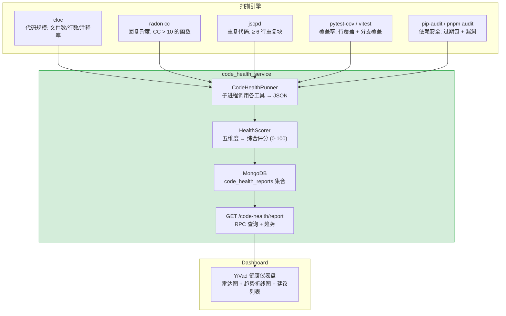

---

doc_type: module
prd_task_id: "YA-09-33"
title: "YA-09-33: 代码健康分析 — 规模/复杂度/重复/覆盖率扫描 + Dashboard — 开发方案"
status: 已完成
priority: P2
owner: 陈铭
roles: [engineer]
created: 2026-09-11
updated: 2026-09-23
project: YiAi
project_id: yiai
prd_month: "202609"
estimate_frontend: 1.5
source_prd: "12-需求-代码健康分析服务.md"
source_okr: [yiai-001]
related_tests: ["12-prd-test-代码健康分析服务"]

type: task
---

# YA-09-33: 代码健康分析 — 规模/复杂度/重复/覆盖率扫描 + Dashboard — 开发方案

> 来源 PRD：[12-需求-代码健康分析服务.md](../../prds/2026-09/12-需求-代码健康分析服务.md)
> 需求编号：YA-09-33 · 优先级：P2 · 人天：1.5d
> 类型：质量工具 · 状态：已完成

---

## 一、架构概述

代码健康分析服务为 YrY 单体仓库的四个项目（YiAi、YiVad、YiPet、YiKnowledge）提供自动化的代码质量扫描。基于多个开源工具聚合五维度指标：代码规模 (cloc)、圈复杂度 (radon)、重复代码 (jscpd)、测试覆盖率 (pytest-cov/vitest)、依赖安全 (pip-audit/pnpm audit)。结果持久化到 MongoDB，支持历史趋势对比和健康评分。



### 扫描维度与工具矩阵

| 维度 | 工具 | 指标 | 评分权重 |
|------|------|------|---------|
| 规模 | `cloc` | 文件数、代码行数、注释率 | 15% |
| 复杂度 | `radon cc` | 圈复杂度 > 10 的函数数、平均 CC | 30% |
| 重复 | `jscpd` | 重复代码块数 (≥ 6 行)、重复率 | 20% |
| 覆盖率 | `pytest-cov` / `vitest --coverage` | 行覆盖率 + 分支覆盖率 | 25% |
| 依赖 | `pip-audit` / `pnpm audit` | 过期依赖数、已知漏洞数 (CVE) | 10% |

---

## 二、文件清单

| # | 文件 | 操作 | 说明 | 预估行数 |
|---|------|------|------|----------|
| 1 | `services/code_health/scanner.py` | 新增 | 子进程调用 + 工具链编排 + JSON 解析 | ~120 |
| 2 | `services/code_health/scorer.py` | 新增 | 五维度 → 综合评分 (0-100) + 趋势计算 | ~80 |
| 3 | `services/code_health/reporter.py` | 新增 | RPC API: report + trends + recommendations | ~70 |
| 4 | `services/code_health/__init__.py` | 新增 | 模块导出 | ~5 |
| 5 | `server/routes/rpc.py` | 修改 | 注册 `code_health_service` | +3 |
| 6 | `config.yaml` | 修改 | 新增 `code_health.repo_path`, `code_health.tools` 配置 | +10 |

**改动汇总：** 4 新增 + 2 修改 = **6 文件，~288 行**

---

## 三、模块设计

### 3.1 扫描引擎 — `services/code_health/scanner.py`

```python
import asyncio
import json
import subprocess
from dataclasses import dataclass, field
from typing import List, Dict, Optional
from enum import Enum

class Project(str, Enum):
    YIAI = "yiai"
    YIVAD = "yivad"
    YIPET = "yipet"
    YIKNOWLEDGE = "yiknowledge"

@dataclass
class ScanResult:
    project: Project
    timestamp: float
    dimensions: Dict[str, Dict] = field(default_factory=dict)  # 五维度

@dataclass
class HealthReport:
    project: Project
    score: int                    # 0-100
    dimensions: Dict[str, float]  # 各维度得分
    trends: List[Dict]            # 历史趋势
    recommendations: List[str]    # 改进建议

class CodeHealthScanner:
    """代码健康扫描引擎——子进程调用外部工具。

    工具链:
      cloc: 代码规模统计
      radon cc -j: 圈复杂度 (JSON 输出)
      jscpd: 重复代码检测
      pytest-cov / vitest --coverage: 覆盖率
      pip-audit / pnpm audit: 依赖安全
    """

    REPO_ROOT: str = None  # 由 config.yaml 注入
    TOOL_TIMEOUT: float = 60.0  # 每个工具最大执行时间

    async def scan_project(self, project: Project) -> ScanResult:
        """扫描单个项目——并行执行五个维度。"""
        tasks = {
            "scale": self._scan_scale(project),
            "complexity": self._scan_complexity(project),
            "duplication": self._scan_duplication(project),
            "coverage": self._scan_coverage(project),
            "dependencies": self._scan_dependencies(project),
        }
        results = {}
        for dim, task in tasks.items():
            try:
                results[dim] = await asyncio.wait_for(task, timeout=self.TOOL_TIMEOUT)
            except asyncio.TimeoutError:
                logger.warning(f"[CodeHealth] {project}.{dim} 扫描超时")
                results[dim] = {"error": "timeout"}
            except Exception as e:
                logger.error(f"[CodeHealth] {project}.{dim} 扫描失败: {e}")
                results[dim] = {"error": str(e)[:200]}

        return ScanResult(
            project=project,
            timestamp=time.time(),
            dimensions=results,
        )

    async def _scan_scale(self, project: Project) -> Dict:
        """cloc 代码规模统计。"""
        repo_path = os.path.join(self.REPO_ROOT, project.value)
        proc = await asyncio.create_subprocess_exec(
            "cloc", repo_path, "--json",
            stdout=asyncio.subprocess.PIPE, stderr=asyncio.subprocess.PIPE,
        )
        stdout, _ = await asyncio.wait_for(proc.communicate(), timeout=30)
        data = json.loads(stdout)
        # 汇总所有语言
        total = sum(lang["code"] for lang in data.values() if isinstance(lang, dict))
        files = sum(lang["nFiles"] for lang in data.values() if isinstance(lang, dict))
        comments = sum(lang.get("comment", 0) for lang in data.values() if isinstance(lang, dict))
        return {
            "files": files,
            "code_lines": total,
            "comment_lines": comments,
            "comment_rate": round(comments / max(total, 1) * 100, 1),
            "languages": list(data.keys()),
        }

    async def _scan_complexity(self, project: Project) -> Dict:
        """radon 圈复杂度扫描——识别 CC > 10 的函数。"""
        repo_path = os.path.join(self.REPO_ROOT, project.value)
        proc = await asyncio.create_subprocess_exec(
            "radon", "cc", repo_path, "--json", "--min", "B",
            stdout=asyncio.subprocess.PIPE, stderr=asyncio.subprocess.PIPE,
        )
        stdout, _ = await asyncio.wait_for(proc.communicate(), timeout=30)
        data = json.loads(stdout) if stdout else {}

        high_complexity = []  # CC > 10
        total_functions = 0
        total_cc = 0
        for file_path, functions in data.items():
            for func in functions:
                total_functions += 1
                cc = func.get("complexity", 0)
                total_cc += cc
                if cc > 10:
                    high_complexity.append({
                        "file": file_path, "function": func["name"],
                        "complexity": cc, "line": func["lineno"],
                    })

        return {
            "total_functions": total_functions,
            "avg_complexity": round(total_cc / max(total_functions, 1), 1),
            "high_complexity_count": len(high_complexity),
            "high_complexity_functions": high_complexity[:20],  # Top 20
        }

    async def _scan_duplication(self, project: Project) -> Dict:
        """jscpd 重复代码检测 (≥ 6 行)。"""
        repo_path = os.path.join(self.REPO_ROOT, project.value)
        proc = await asyncio.create_subprocess_exec(
            "jscpd", repo_path, "--min-lines", "6", "--reporters", "json",
            "--output", "/tmp/jscpd", "--silent",
            stdout=asyncio.subprocess.PIPE, stderr=asyncio.subprocess.PIPE,
        )
        await asyncio.wait_for(proc.communicate(), timeout=30)

        try:
            with open("/tmp/jscpd/jscpd-report.json") as f:
                report = json.load(f)
            clones = report.get("statistics", {}).get("total", {})
            return {
                "duplicate_blocks": clones.get("clonesCount", 0),
                "duplicate_lines": clones.get("duplicatedLines", 0),
                "duplicate_rate": clones.get("percentage", 0),
            }
        except FileNotFoundError:
            return {"duplicate_blocks": 0, "duplicate_lines": 0, "duplicate_rate": 0}

    async def _scan_coverage(self, project: Project) -> Dict:
        """测试覆盖率解析——读取 pytest-cov / vitest 的 JSON 输出。"""
        ...
    async def _scan_dependencies(self, project: Project) -> Dict:
        """依赖安全——pip-audit / pnpm audit。"""
        ...
```

### 3.2 评分器 — `services/code_health/scorer.py`

```python
class HealthScorer:
    """五维度 → 综合评分 (0-100)。

    评分规则:
      - 规模 (15%): 注释率 > 20% 满分, 10-20% 线性, < 10% 0 分
      - 复杂度 (30%): avg CC < 5 满分, 5-10 线性, > 10 0 分; high_cc 扣分
      - 重复 (20%): duplication_rate < 3% 满分, 3-10% 线性, > 10% 0 分
      - 覆盖率 (25%): 行覆盖率 > 80% 满分, 50-80% 线性, < 50% 0 分
      - 依赖 (10%): 0 CVE 满分, 1-3 线性, > 3 0 分; 过期依赖扣分

    综合分 = weighted average + bonus/penalty
    """

    WEIGHTS = {"scale": 0.15, "complexity": 0.30, "duplication": 0.20, "coverage": 0.25, "dependencies": 0.10}

    def score(self, result: ScanResult, history: List[ScanResult]) -> HealthReport:
        dims = result.dimensions

        scale_score = self._score_scale(dims.get("scale", {}))
        complexity_score = self._score_complexity(dims.get("complexity", {}))
        dup_score = self._score_duplication(dims.get("duplication", {}))
        cov_score = self._score_coverage(dims.get("coverage", {}))
        dep_score = self._score_dependencies(dims.get("dependencies", {}))

        dimension_scores = {
            "scale": scale_score, "complexity": complexity_score,
            "duplication": dup_score, "coverage": cov_score, "dependencies": dep_score,
        }

        total = sum(dimension_scores[k] * self.WEIGHTS[k] for k in self.WEIGHTS)

        # 趋势: 对比上一次扫描 (如果有)
        trends = self._compute_trends(result, history)

        # 改进建议: 针对低分维度生成
        recommendations = self._generate_recommendations(dimension_scores)

        return HealthReport(
            project=result.project,
            score=round(total),
            dimensions=dimension_scores,
            trends=trends,
            recommendations=recommendations,
        )

    def _compute_trends(self, current: ScanResult, history: List[ScanResult]) -> List[Dict]:
        """与上一次扫描对比趋势: ↑ 提升, ↓ 下降, → 持平。"""
        if len(history) < 2:
            return []
        prev = history[-2]
        curr_score = self.score(current, history[:-1]).score
        prev_score = self.score(prev, history[:-2]).score
        delta = curr_score - prev_score
        direction = "↑" if delta > 2 else "↓" if delta < -2 else "→"
        return [{"date": datetime.now().isoformat(), "score": curr_score, "delta": delta, "direction": direction}]
```

---

## 四、数据流

### 4.1 扫描执行流程

```
触发 (手动 API / 定时任务)
  │
  ▼
CodeHealthScanner.scan_project("yiai")
  │
  ├── asyncio.gather(并行)
  │     ├── subprocess: cloc YiAi/ --json → {files: 120, code_lines: 15000, ...}
  │     ├── subprocess: radon cc YiAi/ --json → {avg_cc: 4.2, high: 5, ...}
  │     ├── subprocess: jscpd YiAi/ --min-lines 6 → {clones: 12, rate: 3.5}
  │     ├── 解析: .coverage JSON (pytest-cov) → {line_cov: 78}
  │     └── subprocess: pip-audit → {cve: 0, outdated: 3}
  │
  ├── HealthScorer.score()
  │     ├── scale: 15% → 注释率 18% → 80 分
  │     ├── complexity: 30% → avg CC 4.2 → 85 分
  │     ├── duplication: 20% → 3.5% → 75 分
  │     ├── coverage: 25% → 78% → 78 分
  │     └── dependencies: 10% → 0 CVE → 100 分
  │     └── total = 80×0.15 + 85×0.30 + 75×0.20 + 78×0.25 + 100×0.10 = 83
  │
  └── MongoDB code_health_reports.insert_one(HealthReport)
```

---

## 五、实施路线图

| 步骤 | 内容 | 涉及文件 | 验证方式 | 人天 |
|------|------|---------|---------|------|
| 1 | `cloc` + `radon` 集成 | `scanner.py` | 扫描 YiAi 生成规模+复杂度报告 | 0.5 |
| 2 | `jscpd` 重复代码检测 | `scanner.py` | 检出重复代码块，重复率 < 10% | 0.25 |
| 3 | 覆盖率解析 (pytest-cov/vitest) | `scanner.py` | 覆盖率数据准确 | 0.25 |
| 4 | `HealthScorer` 五维度评分 | `scorer.py` | 综合评分 0-100，各维度独立 | 0.25 |
| 5 | `code_health_service` RPC API + 趋势 | `reporter.py` | YiVad 查看健康报告 + 趋势 | 0.25 |
| **合计** | | | | **1.5d** |

---

## 六、代码审查检查清单

- [ ] `cloc`, `radon cc`, `jscpd` 输出正确解析
- [ ] 工具不可用时降级 (返回 `{"error": "tool not found"}` 而非崩溃)
- [ ] 子进程超时 60s, `asyncio.wait_for` 正确取消
- [ ] 综合评分 0-100 范围, 五维度权重正确
- [ ] 历史趋势对比准确 (delta 方向: ↑/↓/→)
- [ ] 改进建议针对低分维度 (覆盖率 < 50% → 建议补充测试)
- [ ] 扫描结果持久化到 MongoDB `code_health_reports`
- [ ] `ruff` + `mypy` 通过

---

## 七、技术风险评估

| 风险 | 概率 | 影响 | 等级 | 缓解措施 | 应急预案 |
|------|------|------|------|---------|---------|
| cloc/radon/jscpd 未安装 | 中 | 中 | 低 | 检查工具是否存在，不存在返回 `{"error": "tool not found"}` | Docker 镜像预装工具 |
| JSCPD 扫描大型仓库 (YiVad node_modules) 超时 | 中 | 中 | 低 | 排除 `node_modules`, `.git`, `dist` 目录 | 提高超时至 120s |
| 各工具 JSON 格式不一致 | 低 | 中 | 低 | 每个工具独立解析函数，松散解析 + 默认值兜底 | — |

---

## 八、已知缺口与技术债务

| # | 技术债 | 优先级 | 预计人天 | 说明 | 状态 |
|---|--------|--------|---------|------|------|
| 1 | 重复代码检测仅文本级 (jscpd)，未使用 AST 级检测 | P3 | 0.3 | jscpd 基于 token 匹配，非语义 | 待实施 |
| 2 | 覆盖率趋势无折线图 | P3 | 0.2 | 仅展示当前值 | 待实施 |
| 3 | 扫描非增量式 (每次全量扫描 YiAi ~5s) | P3 | 0.3 | 可通过 git diff 增量扫描 | 待讨论 |

---

## 九、关联模块

- 工具依赖：`cloc`, `radon`, `jscpd`, `pytest-cov`, `vitest`, `pip-audit`, `pnpm`
- 消费：YiVad 代码健康 Dashboard
- 数据层：[YA-09-05 数据层](./06-prd-task-数据层.md)（Cursor 关闭 + 聚合超时）