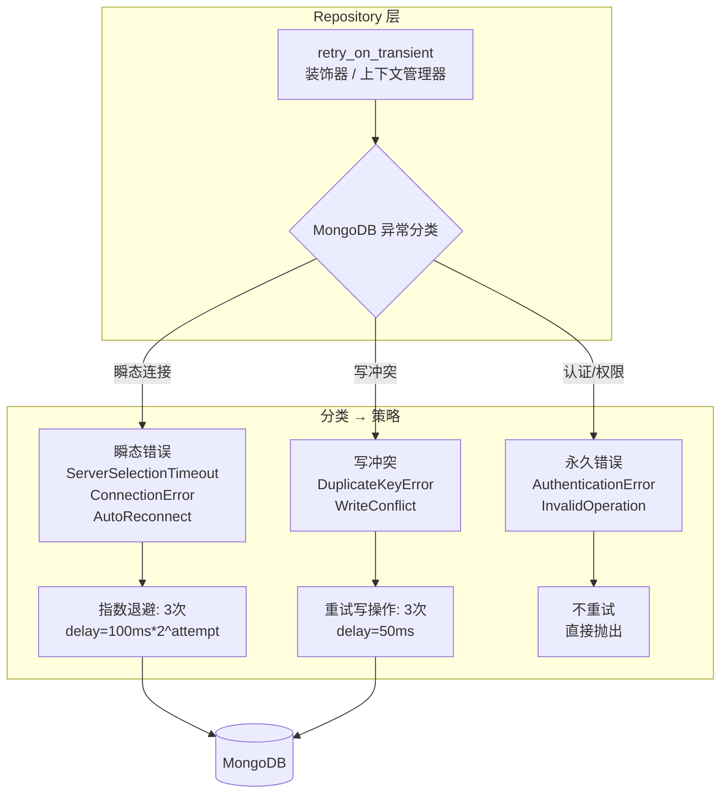

---

doc_type: module
prd_task_id: "YA-09-112"
title: "YA-09-112: 服务端数据库查询重试策略 — 基于异常类型的差异化重试与超时退避配置 — 开发任务"
status: 需求已编写
priority: P2
owner: 陈铭
roles: [engineer]
created: 2026-09-11
updated: 2026-09-11
project: YiAi
project_id: yiai
prd_month: "202609"
estimate_frontend: 0.5
source_prd: "120-需求-数据库查询重试策略.md"
source_okr: [yiai-001]

type: task
---

# YA-09-112: 数据库查询重试策略 — 基于异常类型的差异化重试与超时退避 — 开发任务

> **文档职责**：本文档定义**怎么做、为什么这么做、实际做成什么样**（HOW），不含产品目标与测试用例。

> 来源 PRD：[120-需求-数据库查询重试策略.md](../../prds/2026-09/120-需求-数据库查询重试策略.md)
> 需求编号：YA-09-112 · 优先级：P2 · 人天：0.5d · 状态：需求已编写

---

## 一、架构总览

YA-09-55（HTTP 重试策略）处理了 HTTP 层的重试，但 MongoDB 连接层瞬断（ServerSelectionTimeout、ConnectionPoolError）未被覆盖——驱动抛出的异常直接返回给调用方。方案：在 Repository 层包装 MongoDB 操作，根据异常类型应用差异化重试：连接瞬断指数退避（最多 3 次）、写冲突版本重试（最多 3 次）、认证/权限错误不重试。



---

## 二、文件清单

| 文件 | 操作 | 行数 | 说明 |
|------|------|------|------|
| `src/data/retry_policy.py` | **新建** | ~80 | retry_on_transient 装饰器 + MongoRetryPolicy |
| `src/data/repository.py` | 修改 | +15 | 所有 CRUD 方法包装重试 |
| `tests/data/test_retry_policy.py` | **新建** | ~60 | 4 场景测试 |

---

## 三、模块设计

### 3.1 MongoRetryPolicy

```python
# src/data/retry_policy.py

import asyncio
from functools import wraps
from pymongo.errors import (
    ServerSelectionTimeoutError,
    ConnectionFailure,
    AutoReconnect,
    DuplicateKeyError,
    WriteConflict,
    OperationFailure,
)


class MongoRetryPolicy:
    """MongoDB 查询重试策略——基于异常类型差异化处理。

    分类规则：
    - TRANSIENT: ServerSelectionTimeoutError, ConnectionFailure, AutoReconnect
      → 指数退避, 100ms*2^attempt, 最多 3 次
    - WRITE_CONFLICT: DuplicateKeyError(非 _id), WriteConflict
      → 固定 50ms 重试, 最多 3 次
    - PERMANENT: AuthenticationError, InvalidOperation, 其他
      → 不重试, 直接抛出
    """

    TRANSIENT_ERRORS: tuple = (
        ServerSelectionTimeoutError,
        ConnectionFailure,
        AutoReconnect,
    )
    WRITE_CONFLICT_ERRORS: tuple = (
        WriteConflict,
        OperationFailure,  # code 112 写冲突
    )

    MAX_RETRIES_TRANSIENT: int = 3
    MAX_RETRIES_WRITE: int = 3
    BASE_DELAY_MS: int = 100

    @staticmethod
    def classify(exception: Exception) -> str: ...

    @staticmethod
    async def execute_with_retry(fn, *args, **kwargs) -> Any: ...


def retry_on_transient(func):
    """装饰器：为 MongoDB 操作自动添加重试。"""
    @wraps(func)
    async def wrapper(*args, **kwargs):
        return await MongoRetryPolicy.execute_with_retry(func, *args, **kwargs)
    return wrapper
```

### 3.2 Repository 集成

```python
# src/data/repository.py

from src.data.retry_policy import retry_on_transient

@retry_on_transient
async def query_documents(cname: str, filter: dict, **kwargs):
    db = shard_router.get_shard(cname)
    return await db[cname].find(filter).to_list(None)

@retry_on_transient
async def insert_document(cname: str, doc: dict) -> str:
    db = shard_router.get_shard(cname)
    result = await db[cname].insert_one(doc)
    return str(result.inserted_id)
```

---

## 四、数据流

### 重试时序

```
Repository.query_documents("sessions", {})
  → MongoDB 连接超时 → ServerSelectionTimeoutError
  → MongoRetryPolicy.classify(error) → "TRANSIENT"
  → attempt=1: await asyncio.sleep(0.1s), retry → 仍超时
  → attempt=2: await asyncio.sleep(0.2s), retry → 仍超时
  → attempt=3: await asyncio.sleep(0.4s), retry → 成功
  → 返回结果

如果 3 次全部失败:
  → logger.error("MongoDB 重试耗尽", error=str(e))
  → raise 原始异常
```

---

## 五、实施路线图

| 阶段 | 人天 | 任务 | 产出 | 验证 |
|------|------|------|------|------|
| 一：重试引擎 | 0.15 | MongoRetryPolicy + retry_on_transient 装饰器 | `retry_policy.py` (~80行) | 单元测试：瞬态重试 + 永久不重试 |
| 二：Repository 集成 | 0.15 | 所有 CRUD 方法添加 @retry_on_transient | repository.py 修改 | 集成测试：重试行为正确 |
| 三：测试收尾 | 0.15 | 瞬态连接/写冲突/永久错误/耗尽 4 场景 | 4 场景测试 | pytest 通过 |
| 四：集成验证 | 0.05 | 模拟 MongoDB 重启期间请求 | 手动测试 | 请求不失败 |

**合计：0.5d。**

---

## 六、代码审查检查清单

- [ ] TRANSIENT: 指数退避 100ms*2^attempt, max 3 次
- [ ] WRITE_CONFLICT: 固定 50ms 重试, max 3 次
- [ ] PERMANENT: 不重试, 直接抛出
- [ ] 重试失败记录 WARNING 日志（含 attempt 和 error）
- [ ] 3 次全部失败后抛出原始异常（不包装）
- [ ] 装饰器保持原函数签名（`@wraps`）
- [ ] `asyncio.sleep` 使用异步等待（不阻塞事件循环）
- [ ] 不影响 MongoDB 查询超时（separate timeout config）

---

## 七、技术风险评估

| 风险 | 概率 | 影响 | 等级 | 缓解措施 |
|------|------|------|------|----------|
| 重试导致请求延迟增加 | 高 | 低 | 低 | 最大额外延迟 0.7s (100+200+400ms) |
| 装饰器开销 | 低 | 低 | 低 | 仅异常时才重试，正常路径零开销 |
| 重试期间数据被其他请求修改 | 低 | 低 | 低 | 重试不加悲观锁 |

### 回滚策略：移除 @retry_on_transient 装饰器，恢复直接调用。|