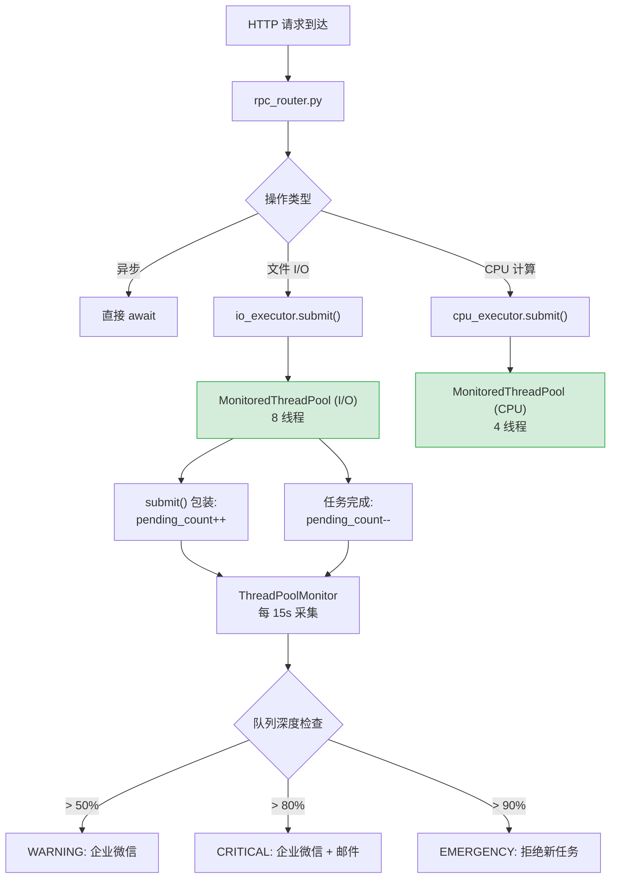

---

doc_type: module
prd_task_id: "YA-09-113"
title: "YA-09-113: 服务端线程池监控 — asyncio 线程池使用率/队列深度/任务积压实时预警 — 开发任务"
status: 需求已编写
priority: P2
owner: 陈铭
roles: [engineer]
created: 2026-09-11
updated: 2026-09-11
project: YiAi
project_id: yiai
prd_month: "202609"
estimate_frontend: 0.5
source_prd: "121-需求-线程池监控告警.md"
source_okr: [yiai-001]

type: task
---

# YA-09-113: 服务端线程池监控 — asyncio 线程池使用率/队列深度/任务积压实时预警 — 开发任务

> **文档职责**：本文档定义**怎么做、为什么这么做、实际做成什么样**（HOW），不含产品目标与测试用例。

> 来源 PRD：[121-需求-线程池监控告警.md](../../prds/2026-09/121-需求-线程池监控告警.md)
> 需求编号：YA-09-113 · 优先级：P2 · 人天：0.5d
> 类型：架构 · 状态：需求已编写

---

## 一、架构概述

YiAi 使用 `asyncio` 作为异步运行时，但文件 I/O、Embedding 计算等同步阻塞操作通过 `run_in_executor` 提交到默认线程池执行。当前默认线程池不可见——无监控、无告警、无任务隔离。当线程池满载时，后续任务无限排队，导致服务整体阻塞。

本方案通过包装 `ThreadPoolExecutor`、双池隔离、多级告警三项手段建立线程池可见性。



**核心设计决策**：

| 决策 | 选择 | 理由 |
|------|------|------|
| 监控方式 | 包装 Executor（自定义子类） | 基于公开 API，不依赖 `_work_queue` 私有属性 |
| 线程池隔离 | 双池（I/O 8 线程 + CPU 4 线程） | 避免 CPU 密集任务阻塞 I/O 任务 |
| 告警阈值 | 三级告警（WARNING/CRITICAL/EMERGENCY） | 渐进式响应，5min 冷却期防告警风暴 |

---

## 二、文件清单

```
YiAi/src/shared/
└── thread_pool_monitor.py             # 新增: MonitoredThreadPoolExecutor + ThreadPoolMonitor + 双池实例

YiAi/src/server/
├── routes.py                          # 修改: 新增 GET /health/thread-pools 端点
└── rpc_router.py                      # 修改: run_in_executor 调用改用专用线程池

YiAi/src/services/
├── knowledge/knowledge_service.py     # 修改: 文件 I/O 改用 io_executor
└── rag/rag_service.py                 # 修改: Embedding 计算改用 cpu_executor

YiAi/src/app.py                        # 修改: 启动时初始化双线程池 + 注册监控器

YiAi/tests/shared/
└── test_thread_pool_monitor.py        # 新增: 单元测试（任务追踪、告警、统计准确性）
```

---

## 三、模块设计

### 3.1 `MonitoredThreadPoolExecutor` — 带监控的线程池

继承 `concurrent.futures.ThreadPoolExecutor`，包装 `submit()` 方法追踪任务生命周期。

```python
# YiAi/src/shared/thread_pool_monitor.py

@dataclass
class ThreadPoolStats:
    """线程池统计快照。"""
    pool_name: str
    max_workers: int
    active_tasks: int            # 当前正在执行的任务数
    pending_tasks: int           # 队列中等待的任务数
    completed_tasks: int         # 历史完成任务总数
    failed_tasks: int            # 历史失败任务总数
    utilization: float           # 使用率 0.0-1.0
    queue_depth_ratio: float     # 队列深度 / max_workers
    avg_task_duration_ms: float  # 任务平均耗时
    p99_task_duration_ms: float  # 任务 P99 耗时
    timestamp: float


class MonitoredThreadPoolExecutor(concurrent.futures.ThreadPoolExecutor):
    """包装 submit() 追踪任务状态，线程安全的计数更新。"""

    def __init__(self, max_workers: int = None, pool_name: str = 'default',
                 task_duration_window: int = 1000):
        super().__init__(max_workers=max_workers)
        self._pool_name = pool_name
        self._lock = threading.Lock()
        self._active_count = 0
        self._pending_count = 0
        self._completed_count = 0
        self._failed_count = 0
        self._task_durations: deque[float] = deque(maxlen=task_duration_window)

    def submit(self, fn, *args, **kwargs) -> Future:
        """包装 submit——追踪任务生命周期（pending -> active -> done/failed）。"""
        ...

    def get_stats(self) -> ThreadPoolStats:
        """获取当前线程池统计快照。"""
        ...
```

**关键实现要点**：
- `submit()` 返回 Future，内层 `_wrapped_fn` 在同一线程执行计数更新，避免跨线程竞态
- `threading.Lock` 保护所有计数器读写
- 滑动窗口 `deque(maxlen=1000)` 存储任务耗时，`get_stats()` 时计算 P99
- 异常路径也更新计数（`_failed_count`），然后 re-raise

### 3.2 `ThreadPoolMonitor` — 多池管理 + 告警

管理多个 `MonitoredThreadPoolExecutor`，定期采集统计，分级告警。

```python
class ThreadPoolMonitor:
    """管理多个线程池，定期采集统计信息，根据队列深度分级告警。"""

    QUEUE_WARNING = 0.5    # 队列深度 > 50% max_workers
    QUEUE_CRITICAL = 0.8   # 队列深度 > 80%
    QUEUE_EMERGENCY = 0.9  # 队列深度 > 90%

    def __init__(self):
        self._pools: dict[str, MonitoredThreadPoolExecutor] = {}
        self._alert_cooldown: dict[str, float] = {}   # 5 分钟告警冷却
        self._alert_interval = 300

    def register(self, pool: MonitoredThreadPoolExecutor) -> None: ...
    def get_all_stats(self) -> list[ThreadPoolStats]: ...
    def check_alerts(self) -> list[dict]:
        """检查告警条件，返回触发告警的池列表（含冷却期判断）。"""
        ...
```

### 3.3 健康检查端点

```python
# YiAi/src/server/routes.py

@app.get("/health/thread-pools")
async def thread_pool_health():
    """返回所有线程池的实时统计（name/max_workers/active/pending/utilization/queue_depth/avg_duration_ms/p99_duration_ms）。"""
    stats = monitor.get_all_stats()
    return {'pools': [{...} for s in stats]}
```

### 3.4 全局双池实例

```python
# 模块级单例——在 app.py 的 on_startup 中初始化
io_executor = MonitoredThreadPoolExecutor(max_workers=8, pool_name='io')
cpu_executor = MonitoredThreadPoolExecutor(max_workers=4, pool_name='cpu')
monitor = ThreadPoolMonitor()
monitor.register(io_executor)
monitor.register(cpu_executor)
```

---

## 四、数据流

```
请求到达 → rpc_router 分发
  ├── 文件 I/O 请求 → loop.run_in_executor(io_executor, _sync_read_file, path)
  │     └── MonitoredThreadPool.submit() → pending_count++ → 线程执行 → done: active_count--, completed_count++
  ├── Embedding 请求 → loop.run_in_executor(cpu_executor, _sync_compute_embedding, text)
  │     └── MonitoredThreadPool.submit() → pending_count++ → 线程执行 → done: active_count--, completed_count++
  └── 异步请求 → 直接 await（不经过线程池）

ThreadPoolMonitor (后台定时任务, 15s 间隔)
  ├── get_all_stats() → 读取每个池的 ThreadPoolStats
  ├── check_alerts() → 队列深度 vs 阈值 → 分级告警
  └── 企业微信推送 (WARNING/CRITICAL/EMERGENCY)
```

**线程池配置**：

| 线程池 | 线程数 | 适用场景 | 队列深度告警触发 |
|--------|--------|----------|-----------------|
| `io_executor` | 8 | 文件读写、网络同步调用 | > 4 等待 (WARNING) |
| `cpu_executor` | 4 | Embedding 计算、向量搜索 | > 2 等待 (WARNING) |

---

## 五、实施路线图

| 步骤 | 任务 | 涉及文件 | 验证方式 | 人天 |
|------|------|---------|---------|------|
| 1 | 实现 `MonitoredThreadPoolExecutor` 包装类 | `thread_pool_monitor.py` | 单元测试：提交任务后 stats 正确（active/pending/completed 计数） | 0.10 |
| 2 | 实现 `ThreadPoolMonitor` 监控器 + 三级告警 + 冷却期 | `thread_pool_monitor.py` | 单元测试：模拟队列积压触发 WARNING/CRITICAL/EMERGENCY | 0.10 |
| 3 | 创建双池实例（io + cpu），`app.py` 启动时注册 | `app.py` | 启动后 `/health/thread-pools` 返回双池状态 | 0.05 |
| 4 | 迁移所有 `run_in_executor` 调用指定专用线程池 | `rpc_router.py` + `knowledge_service.py` + `rag_service.py` | 功能测试：文件读写和 Embedding 计算正常 | 0.15 |
| 5 | 新增 `/health/thread-pools` 端点 | `routes.py` | `curl /health/thread-pools` 返回 JSON 统计数据 | 0.05 |
| 6 | 编写单元测试 | `test_thread_pool_monitor.py` | `pytest tests/shared/test_thread_pool_monitor.py -v` 全部通过 | 0.05 |

**合计：0.5d**

---

## 六、代码审查检查清单

- [ ] `MonitoredThreadPoolExecutor` 包装 `submit()` 正确追踪任务生命周期（pending -> active -> done/failed）
- [ ] 计数更新使用 `threading.Lock` 保证线程安全
- [ ] 双池隔离：`io_executor`（8 线程）和 `cpu_executor`（4 线程）
- [ ] 所有 `run_in_executor` 调用指定专用线程池（grep 检查无遗漏的 `run_in_executor(None, ...)` 调用）
- [ ] `/health/thread-pools` 端点返回完整统计数据（name/active/pending/utilization/queue_depth/duration）
- [ ] 三级告警（WARNING/CRITICAL/EMERGENCY）+ 5 分钟冷却期防止告警风暴
- [ ] 任务耗时统计滑动窗口限制 1000 条目，防止内存无限增长
- [ ] 告警通过企业微信推送（复用现有 wechat 通知通道）
- [ ] 异常路径：任务抛异常时 `_failed_count` 正确递增 + re-raise

---

## 七、风险与缓解

| 风险 | 概率 | 影响 | 等级 | 缓解措施 | 应急预案 |
|------|------|------|------|----------|----------|
| 线程池隔离导致资源浪费 | 低 | 低 | 低 | 线程数按需配置，空闲线程不占 CPU | 合并为单池 |
| 监控计数竞争（lock 争用） | 低 | 低 | 低 | `threading.Lock` 保护，临界区极短（整数加减） | 使用 `atomic` 无锁计数 |
| 告警风暴（频繁触发） | 中 | 低 | 低 | 5 分钟冷却期 + 分级（WARNING 不升级到 CRITICAL 前有缓冲） | 增大冷却期至 10min |
| 双池切换后部分操作仍用默认池 | 中 | 中 | 中 | grep 审查所有 `run_in_executor` 调用点 | 代码审查时强制检查 |
| 任务耗时统计内存增长 | 低 | 低 | 低 | 滑动窗口 1000 条目，约 80KB 常量内存 | 减小窗口至 500 |
| EMERGENCY 拒绝新任务导致请求失败 | 中 | 中 | 中 | 仅当 `queue_depth_ratio > 90%` 时触发，正常负载不会达到 | 降级为仅告警不拒绝 |