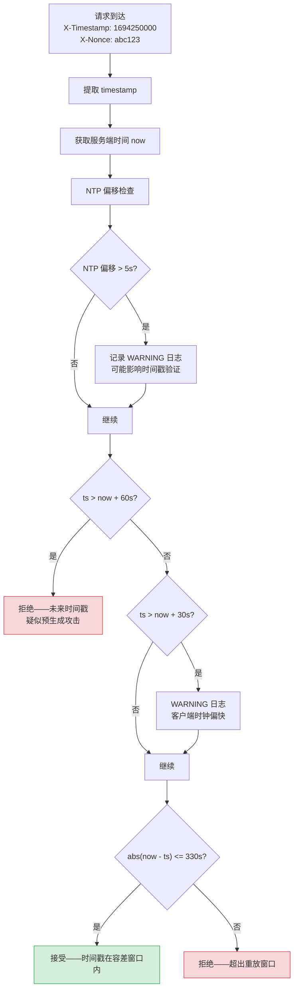

---

doc_type: module
prd_task_id: "YA-09-114"
title: "YA-09-114: 服务端请求签名时间戳容差 — NTP 时钟同步容错与未来时间戳拒绝策略 — 开发任务"
status: 需求已编写
priority: P2
owner: 陈铭
roles: [engineer]
created: 2026-09-11
updated: 2026-09-11
project: YiAi
project_id: yiai
prd_month: "202609"
estimate_frontend: 0.5
source_prd: "122-需求-时间戳容差NTP.md"
source_okr: [yiai-001]

type: task
---

# YA-09-114: 服务端请求签名时间戳容差 — NTP 时钟同步容错与未来时间戳拒绝策略 — 开发任务

> **文档职责**：本文档定义**怎么做、为什么这么做、实际做成什么样**（HOW），不含产品目标与测试用例。

> 来源 PRD：[122-需求-时间戳容差NTP.md](../../prds/2026-09/122-需求-时间戳容差NTP.md)
> 需求编号：YA-09-114 · 优先级：P2 · 人天：0.5d
> 类型：架构 · 状态：需求已编写 · 依赖：YA-09-85（请求签名验证）

---

## 一、架构概述

YA-09-85 实现了请求签名验证，含 300s 重放攻击窗口。但硬编码 300s 无 NTP 容差——时钟偏差 5-30s 时合法请求被误拒绝，且攻击者可预生成未来时间戳签名在窗口内重放。

本方案通过三层时间戳验证 + SNTP 时钟同步监控实现安全性与可用性的平衡：



**核心设计决策**：

| 决策 | 选择 | 理由 |
|------|------|------|
| 时钟容差 | 固定 30s + NTP 偏移监控 | 30s 覆盖绝大多数 NTP 偏差场景，NTP 仅告警不影响验证逻辑 |
| 未来时间戳 | 分层处理（30s 容差接受，60s 硬拒绝） | 30-60s 缓冲区分"时钟偏差"和"预生成攻击" |
| NTP 同步 | 主动查询 `pool.ntp.org`（SNTP 协议） | 进程内实现，不依赖外部监控系统 |

**验证窗口矩阵**：

| 场景 | 窗口 | 行为 |
|------|------|------|
| 正常请求 | 300s + 30s = 330s | 接受 |
| 未来时间戳（容差内） | ts <= now + 30s | 接受但告警 |
| 未来时间戳（告警区） | now + 30s < ts <= now + 60s | 接受但 WARNING 日志 |
| 未来时间戳（硬限制） | ts > now + 60s | 拒绝——疑似预生成攻击 |
| 过期时间戳 | ts < now - 330s | 拒绝 |

---

## 二、文件清单

```
YiAi/src/shared/
└── clock_tolerance.py                 # 新增: ClockToleranceValidator + SNTP 查询 + ClockStatus

YiAi/src/server/middleware/
└── auth_middleware.py                 # 修改: 时间戳验证改用 ClockToleranceValidator

YiAi/src/app.py                        # 修改: 启动时初始化 ClockToleranceValidator + NTP 后台任务

YiAi/tests/shared/
└── test_clock_tolerance.py            # 新增: 单元测试（各时间戳场景 + NTP 降级）
```

---

## 三、模块设计

### 3.1 `ClockToleranceValidator` — NTP 时钟容差验证器

```python
# YiAi/src/shared/clock_tolerance.py

@dataclass
class ClockStatus:
    """时钟状态快照。"""
    ntp_offset_ms: float          # NTP 偏移（毫秒），正=服务端快
    ntp_synced: bool              # 是否成功同步
    last_sync_time: float         # 上次同步时间
    system_time: float            # 当前系统时间
    is_reliable: bool             # 时钟是否可靠（偏移 < 5s）


class ClockToleranceValidator:
    """NTP 时钟容差验证器——三层验证 + SNTP 时钟监控。

    配置常量：
    - CLOCK_SKEW_TOLERANCE = 30       # 时钟偏移容差（秒）
    - MAX_FUTURE_OFFSET = 60          # 未来时间戳硬限制（秒）
    - REPLAY_WINDOW = 300             # 重放保护窗口（秒）
    - NTP_SYNC_INTERVAL = 300         # NTP 同步间隔（秒）
    - NTP_OFFSET_ALERT = 5.0          # NTP 偏移告警阈值（秒）
    """

    def validate_timestamp(self, ts: int) -> tuple[bool, str]:
        """验证请求时间戳是否在有效窗口内。

        验证层级：
        1. ts > now + 60s → 拒绝（预生成攻击）
        2. ts > now + 30s → 接受但 WARNING（客户端时钟偏快）
        3. ts <= now + 30s 且 diff <= 330s → 接受
        4. diff > 330s → 拒绝

        Returns: (is_valid, reason)
        """
        ...

    def check_ntp_sync(self) -> ClockStatus:
        """SNTP 查询 NTP 服务器获取时钟偏移，5min 缓存。

        失败时降级：使用上次缓存偏移，ntp_synced=False。
        """
        ...

    def _query_ntp_offset(self) -> float:
        """SNTP 协议查询（UDP port 123），偏移 = ((T2-T1)+(T3-T4))/2。
        48 字节 NTP 包，解析 64 位定点数时间戳。"""
        ...
```

**SNTP 协议关键点**：使用原始 socket 发送 48 字节 NTP 请求包（LI=0, VN=4, Mode=3），解析响应的 T2（接收时间戳）和 T3（传输时间戳），计算往返偏移。NTP epoch (1900-01-01) 到 Unix epoch 差值为 2208988800 秒。

### 3.2 签名验证中间件集成

```python
# YiAi/src/server/middleware/auth_middleware.py

async def validate_request_signature(request: Request) -> bool:
    ts = int(request.headers.get('X-Timestamp', '0'))
    nonce = request.headers.get('X-Nonce', '')

    # 1. 时间戳验证（含 NTP 容差）
    is_valid, reason = clock_validator.validate_timestamp(ts)
    if not is_valid:
        logger.warning(f'[Auth] timestamp validation failed: {reason}')
        return False

    # 2. Nonce 验证（防重放，TTL=330s 匹配时间窗口）
    if not await nonce_store.check_and_store(nonce, ttl=330):
        logger.warning(f'[Auth] nonce replay detected: {nonce[:8]}...')
        return False

    # 3. 签名验证（不变）
    ...
```

### 3.3 NTP 后台同步任务

```python
# YiAi/src/app.py — on_startup

@app.on_event("startup")
async def startup_ntp_sync():
    clock_validator = ClockToleranceValidator()
    # 首次同步
    status = clock_validator.check_ntp_sync()
    logger.info(f'[NTP] initial sync: offset={status.ntp_offset_ms:.0f}ms reliable={status.is_reliable}')

    # 后台定期同步（5min 间隔）
    asyncio.create_task(_ntp_sync_loop(clock_validator))
```

---

## 四、数据流

```
请求到达 → auth_middleware
  ├── 1. 提取 X-Timestamp 和 X-Nonce header
  ├── 2. ClockToleranceValidator.validate_timestamp(ts)
  │     ├── 检查 NTP 偏移缓存（> 5s 时记 WARNING）
  │     ├── 第一层：ts > now + 60s → 拒绝（预生成攻击）
  │     ├── 第二层：ts > now + 30s → 接受但 WARNING（客户端时钟偏快）
  │     └── 第三层：abs(now - ts) <= 330s → 接受 / 拒绝
  ├── 3. Nonce 验证（防重放）
  └── 4. 签名验证（不变）

NTP 后台任务（5min 间隔）
  ├── SNTP 查询 pool.ntp.org:123 (UDP)
  ├── 计算偏移: offset = ((T2-T1)+(T3-T4))/2 * 1000 ms
  ├── 更新 ClockStatus 缓存
  └── 偏移 > 5s → WARNING 日志 + is_reliable=False
```

---

## 五、实施路线图

| 步骤 | 任务 | 涉及文件 | 验证方式 | 人天 |
|------|------|---------|---------|------|
| 1 | 实现 `ClockToleranceValidator` 核心逻辑（三层验证） | `clock_tolerance.py` | 单元测试：正常/过期/未来容差内/未来硬限制四种场景 | 0.15 |
| 2 | 实现 SNTP 查询（socket UDP + NTP 包解析） | `clock_tolerance.py` | 手动测试：`_query_ntp_offset()` 返回合理偏移值 | 0.10 |
| 3 | 修改 `auth_middleware.py` 集成新验证器 | `auth_middleware.py` | 集成测试：签名请求时间戳验证通过/拒绝 | 0.10 |
| 4 | 初始化 NTP 后台同步任务（app.py on_startup） | `app.py` | 启动后日志输出 NTP 偏移 | 0.05 |
| 5 | 编写单元测试（时间戳场景 + NTP 降级） | `test_clock_tolerance.py` | `pytest tests/shared/test_clock_tolerance.py -v` 全部通过 | 0.10 |

**合计：0.5d**

---

## 六、代码审查检查清单

- [ ] 请求 timestamp 验证：`abs(now - ts) <= REPLAY_WINDOW + CLOCK_SKEW_TOLERANCE`（330s）
- [ ] 未来时间戳 > 60s 硬拒绝（防预生成攻击），30-60s 接受但 WARNING
- [ ] NTP 时钟偏移监控：偏移 > 5s 告警（`is_reliable=False`）
- [ ] 环境变量 `CLOCK_SKEW_TOLERANCE` 可配置（默认 30s）
- [ ] SNTP 查询使用 3s 超时，失败降级使用上次缓存偏移
- [ ] NTP 同步仅用于告警，不影响时间戳验证逻辑——确保监控和验证解耦
- [ ] Nonce TTL=330s 与时间戳窗口匹配
- [ ] 时间戳验证拒绝原因记录到日志（future_timestamp / expired_timestamp）

---

## 七、风险与缓解

| 风险 | 概率 | 影响 | 等级 | 缓解措施 | 应急预案 |
|------|------|------|------|----------|----------|
| NTP 服务器不可达（网络隔离） | 低 | 低 | 低 | 降级使用上次缓存偏移，超时 3s | 切换备用 NTP 服务器 |
| 移动设备时钟偏差大（> 30s） | 中 | 中 | 中 | `CLOCK_SKEW_TOLERANCE` 可配置为 60s | 对移动端使用更宽松窗口 |
| 时钟回拨导致时间戳跳变 | 低 | 中 | 低 | 检测回拨事件（`now < last_now`）记录日志 | 回拨时临时放宽容差 |
| 预生成攻击——攻击者在 60s 窗口内生成签名 | 低 | 高 | 中 | 配合 nonce 一次性使用机制 | 缩短 `MAX_FUTURE_OFFSET` 至 30s |
| NTP 偏移监控误告警 | 中 | 低 | 低 | 连续 3 次 > 5s 才触发告警 | 增大 `NTP_OFFSET_ALERT` 至 10s |