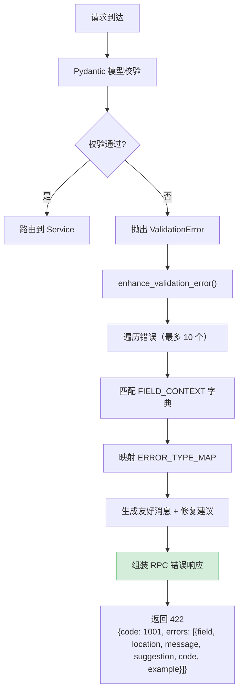

---

doc_type: module
prd_task_id: "YA-09-68"
title: "YA-09-68: 请求校验错误增强 — 字段级定位 + 修复建议 — 开发方案"
status: 需求已编写
priority: P2
owner: 陈铭
roles: [engineer]
created: 2026-09-11
updated: 2026-09-14
project: YiAi
project_id: yiai
prd_month: "202609"
estimate_frontend: 0.5
source_prd: "123-需求-请求校验错误增强.md"
source_okr: [yiai-001]

type: task
---

# YA-09-68: 请求校验错误增强 — 字段级定位 + 修复建议 — 开发方案

> **文档职责**：本文档定义**怎么做、为什么这么做、实际做成什么样**（HOW），不含产品目标与测试用例。

> 来源 PRD：[123-需求-请求校验错误增强.md](../../prds/2026-09/123-需求-请求校验错误增强.md)
> 需求编号：YA-09-68 · 优先级：P2 · 人天：0.5d · 状态：需求已编写 · 依赖：YA-09-51（Pydantic 参数校验）

---

## 一、架构概述

YA-09-51 引入了 Pydantic 参数校验，但错误信息是技术导向的——`"field required"`、"`type_error.integer`" 对业务用户无意义。当前问题：(1) 技术术语不可读 (2) 无字段上下文——不知道参数含义 (3) 无修复建议 (4) 仅返回首个错误。

本方案通过覆盖 FastAPI 异常处理器，将 Pydantic `ValidationError` 转换为 RPC 格式的增强错误响应，包含字段级定位、中文消息、示例值和修复建议。



**核心设计决策**：

| 决策 | 选择 | 理由 |
|------|------|------|
| 增强方式 | 覆盖 FastAPI `add_exception_handler` | 侵入性最小，不修改 Pydantic 核心逻辑 |
| 字段上下文 | 硬编码字典（15 个核心 RPC 字段） | 当前最简，后续可迁移到配置文件支持 i18n |
| 多错误返回 | 前 10 个错误 + `total_errors` | 平衡用户体验和响应大小，10 个覆盖绝大多数场景 |
| 错误码 | RPC 1001（参数验证失败） | 统一 RPC 错误码，前端（YiVad/YiPet）已适配 |

---

## 二、文件清单

```
YiAi/src/shared/
└── validation_enhancer.py             # 新增: enhance_validation_error() + FIELD_CONTEXT + FRIENDLY_MESSAGES + ERROR_TYPE_MAP + exception_handler

YiAi/src/app.py                        # 修改: 注册自定义 ValidationError 异常处理器

YiAi/tests/shared/
└── test_validation_enhancer.py        # 新增: 单元测试（各错误类型增强 + 多错误场景）
```

---

## 三、模块设计

### 3.1 核心数据字典

```python
# YiAi/src/shared/validation_enhancer.py

# 友好错误消息模板（12 种错误类型）
FRIENDLY_MESSAGES: dict[str, str] = {
    'missing': '缺少必填字段 "{field}"——{context}',
    'type_error': '字段 "{field}" 类型错误——期望 {expected}，收到 {actual}',
    'value_error': '字段 "{field}" 值无效——{reason}',
    'extra_forbidden': '未知字段 "{field}"——已从请求中移除，请使用 "{alternative}"',
    'string_too_short': '字段 "{field}" 过短——最少 {min_length} 个字符',
    'string_too_long': '字段 "{field}" 过长——最多 {max_length} 个字符',
    'number_too_small': '字段 "{field}" 值过小——最小 {min_value}',
    'number_too_large': '字段 "{field}" 值过大——最大 {max_value}',
    'enum': '字段 "{field}" 值无效——可选值: {options}',
    'json_invalid': '请求体不是有效的 JSON 格式——请检查语法',
    'unexpected_type': '字段 "{field}" 类型错误——期望 {expected}，收到 {actual}',
}

# 字段上下文——15 个核心 RPC 参数（context + example + format + options）
FIELD_CONTEXT: dict[str, dict] = {
    'cname':       {'context': '请指定要操作的集合名称', 'example': 'projects',
                    'options': ['projects','bugs','sessions','knowledge_files','rss_entries','menus','users','static_files']},
    'filter':      {'context': 'MongoDB 查询过滤条件', 'example': '{"status": "open"}',
                    'note': '注意：参数名为 filter，非 query'},
    'target_file': {'context': '目标文件路径', 'example': 'YiKnowledge/engineer/deployment-guide.md',
                    'note': '注意：参数名为 target_file，非 path'},
    'page':        {'context': '分页页码', 'example': '1', 'format': '正整数，从 1 开始'},
    'pageSize':    {'context': '每页条数', 'example': '20', 'format': '正整数，范围 1-500'},
    'sort':        {'context': '排序条件', 'example': '{"updated": -1}'},
    'module_name': {'context': 'RPC 模块路径', 'example': 'services.database.data_service'},
    'method_name': {'context': 'RPC 方法名', 'example': 'query_documents'},
    'parameters':  {'context': 'RPC 方法参数', 'example': '{"cname": "projects"}'},
    'content':     {'context': '文件内容', 'example': '# 文件标题\n\n文件正文...'},
    'messages':    {'context': '聊天消息列表', 'example': '[{"role": "user", "content": "你好"}]'},
    'question':    {'context': 'RAG 检索问题', 'example': '如何部署 YiAi？'},
    'scope':       {'context': '知识库检索范围', 'example': 'engineer',
                    'options': ['engineer','sre','curator','designer','manager','tester','common']},
    'key':         {'context': '文档唯一标识', 'example': 'session_abc123'},
    'title':       {'context': '标题', 'example': '部署指南'},
}

# Pydantic 错误类型 → 友好类型映射（14 种）
ERROR_TYPE_MAP: dict[str, str] = {
    'missing': 'missing', 'value_error.missing': 'missing',
    'type_error.integer': 'type_error', 'type_error.float': 'type_error',
    'type_error.str': 'type_error', 'type_error.bool': 'type_error',
    'type_error.dict': 'type_error', 'type_error.list': 'type_error',
    'type_error.json': 'json_invalid', 'value_error.extra': 'extra_forbidden',
    'type_error.enum': 'enum',
    'value_error.str.min_length': 'string_too_short',
    'value_error.str.max_length': 'string_too_long',
    'value_error.number.min_size': 'number_too_small',
    'value_error.number.max_size': 'number_too_large',
    'type_error.unexpected_type': 'unexpected_type',
}

# 废弃参数名 → 替代参数
DEPRECATED_PARAMS = {'query': 'filter', 'path': 'target_file', 'collection_name': 'cname', 'history': 'messages'}

MAX_ERRORS = 10
```

### 3.2 `enhance_validation_error()` — 核心增强函数

```python
@dataclass
class EnhancedError:
    field: str                # 字段名
    location: str             # 字段路径（body.parameters.cname）
    message: str              # 用户友好消息
    suggestion: str           # 修复建议
    code: str                 # 错误类型代码
    example: Optional[str]    # 示例值


def enhance_validation_error(exc: ValidationError) -> dict:
    """将 Pydantic ValidationError 转换为增强错误响应。

    处理流程：
    1. 遍历 exc.errors()[:MAX_ERRORS]
    2. 每个 error → _enhance_single_error()
       a. 提取字段名（loc[-1]）
       b. 映射错误类型（ERROR_TYPE_MAP）
       c. 查找字段上下文（FIELD_CONTEXT）
       d. 格式化友好消息（FRIENDLY_MESSAGES 模板）
       e. 生成修复建议（_build_suggestion）
    3. 组装 RPC 响应：{code: 1001, message, data: {errors, total_errors}}

    Returns:
        RPC 错误响应格式
    """
    ...


def _build_suggestion(field: str, error_type: str, field_info: dict) -> str:
    """生成修复建议——优先级：
    1. 废弃参数名 → "请将 {旧名} 改为 {新名}"
    2. 字段有 format → "格式要求: {format}"
    3. 字段有 example → "示例: {example}"
    4. 通用建议（missing → "请添加字段"，type_error → "请检查类型"）
    """
    ...
```

### 3.3 FastAPI 异常处理器注册

```python
# YiAi/src/app.py

from pydantic import ValidationError
from src.shared.validation_enhancer import enhance_validation_error

app.add_exception_handler(ValidationError, validation_exception_handler)

async def validation_exception_handler(request: Request, exc: ValidationError):
    enhanced = enhance_validation_error(exc)
    return JSONResponse(status_code=422, content=enhanced)
```

### 3.4 改造前后对比

改造前：`{"detail": [{"loc": ["body","parameters","cname"], "msg": "field required", "type": "value_error.missing"}]}`

改造后：
```json
{
  "code": 1001,
  "message": "请求参数校验失败——共 2 个错误",
  "data": {
    "errors": [{
      "field": "cname",
      "location": "body.parameters.cname",
      "message": "缺少必填字段 \"cname\"——请指定要操作的集合名称",
      "suggestion": "格式要求: 字符串，枚举值，示例: projects",
      "code": "value_error.missing",
      "example": "projects"
    }],
    "total_errors": 2
  }
}
```

---

## 四、数据流

```
请求到达 → Pydantic 模型校验失败
  → ValidationError 抛出
  → FastAPI 路由到 validation_exception_handler
  → enhance_validation_error(exc)
    ├── 遍历 exc.errors()（最多 10 个）
    │   ├── 提取 loc → field
    │   ├── 映射 error type → mapped_type (ERROR_TYPE_MAP)
    │   ├── 查找 FIELD_CONTEXT → context / example / options / format
    │   ├── 格式化 FRIENDLY_MESSAGES 模板 → message
    │   └── _build_suggestion() → suggestion
    └── 组装响应 → JSONResponse(422)
```

**关键边界处理**：
- 字段无上下文时：使用通用模板（`FRIENDLY_MESSAGES['value_error']`），suggestion 回退为"请检查字段值是否正确"
- 废弃参数名（query/path/collection_name）：专属提示改为正确参数名（CLA.md 契约对齐）
- 超过 10 个错误：截断 + `total_errors` 字段 + message 附注"仅展示前 10 个"

---

## 五、实施路线图

| 步骤 | 任务 | 涉及文件 | 验证方式 | 人天 |
|------|------|---------|---------|------|
| 1 | 编写 `FIELD_CONTEXT` 字典（15 个核心 RPC 字段） | `validation_enhancer.py` | 对照 CLAUDE.md 参数名契约表审查覆盖完整性 | 0.10 |
| 2 | 实现 `enhance_validation_error()` + `_enhance_single_error()` + `_build_suggestion()` | `validation_enhancer.py` | 单元测试：模拟 missing/type_error/enum/extra 四种典型错误 | 0.15 |
| 3 | 实现 `validation_exception_handler` 并注册到 app | `validation_enhancer.py` + `app.py` | 集成测试：发送缺少 cname 的请求，验证 422 响应格式 | 0.10 |
| 4 | 废弃参数名检测 + 专属建议 | `validation_enhancer.py` | 测试：发送 `query` 而非 `filter`，验证提示改为 filter | 0.05 |
| 5 | 编写单元测试（多错误截断、废弃参数、边界降级） | `test_validation_enhancer.py` | `pytest tests/shared/test_validation_enhancer.py -v` 全部通过 | 0.10 |

**合计：0.5d**

---

## 六、代码审查检查清单

- [ ] 校验错误返回字段级详情（field/location/message/suggestion/code/example）
- [ ] suggestion 包含示例值或格式提示（从 FIELD_CONTEXT 提取）
- [ ] 多个字段错误时全部返回（非仅第一个），最多 10 个 + `total_errors`
- [ ] 废弃参数名（query/path/collection_name/history）有专门的替换提示，与 CLAUDE.md 参数名契约一致
- [ ] `FIELD_CONTEXT` 覆盖所有核心 RPC 参数（15 个字段：cname/filter/target_file/page/pageSize/sort/module_name/method_name/parameters/content/messages/question/scope/key/title）
- [ ] 异常处理器仅拦截 `ValidationError`，不影响其他异常（500/认证失败等）
- [ ] 响应格式使用 RPC 错误码 1001（参数验证失败），与前端统一错误处理对齐
- [ ] 字段无上下文时回退通用提示（不报错、不返回空 suggestion）
- [ ] 错误类型映射覆盖 Pydantic 常见 14 种错误类型

---

## 七、风险与缓解

| 风险 | 概率 | 影响 | 等级 | 缓解措施 | 应急预案 |
|------|------|------|------|----------|----------|
| 错误消息泄露内部字段名 | 低 | 中 | 低 | 仅暴露参数名（非内部实现），审计 production 错误响应 | 关闭 suggestion 字段 |
| 大批量校验错误响应过大（50+ 字段错误） | 低 | 低 | 低 | 截断前 10 错误 + total_errors 提示 | 增大 MAX_ERRORS 或全部返回 |
| 字段上下文维护成本（新增字段时遗忘更新） | 中 | 低 | 低 | 新增 RPC 参数时同步更新 FIELD_CONTEXT，code review 检查 | 缺失上下文的字段回退通用提示 |
| 废弃参数名映射不完整 | 低 | 低 | 低 | 基于 CLAUDE.md 参数名契约表维护 `DEPRECATED_PARAMS` | 补充映射后热更新 |
| 异常处理器覆盖其他 422 错误 | 低 | 中 | 低 | 仅拦截 `pydantic.ValidationError`（`isinstance` 检查） | 移除处理器注册，恢复 FastAPI 默认 |