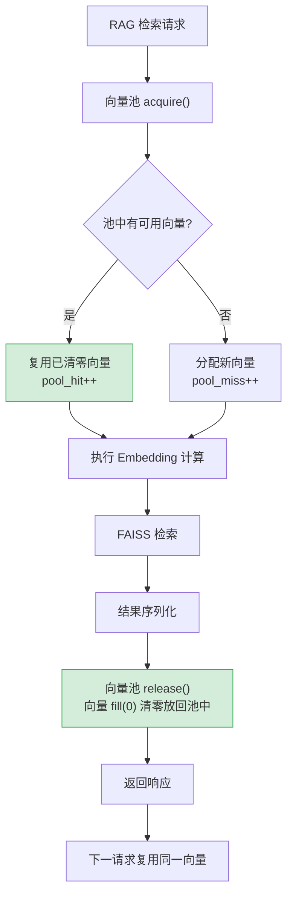

---

doc_type: module
prd_task_id: "YA-09-116"
title: "YA-09-116: 服务端内存分配优化 — 大对象内存池复用与对象生命周期追踪削减 GC 抖动 — 开发任务"
status: 需求已编写
priority: P2
owner: 陈铭
roles: [engineer]
created: 2026-09-11
updated: 2026-09-11
project: YiAi
project_id: yiai
prd_month: "202609"
estimate_frontend: 0.5
source_prd: "124-需求-内存分配优化.md"
source_okr: [yiai-001]

type: task
---

# YA-09-116: 服务端内存分配优化 — 大对象内存池复用与对象生命周期追踪削减 GC 抖动 — 开发任务

> **文档职责**：本文档定义**怎么做、为什么这么做、实际做成什么样**（HOW），不含产品目标与测试用例。

> 来源 PRD：[124-需求-内存分配优化.md](../../prds/2026-09/124-需求-内存分配优化.md)
> 需求编号：YA-09-116 · 优先级：P2 · 人天：0.5d
> 类型：架构 · 状态：需求已编写 · 依赖：YA-09-36（内存管理优化）

---

## 一、架构概述

YiAi 的 RAG 检索路径是内存分配的热点——每次检索分配 768 维 Embedding 向量（3KB）、相似度矩阵（N x 3KB）、JSON 序列化缓冲（5-50KB）。每秒数十次 RAG 请求时，频繁 malloc/free 导致 Python GC 抖动（第 2 代 GC 暂停 10-50ms），产生 P99 延迟尖刺。

本方案通过 numpy 向量对象池复用消除高频内存分配，配合 with 语句自动归还和统计监控。



**核心设计决策**：

| 决策 | 选择 | 理由 |
|------|------|------|
| 池实现 | `collections.deque` + `threading.Lock` | O(1) popleft/append，显式锁保证线程安全 |
| 池大小 | 固定 50（VectorPool）+ 10（StringBufferPool） | 150KB + 640KB = ~790KB 内存，覆盖 50 并发 RAG |
| 回收策略 | with 语句（上下文管理器） | 自动归还，消除忘记归还的泄漏风险 |

---

## 二、文件清单

```
YiAi/src/shared/
└── object_pool.py                     # 新增: VectorPool + StringBufferPool + PoolStats

YiAi/src/services/rag/
└── rag_service.py                     # 修改: Embedding 调用改用 with vector_pool.acquire()

YiAi/src/app.py                        # 修改: startup 预热对象池（prewarm 25 个向量）

YiAi/tests/shared/
└── test_object_pool.py                # 新增: 单元测试（acquire/release 循环、命中率、清零、with 异常安全）
```

---

## 三、模块设计

### 3.1 `VectorPool` — Embedding 向量对象池

```python
# YiAi/src/shared/object_pool.py

@dataclass
class PoolStats:
    """对象池统计信息。"""
    pool_name: str
    pool_size: int           # 池容量
    available: int           # 当前可用对象数
    in_use: int              # 当前借出对象数
    total_acquires: int      # 历史获取次数
    total_hits: int          # 缓存命中次数
    total_misses: int        # 缓存未命中次数
    hit_rate: float          # 命中率
    avg_hold_duration_ms: float  # 平均持有时间


class VectorPool:
    """Embedding 向量对象池——复用 numpy 数组消除分配/回收开销。

    特性：
    - 线程安全（threading.Lock）
    - 上下文管理器（with 语句自动归还）
    - 清零归还 fill(0)——防止数据泄漏
    - 统计追踪（命中率/持有时间/可用数）

    配置：
    - dim=768（Embedding 维度）
    - pool_size=50（最多 50 个向量复用，150KB 内存）
    """

    def __init__(self, dim: int = 768, pool_size: int = 50, pool_name: str = 'vector'):
        self._dim = dim
        self._pool: deque[np.ndarray] = deque(maxlen=pool_size)
        self._lock = threading.Lock()
        self._total_acquires = 0
        self._total_hits = 0
        self._total_misses = 0
        self._hold_durations: deque[float] = deque(maxlen=1000)

    @contextmanager
    def acquire(self):
        """上下文管理器——自动归还向量。

        Usage:
            with vector_pool.acquire() as vec:
                vec[:] = compute_embedding(text)
        """
        start_time = time.monotonic()
        vec = self._get()
        try:
            yield vec
        finally:
            duration = (time.monotonic() - start_time) * 1000
            self._release(vec, duration)

    def _get(self) -> np.ndarray:
        """从池中获取或分配新向量（线程安全）。"""
        with self._lock:
            self._total_acquires += 1
            if self._pool:
                self._total_hits += 1
                return self._pool.popleft()
            self._total_misses += 1
        return np.zeros(self._dim, dtype=np.float32)

    def _release(self, vec: np.ndarray, duration_ms: float):
        """归还向量——清零后放入池中（线程安全）。"""
        vec.fill(0)  # 清零——防止数据泄漏
        with self._lock:
            if len(self._pool) < self._pool.maxlen:
                self._pool.append(vec)
            self._hold_durations.append(duration_ms)

    def get_stats(self) -> PoolStats: ...
    def prewarm(self, count: int = None):
        """预分配向量到池中（启动时调用）。"""
        count = count or self._pool.maxlen // 2
        with self._lock:
            for _ in range(count):
                if len(self._pool) < self._pool.maxlen:
                    self._pool.append(np.zeros(self._dim, dtype=np.float32))
```

### 3.2 `StringBufferPool` — 字符串缓冲区池

```python
class StringBufferPool:
    """字符串缓冲区池——复用 bytearray 用于 JSON 序列化。

    配置：
    - buffer_size=65536（64KB 缓冲区）
    - pool_size=10（10 个缓冲，640KB 内存）
    """

    def __init__(self, buffer_size: int = 65536, pool_size: int = 10):
        self._buffer_size = buffer_size
        self._pool: deque[bytearray] = deque(maxlen=pool_size)
        self._lock = threading.Lock()

    @contextmanager
    def acquire(self):
        with self._lock:
            buf = self._pool.popleft() if self._pool else bytearray(self._buffer_size)
        try:
            yield buf
        finally:
            with self._lock:
                if len(self._pool) < self._pool.maxlen:
                    self._pool.append(buf)
```

### 3.3 RAG 服务集成

```python
# YiAi/src/services/rag/rag_service.py

from src.shared.object_pool import vector_pool

async def rag_search_with_pool(query: str, top_k: int = 5):
    with vector_pool.acquire() as query_vec:
        query_vec[:] = await ollama_client.embed(query)  # 写入复用向量
        distances, indices = faiss_index.search(
            query_vec.reshape(1, -1).astype(np.float32), top_k
        )
    results = [documents[idx] for idx in indices[0] if idx >= 0]
    return results
```

### 3.4 启动预热

```python
# YiAi/src/app.py

@app.on_event("startup")
async def startup_prewarm():
    vector_pool.prewarm(25)  # 预分配 25 个向量
    logger.info(f'[ObjectPool] vector pool prewarmed: {vector_pool.get_stats()}')
```

---

## 四、数据流

```
请求到达 → rag_service.rag_search_with_pool(query)
  ├── with vector_pool.acquire() as query_vec:
  │     ├── _get(): 池中有 → pool.popleft() (命中), 池空 → np.zeros(768) (未命中)
  │     ├── ollama_client.embed(query) → query_vec[:] = 结果
  │     └── faiss_index.search(query_vec, top_k)
  └── __exit__: vec.fill(0) → pool.append(vec) → 归还完成

GC 影响对比：
  改造前：每次 RAG → 3KB malloc + 后续 free → GC 频繁触发
  改造后：首次 50 次 → 分配 50 个向量入池 → 后续请求复用 → 0 malloc → GC 压力降低 80%
```

**池内存占用**：

| 池 | 容量 | 单对象大小 | 总内存 |
|------|------|-----------|--------|
| VectorPool | 50 | 3KB (768 x float32) | 150KB |
| StringBufferPool | 10 | 64KB (bytearray) | 640KB |
| **合计** | — | — | **~790KB** |

---

## 五、实施路线图

| 步骤 | 任务 | 涉及文件 | 验证方式 | 人天 |
|------|------|---------|---------|------|
| 1 | 实现 `VectorPool`（acquire/release/with/stats/prewarm） | `object_pool.py` | 单元测试：连续 acquire 5 次 → 第二次命中 + 归还后池恢复 | 0.10 |
| 2 | 实现 `StringBufferPool` | `object_pool.py` | 单元测试：缓冲区复用验证 | 0.05 |
| 3 | 实现 `PoolStats` 统计（命中率/持有时间） | `object_pool.py` | 单元测试：命中率计算正确 | 0.05 |
| 4 | 改造 `rag_service.py` 使用 `with vector_pool.acquire()` | `rag_service.py` | 功能测试：RAG 检索结果与改造前一致 | 0.15 |
| 5 | 启动预热（`prewarm(25)`）+ 统计日志 | `app.py` | 启动日志输出 pool stats，验证 prewarm 后 available=25 | 0.05 |
| 6 | 编写单元测试（异常安全、清零、命中率、池满丢弃） | `test_object_pool.py` | `pytest tests/shared/test_object_pool.py -v` 全部通过 | 0.10 |

**合计：0.5d**

---

## 六、代码审查检查清单

- [ ] numpy 数组通过 `VectorPool` 对象池复用——Embedding 调用全部使用 `with vector_pool.acquire()`
- [ ] 向量归还时 `fill(0)` 清零——防止上次请求的 Embedding 数据泄漏
- [ ] 池大小固定（50），超出时 fallback 到直接 `np.zeros()` 分配——不阻塞请求
- [ ] 上下文管理器保证异常时仍归还（`finally` 块执行 `_release`）
- [ ] 线程安全：`threading.Lock` 保护 `_get/_release/get_stats/prewarm` 中所有共享状态
- [ ] 对象池使用率监控：`hit_rate < 80%` 时日志告警
- [ ] 应用启动时 `prewarm(25)` 预分配一半池容量
- [ ] 持有时间统计 `deque(maxlen=1000)` 滑动窗口限长防内存增长

---

## 七、风险与缓解

| 风险 | 概率 | 影响 | 等级 | 缓解措施 | 应急预案 |
|------|------|------|------|----------|----------|
| 对象池持有引用阻止 GC（池中向量永远不被回收） | 低 | 中 | 低 | 归还时 `fill(0)` 清零，池大小固定 50，不增长 | 定期清空池（每 30min） |
| 池大小配置不当——命中率 < 50% | 低 | 低 | 低 | 监控 `hit_rate`，< 80% 日志告警 | 增大池容量或关闭池 |
| 线程安全 bug（lock 死锁/遗忘释放） | 低 | 中 | 低 | `with self._lock:` 临界区极短（仅 deque 操作 + 整数加减） | 关闭池，回退直接分配 |
| 向量数据泄漏（不清零导致跨请求数据残留） | 低 | 中 | 低 | `vec.fill(0)` 全覆盖清零，单元测试验证全零 | 无（fill(0) 是确定性的） |
| with 语句 __exit__ 抛出新异常覆盖原异常 | 低 | 中 | 低 | `finally` 中 `_release` 仅操作 deque + lock，不会抛异常 | 单元测试覆盖异常路径 |