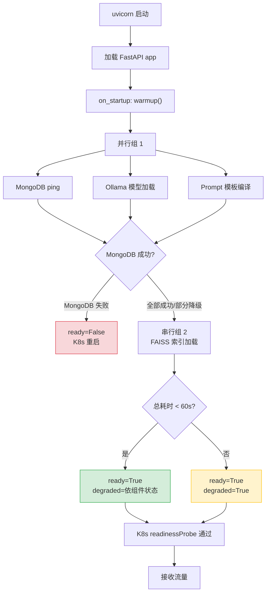

---

doc_type: module
prd_task_id: "YA-09-117"
title: "YA-09-117: 服务端请求预热与冷启动优化 — 首次请求前预加载关键路径模块与连接池 — 开发任务"
status: 需求已编写
priority: P2
owner: 陈铭
roles: [engineer]
created: 2026-09-11
updated: 2026-09-11
project: YiAi
project_id: yiai
prd_month: "202609"
estimate_frontend: 0.5
source_prd: "125-需求-请求预热冷启动.md"
source_okr: [yiai-001]

type: task
---

# YA-09-117: 服务端请求预热与冷启动优化 — 首次请求前预加载关键路径模块与连接池 — 开发任务

> **文档职责**：本文档定义**怎么做、为什么这么做、实际做成什么样**（HOW），不含产品目标与测试用例。

> 来源 PRD：[125-需求-请求预热冷启动.md](../../prds/2026-09/125-需求-请求预热冷启动.md)
> 需求编号：YA-09-117 · 优先级：P2 · 人天：0.5d
> 类型：架构 · 状态：需求已编写 · 依赖：YA-09-34（懒加载模块预热）

---

## 一、架构概述

YiAi 启动后首个请求延迟 2-6s——Ollama 模型加载（1-3s）+ FAISS 索引加载（0.5-2s）+ MongoDB 连接（50-200ms）+ Python import（100-500ms）+ Prompt 模板编译（50-100ms）。在 K8s 滚动更新中，新 Pod 立即接收流量，冷启动延迟导致首个请求超时（30s 全局超时），触发健康检查失败和 Pod 重启循环。

本方案通过 FastAPI `on_startup` 事件 + K8s `startupProbe` 组合实现启动时预热，预热完成前不接收流量。



**核心设计决策**：

| 决策 | 选择 | 理由 |
|------|------|------|
| 预热时机 | `on_startup` + K8s `startupProbe` | FastAPI 预热 Python 组件，K8s 阻止流量进入 |
| 预热策略 | 分组并行（无依赖并行，有依赖串行） | MongoDB/Ollama/Prompt 并行，FAISS 在 Ollama 后串行 |
| 超时处理 | 降级策略（60s 超时跳过未完成组件） | MongoDB 失败则 not ready，非核心组件超时则 degraded |
| 降级粒度 | 核心（MongoDB）必须，非核心可降级 | Ollama 不可用时 CRUD/文件管理仍可用 |

**冷启动延迟对比**：

| 组件 | 改造前首次请求 | 改造后首次请求 | 改善 |
|------|-------------|-------------|------|
| Ollama Embedding | 1500-3000ms | 50-100ms | 15-60x |
| MongoDB 查询 | 50-200ms | 2-5ms | 10-40x |
| FAISS 检索 | 500-2000ms | 5-10ms | 50-200x |
| **首次 RAG 总计** | **3-6s** | **50-120ms** | **25-50x** |

---

## 二、文件清单

```
YiAi/src/shared/
└── warmup.py                          # 新增: ServiceWarmer + WarmupStatus/WarmupResult/WarmupReport

YiAi/src/
├── app.py                             # 修改: on_startup 事件集成 warmup()
└── server/
    └── routes.py                      # 修改: 新增 GET /health/ready + GET /health/warmup

YiAi/k8s/
└── deployment.yaml                    # 修改: 新增 startupProbe 配置

YiAi/tests/shared/
└── test_warmup.py                     # 新增: 单元测试（各组件成功/失败/超时场景）
```

---

## 三、模块设计

### 3.1 `ServiceWarmer` — 服务预热器

```python
# YiAi/src/shared/warmup.py

class WarmupStatus(str, Enum):
    PENDING = 'pending'
    RUNNING = 'running'
    SUCCESS = 'success'
    FAILED = 'failed'
    TIMEOUT = 'timeout'
    SKIPPED = 'skipped'

@dataclass
class WarmupResult:
    component: str               # mongodb | ollama | prompt | faiss
    status: WarmupStatus
    duration_ms: float
    error: Optional[str] = None

@dataclass
class WarmupReport:
    results: list[WarmupResult]
    total_duration_ms: float
    ready: bool
    degraded: bool
    degraded_components: list[str]


class ServiceWarmer:
    """服务预热器——启动时预加载关键路径组件。

    预热流程：
    阶段 1（并行）：MongoDB ping + Ollama 模型加载 + Prompt 模板编译
    阶段 2（串行，依赖 Ollama）：FAISS 索引加载
    超时 60s 后降级，标记未完成组件为 degraded

    就绪条件：
    - MongoDB 必须成功（否则 ready=False → K8s 重启 Pod）
    - 其他组件超时则降级（ready=True, degraded=True）
    """

    WARMUP_TIMEOUT = 60  # 总超时 60s

    def __init__(self):
        self._ready = False
        self._degraded = False
        self._degraded_components: list[str] = []
        self._report: Optional[WarmupReport] = None

    @property
    def is_ready(self) -> bool:
        return self._ready

    async def warmup(self) -> WarmupReport:
        """执行预热流程。使用 asyncio.gather 并行阶段 1，串行阶段 2。"""
        ...

    async def _warmup_mongodb(self) -> WarmupResult:
        """db.command('ping')——失败则服务不可用。"""
        ...

    async def _warmup_ollama(self) -> WarmupResult:
        """ollama_client.embed('warmup')——触发模型加载到 GPU/内存。"""
        ...

    async def _warmup_prompt_templates(self) -> WarmupResult:
        """PromptManager.render('system/agent', ...)——编译 Jinja2 模板缓存。"""
        ...

    async def _warmup_faiss(self) -> WarmupResult:
        """rag_service.search('__warmup__', top_k=1)——加载 FAISS 索引。"""
        ...
```

### 3.2 健康检查端点

```python
# YiAi/src/server/routes.py

@app.get("/health/ready")
async def readiness_check():
    """就绪探针——预热完成前返回 503，K8s startupProbe 据此阻止流量。

    Returns:
        预热完成 → 200 {status: 'ready', degraded, degraded_components}
        预热中   → 503 {status: 'not_ready', message: 'warmup in progress'}
    """
    if warmer.is_ready:
        return {'status': 'ready', 'degraded': warmer._degraded, ...}
    return JSONResponse({'status': 'not_ready', ...}, status_code=503)


@app.get("/health/warmup")
async def warmup_status():
    """预热状态查询——返回各组件预热结果（name/status/duration_ms/error）。"""
    ...
```

### 3.3 K8s 探针配置

```yaml
# YiAi/k8s/deployment.yaml
startupProbe:
  httpGet:       {path: /health/ready, port: 10086}
  initialDelaySeconds: 2
  periodSeconds: 5
  failureThreshold: 15   # 2 + 5*15 = 77s > 60s 预热超时
readinessProbe:
  httpGet:       {path: /health/ready, port: 10086}
  periodSeconds: 10
  failureThreshold: 3
livenessProbe:
  httpGet:       {path: /health/live, port: 10086}
  periodSeconds: 15
  failureThreshold: 3
```

### 3.4 启动集成

```python
# YiAi/src/app.py

from src.shared.warmup import warmer

@app.on_event("startup")
async def startup_warmup():
    await warmer.warmup()
```

---

## 四、数据流

```
uvicorn 启动 → FastAPI app 加载 → on_startup 事件
  → warmer.warmup()
    ├── asyncio.gather(
    │     _warmup_mongodb(),      # db.command('ping') → 50-200ms
    │     _warmup_ollama(),       # ollama.embed('warmup') → 1-3s
    │     _warmup_prompt_templates() # jinja2 render → 10-50ms
    │   )
    ├── 检查 MongoDB 结果 → 失败则 ready=False, return
    ├── 检查 Ollama 结果 → 成功则执行
    │     _warmup_faiss()        # rag.search('__warmup__') → 0.5-2s
    ├── 超时检查（总耗时 vs 60s）→ 超时标记 degraded
    └── 组装 WarmupReport → ready=True

K8s startupProbe → GET /health/ready
  → warmer.is_ready == False → 503 → K8s 继续等待
  → warmer.is_ready == True  → 200 → K8s 标记 Pod Ready → 接收流量
```

---

## 五、实施路线图

| 步骤 | 任务 | 涉及文件 | 验证方式 | 人天 |
|------|------|---------|---------|------|
| 1 | 实现 `ServiceWarmer` 预热流程（两阶段 + 超时降级） | `warmup.py` | 单元测试：模拟各组件成功/失败，验证 ready/degraded 状态 | 0.15 |
| 2 | 实现 `GET /health/ready` 就绪探针端点（503/200） | `routes.py` | 预热完成前 `curl /health/ready` 返回 503 | 0.05 |
| 3 | 实现 `GET /health/warmup` 预热状态端点 | `routes.py` | 返回各组件预热结果 JSON | 0.05 |
| 4 | 集成 `on_startup` 事件调用 `warmer.warmup()` | `app.py` | 启动后日志输出 WarmupReport | 0.05 |
| 5 | 配置 K8s `startupProbe` | `deployment.yaml` | 新 Pod 启动后预热完成才接收流量 | 0.10 |
| 6 | 编写单元测试（全部成功/MongoDB 失败/Ollama 降级/超时） | `test_warmup.py` | `pytest tests/shared/test_warmup.py -v` 全部通过 | 0.10 |

**合计：0.5d**

---

## 六、代码审查检查清单

- [ ] 启动后先预热关键路径再标记 ready——MongoDB ping + Ollama 模型加载 + RAG 索引加载 + Prompt 模板编译
- [ ] 预热超时 60s——超时降级（未完成组件标记 TIMEOUT，degraded=True）
- [ ] MongoDB 失败时 `ready=False`——服务不可用，K8s 重启 Pod
- [ ] 非核心组件（Ollama/FAISS/Prompt）失败时降级——`ready=True, degraded=True`
- [ ] 声誉探针 `/health/ready` 在预热完成前返回 503
- [ ] K8s `startupProbe.failureThreshold=15`——77s 窗口 > 60s 预热超时
- [ ] `/health/warmup` 端点返回各组件预热状态（name/status/duration_ms/error）
- [ ] 预热完成日志确认——`logger.info(f'[Warmup] complete: ready={ready} degraded={degraded}')`
- [ ] `WARMUP_TIMEOUT` 和 `CLOCK_SKEW_TOLERANCE` 等阈值通过环境变量可配置

---

## 七、风险与缓解

| 风险 | 概率 | 影响 | 等级 | 缓解措施 | 应急预案 |
|------|------|------|------|----------|----------|
| 预热超时误判服务不可用（Ollama 首次下载模型） | 低 | 高 | 中 | 预热仅触发模型加载（非下载），模型应预置 | 手动触发预热或增大 WARMUP_TIMEOUT |
| 预热中接收请求返回 503 | 中 | 中 | 中 | K8s `startupProbe` 阻止流量进入 | 增大 `failureThreshold` |
| Ollama 不可用导致 RAG/Chat 功能降级 | 中 | 中 | 中 | 仅标记 RAG/Chat 功能降级，CRUD 仍可用 | 手动重启 Ollama |
| FAISS 索引文件不存在（首次部署） | 低 | 中 | 低 | 预热时跳过 FAISS（标记 SKIPPED + degraded） | 手动构建索引后重启 |
| 预热覆盖不完整（遗漏新模块） | 低 | 低 | 中 | `_warmup_*` 方法名含组件名，新增关键路径时 review 是否需预热 | 补充预热方法 |