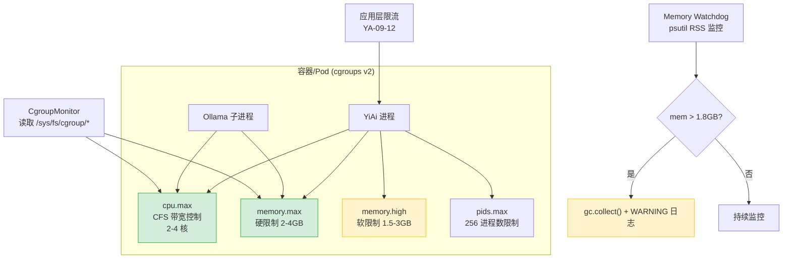

---

doc_type: module
prd_task_id: "YA-09-117"
title: "YA-09-117: cgroups 资源隔离 — CPU/内存硬限制 — 开发方案"
status: 需求已编写
priority: P2
owner: 陈铭
roles: [engineer]
created: 2026-09-11
updated: 2026-09-14
project: YiAi
project_id: yiai
prd_month: "202609"
estimate_frontend: 0.5
source_prd: "126-需求-cgroups资源隔离.md"
source_okr: [yiai-001]

type: task
---

# YA-09-117: cgroups 资源隔离 — CPU/内存硬限制 — 开发方案

> **文档职责**：本文档定义**怎么做、为什么这么做、实际做成什么样**（HOW），不含产品目标与测试用例。

> 来源 PRD：[126-需求-cgroups资源隔离.md](../../prds/2026-09/126-需求-cgroups资源隔离.md)
> 需求编号：YA-09-117 · 优先级：P2 · 人天：0.5d · 状态：需求已编写

---

## 一、架构概述

应用层限流只能控制请求速率，无法防止进程自身的资源滥用。YiAi 面临 Ollama 推理 CPU 耗尽、Python 内存泄漏 OOM、文件描述符耗尽等资源风险。cgroups v2 是 Linux 内核提供的进程资源隔离机制，可设置 CPU/内存/IO 硬限制。

本方案通过 K8s `resources.limits`（生产）+ Docker Compose `deploy.resources`（开发）+ cgroups v2 脚本（裸机）实现进程级资源隔离，配合 cgroup 状态监控和内存 watchdog。



**核心设计决策**：

| 决策 | 选择 | 理由 |
|------|------|------|
| 隔离方式 | K8s `resources.limits`（生产） / Docker Compose（开发） / cgroups v2 脚本（裸机） | 按部署环境选择最简配置方式 |
| 内存限制 | 硬限制 + 软限制 | 硬限制防 OOM 扩散，软限制提前 GC 回收 |
| CPU 限制 | CFS 带宽控制（quota） | 硬限制防止 CPU 密集型任务占满所有核心 |
| 监控 | 应用层 `psutil` watchdog + 系统层 cgroup stats | 双层监控：应用层主动 GC，系统层被动告警 |

---

## 二、文件清单

```
YiAi/src/shared/
└── cgroup_monitor.py                  # 新增: CgroupStats + read_cgroup_stats() + 文件解析

YiAi/src/
└── app.py                             # 修改: 启动时读取 cgroup 状态 + memory_watchdog 后台任务

YiAi/k8s/
└── deployment.yaml                    # 修改: resources.limits + securityContext

YiAi/docker-compose.yml                # 修改: deploy.resources (开发环境)

YiAi/scripts/
└── setup-cgroups.sh                   # 新增: 裸机环境 cgroups v2 配置脚本

YiAi/tests/shared/
└── test_cgroup_monitor.py             # 新增: 单元测试
```

---

## 三、模块设计

### 3.1 `CgroupStats` — cgroup 统计数据结构

```python
# YiAi/src/shared/cgroup_monitor.py

@dataclass
class CgroupStats:
    """cgroup 统计信息——从 /sys/fs/cgroup/ 文件系统读取。

    读取文件：
    - /sys/fs/cgroup/cpu.stat → cpu_usage_usec, throttled_usec, nr_throttled
    - /sys/fs/cgroup/memory.current → memory_current
    - /sys/fs/cgroup/memory.peak → memory_peak
    - /sys/fs/cgroup/memory.events → oom 计数
    - /sys/fs/cgroup/pids.current → pids_current
    - /sys/fs/cgroup/pids.peak → pids_peak
    """

    cpu_usage_usec: int           # CPU 使用时间（微秒）
    cpu_throttled_usec: int       # CPU 被限制时间（微秒）
    cpu_nr_throttled: int         # CPU 被限制次数
    memory_current: int           # 当前内存使用（字节）
    memory_peak: int              # 峰值内存使用（字节）
    memory_oom_count: int         # OOM 事件计数
    pids_current: int             # 当前进程数
    pids_peak: int                # 峰值进程数

    @property
    def cpu_throttle_ratio(self) -> float:
        """CPU 被限制的时间占比。"""
        if self.cpu_usage_usec == 0:
            return 0.0
        return self.cpu_throttled_usec / (self.cpu_usage_usec + self.cpu_throttled_usec)

    @property
    def memory_usage_ratio(self) -> float:
        """内存使用率（相对硬限制 memory.max）。"""
        memory_max = self._read_memory_max()
        if memory_max == 0:
            return 0.0
        return self.memory_current / memory_max


def read_cgroup_stats() -> Optional[CgroupStats]:
    """读取当前进程的 cgroup 统计信息。

    Returns:
        CgroupStats 或 None（非 cgroups v2 环境降级）。
    异常处理：任何文件读取失败返回 None，不抛异常。
    """
    cgroup_path = '/sys/fs/cgroup'
    if not os.path.exists(f'{cgroup_path}/cpu.stat'):
        return None

    try:
        cpu_stat = _parse_key_value(f'{cgroup_path}/cpu.stat')
        memory_current = _read_int(f'{cgroup_path}/memory.current')
        memory_peak = _read_int(f'{cgroup_path}/memory.peak')
        memory_events = _parse_key_value(f'{cgroup_path}/memory.events')
        pids_current = _read_int(f'{cgroup_path}/pids.current')
        pids_peak = _read_int(f'{cgroup_path}/pids.peak')

        return CgroupStats(
            cpu_usage_usec=cpu_stat.get('usage_usec', 0),
            cpu_throttled_usec=cpu_stat.get('throttled_usec', 0),
            cpu_nr_throttled=cpu_stat.get('nr_throttled', 0),
            memory_current=memory_current,
            memory_peak=memory_peak,
            memory_oom_count=memory_events.get('oom', 0),
            pids_current=pids_current,
            pids_peak=pids_peak,
        )
    except Exception as e:
        logger.error(f'[Cgroup] failed to read stats: {e}')
        return None
```

**辅助函数**：
- `_parse_key_value(path)` — 解析 kernel key-value 格式文件（`key value\n`）
- `_read_int(path)` — 读取单值文件，不存在返回 0
- `_read_memory_max()` — 读取 `memory.max`，值为 "max" 时返回 0

### 3.2 Memory Watchdog — 应用层内存守护

```python
# YiAi/src/app.py

import psutil
import gc

async def memory_watchdog():
    """定期检查进程 RSS，接近限制时主动 GC。"""
    while True:
        mem_gb = psutil.Process().memory_info().rss / (1024 ** 3)

        if mem_gb > 1.8:  # 接近 2GB 硬限制
            gc.collect()
            logger.warning(f'[MemoryWatchdog] high memory: {mem_gb:.1f}GB——triggered GC')

        await asyncio.sleep(10)


@app.on_event("startup")
async def startup_monitoring():
    # 启动 cgroup 状态检查
    stats = read_cgroup_stats()
    if stats:
        logger.info(f'[Cgroup] CPU: {stats.cpu_usage_usec}us throttled={stats.cpu_throttle_ratio:.1%}, '
                    f'Memory: {stats.memory_current/1024/1024:.0f}MB OOMs={stats.memory_oom_count}')

    # 启动内存 watchdog 后台任务
    asyncio.create_task(memory_watchdog())
```

### 3.3 多环境资源配置

```yaml
# Docker Compose（开发环境）
# YiAi/docker-compose.yml
services:
  yiai:
    deploy:
      resources:
        limits:   {cpus: "2.0", memory: "2G"}
        reservations: {cpus: "1.0", memory: "1G"}
```

```yaml
# K8s Deployment（生产环境）
# YiAi/k8s/deployment.yaml
spec:
  template:
    spec:
      containers:
      - name: yiai
        resources:
          requests: {cpu: "2", memory: "2Gi"}
          limits:   {cpu: "4", memory: "4Gi"}
        securityContext:
          runAsNonRoot: true
          runAsUser: 1000
          allowPrivilegeEscalation: false
          capabilities: {drop: ["ALL"]}
          readOnlyRootFilesystem: true
```

### 3.4 裸机环境 cgroups v2 脚本

```bash
#!/bin/bash
# YiAi/scripts/setup-cgroups.sh
CGROUP_PATH="/sys/fs/cgroup/yiai"
mkdir -p "$CGROUP_PATH"
echo "+cpu +memory +pids" > /sys/fs/cgroup/cgroup.subtree_control 2>/dev/null || true

echo "200000 100000" > "$CGROUP_PATH/cpu.max"          # 2 核
echo "2147483648" > "$CGROUP_PATH/memory.max"           # 2GB
echo "1610612736" > "$CGROUP_PATH/memory.high"          # 1.5GB 软限制
echo "256" > "$CGROUP_PATH/pids.max"

echo "cgroups v2 configured:"
echo "  CPU:    $(cat $CGROUP_PATH/cpu.max)"
echo "  Memory: $(numfmt --to=iec $(cat $CGROUP_PATH/memory.max))"
```

**限制策略对比**：

| 环境 | CPU 硬限制 | 内存硬限制 | 内存软限制 | 说明 |
|------|-----------|-----------|-----------|------|
| Docker Compose（开发） | 2.0 cores | 2GB | 1GB（reservations） | Docker 自动映射到 cgroup |
| K8s（生产） | 4 cores | 4GB | 3GB（memory.high） | K8s 自动映射 |
| 裸机 cgroups v2 | 2 cores | 2GB | 1.5GB | 手动配置 |

---

## 四、数据流

```
容器/Pod 创建 → 容器运行时设置 cgroup
  → /sys/fs/cgroup/.../
    ├── cpu.max       ← CFS 带宽控制
    ├── memory.max    ← 硬限制
    ├── memory.high   ← 软限制
    └── pids.max      ← 进程数限制

YiAi 进程运行中：
  应用层 Memory Watchdog（10s 间隔）
    → psutil RSS > 1.8GB → gc.collect() + WARNING 日志
    → 内存仍增长超过 memory.max → kernel OOM Killer → 进程终止

  系统层 CgroupMonitor（15s 间隔）
    → read_cgroup_stats()
    → cpu_throttle_ratio > 20% → WARNING 告警（企业微信）
    → memory_current > 3.5GB → WARNING 告警
    → memory_oom_count > 0 → CRITICAL 告警
```

**CPU throttle 影响**：

| 场景 | CPU 使用 | throttle 比例 | P99 延迟 |
|------|----------|--------------|----------|
| 正常 CRUD | 0.5-2 核 | 0% | 5-10ms |
| RAG 检索（10 并发） | 2-3 核 | 0% | 50-100ms |
| LLM 推理 | 3.5-4 核 | 5-15% | 200-500ms |
| 满载 | 4 核 | 20-30% | 500-1000ms |

---

## 五、实施路线图

| 步骤 | 任务 | 涉及文件 | 验证方式 | 人天 |
|------|------|---------|---------|------|
| 1 | 配置 Docker Compose `deploy.resources` | `docker-compose.yml` | `docker stats yiai` 查看 CPU/MEM 限制 | 0.05 |
| 2 | 配置 K8s `resources.limits` + `securityContext` | `deployment.yaml` | `kubectl describe pod` 查看 limits | 0.05 |
| 3 | 实现 `CgroupStats` + `read_cgroup_stats()` | `cgroup_monitor.py` | 单元测试：mock cgroup 文件系统 | 0.10 |
| 4 | 实现 `memory_watchdog()` 后台任务 | `app.py` | 模拟高内存（`bytearray` 分配），验证 GC 触发 | 0.10 |
| 5 | 编写 `setup-cgroups.sh`（裸机环境） | `setup-cgroups.sh` | 执行脚本，`cat` 验证 cgroup 文件 | 0.10 |
| 6 | 压力测试验证资源限制 + 编写单元测试 | — | 内存超限 OOM Kill / CPU 超限 throttle | 0.10 |

**合计：0.5d**

---

## 六、代码审查检查清单

- [ ] Docker Compose / K8s deployment 配置 CPU/内存硬限制
- [ ] 资源限制值合理：开发 2CPU/2GB，生产 4CPU/4GB
- [ ] 应用层 memory watchdog 每 10s 检查，接近限制时 `gc.collect()`
- [ ] `read_cgroup_stats()` 非 cgroup 环境降级返回 `None`（不抛异常）
- [ ] `cpu_throttle_ratio` 计算正确（throttled / (usage + throttled)）
- [ ] 容器 `securityContext` 配置 `runAsNonRoot` + `readOnlyRootFilesystem` + `capabilities.drop`
- [ ] 裸机环境提供 `setup-cgroups.sh` 配置脚本
- [ ] 告警规则：CPU throttle > 20% WARNING，memory > 85% 硬限制 WARNING，OOM > 0 CRITICAL

---

## 七、风险与缓解

| 风险 | 概率 | 影响 | 等级 | 缓解措施 | 应急预案 |
|------|------|------|------|----------|----------|
| 内存限制过低导致 OOM Kill（峰值超 2GB） | 中 | 高 | 高 | 压力测试峰值监控，memory watchdog 主动 GC | 增大 limits 至 4GB |
| CPU throttle 导致 P99 延迟增加 | 中 | 中 | 中 | 监控 `throttle_ratio` < 15% 正常 | 增大 CPU limits 或 HPA 扩容 |
| 非 cgroup 环境 memory watchdog 无意义（无硬限制） | 低 | 低 | 低 | 检测 cgroup 是否可用，不可用则仅依赖 Python GC | 无额外操作 |
| `psutil` 不可用（精简容器） | 低 | 低 | 低 | `import psutil` 失败时跳过 watchdog | 仅依赖 cgroup 监控 |
| 裸机 cgroup 配置错误导致资源不足 | 低 | 中 | 低 | 脚本输出验证信息，建议执行后检查 cgroup 文件 | 删除 cgroup 目录释放限制 |