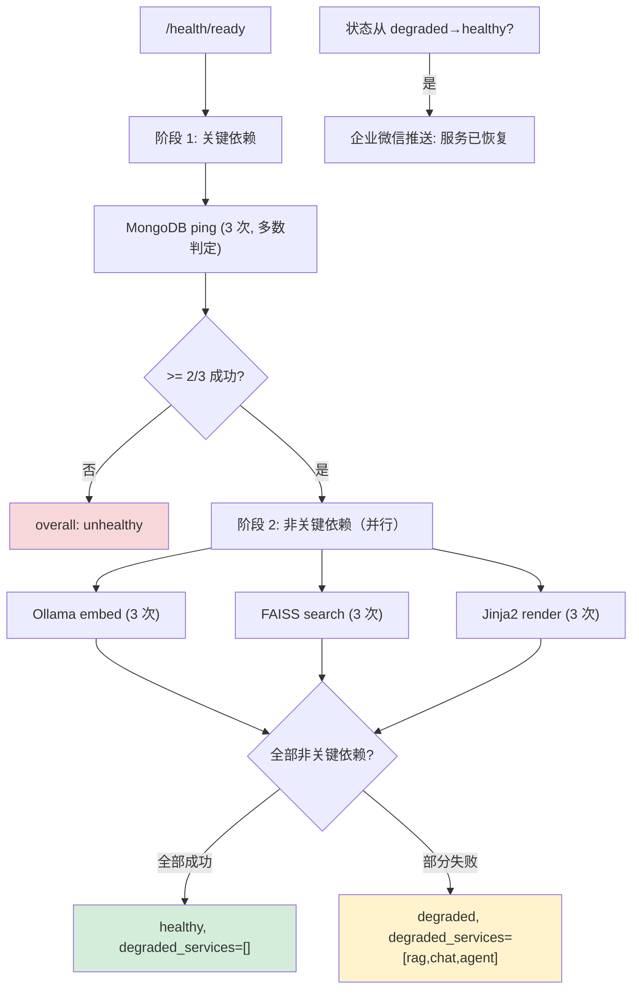

---

doc_type: module
prd_task_id: "YA-09-119"
title: "YA-09-119: 服务端依赖健康检查编排 — 级联依赖状态评估与部分降级策略自动化 — 开发任务"
status: 需求已编写
priority: P2
owner: 陈铭
roles: [engineer]
created: 2026-09-11
updated: 2026-09-11
project: YiAi
project_id: yiai
prd_month: "202609"
estimate_frontend: 0.5
source_prd: "127-需求-依赖健康检查编排.md"
source_okr: [yiai-001]

type: task
---

# YA-09-119: 服务端依赖健康检查编排 — 级联依赖状态评估与部分降级策略自动化 — 开发任务

> **文档职责**：本文档定义**怎么做、为什么这么做、实际做成什么样**（HOW），不含产品目标与测试用例。

> 来源 PRD：[127-需求-依赖健康检查编排.md](../../prds/2026-09/127-需求-依赖健康检查编排.md)
> 需求编号：YA-09-119 · 优先级：P2 · 人天：0.5d · 依赖：YA-09-16, YA-09-47

---

## 一、架构概述

当前 `/health/ready` 返回二进制的 ready/not_ready。Ollama 不可用时整个服务被标记 not_ready，但 CRUD 功能完全正常。本方案引入三级健康状态（healthy/degraded/unhealthy）+ 级联依赖拓扑，非关键依赖失败仅标记降级而不影响整体可用性。



**核心决策**：分级状态（healthy/degraded/unhealthy）、分组并行检查（关键串行→非关键并行）、多数判定（3次中2次成功）、MongoDB 关键/Ollama 非关键分类。

---

## 二、文件清单

```
YiAi/src/shared/
└── dependency_health.py               # 新增: DependencyHealthChecker + HealthStatus + DependencyConfig + HealthReport

YiAi/src/server/
└── routes.py                          # 修改: /health/ready 改用级联健康检查

YiAi/tests/shared/
└── test_dependency_health.py          # 新增: 单元测试
```

---

## 三、模块设计

**依赖配置（4 项依赖，含 criticality + affected_services）**：

| 依赖 | 关键程度 | 影响服务 | 检查方式 | 超时 |
|------|---------|----------|----------|------|
| MongoDB | CRITICAL | ALL | `db.command('ping')` | 3s |
| Ollama | NON_CRITICAL | rag_query, rag_chat, chat, agent | `ollama_client.list_models()` | 5s |
| FAISS | NON_CRITICAL | rag_query, rag_chat | `os.path.exists(index_path)` | 3s |
| Jinja2 | NON_CRITICAL | chat, agent | `env.from_string('{{test}}').render()` | 1s |

**核心类**：`DependencyHealthChecker`——`check_all()` 执行级联检查（阶段1: 关键依赖串行检查 → 阶段2: 非关键依赖 asyncio.gather 并行检查），`_check_with_retry()` 每项依赖重试 3 次多数判定（>=2/3 成功即 healthy）。检测 `_last_status == DEGRADED → HEALTHY` 转换时触发企业微信恢复通知。

---

## 四、数据流

```
/health/ready → DependencyHealthChecker.check_all()
  → 阶段1: _check_mongodb() × 3 (多数判定) → MongoDB UNHEALTHY → return UNHEALTHY
  → 阶段1: MongoDB HEALTHY → 阶段2: asyncio.gather(
      _check_ollama() × 3, _check_faiss() × 3, _check_jinja2() × 3)
  → 收集降级服务列表（从 DependencyConfig.affected_services）
  → 汇总 HealthReport(overall/degraded_services/dependencies/slowest_dependency)
  → HTTP 200 (healthy/degraded) 或 503 (unhealthy)
```

---

## 五、实施路线图

| 步骤 | 任务 | 涉及文件 | 验证 | 人天 |
|------|------|---------|------|------|
| 1 | 实现依赖配置 + 检查函数注册 | `dependency_health.py` | 各检查函数正确执行 | 0.10 |
| 2 | 实现重试逻辑 + 多数判定（3次中2次） | `dependency_health.py` | 模拟 3 次中 2 次成功 → healthy | 0.10 |
| 3 | 实现级联编排（关键串行 + 非关键并行） | `dependency_health.py` | 测试 unhealthy/degraded/healthy 三态 | 0.10 |
| 4 | 实现降级服务列表汇总 + 恢复通知 | `dependency_health.py` | Ollama 失败 → degraded_services 正确 | 0.05 |
| 5 | 修改 `/health/ready` 端点 | `routes.py` | curl 验证响应 JSON | 0.05 |
| 6 | 编写单元测试 | `test_dependency_health.py` | pytest 全部通过 | 0.10 |

**合计：0.5d**

---

## 六、代码审查检查清单

- [ ] 依赖拓扑排序执行（MongoDB → Ollama → FAISS 逐级）
- [ ] 单点依赖失败不影响其他检查继续
- [ ] 检查结果汇总含 slowest_dependency 标注
- [ ] CRITICAL 依赖失败 → unhealthy, NON_CRITICAL → degraded
- [ ] 重试 3 次 + 多数判定（>=2/3 成功 = healthy）
- [ ] 降级服务列表含受影响的 RPC 方法名
- [ ] 状态从 degraded→healthy 时推送恢复通知
- [ ] 每个检查函数含独立超时（asyncio.wait_for）

---

## 七、风险与缓解

| 风险 | 概率 | 影响 | 等级 | 缓解 | 应急 |
|------|------|------|------|------|------|
| 检查串行导致 ready 延迟 > 10s | 中 | 低 | 低 | 非关键依赖并行，K8s periodSeconds=10 | 增大 periodSeconds |
| 瞬态故障误判 | 中 | 中 | 中 | 多数判定 2/3 | 增大重试次数至 5 |
| 检查函数超时阻塞 | 低 | 中 | 低 | 每个检查独立 asyncio.wait_for | 增大超时或移除慢检查 |
| 新增依赖未注册检查函数 | 低 | 中 | 低 | 启动时校验所有依赖有对应 checker | 补充注册后重启 |