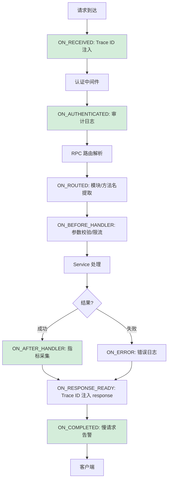

---

doc_type: module
prd_task_id: "YA-09-120"
title: "YA-09-120: 请求生命周期事件 — 钩子扩展点 — 开发方案"
status: 需求已编写
priority: P2
owner: 陈铭
roles: [engineer]
created: 2026-09-11
updated: 2026-09-14
project: YiAi
project_id: yiai
prd_month: "202609"
estimate_frontend: 0.5
source_prd: "128-需求-请求生命周期事件.md"
source_okr: [yiai-003]

type: task
---

# YA-09-120: 请求生命周期事件 — 钩子扩展点 — 开发方案

> **文档职责**：本文档定义**怎么做、为什么这么做、实际做成什么样**（HOW），不含产品目标与测试用例。

> 来源 PRD：[128-需求-请求生命周期事件.md](../../prds/2026-09/128-需求-请求生命周期事件.md)
> 需求编号：YA-09-120 · 优先级：P2 · 人天：0.5d

---

## 一、架构概述

YiAi 的审计日志、指标采集、Trace ID 注入等横切关注点硬编码在中间件中，耦合严重。本方案引入 8 个核心生命周期事件 + 观察者模式事件系统，将横切关注点解耦为独立的事件处理器。



**核心决策**：观察者模式（进程内同步回调，保证数据一致性）、8 个事件覆盖全生命周期、try/except 隔离（单个处理器失败不影响其他处理器和主请求）、混合模式（关键事件同步、非关键异步）。

---

## 二、文件清单

```
YiAi/src/shared/
└── request_lifecycle.py               # 新增: RequestLifecycle + RequestEvent + RequestContext + 内置处理器

YiAi/src/
├── app.py                             # 修改: 注册 lifecycle_middleware + register_builtin_handlers()
└── server/
    └── rpc_router.py                  # 修改: 设置 request.state.module_name / method_name

YiAi/tests/shared/
└── test_request_lifecycle.py          # 新增: 单元测试
```

---

## 三、模块设计

**8 个事件枚举**（`RequestEvent`）：`ON_RECEIVED → ON_AUTHENTICATED → ON_ROUTED → ON_BEFORE_HANDLER → ON_AFTER_HANDLER/ON_ERROR → ON_RESPONSE_READY → ON_COMPLETED`

**核心类** `RequestLifecycle`：类方法模式（全局单例），`on(event, handler)` 注册、`emit(event, request, response, context)` 触发——每个 handler 被 try/except 包裹保证故障隔离。`RequestContext` 在事件间传递 trace_id/user_id/module_name/metadata。

**内置处理器**（`register_builtin_handlers()`）：
- ON_RECEIVED: UUID 生成 Trace ID 注入 `request.state`
- ON_AUTHENTICATED: 审计日志（trace_id + user + method + path）
- ON_ROUTED: 提取 module_name/method_name 到 context
- ON_COMPLETED: 性能指标采集 + 慢请求告警（> 3s）
- ON_ERROR: 5xx 错误日志

**中间件集成**：`lifecycle_middleware` 在各阶段调用 `RequestLifecycle.emit()`，Token 通过 `ContextVar` 传递。

---

## 四、数据流

```
lifecycle_middleware:
  1. ctx = RequestContext(start_time=now)
  2. emit(ON_RECEIVED) → inject_trace_id, 设置 ctx.trace_id
  3. [认证中间件执行] → 设置 ctx.user_id
  4. emit(ON_AUTHENTICATED) → audit_log
  5. [RPC 路由] → 设置 ctx.module_name, ctx.method_name
  6. emit(ON_ROUTED) → extract_rpc_info
  7. emit(ON_BEFORE_HANDLER)
  8. call_next(request) → response
  9. emit(ON_AFTER_HANDLER) 或 emit(ON_ERROR) 如果异常
  10. 设置 response.headers['X-Trace-ID'] = ctx.trace_id
  11. emit(ON_RESPONSE_READY)
  12. emit(ON_COMPLETED) → record_metrics + slow_request_alert
  13. return response
```

---

## 五、实施路线图

| 步骤 | 任务 | 涉及文件 | 验证 | 人天 |
|------|------|---------|------|------|
| 1 | 实现 RequestEvent + RequestContext | `request_lifecycle.py` | 类型检查 | 0.05 |
| 2 | 实现 RequestLifecycle 事件注册/触发 + 错误隔离 | `request_lifecycle.py` | 单测：注册→触发→handler 执行 | 0.10 |
| 3 | 实现内置处理器（Trace ID/审计/指标/告警） | `request_lifecycle.py` | 集成测试：请求后日志含 trace_id | 0.10 |
| 4 | 实现 lifecycle_middleware 中间件 | `request_lifecycle.py` | 集成测试：请求触发全部 8 事件 | 0.10 |
| 5 | 集成到 app.py（注册中间件 + 内置处理器） | `app.py` | 启动后 curl 验证 | 0.05 |
| 6 | 编写单元测试 | `test_request_lifecycle.py` | pytest 全部通过 | 0.10 |

**合计：0.5d**

---

## 六、代码审查检查清单

- [ ] 8 个事件覆盖完整生命周期（RECEIVED→AUTHENTICATED→ROUTED→BEFORE_HANDLER→AFTER_HANDLER/ERROR→RESPONSE_READY→COMPLETED）
- [ ] 每个 handler 被 try/except 包裹——单个失败不影响请求处理
- [ ] RequestContext 在各事件间传递（ContextVar）
- [ ] 内置处理器覆盖 Trace ID、审计日志、性能指标、慢请求告警、错误日志
- [ ] 非关键事件（指标采集、慢请求告警）使用 async_mode=True fire-and-forget
- [ ] 关键事件（Trace ID、审计日志）同步执行保证一致性

---

## 七、风险与缓解

| 风险 | 概率 | 影响 | 等级 | 缓解 | 应急 |
|------|------|------|------|------|------|
| 事件处理器耗时过长阻塞请求 | 中 | 低 | 低 | 非关键处理器 async_mode，关键处理器限时 1ms | 移除慢处理器 |
| 处理器异常未被隔离导致 500 | 低 | 中 | 低 | 每个 handler try/except + 日志记录 | 内置保护 |
| 事件顺序依赖导致功能异常 | 低 | 中 | 低 | 文档化事件顺序 + 单元测试固定顺序 | 调整事件触发顺序 |