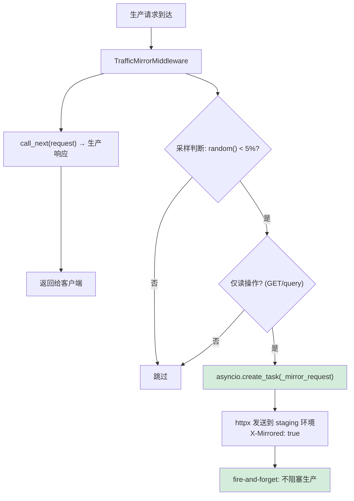

---

doc_type: module
prd_task_id: "YA-09-121"
title: "YA-09-121: 服务端请求重定向与流量镜像 — 生产流量复制到预发布环境的无损测试方案 — 开发任务"
status: 需求已编写
priority: P2
owner: 陈铭
roles: [engineer]
created: 2026-09-11
updated: 2026-09-11
project: YiAi
project_id: yiai
prd_month: "202609"
estimate_frontend: 0.5
source_prd: "129-需求-流量镜像预发布测试.md"
source_okr: [yiai-001]

type: task
---

# YA-09-121: 服务端流量镜像 — 生产流量复制到预发布环境 — 开发任务

> **文档职责**：本文档定义**怎么做、为什么这么做、实际做成什么样**（HOW），不含产品目标与测试用例。

> 来源 PRD：[129-需求-流量镜像预发布测试.md](../../prds/2026-09/129-需求-流量镜像预发布测试.md)
> 需求编号：YA-09-121 · 优先级：P2 · 人天：0.5d · 依赖：YA-09-87

---

## 一、架构概述

YA-09-87 实现了离线流量录制与回放，但存在非实时、数据不一致、无对比等缺陷。本方案通过 FastAPI 中间件实现实时流量镜像——将生产读请求异步复制到预发布环境，在不影响用户的前提下验证新版本。



**核心决策**：FastAPI 中间件（进程内实现）、仅镜像读操作（避免副作用）、5% 采样率（可配置）、fire-and-forget（不阻塞）、5s 超时、X-Mirrored header 标记。

---

## 二、文件清单

```
YiAi/src/server/middleware/
└── traffic_mirror.py                  # 新增: TrafficMirrorMiddleware + MirrorConfig

YiAi/src/
├── app.py                             # 修改: 注册 traffic_mirror 中间件
└── server/
    └── routes.py                      # 修改: 预发布环境识别 X-Mirrored header

YiAi/tests/server/middleware/
└── test_traffic_mirror.py             # 新增: 测试
```

---

## 三、模块设计

**`TrafficMirrorMiddleware`**：异步中间件类，`__call__(request, call_next)` 先处理生产请求再异步镜像。`_should_mirror()` 三重判断（enabled + 采样 + 读写），`_is_read_operation()` 通过 method + RPC method_name 白名单判断，`_mirror_request()` 使用 httpx.AsyncClient 发送到 staging_url（fire-and-forget，异常静默）。

**`MirrorConfig`**：`enabled`（环境变量 MIRROR_ENABLED）、`staging_url`（默认 http://staging:10086）、`sample_rate`（默认 0.05）、`mirror_timeout`（5s）、`mirror_read_only`（true）、`compare_responses`（false）。

**预发布环境处理**：检查 `X-Mirrored: true` header，设置 `request.state.is_mirrored = True`，跳过审计日志/通知/webhook 等副作用。

---

## 四、数据流

```
生产请求 → __call__(request, call_next)
  → 1. response = await call_next(request)  # 先处理生产
  → 2. _should_mirror(): enabled? + sample_rate? + is_read?
  → 3. asyncio.create_task(_mirror_request)
       → httpx.request(url=staging_url + path, headers=dict(orig_headers) + X-Mirrored
       → 成功: mirrored_count++, debug 日志
       → 失败: mirrored_errors++, debug 日志 (非关键)
  → 4. return response  # 不等待镜像
```

---

## 五、实施路线图

| 步骤 | 任务 | 涉及文件 | 验证 | 人天 |
|------|------|---------|------|------|
| 1 | 实现 TrafficMirrorMiddleware 核心逻辑 | `traffic_mirror.py` | 模拟请求触发镜像 | 0.15 |
| 2 | 实现读写判断 + 采样逻辑 | `traffic_mirror.py` | GET 触发/POST 不触发，1000 次 ~50 次 | 0.05 |
| 3 | 注册中间件 + 环境变量配置 | `app.py` | curl 验证 | 0.05 |
| 4 | 预发布环境 X-Mirrored 识别 | `routes.py` | 镜像请求跳过副作用 | 0.10 |
| 5 | 编写单元测试 | `test_traffic_mirror.py` | pytest 通过 | 0.15 |

**合计：0.5d**

---

## 六、代码审查检查清单

- [ ] fire-and-forget（`asyncio.create_task`）不阻塞生产主流程
- [ ] 可配置采样率 5%（环境变量 `MIRROR_SAMPLE_RATE`）
- [ ] 仅镜像读操作（GET + RPC query_documents/get_document/search/list_files）
- [ ] 镜像请求携带 `X-Mirrored: true` + `X-Mirrored-From: production`
- [ ] 预发布环境识别镜像请求并跳过副作用（审计/通知/webhook）
- [ ] 镜像失败静默处理（debug 日志，不影响生产）
- [ ] 镜像请求 5s 超时
- [ ] 移除敏感 header（Authorization/Cookie）后再镜像

---

## 七、风险与缓解

| 风险 | 概率 | 影响 | 等级 | 缓解 | 应急 |
|------|------|------|------|------|------|
| 镜像流量压垮预发布环境 | 中 | 中 | 中 | 5% 采样（100 QPS → 5 QPS），可调 | 关闭镜像（MIRROR_ENABLED=false） |
| 写操作误镜像产生副作用 | 低 | 高 | 中 | 读写白名单 + 预发布跳过副作用 | 预发布识别 X-Mirrored |
| mirror 协程累积未清理 | 低 | 低 | 低 | 5s 超时 + fire-and-forget 自动清理 | 监控活跃任务数 |
| 请求 body 被消费无法复制 | 低 | 低 | 低 | 中间件在 call_next 前先 request.body() | — |