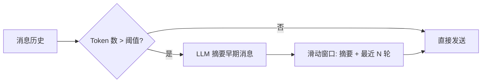

# YA-09-07: 上下文压缩服务 — 长对话自动摘要 + 滑动窗口 — 开发方案

> **文档职责**：本文档定义**怎么做、为什么这么做、实际做成什么样**（HOW），不含产品目标与测试用例。

> 来源 PRD：[13-需求-上下文压缩服务.md](../../prds/2026-09/13-需求-上下文压缩服务.md)
> 需求编号：YA-09-07 · 优先级：P1 · 人天：2.0d · 状态：已完成

---

## 一、问题

长对话超过模型上下文窗口时，Ollama 返回错误。当前无截断策略，用户需手动清理对话。

---

## 二、方案

### 策略

| 参数 | 默认值 | 说明 |
|------|--------|------|
| `max_tokens` | 4096 | 触发压缩的阈值 |
| `window_size` | 10 | 保留最近 N 轮完整消息 |
| `summary_model` | 同 chat model | 生成摘要的模型 |

---

## 三、实施步骤

| 步骤 | 验证 | 人天 |
|------|------|------|
| 1 | Token 计数（tiktoken） | 精确估算消息 token 数 | 0.5 |
| 2 | 摘要生成 + 滑动窗口 | 超窗口后早期消息变摘要 | 1.0 |
| 3 | 集成到 chat_service + 测试 | 长对话不报窗口溢出 | 0.5 |

**合计：2.0d**。

---

## 四、关联模块

- 依赖：[YA-07-04 AI 聊天服务](../2026-07/04-prd-task-AI聊天服务.md)
- 依赖：[YA-08-02 Multi-Provider LLM](../2026-08/02-prd-task-Multi-Provider-LLM.md)

---

## 已知缺口与技术债

### 功能缺口

| # | 缺口 | 影响 | 建议 |
|---|------|------|------|
| — | 无 | — | — |

### 技术债

| # | 技术债 | 优先级 | 预计人天 | 说明 | 状态 |
|---|--------|--------|---------|------|------|
| 1 | 摘要质量无评估 | P3 | 0.2 | 压缩后信息保留率未量化 | 待实施 |
| 2 | 滑动窗口大小硬编码 10 | P3 | 0.1 | 未配置化 | 待实施 |
