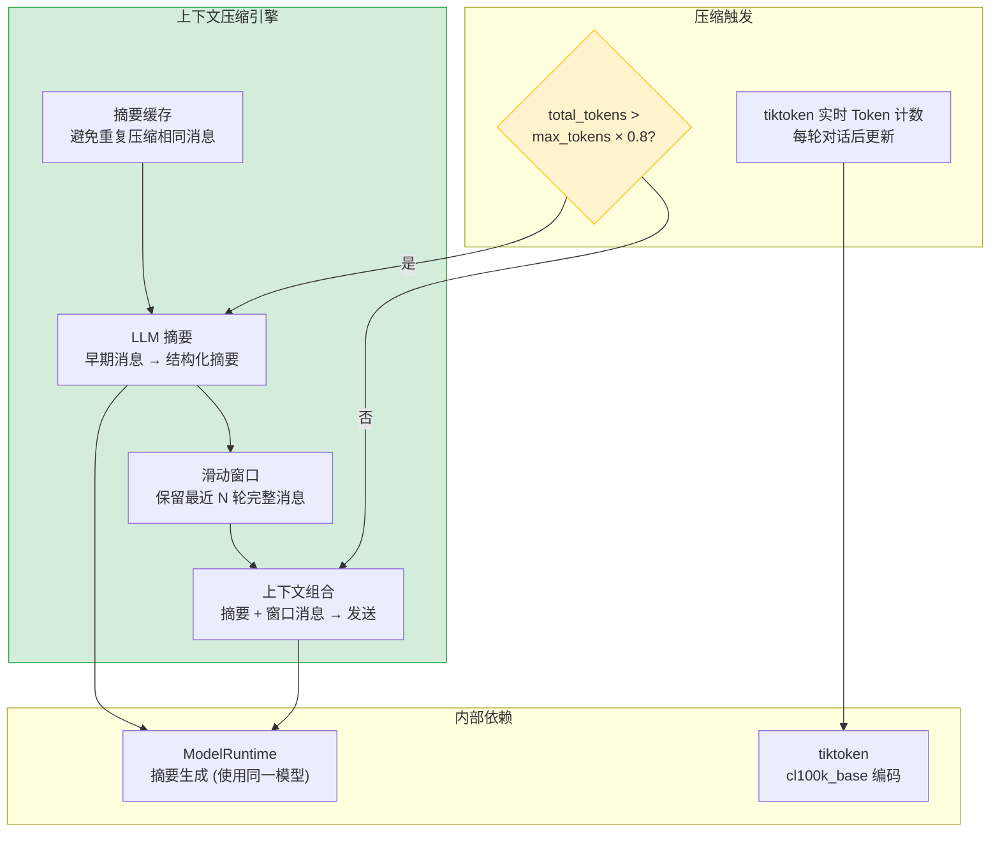

---

doc_type: module
prd_task_id: "YA-09-07"
title: "YA-09-07: 上下文压缩服务 — Token 估算 + LLM 摘要 + 滑动窗口 + 增量压缩 — 开发方案"
status: 已完成
priority: P1
owner: 陈铭
roles: [engineer]
created: 2026-09-11
updated: 2026-09-23
project: YiAi
project_id: yiai
prd_month: "202609"
estimate_frontend: 2.0
source_prd: "13-需求-上下文压缩服务.md"
source_okr: [yiai-003]
related_tests: ["13-prd-test-上下文压缩服务"]

type: task
---

# YA-09-07: 上下文压缩服务 — Token 估算 + LLM 摘要 + 滑动窗口 + 增量压缩 — 开发方案

> 来源 PRD：[13-需求-上下文压缩服务.md](../../prds/2026-09/13-需求-上下文压缩服务.md)
> 需求编号：YA-09-07 · 优先级：P1 · 人天：2.0d
> 类型：功能 · 状态：已完成

---

## 一、架构概述

长对话超过模型上下文窗口时，Ollama 返回错误（如 qwen3.5:4b 的 32K tokens 限制）。当前无截断策略，用户需手动清理对话。本服务在 token 数接近阈值时自动触发压缩：LLM 摘要早期消息 → 滑动窗口保留最近 N 轮 → 摘要 + 完整消息组合发送。压缩对用户透明，不丢失关键上下文。


```mermaid
graph TD
  subgraph Trigger["压缩触发"]
    COUNT["tiktoken 实时 Token 计数<br/>每轮对话后更新"]
    CHECK{"total_tokens ><br/>max_tokens × 0.8?"}
  end

  subgraph Compactor["上下文压缩引擎"]
    SUMMARIZE["LLM 摘要<br/>早期消息 → 结构化摘要"]
    SLIDE["滑动窗口<br/>保留最近 N 轮完整消息"]
    COMBINE["上下文组合<br/>摘要 + 窗口消息 → 发送"]
    CACHE["摘要缓存<br/>避免重复压缩相同消息"]
  end

  subgraph Internal["内部依赖"]
    LLM["ModelRuntime<br/>摘要生成 (使用同一模型)"]
    TOKENIZER["tiktoken<br/>cl100k_base 编码"]
  end

  CHECK -- 是 --> SUMMARIZE
  CHECK -- 否 --> COMBINE
  SUMMARIZE --> SLIDE
  SLIDE --> COMBINE
  COMBINE --> LLM
  COUNT --> TOKENIZER
  SUMMARIZE --> LLM
  CACHE --> SUMMARIZE

  style Compactor fill:#d4edda,stroke:#28a745
  style CHECK fill:#fff3cd,stroke:#ffc107
```

### 压缩策略参数

| 参数 | 默认值 | 说明 |
|------|--------|------|
| `max_tokens` | 4096 | 触发压缩的 token 阈值 |
| `compression_threshold` | 0.8 | 达到 max_tokens × 0.8 时开始压缩 |
| `window_size` | 10 | 保留最近 N 轮完整对话 |
| `summary_model` | 同 chat model | 生成摘要的模型 |
| `summary_max_tokens` | 500 | 摘要最大 token 数 |

---

## 二、文件清单

| # | 文件 | 操作 | 说明 | 预估行数 |
|---|------|------|------|----------|
| 1 | `services/ai/context_compactor.py` | 新增 | Token 计数 + LLM 摘要 + 滑动窗口 + 增量压缩 | ~180 |
| 2 | `domain/ai/token_counter.py` | 新增 | tiktoken 封装: 精确计数 + 估算 | ~50 |
| 3 | `services/ai/chat_service.py` | 修改 | 集成 `ContextCompactor` 到发送前管线 | +30 |
| 4 | `config.yaml` | 修改 | 新增 `chat.context_compression` 配置段 | +15 |

**改动汇总：** 2 新增 + 2 修改 = **4 文件，~275 行**

---

## 三、模块设计

### 3.1 Token 计数器 — `domain/ai/token_counter.py`

```python
import tiktoken
from typing import List, Dict, Optional

class TokenCounter:
    """tiktoken 精确 Token 计数——支持多模型编码器。

    编码器选择:
      Ollama 模型 (qwen3.5:4b): 使用 cl100k_base (最接近)
      OpenAI GPT-4: 使用 cl100k_base (o200k_base 备选)
      DeepSeek: 使用 cl100k_base (兼容 OpenAI API)
    """

    DEFAULT_ENCODING = "cl100k_base"
    FALLBACK_ESTIMATE_RATIO = 1.3  # 字符数 → 中文 token 估算 (1 字 ≈ 1.3 tokens)

    def __init__(self, encoding_name: str = DEFAULT_ENCODING):
        try:
            self._encoder = tiktoken.get_encoding(encoding_name)
        except Exception:
            self._encoder = tiktoken.get_encoding("cl100k_base")

    def count_tokens(self, text: str) -> int:
        """精确计数 (tiktoken)。"""
        try:
            return len(self._encoder.encode(text))
        except Exception:
            # fallback: 字符数 × 估算系数
            return int(len(text) * self.FALLBACK_ESTIMATE_RATIO)

    def count_messages(self, messages: List[Dict]) -> int:
        """计算消息列表的总 token 数。

        包含:
          - 每条消息的 role (约 4 tokens/message)
          - 每条消息的 content
          - 消息分隔符 (约 3 tokens/message)
        """
        total = 0
        for msg in messages:
            total += 4  # role token overhead
            content = msg.get("content", "")
            if isinstance(content, str):
                total += self.count_tokens(content)
            elif isinstance(content, list):
                for part in content:
                    if isinstance(part, dict) and "text" in part:
                        total += self.count_tokens(part["text"])
            total += 3  # message delimiter
        return total
```

### 3.2 上下文压缩器 — `services/ai/context_compactor.py`

```python
from dataclasses import dataclass, field
from typing import List, Dict, Optional, Tuple
import hashlib

@dataclass
class CompactionResult:
    """压缩结果——包含摘要文本 + 完整窗口消息。"""
    summary: str                          # 早期消息的结构化摘要
    window_messages: List[Dict]           # 保留的最近 N 轮完整消息
    compacted_count: int                  # 被压缩的消息数
    tokens_before: int                    # 压缩前 token 数
    tokens_after: int                     # 压缩后 token 数
    compression_ratio: float              # 压缩比 (1 - after/before)

class ContextCompactor:
    """上下文压缩引擎——LLM 摘要 + 滑动窗口 + 增量压缩。

    压缩策略:
      1. 实时 Token 计数 (tiktoken)
      2. 当 total > max_tokens × compression_threshold 时触发
      3. 将早期消息 (window 之外) 发送给 LLM 生成结构化摘要
      4. 摘要 + 窗口内完整消息 → 组合发送
      5. 摘要缓存: 基于消息 hash 避免重复压缩

    增量压缩:
      - 首次压缩: 摘要消息 1-K
      - 后续压缩: 扩展摘要 (旧摘要 + 新的早期消息 → LLM 更新摘要)
    """

    def __init__(
        self,
        token_counter: TokenCounter,
        llm_runtime,
        max_tokens: int = 4096,
        compression_threshold: float = 0.8,
        window_size: int = 10,
        summary_max_tokens: int = 500,
    ):
        self._counter = token_counter
        self._llm = llm_runtime
        self._max_tokens = max_tokens
        self._threshold = compression_threshold
        self._window_size = window_size
        self._summary_max_tokens = summary_max_tokens
        self._summary_cache: Dict[str, str] = {}  # hash → summary
        self._current_summary = ""

    def needs_compaction(self, messages: List[Dict]) -> bool:
        """判断是否需要压缩。"""
        total = self._counter.count_messages(messages)
        return total > self._max_tokens * self._threshold

    async def compact(self, messages: List[Dict]) -> CompactionResult:
        """执行上下文压缩——摘要早期消息 + 滑动窗口。

        流程:
          1. 计算消息总 token 数
          2. 分割: messages[:-window_size] → 压缩区, messages[-window_size:] → 窗口区
          3. 对压缩区生成/更新摘要 (检查缓存)
          4. 组合: [{"role": "system", "content": summary}] + 窗口消息
          5. 计算压缩指标
        """
        tokens_before = self._counter.count_messages(messages)

        if len(messages) <= self._window_size:
            # 消息不足窗口大小，无需压缩
            return CompactionResult(
                summary="", window_messages=messages, compacted_count=0,
                tokens_before=tokens_before, tokens_after=tokens_before, compression_ratio=0,
            )

        # 分割
        compact_zone = messages[:-self._window_size]
        window_zone = messages[-self._window_size:]

        # 生成/更新摘要
        summary = await self._generate_summary(compact_zone)

        # 组合: system 摘要 + 窗口消息
        compacted = [{"role": "system", "content": summary}] + window_zone
        tokens_after = self._counter.count_messages(compacted)

        return CompactionResult(
            summary=summary,
            window_messages=window_zone,
            compacted_count=len(compact_zone),
            tokens_before=tokens_before,
            tokens_after=tokens_after,
            compression_ratio=round(1 - tokens_after / max(tokens_before, 1), 3),
        )

    async def _generate_summary(self, messages: List[Dict]) -> str:
        """LLM 生成/更新结构化摘要——增量模式。

        增量逻辑:
          - 如果已有 `_current_summary` (之前压缩过): 提示 LLM 将新消息合并到现有摘要
          - 如果没有: 从头生成

        摘要结构:
          ## 对话概述
          <1-2 句总结对话主题和目标>

          ## 关键信息
          - 事实 1
          - 事实 2
          - 用户偏好/约束

          ## 待解决问题
          - 问题 1
        """
        msg_hash = hashlib.md5(
            "".join(str(m) for m in messages).encode()
        ).hexdigest()

        # 缓存检查
        if msg_hash in self._summary_cache:
            return self._summary_cache[msg_hash]

        # 构建 prompt
        context = "\n".join(
            f"[{m['role']}]: {str(m.get('content',''))[:500]}"
            for m in messages[-20:]  # 最多取 20 条消息用于摘要
        )

        prompt = (
            "你是一个对话摘要引擎。请将以下对话压缩为结构化摘要（不超过 500 tokens）。\n\n"
            "结构要求:\n"
            "## 对话概述\n1-2 句总结\n\n"
            "## 关键信息\n- 事实和上下文\n\n"
            "## 用户意图\n- 用户的核心需求\n\n"
            "## 待解决问题\n- 尚未解决的问题\n\n"
            f"对话:\n{context}\n\n"
            f"{'已有摘要 (请合并新信息): ' + self._current_summary if self._current_summary else ''}"
        )

        summary = await self._llm.complete(
            [{"role": "user", "content": prompt}],
            max_tokens=self._summary_max_tokens,
        )

        self._current_summary = summary.get("message", "")
        self._summary_cache[msg_hash] = self._current_summary
        return self._current_summary

    def clear_cache(self):
        """清除摘要缓存 (切换对话时调用)。"""
        self._summary_cache.clear()
        self._current_summary = ""
```

### 3.3 集成到 chat_service

```python
# services/ai/chat_service.py (修改)

class ChatService:
    def __init__(self, ...):
        self._compactor = ContextCompactor(
            token_counter=TokenCounter(),
            llm_runtime=get_runtime("ollama"),
            max_tokens=config.chat.context_max_tokens,       # 4096
            window_size=config.chat.context_window_size,     # 10
        )

    async def chat_stream(self, session_key: str, query: str, model: str):
        # 加载会话消息
        messages = await self._load_session_messages(session_key)
        messages.append({"role": "user", "content": query})

        # 压缩检查——对用户透明
        if self._compactor.needs_compaction(messages):
            result = await self._compactor.compact(messages)
            logger.info(
                f"[Chat] context compacted: {result.tokens_before} → "
                f"{result.tokens_after} tokens (ratio: {result.compression_ratio})"
            )
            messages = [{"role": "system", "content": result.summary}] + result.window_messages

        # 正常流程: 流式推理
        async for token in self._llm.stream_chat(messages, model=model):
            yield token
```

---

## 四、数据流

### 4.1 压缩触发流程

```
用户发送第 25 轮消息
  │
  ▼
ChatService.chat_stream()
  │
  ├── 加载历史消息: 24 轮 = 48 条消息
  ├── TokenCounter.count_messages(50 条) → 5200 tokens
  │
  ├── needs_compaction(5200 > 4096 × 0.8 = 3277)
  │     └── 是 → 触发压缩
  │
  ├── compact(messages)
  │     ├── 分割: 前 40 条 → compact_zone, 后 10 条 → window_zone
  │     ├── _generate_summary(compact_zone)
  │     │     └── LLM: "用户正在讨论 RAG 引擎优化..." (500 tokens)
  │     ├── 组合: [system: summary] + window_zone
  │     └── Token 计数: 5200 → 1800 (压缩比 65%)
  │
  └── LLM 推理: 使用压缩后的上下文 → 流式输出
```

### 4.2 增量压缩序列

```
第 1 次压缩: 对话 1-40 条 → 摘要 "用户讨论 RAG 优化"
第 2 次压缩: 对话 1-60 条 → LLM: "已有摘要: 用户讨论 RAG 优化。新消息涉及..."
                 → 更新摘要: "用户讨论 RAG 优化 + 性能基准测试"
第 3 次压缩: 对话 1-80 条 → 同上增量
```

---

## 五、实施路线图

| 步骤 | 内容 | 涉及文件 | 验证方式 | 人天 |
|------|------|---------|---------|------|
| 1 | tiktoken 封装 `TokenCounter` | `domain/ai/token_counter.py` | 精确计数 ±5% 误差 | 0.25 |
| 2 | LLM 摘要 + 滑动窗口 (首次压缩) | `services/ai/context_compactor.py` | 超窗口后早期消息变摘要 | 0.75 |
| 3 | 增量压缩 (扩展已有摘要) | `services/ai/context_compactor.py` | 多次压缩后摘要逐步更新 | 0.25 |
| 4 | 摘要缓存 (hash 去重) | `services/ai/context_compactor.py` | 相同消息不重复调用 LLM | 0.25 |
| 5 | 集成到 chat_service | `services/ai/chat_service.py` | 长对话不报 token 溢出错误 | 0.5 |
| **合计** | | | | **2.0d** |

---

## 六、代码审查检查清单

- [ ] tiktoken `cl100k_base` 编码器正确加载
- [ ] Token 计数包含 role overhead (4 tokens) + delimiter (3 tokens)
- [ ] 压缩阈值: `max_tokens × 0.8` (而非 100%, 留 20% 余量)
- [ ] 滑动窗口 `window_size=10` 保留最近 10 轮完整消息
- [ ] 摘要基于消息 hash 缓存 (`hashlib.md5`)
- [ ] 增量压缩: `_current_summary` 作为 LLM 输入上下文
- [ ] 切换对话时 `clear_cache()` 重置摘要缓存
- [ ] 摘要 max_tokens=500 (控制摘要长度)
- [ ] Ruff + mypy 通过

---

## 七、技术风险评估

| 风险 | 概率 | 影响 | 等级 | 缓解措施 | 应急预案 |
|------|------|------|------|---------|---------|
| tiktoken 编码不匹配 Ollama 模型 (qwen 使用不同 tokenizer) | 中 | 中 | 中 | 使用 `cl100k_base` 作为通用估算器，配合字符数 fallback | 增加 `×1.5` 安全系数过估计 |
| LLM 摘要质量差导致信息丢失 | 中 | 高 | 中 | 摘要结构化模板 (概述/关键信息/意图/待解决问题) | 保留 key=messages 缓存中的原始消息供回退 |
| 增量摘要漂移 (旧摘要错误累积) | 低 | 中 | 低 | 每 N 次增量后全量重新摘要 | 限制增量次数 (最多 3 次增量后重置) |
| 摘要 LLM 调用增加延迟 (1-3s) | 低 | 低 | 低 | 摘要仅在首次超阈值时触发，后续使用缓存 | — |

---

## 八、已知缺口与技术债务

| # | 技术债 | 优先级 | 预计人天 | 说明 | 状态 |
|---|--------|--------|---------|------|------|
| 1 | 摘要质量无评估指标 (信息保留率未量化) | P3 | 0.3 | 人工抽样验证 | 待实施 |
| 2 | 滑动窗口大小 (`window_size=10`) 硬编码 | P3 | 0.1 | 可通过 `config.yaml` 覆盖 | 待实施 |
| 3 | 摘要缓存无 TTL / 内存上限 | P3 | 0.2 | 长运行后可能累积大量缓存 | 待实施 |
| 4 | 未区分不同角色的消息在摘要中的权重 | P3 | 0.3 | system/user 消息可能同等权重 | 待讨论 |

---

## 九、关联模块

- 上游：[YA-07-04 AI 聊天服务](../2026-07/04-prd-task-AI聊天服务.md)
- 上游：[YA-08-02 Multi-Provider LLM](../2026-08/02-prd-task-Multi-Provider-LLM.md)
- 并行：[YA-09-17 SSE 流式背压控制](./17-prd-task-SSE流式背压控制与缓冲策略.md)（压缩后消息仍通过 SSE 流式输出）
- 数据源：MongoDB `sessions` (对话消息持久化)