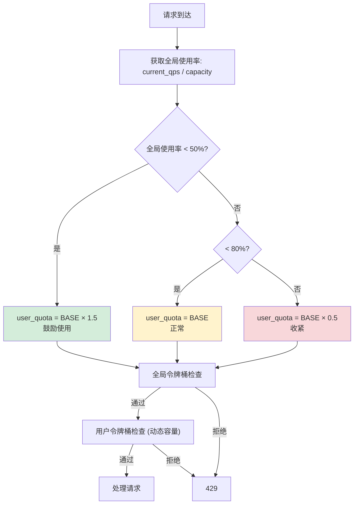

---

doc_type: module
prd_task_id: "YA-09-122"
title: "YA-09-122: 服务端请求限流全局限流与用户限流的协同 — 双重令牌桶的嵌套配额分配模型 — 开发任务"
status: 需求已编写
priority: P2
owner: 陈铭
roles: [engineer]
created: 2026-09-11
updated: 2026-09-11
project: YiAi
project_id: yiai
prd_month: "202609"
estimate_frontend: 0.5
source_prd: "130-需求-双重令牌桶嵌套配额.md"
source_okr: [yiai-002]

type: task
---

# YA-09-122: 服务端双重令牌桶嵌套配额 — 全局限流与用户限流协同 — 开发任务

> **文档职责**：本文档定义**怎么做、为什么这么做、实际做成什么样**（HOW），不含产品目标与测试用例。

> 来源 PRD：[130-需求-双重令牌桶嵌套配额.md](../../prds/2026-09/130-需求-双重令牌桶嵌套配额.md)
> 需求编号：YA-09-122 · 优先级：P2 · 人天：0.5d · 依赖：YA-09-12, YA-09-69

---

## 一、架构概述

YA-09-12 的三级限流中，全局令牌桶和用户令牌桶独立运作——全局空闲时用户仍受限于固定配额（资源浪费），全局紧张时用户全速请求（加速过载）。本方案引入嵌套配额模型：**用户配额 = f(全局使用率)**，全局低负载时放大配额鼓励使用，高负载时收紧配额保护全局。



**核心决策**：嵌套配额（用户配额 = f(全局使用率)）、阶梯函数 3 级（<50% / 50-80% / >80%）、二级用户优先级（VIP 20 req/s 基准 / NORMAL 10 req/s 基准）、最低保障 2 req/s。

---

## 二、文件清单

```
YiAi/src/shared/
└── nested_rate_limiter.py             # 新增: NestedRateLimiter + NestedQuotaConfig + UserTier

YiAi/src/server/middleware/
└── rate_limit_middleware.py           # 修改: 集成嵌套限流

YiAi/tests/shared/
└── test_nested_rate_limiter.py        # 新增: 单元测试
```

---

## 三、模块设计

**`NestedRateLimiter`**：双层令牌桶，全局桶（capacity=100）和按用户动态容量桶。`get_global_usage_ratio()` 计算 `1 - tokens/capacity`，`get_user_quota(user_id, tier)` 阶梯计算配额，`try_acquire(user_id, tier)` 双层检查（先全局后用户）。

**配额调整表**：

| 全局使用率 | VIP 配额 | 普通配额 | 系数 |
|-----------|---------|---------|------|
| < 50% | 30 req/s | 15 req/s | ×1.5 |
| 50-80% | 20 req/s | 10 req/s | ×1.0 |
| > 80% | 10 req/s | 5 req/s | ×0.5 |
| 极高(> 95%) | 2 req/s | 2 req/s | min保障 |

**用户桶管理**：`_user_buckets[user_id] = {tokens, last_refill, max_tokens}`，配额变化时 `max_tokens` 动态更新。定期清理不活跃用户桶（> 10min 无请求）。

---

## 四、数据流

```
请求 → nested_rate_limit_middleware
  → user_id from X-User-ID header, tier from X-Internal header
  → nested_limiter.try_acquire(user_id, tier)
    1. _try_acquire_global(): _refill_global() → tokens-- → True/False
    2. get_user_quota(tier): global_usage_ratio → 阶梯 → quota
    3. _try_acquire_user(user_id, quota): _refill_user_bucket(quota) → tokens-- → True/False
  → False: 429 {code: 4003, message, data: {retry_after, global_usage, user_quota}}
  → True: call_next(request)
```

---

## 五、实施路线图

| 步骤 | 任务 | 涉及文件 | 验证 | 人天 |
|------|------|---------|------|------|
| 1 | 实现全局令牌桶 + 使用率计算 | `nested_rate_limiter.py` | 单测：令牌消耗/补充 | 0.10 |
| 2 | 实现嵌套配额阶梯函数 | `nested_rate_limiter.py` | 单测：各负载下配额正确 | 0.10 |
| 3 | 实现用户令牌桶 + 动态容量更新 | `nested_rate_limiter.py` | 单测：配额变化时桶容量更新 | 0.10 |
| 4 | 集成到限流中间件 | `rate_limit_middleware.py` | 集成测试：负载变化时配额调整 | 0.10 |
| 5 | 编写单元测试 | `test_nested_rate_limiter.py` | pytest 通过 | 0.10 |

**合计：0.5d**

---

## 六、代码审查检查清单

- [ ] 全局使用率 < 50% 配额放大 1.5x，50-80% 保持基准，> 80% 收紧 0.5x
- [ ] VIP 用户基准配额 20 req/s（普通 10 req/s）
- [ ] 最低保障配额 2 req/s 防止饥饿
- [ ] 全局令牌桶作为硬限制（全局耗尽直接拒）
- [ ] 用户桶容量随配额变化动态更新
- [ ] 不活跃用户桶定期清理（> 10min）
- [ ] 429 响应包含 `retry_after` + `global_usage` + `user_quota`

---

## 七、风险与缓解

| 风险 | 概率 | 影响 | 等级 | 缓解 | 应急 |
|------|------|------|------|------|------|
| 配额震荡（阈值附近波动） | 中 | 中 | 中 | hysterisis 区间（48-52% 不切换） | 增大 hysterisis |
| 用户桶内存泄漏 | 低 | 低 | 低 | 10min TTL 定期清理 | 限制桶数量上限 |
| VIP 用户误判为普通 | 低 | 中 | 低 | X-Internal header 校验 | 审计限流日志 |