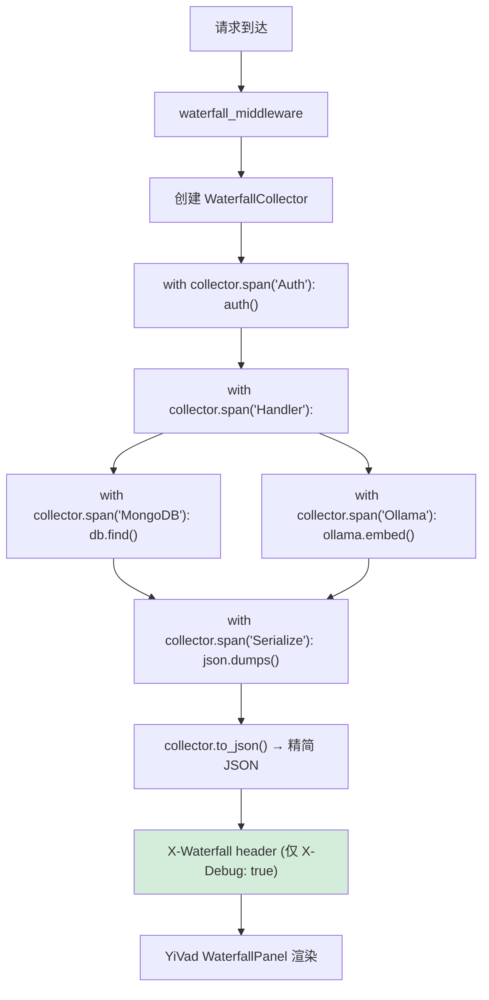

---

doc_type: module
prd_task_id: "YA-09-123"
title: "YA-09-123: 服务端请求响应时间线可视化 — 瀑布图展示请求的中间件/服务/Domain各阶段耗时分解 — 开发任务"
status: 需求已编写
priority: P2
owner: 陈铭
roles: [engineer]
created: 2026-09-11
updated: 2026-09-11
project: YiAi
project_id: yiai
prd_month: "202609"
estimate_frontend: 0.5
source_prd: "131-需求-响应时间线瀑布图.md"
source_okr: [yiai-001]

type: task
---

# YA-09-123: 服务端请求响应时间线可视化 — 瀑布图展示各阶段耗时分解 — 开发任务

> **文档职责**：本文档定义**怎么做、为什么这么做、实际做成什么样**（HOW），不含产品目标与测试用例。

> 来源 PRD：[131-需求-响应时间线瀑布图.md](../../prds/2026-09/131-需求-响应时间线瀑布图.md)
> 需求编号：YA-09-123 · 优先级：P2 · 人天：0.5d · 依赖：YA-09-29

---

## 一、架构概述

YA-09-29 的分布式链路 Span 数据以 JSON 日志存在，开发者需手动 grep/解析才能定位瓶颈。本方案通过 with 语句 Span 收集器 + X-Waterfall response header 实现浏览器原生可解析的瀑布图数据，开发者在 YiVad 调试面板中即可看到请求各阶段的耗时分解。



**精简字段名**（减小 header 体积）：n=name, s=start_ms, d=duration_ms, c=children, m=metadata。5 Span ~200B, 20 Span ~800B, 50 Span ~2KB。

---

## 二、文件清单

```
YiAi/src/shared/
└── waterfall.py                       # 新增: WaterfallCollector + WaterfallSpan + ContextVar

YiAi/src/
├── app.py                             # 修改: 注册 waterfall_middleware
└── server/
    └── rpc_router.py                  # 修改: Service 层嵌入 with collector.span()

YiVad/src/components/debug/
└── WaterfallPanel.vue                 # 新增: 前端瀑布图渲染组件

YiAi/tests/shared/
└── test_waterfall.py                  # 新增: 单元测试
```

---

## 三、模块设计

**`WaterfallSpan`**：`name/start_ms/duration_ms/children[]/metadata{}`，递归嵌套树结构。

**`WaterfallCollector`**：栈式 Span 收集器，`span(name, **metadata)` 返回上下文管理器。`_stack` 追踪父 Span 栈，`__enter__` 创建新 Span 挂到栈顶 children，`__exit__` 计算 duration 并 pop。`to_json()` 递归序列化为 `{n,s,d,c,m}` 精简格式，MAX_SPANS=50, MAX_JSON_SIZE=4KB。

**中间件**：`waterfall_middleware` 创建 collector → 绑定 ContextVar → with collector.span() 包裹各阶段 → 仅 X-Debug:true 时设置 X-Waterfall header。

**前端组件**：YiVad `WaterfallPanel.vue` 解析 JSON → 递归渲染嵌套水平条（层叠偏移 display + duration 宽度），悬停显示 metadata。

---

## 四、数据流

```
请求 → waterfall_middleware:
  collector = WaterfallCollector(), ContextVar.set(collector)
  with collector.span('Auth'):         # 计时 Auth
  with collector.span('Handler'):      # 计时总处理
    [rpc_router 中] with get_waterfall().span('MongoDB', cname='projects'): db.find()
    [rpc_router 中] with get_waterfall().span('Ollama', model='qwen2.5'): ollama.embed()
  with collector.span('Serialize'):    # 计时序列化
  if X-Debug:true: response.headers['X-Waterfall'] = collector.to_json()
  ContextVar.reset()
```

---

## 五、实施路线图

| 步骤 | 任务 | 涉及文件 | 验证 | 人天 |
|------|------|---------|------|------|
| 1 | 实现 WaterfallSpan + WaterfallCollector | `waterfall.py` | 单测：嵌套 Span 计时准确 | 0.10 |
| 2 | 实现 waterfall_middleware + X-Debug 门控 | `waterfall.py` | 集成测试：X-Waterfall header | 0.10 |
| 3 | 在 Service/Domain 层嵌入 Span | `rpc_router.py` | curl 验证含 MongoDB/Ollama Span | 0.10 |
| 4 | 实现前端 WaterfallPanel 组件 | `WaterfallPanel.vue` | 前端渲染嵌套瀑布图 | 0.15 |
| 5 | 编写单元测试 | `test_waterfall.py` | pytest 通过 | 0.05 |

**合计：0.5d**

---

## 六、代码审查检查清单

- [ ] with 语句自动计时——异常安全（finally 中计算 duration + pop）
- [ ] 精简字段名 n/s/d/c/m 控制 header 体积（< 4KB）
- [ ] 最多 50 个 Span——超出跳过不抛异常
- [ ] 仅 X-Debug: true 模式输出——生产零开销
- [ ] ContextVar 保证请求间 Span 隔离
- [ ] 前端递归渲染嵌套树，支持悬停显示 metadata
- [ ] 并发 Span（同级兄弟 children）正确展示重叠时间段

---

## 七、风险与缓解

| 风险 | 概率 | 影响 | 等级 | 缓解 | 应急 |
|------|------|------|------|------|------|
| Waterfall header 被 Nginx 截断 | 低 | 低 | 低 | JSON < 4KB（Nginx 默认 8KB header limit） | 减小 MAX_SPANS |
| Span 嵌套过深导致栈溢出 | 低 | 低 | 低 | 限制最大深度 10 层 | 截断显示 |
| with 块中异常导致 duration 不准确 | 低 | 低 | 低 | finally 中计算时间（start 在 enter 记录） | — |