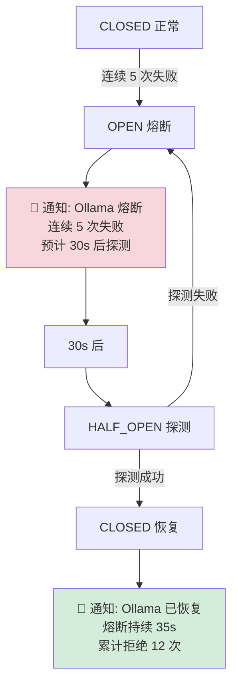

---

doc_type: module
prd_task_id: "YA-09-59"
title: "YA-09-59: 断路器恢复通知 — 状态变更 + 企微推送 — 开发方案"
status: 需求已编写
priority: P2
owner: 陈铭
roles: [engineer]
created: 2026-09-11
updated: 2026-09-14
project: YiAi
project_id: yiai
prd_month: "202609"
estimate_frontend: 0.5
source_prd: "132-需求-断路器恢复通知.md"
source_okr: [yiai-001]

type: task
---

# YA-09-59: 断路器恢复通知 — 状态变更 + 企微推送 — 开发方案

> **文档职责**：本文档定义**怎么做、为什么这么做、实际做成什么样**（HOW），不含产品目标与测试用例。

> 来源 PRD：[132-需求-断路器恢复通知.md](../../prds/2026-09/132-需求-断路器恢复通知.md)
> 需求编号：YA-09-59 · 优先级：P2 · 人天：0.5d · 依赖：YA-09-89

---

## 一、架构概述

YA-09-89 实现了断路器模式（CLOSED/OPEN/HALF_OPEN 三态自动转换），但状态转换无通知——运维不知道何时熔断、何时恢复。本方案在断路器状态转换时通过企业微信推送通知，记录熔断历史用于趋势分析。



**核心决策**：企业微信 Markdown 通知（复用现有 webhook）、OPEN 和 CLOSED 始终通知（关键事件）、HALF_OPEN 不单独通知（过渡状态）、5 分钟冷却期（防告警风暴）、熔断历史内存记录（可查询）。

---

## 二、文件清单

```
YiAi/src/shared/
├── circuit_breaker_notifier.py        # 新增: CircuitBreakerNotifier + CBStateChange + CBHistory
└── circuit_breaker.py                 # 修改: _transition_to() 调用 cb_notifier.on_state_change()

YiAi/tests/shared/
└── test_circuit_breaker_notifier.py   # 新增: 单元测试
```

---

## 三、模块设计

**`CircuitBreakerNotifier`**：`on_state_change(dependency, old_state, new_state, failure_count, rejected_count, open_duration_ms)` — 记录历史、判断是否通知（OPEN/CLOSED 始终通知）、格式化企业微信 Markdown 消息（含依赖名/状态/持续时长/拒绝次数/建议）、`_send_notification()` 通过 httpx POST webhook URL（5s 超时、异常静默）。

**`CBHistory`**：追踪每个依赖的 `total_trips`（累计熔断次数）、`total_open_duration_ms`（累计熔断时长）、`last_trip_time`、`state_changes` 列表。`get_history(dependency)` 可查询。

**熔断通知内容**：
- OPEN 通知：`## 断路器熔断告警\n> 依赖: ollama\n> 连续失败: 5 次\n> 熔断时间: 14:32:05\n请检查 ollama 服务状态`
- CLOSED 通知：`## 断路器恢复通知\n> 依赖: ollama\n> 熔断持续: 35.2s\n> 累计拒绝: 12 次请求\n服务已恢复正常`

---

## 四、数据流

```
CircuitBreaker._transition_to(new_state):
  1. old_state = self.state, self.state = new_state
  2. 记录 open_duration_ms (OPEN → CLOSED 时) 或 open_start_time (→ OPEN 时)
  3. cb_notifier.on_state_change(dependency, old_state, new_state, ...)
     → 记录 CBHistory
     → 判断通知: new_state == OPEN || (old_state == OPEN && new_state == CLOSED)
     → 构建 markdown 消息
     → _send_notification() → httpx POST wework webhook
     → 更新 _last_notification 时间戳
```

---

## 五、实施路线图

| 步骤 | 任务 | 涉及文件 | 验证 | 人天 |
|------|------|---------|------|------|
| 1 | 实现 CircuitBreakerNotifier 通知+历史 | `circuit_breaker_notifier.py` | 单测：状态转换触发通知 | 0.10 |
| 2 | 实现企业微信 Markdown 格式化 | `circuit_breaker_notifier.py` | 手动测试消息格式 | 0.10 |
| 3 | 实现 CBHistory 熔断历史记录 | `circuit_breaker_notifier.py` | 单测：历史累积正确 | 0.10 |
| 4 | 集成到 CircuitBreaker._transition_to() | `circuit_breaker.py` | 集成测试：触发熔断后收通知 | 0.10 |
| 5 | 编写单元测试 | `test_circuit_breaker_notifier.py` | pytest 通过 | 0.10 |

**合计：0.5d**

---

## 六、代码审查检查清单

- [ ] OPEN/CLOSED 状态转换始终发送通知，HALF_OPEN 不单独通知
- [ ] 通知包含依赖名、状态、持续时长、失败/拒绝次数、操作建议
- [ ] 企业微信 Markdown 格式化（含颜色标记：warning=熔断, info=恢复）
- [ ] 通知发送异步（asyncio.create_task）——不阻塞断路器状态转换
- [ ] webhook URL 未配置时优雅降级（仅日志记录）
- [ ] 熔断历史可查询（get_history / get_all_histories）
- [ ] 5 分钟冷却期防止告警风暴

---

## 七、风险与缓解

| 风险 | 概率 | 影响 | 等级 | 缓解 | 应急 |
|------|------|------|------|------|------|
| 企业微信 webhook 不可用 | 低 | 低 | 低 | 通知失败仅日志记录 | 切换备用渠道 |
| 频繁熔断/恢复导致告警风暴 | 中 | 中 | 中 | OPEN/CLOSED 始终通知但冷却期内不重复 | 增大冷却期 |
| 历史记录内存增长 | 低 | 低 | 低 | 限制 state_changes 最多 1000 条 | 定期清理旧记录 |
| 通知发送阻塞断路器状态转换 | 低 | 中 | 低 | asyncio.create_task fire-and-forget | 无（已异步） |