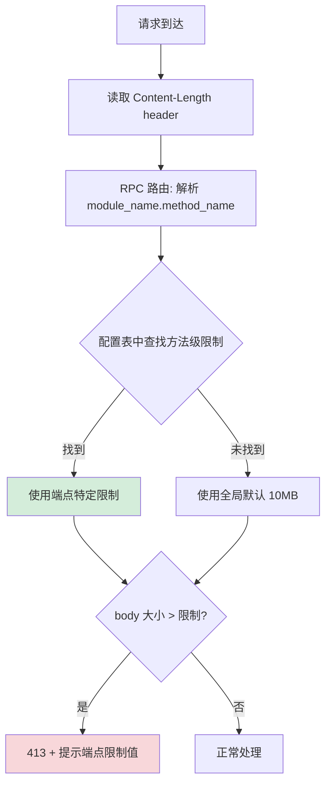

---

doc_type: module
prd_task_id: "YA-09-88"
title: "YA-09-88: 按端点差异化请求体限制 — 细粒度 BodySize — 开发方案"
status: 需求已编写
priority: P2
owner: 陈铭
roles: [engineer]
created: 2026-09-11
updated: 2026-09-14
project: YiAi
project_id: yiai
prd_month: "202609"
estimate_frontend: 0.5
source_prd: "133-需求-请求大小按端点差异化.md"
source_okr: [yiai-001]

type: task
---

# YA-09-88: 按端点差异化请求体限制 — 细粒度 BodySize — 开发方案

> **文档职责**：本文档定义**怎么做、为什么这么做、实际做成什么样**（HOW），不含产品目标与测试用例。

> 来源 PRD：[133-需求-请求大小按端点差异化.md](../../prds/2026-09/133-需求-请求大小按端点差异化.md)
> 需求编号：YA-09-88 · 优先级：P2 · 人天：0.5d · 依赖：YA-09-46

---

## 一、架构概述

YA-09-46 设置了全局 10MB 请求体限制，但"一刀切"存在严重问题——Agent prompt 端点（Chat/Agent 应限 50-100KB）被放宽到 10MB，而文件上传端点（应限 100MB）被截断在 10MB。本方案为每个 RPC 方法设置独立的大小限制，使用 Content-Length header 快速路径（不消费 body）。



**核心决策**：方法级粒度（RPC 方法名匹配）、Content-Length 快速路径（不消费 body）、默认 10MB 兜底（新端点自动继承）、环境变量覆盖（LIMIT_<METHOD>）。

**端点限制配置（节选）**：

| 端点 | 限制 | 说明 |
|------|------|------|
| `chat_service.chat` / `agent_service.run_agent` | 50-100KB | 防 Token 超限 |
| `data_service.query_documents` | 10KB | Dashboard 查询 |
| `data_service.create_document` | 5MB | 批量导入 |
| `knowledge.write_file` | 100MB | 大文件上传 |

---

## 二、文件清单

```
YiAi/src/server/middleware/
└── per_endpoint_limit.py              # 新增: PerEndpointBodySizeMiddleware + PER_ENDPOINT_LIMITS 字典

YiAi/src/
├── app.py                             # 修改: 注册中间件
└── server/
    └── rpc_router.py                  # 修改: 设置 request.state.rpc_method

YiAi/tests/server/middleware/
└── test_per_endpoint_limit.py         # 新增: 测试
```

---

## 三、模块设计

**`PER_ENDPOINT_LIMITS` 字典**：`{RPC_METHOD: bytes}`，覆盖 Chat/Agent/RAG/Data/Knowledge/Dashboard/Auth 共 20+ 端点。通过 `_apply_env_overrides()` 运行时覆盖（环境变量 `LIMIT_<UPPER_METHOD>`）。

**中间件 `per_endpoint_limit_middleware`**：读取 `Content-Length` header（不消费 body）→ 从 `request.state.rpc_method` 获取方法名 → 字典查找限制值 → 比较并返回 413 或放行。413 响应包含 `endpoint/limit_bytes/received_bytes`。

**RPC 路由集成**：`rpc_router` 解析 body 后设置 `request.state.rpc_method = f'{module_name}.{method_name}'`。

---

## 四、数据流

```
请求 → per_endpoint_limit_middleware:
  content_length = headers['Content-Length']
  method = request.state.rpc_method (由 rpc_router 预设置)
  limit = PER_ENDPOINT_LIMITS.get(method, PER_ENDPOINT_LIMITS['default'])
  if content_length > limit: 413 {code:4004, message, data:{endpoint, limit, received}}
  else: call_next(request)
```

---

## 五、实施路线图

| 步骤 | 任务 | 涉及文件 | 验证 | 人天 |
|------|------|---------|------|------|
| 1 | 编写 PER_ENDPOINT_LIMITS 配置表（20+ 端点） | `per_endpoint_limit.py` | 审查所有 RPC 方法 | 0.10 |
| 2 | 实现中间件 + Content-Length 快速路径 | `per_endpoint_limit.py` | 超限请求返回 413 | 0.10 |
| 3 | 修改 rpc_router 设置 rpc_method | `rpc_router.py` | request.state 含方法名 | 0.05 |
| 4 | 注册中间件 + 环境变量覆盖 | `app.py` | curl 验证 | 0.10 |
| 5 | 编写测试 | `test_per_endpoint_limit.py` | pytest 通过 | 0.15 |

**合计：0.5d**

---

## 六、代码审查检查清单

- [ ] 每个 RPC 端点有独立限制（Chat/Agent 50-100KB, Data 5-10MB, File 100MB）
- [ ] 全局默认 10MB 兜底（未配置端点）
- [ ] Content-Length header 快速路径（不消费 body）
- [ ] `request.state.rpc_method` 由 rpc_router 正确设置
- [ ] 413 响应含端点名 + 限制值 + 实际值
- [ ] 环境变量 `LIMIT_<METHOD>` 支持运行时覆盖

---

## 七、风险与缓解

| 风险 | 概率 | 影响 | 等级 | 缓解 | 应急 |
|------|------|------|------|------|------|
| 端点配置遗漏 | 中 | 低 | 低 | 默认 10MB 兜底 | 补充配置后重启 |
| Content-Length 缺失 | 低 | 低 | 低 | 无此 header 时跳过检查（非快速路径失效） | — |
| 大文件上传内存占用 | 中 | 中 | 中 | 暂用整体读取，后续升级流式上传 | 降低文件上传限制 |