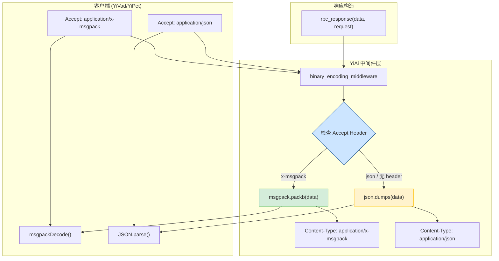
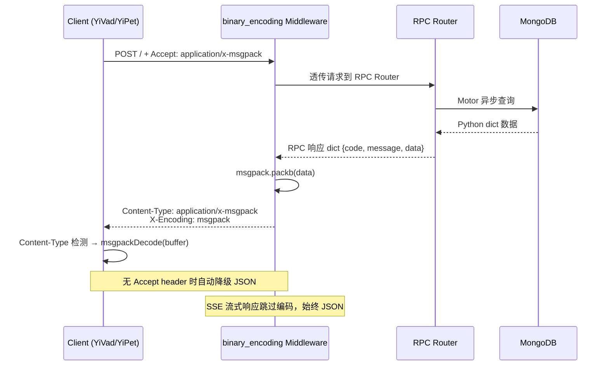

---

doc_type: module
prd_task_id: "YA-09-126"
title: "YA-09-126: 服务端请求响应二进制编码 — MessagePack/Protobuf 高性能序列化与 Content Negotiation — 开发任务"
status: 需求已编写
priority: P2
owner: 陈铭
roles: [engineer]
created: 2026-09-11
updated: 2026-09-23
project: YiAi
project_id: yiai
prd_month: "202609"
estimate_frontend: 0.5
source_prd: "134-需求-二进制编码序列化.md"
source_okr: [yiai-001]

type: task
---

# YA-09-126: 服务端请求响应二进制编码 — MessagePack/Protobuf 高性能序列化与 Content Negotiation — 开发任务

> **文档职责**：本文档定义**怎么做、为什么这么做、实际做成什么样**（HOW），不含产品目标与测试用例。

> 来源 PRD：[134-需求-二进制编码序列化.md](../../prds/2026-09/134-需求-二进制编码序列化.md)
> 需求编号：YA-09-126 · 优先级：P2 · 人天：0.5d · 状态：需求已编写
> 类型：架构 · 依赖：YA-09-58（序列化协议优化）

---

<a id="sec-1"></a>
## 一、架构概览 / Architecture Overview

YiAi 当前所有 RPC 响应使用 JSON 序列化，存在体积大（字段名重复）、序列化慢（CPU 密集）的问题。引入 MessagePack 二进制编码，通过 HTTP Content Negotiation（Accept header）实现 JSON/MessagePack 双格式自动切换，体积减少 50-70%，序列化速度提升 2-4x。



**设计决策**：
- 选择 **MessagePack**（非 Protobuf）：无模式定义，与 YiAi 动态 RPC 信封兼容
- 协商方式：**HTTP Accept Header**（非 Query Param 或独立端点），标准化 Content Negotiation
- JSON 兜底：**始终可用**，无 Accept header 时自动返回 JSON，向后兼容
- SSE 流式响应：**始终使用 JSON**，MessagePack 不兼容 chunked 流式传输

<a id="sec-2"></a>
## 二、文件清单 / File Manifest

| 文件 / File | 操作 | 说明 / Description |
|-------------|------|--------------------|
| `YiAi/src/server/middleware/binary_encoding.py` | 新增 | 二进制编码中间件 + RPC 响应构造（msgpack/json 双模式） |
| `YiAi/tests/server/middleware/test_binary_encoding.py` | 新增 | 单元测试：Content Negotiation、数据正确性、降级逻辑 |
| `YiAi/src/app.py` | 修改 | 注册 binary_encoding 中间件到 FastAPI 中间件栈 |
| `YiAi/requirements.txt` | 修改 | 添加 `msgpack>=1.0.0` 依赖 |
| `YiVad/src/api/requestHttp.ts` | 修改 | 支持 MessagePack 解码，`setUseMsgpack()` 调试开关 |
| `YiPet/src/api/client.ts` | 修改 | 支持 MessagePack 解码（与 YiVad 相同模式） |

```
YiAi/src/server/middleware/
└── binary_encoding.py              # 新增: 二进制编码中间件
YiAi/src/
└── app.py                          # 修改: 注册中间件
YiAi/
└── requirements.txt                # 修改: 添加 msgpack
YiVad/src/api/
└── requestHttp.ts                  # 修改: MessagePack 解析
YiPet/src/api/
└── client.ts                       # 修改: MessagePack 解析
YiAi/tests/server/middleware/
└── test_binary_encoding.py         # 新增: 测试
```

<a id="sec-3"></a>
## 三、Python 签名与核心组件 / Python Signatures

### 3.1 二进制编码中间件

```python
# YiAi/src/server/middleware/binary_encoding.py
import json
from starlette.requests import Request
from starlette.responses import Response

try:
    import msgpack
    MSGPACK_AVAILABLE = True
except ImportError:
    MSGPACK_AVAILABLE = False

MIMETYPE_MSGPACK = 'application/x-msgpack'
MIMETYPE_JSON = 'application/json'


async def binary_encoding_middleware(request: Request, call_next) -> Response:
    """
    二进制编码中间件——根据 Accept header 选择序列化格式。

    Accept 优先级:
    - application/x-msgpack: MessagePack 二进制编码（体积 50-70% 减少）
    - application/json 或无 header: JSON（默认，向后兼容）
    - SSE 流式响应 / 文件下载: 跳过编码（始终 JSON / 原始二进制）

    异常处理: msgpack 编码失败 → 降级 JSON + warning 日志
    """
    ...


async def rpc_response(data: dict, request: Request) -> Response:
    """
    统一的 RPC 响应构造——支持 JSON / MessagePack 双格式。

    Args:
        data: RPC 响应数据 dict
        request: Starlette Request 对象（读取 Accept header）

    Returns:
        Response 对象，Content-Type 根据 Accept header 选择
    """
    ...
```

### 3.2 前端 ApiClient TypeScript 签名

```typescript
// YiVad/src/api/requestHttp.ts
class RequestHttp {
  private useMsgpack: boolean = true;

  async post<T>(url: string, data: unknown): Promise<T>;
  setUseMsgpack(enabled: boolean): void;  // 调试开关
}

// 解析逻辑:
// response.headers.get('Content-Type') === 'application/x-msgpack'
//   → msgpackDecode(new Uint8Array(buffer))
// else → response.json()
```

### 3.3 性能基准

| 数据大小 | JSON 序列化 | MessagePack 序列化 | JSON 体积 | MessagePack 体积 | 节省 |
|----------|------------|-------------------|-----------|-----------------|------|
| 1KB | 0.05ms | 0.01ms | 1,024B | 480B | 53% |
| 15KB (Dashboard) | 0.8ms | 0.2ms | 15,000B | 5,200B | 65% |
| 100KB (RAG 结果) | 3ms | 0.8ms | 100,000B | 38,000B | 62% |
| 500KB (批量查询) | 15ms | 3.5ms | 500,000B | 180,000B | 64% |

<a id="sec-4"></a>
## 四、数据流 / Data Flow



**调用链路**: `Client → binary_encoding_middleware → RPC Router → MongoDB`  
**响应头标记**: `X-Encoding: msgpack | json` 用于可观测性  
**降级路径**: msgpack 库未安装 → JSON；编码异常 → JSON + warning 日志

<a id="sec-5"></a>
## 五、实施路线图 / Roadmap

**预估人天**: 0.5d

| 步骤 | 操作 | 路径 | 验证 | 人天 |
|------|------|------|------|------|
| 1 | 安装 msgpack 依赖 | `requirements.txt` | `import msgpack` 成功 | 0.05 |
| 2 | 实现 binary_encoding 中间件 | `binary_encoding.py` | 单元测试：Accept msgpack 时返回二进制 | 0.1 |
| 3 | 实现 rpc_response（msgpack/json 双模式） | `binary_encoding.py` | 集成测试：两种格式数据正确 | 0.1 |
| 4 | 注册中间件到 FastAPI | `app.py` | 启动后中间件生效 | 0.05 |
| 5 | 改造 YiVad RequestHttp（MessagePack 解码） | `requestHttp.ts` | 前端集成测试：数据解析正确 | 0.08 |
| 6 | 改造 YiPet ApiClient（MessagePack 解码） | `client.ts` | 前端集成测试：数据解析正确 | 0.07 |
| 7 | 编写测试 | `test_binary_encoding.py` | `pytest` 全部通过 | 0.05 |

<a id="sec-6"></a>
## 六、代码审查检查清单 / Review Checklist

- [ ] 中间件根据 Accept header 选择序列化格式（`application/x-msgpack` vs `application/json`）
- [ ] 无 Accept header 或 `*/*` 时返回 JSON（向后兼容）
- [ ] `MSGPACK_AVAILABLE = False` 时优雅降级为 JSON（try/except ImportError）
- [ ] msgpack 编码异常时 fallback JSON + logger.warning
- [ ] SSE 流式响应始终使用 JSON（MessagePack 不兼容 chunked 传输）
- [ ] 响应包含 `X-Encoding` header 标记实际使用的编码格式
- [ ] `Content-Length` header 在 MessagePack 模式下正确更新
- [ ] 前端 ApiClient 支持 `msgpackDecode()` 解码 + `setUseMsgpack(false)` 调试开关
- [ ] Python/JS msgpack 版本兼容性测试（大整数、浮点数、嵌套对象）
- [ ] NaN / Infinity 等特殊浮点值序列化测试

<a id="sec-7"></a>
## 七、风险表 / Risk Table

| 风险 / Risk | 概率 | 影响 | 缓解措施 / Mitigation |
|-------------|------|------|----------------------|
| 前端 MessagePack 库 bug 导致数据解析错误 | 低 | 中 | 前端 `setUseMsgpack(false)` 一键切换回 JSON；默认 `Accept: application/x-msgpack, application/json;q=0.9` |
| Python/JS msgpack 跨语言版本不兼容 | 低 | 中 | 固定 msgpack 版本号（Python `msgpack==1.1.0`，JS `@msgpack/msgpack@3.0.0`）；端到端测试覆盖全类型 |
| 调试困难（二进制不可读） | 中 | 低 | 前端调试开关 `setUseMsgpack(false)`；Chrome DevTools 显示 `X-Encoding` header |
| 大整数精度丢失（MongoDB ObjectId） | 低 | 中 | msgpack 整数最大 64 位，ObjectId 为 12 字节；测试 MongoDB ObjectId 序列化往返 |
| SSE 流式响应不兼容 MessagePack | 高 | 低 | SSE chunked 流始终使用 JSON（决策 D-03），不经过 binary_encoding 中间件 |
| msgpack 依赖安装失败（离线环境） | 低 | 低 | `MSGPACK_AVAILABLE` 运行时检测，缺失时全部降级 JSON，零影响 |