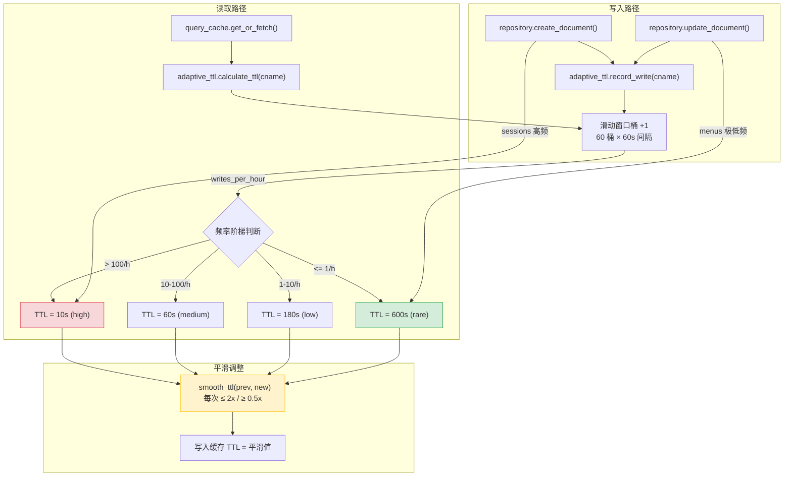
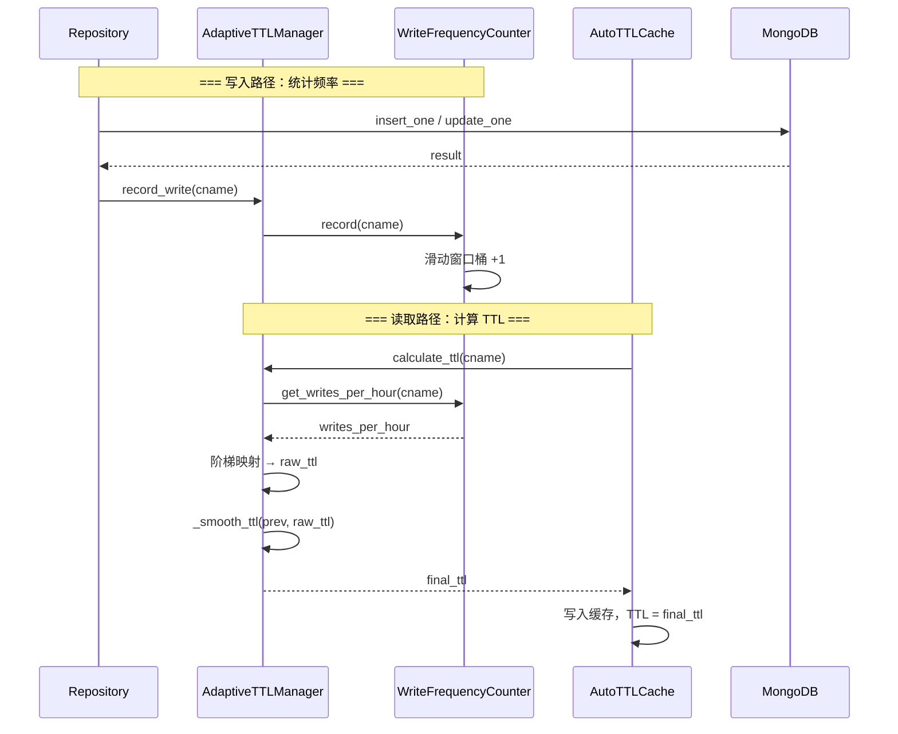

---

doc_type: module
prd_task_id: "YA-09-127"
title: "YA-09-127: 服务端请求缓存策略自适应 — 基于数据变更频率的动态缓存 TTL 调整算法 — 开发任务"
status: 需求已编写
priority: P2
owner: 陈铭
roles: [engineer]
created: 2026-09-11
updated: 2026-09-23
project: YiAi
project_id: yiai
prd_month: "202609"
estimate_frontend: 0.5
source_prd: "135-需求-自适应缓存TTL.md"
source_okr: [yiai-003]

type: task
---

# YA-09-127: 服务端请求缓存策略自适应 — 基于数据变更频率的动态缓存 TTL 调整算法 — 开发任务

> **文档职责**：本文档定义**怎么做、为什么这么做、实际做成什么样**（HOW），不含产品目标与测试用例。

> 来源 PRD：[135-需求-自适应缓存TTL.md](../../prds/2026-09/135-需求-自适应缓存TTL.md)
> 需求编号：YA-09-127 · 优先级：P2 · 人天：0.5d · 状态：需求已编写
> 类型：架构 · 依赖：YA-09-25（数据查询缓存层）、YA-09-66（缓存智能失效）

---

<a id="sec-1"></a>
## 一、架构概览 / Architecture Overview

YiAi 当前所有集合使用固定 TTL（60s），无法适应数据变更频率差异。sessions（每秒写入）与 menus（每月更新）使用相同 TTL 既造成高频数据过时，又浪费低频数据的数据库查询资源。本方案通过 60 分钟滑动窗口统计写入频率，阶梯映射 TTL（10s/60s/180s/600s），平滑调整避免缓存抖动。



**设计决策**：
- 频率统计：**60 分钟滑动窗口**（60 个桶，每分钟一个），准确可靠，内存可控
- TTL 调整：**阶梯映射**（4 档），简单可预测，TTL 不会频繁波动
- TTL 范围：**固定 10s-600s**，覆盖高频到极低频率的所有场景
- 平滑调整：每次变化不超过 **2x（增大）/ 0.5x（减小）**，防止批量写入导致的 TTL 骤变

<a id="sec-2"></a>
## 二、文件清单 / File Manifest

| 文件 / File | 操作 | 说明 / Description |
|-------------|------|--------------------|
| `YiAi/src/shared/adaptive_ttl.py` | 新增 | WriteFrequencyCounter + AdaptiveTTLManager + AutoTTLCache |
| `YiAi/tests/shared/test_adaptive_ttl.py` | 新增 | 单元测试：频率统计、TTL 计算、平滑调整、冷启动 |
| `YiAi/src/data/repository.py` | 修改 | 写入操作后调用 `adaptive_ttl.record_write(cname)` |
| `YiAi/src/shared/query_cache.py` | 修改 | 缓存 TTL 改用 `adaptive_ttl.calculate_ttl(cname)` |

```
YiAi/src/shared/
├── adaptive_ttl.py               # 新增: WriteFrequencyCounter + AdaptiveTTLManager
└── query_cache.py                # 修改: AutoTTLCache 集成自适应 TTL
YiAi/src/data/
└── repository.py                 # 修改: create/update 后 record_write()
YiAi/tests/shared/
└── test_adaptive_ttl.py          # 新增: 单元测试
```

<a id="sec-3"></a>
## 三、Python 签名与核心组件 / Python Signatures

### 3.1 写入频率计数器

```python
# YiAi/src/shared/adaptive_ttl.py
from collections import deque
from dataclasses import dataclass
import time

@dataclass
class TTLConfig:
    """自适应 TTL 配置。四个频率梯级，每个对应固定 TTL。"""
    HIGH_FREQ_THRESHOLD: int = 100   # > 100 writes/h → TTL 10s
    MED_FREQ_THRESHOLD: int = 10     # > 10 writes/h  → TTL 60s
    LOW_FREQ_THRESHOLD: int = 1      # > 1 write/h   → TTL 180s
    HIGH_FREQ_TTL: int = 10
    MED_FREQ_TTL: int = 60
    LOW_FREQ_TTL: int = 180
    RARE_TTL: int = 600
    MIN_TTL: int = 10
    MAX_TTL: int = 600
    DEFAULT_TTL: int = 60            # 冷启动默认值

class WriteFrequencyCounter:
    """写入频率计数器——60 分钟滑动窗口。
    每分钟一个桶，共 60 个桶，每个桶记录该分钟的写入次数。
    """
    WINDOW_MINUTES: int = 60
    BUCKET_INTERVAL: int = 60  # 秒

    def __init__(self):
        self._buckets: dict[str, deque[int]] = {}
        self._last_bucket_time: dict[str, float] = {}

    def record(self, cname: str) -> None:
        """记录一次写入事件。O(1) 操作。"""
        ...

    def get_writes_per_hour(self, cname: str) -> int:
        """获取过去 60 分钟的写入总次数。O(60) 操作。"""
        ...

    def _advance_buckets(self, cname: str, now: float) -> None:
        """推进桶——过期桶自动添加空桶（最旧的自动弹出）。"""
        ...
```

### 3.2 自适应 TTL 管理器

```python
class AdaptiveTTLManager:
    """自适应 TTL 管理器。
    根据数据变更频率动态调整缓存 TTL，阶梯映射 + 平滑过渡。
    """
    def __init__(self, config: TTLConfig = TTLConfig()):
        self.config = config
        self._counter = WriteFrequencyCounter()
        self._previous_ttls: dict[str, int] = {}

    def record_write(self, cname: str) -> None:
        """在数据修改操作中调用，更新写入频率统计。"""
        ...

    def calculate_ttl(self, cname: str) -> int:
        """计算自适应 TTL。阶梯映射 + 平滑调整。"""
        ...

    def _ttl_from_frequency(self, writes_per_hour: int) -> int:
        """频率 → TTL 阶梯映射。"""
        if writes_per_hour > self.config.HIGH_FREQ_THRESHOLD:
            return self.config.HIGH_FREQ_TTL      # 10s
        elif writes_per_hour > self.config.MED_FREQ_THRESHOLD:
            return self.config.MED_FREQ_TTL       # 60s
        elif writes_per_hour > self.config.LOW_FREQ_THRESHOLD:
            return self.config.LOW_FREQ_TTL       # 180s
        return self.config.RARE_TTL               # 600s

    def _smooth_ttl(self, previous: int, new: int) -> int:
        """平滑 TTL 调整：增大 ≤ 2x，减小 ≥ 0.5x。防止突变抖动。"""
        ...

    def get_stats(self, cname: str) -> dict:
        """获取自适应 TTL 统计（频率、TTL、梯级）。"""
        ...

# 全局单例
adaptive_ttl = AdaptiveTTLManager()
```

### 3.3 集成点签名

```python
# repository.py 集成
async def create_document(cname: str, data: dict):
    result = await db[cname].insert_one(data)
    adaptive_ttl.record_write(cname)  # ← 记录写入
    return result

# query_cache.py 集成
class AutoTTLCache:
    async def get_or_fetch(self, cname: str, key: str, fetch_fn):
        ttl = adaptive_ttl.calculate_ttl(cname)  # ← 自适应 TTL
        ...
```

### 3.4 各集合 TTL 预期值

| 集合 | 写入频率 | TTL |
|------|---------|-----|
| sessions（聊天会话） | > 100/h | 10s |
| bugs（缺陷追踪） | 10-100/h | 60s |
| knowledge_files（知识库） | 1-10/h | 180s |
| menus（菜单配置） | <= 1/h | 600s |
| users（用户数据） | <= 1/h | 600s |

<a id="sec-4"></a>
## 四、数据流 / Data Flow



**滑动窗口机制**: 60 个桶 × 每分钟 1 个桶。`record_write()` 向当前桶 +1，`_advance_buckets()` 随时间的推移将过期桶清空（添加新空桶，最旧的自动弹出）。`get_writes_per_hour()` 对所有桶求和。

<a id="sec-5"></a>
## 五、实施路线图 / Roadmap

**预估人天**: 0.5d

| 步骤 | 操作 | 路径 | 验证 | 人天 |
|------|------|------|------|------|
| 1 | 实现 WriteFrequencyCounter 滑动窗口 | `adaptive_ttl.py` | 单元测试：模拟写入后 sum 正确，过期桶归零 | 0.1 |
| 2 | 实现 AdaptiveTTLManager TTL 计算 | `adaptive_ttl.py` | 单元测试：4 种频率对应正确 TTL 阶梯 | 0.1 |
| 3 | 实现 TTL 平滑调整逻辑 | `adaptive_ttl.py` | 单元测试：TTL 10→600 受限于 20（2x），600→10 受限于 300（0.5x） | 0.05 |
| 4 | 集成到 repository.py 记录写入 | `repository.py` | 功能测试：create/update 后 writes_per_hour 增加 | 0.1 |
| 5 | 集成到 query_cache.py 自适应 TTL | `query_cache.py` | 功能测试：缓存 TTL 随频率变化 | 0.1 |
| 6 | 编写完整单元测试 | `test_adaptive_ttl.py` | `pytest` 全部通过，覆盖率 > 90% | 0.05 |

<a id="sec-6"></a>
## 六、代码审查检查清单 / Review Checklist

- [ ] WriteFrequencyCounter 使用 60 个桶的 deque 滑动窗口
- [ ] `record_write()` 为 O(1) 操作（仅更新当前桶）
- [ ] `get_writes_per_hour()` 正确求和所有桶
- [ ] 高频集合（> 100/h）TTL 降至 10s
- [ ] 低频集合（<= 1/h）TTL 升至 600s
- [ ] TTL 平滑调整：每次变化不超过 2x（增大）/ 0.5x（减小）
- [ ] 冷启动默认 TTL = 600s（偏保守，后续逐渐收敛）
- [ ] TTL 范围限制在 [10, 600] 秒
- [ ] 所有写入路径（create/update/delete）均调用 `record_write()`
- [ ] 滑动窗口过期桶自动清零（`_advance_buckets` 添加空桶）
- [ ] 桶字典按需创建（仅活跃集合），防止不活跃集合浪费内存
- [ ] `get_stats()` 返回诊断信息（频率、TTL、梯级）供可观测性

<a id="sec-7"></a>
## 七、风险表 / Risk Table

| 风险 / Risk | 概率 | 影响 | 缓解措施 / Mitigation |
|-------------|------|------|----------------------|
| 批量导入导致 TTL 骤降（如导入 1000 条文档） | 中 | 中 | 平滑调整限制（≤ 2x / ≥ 0.5x），需 3-4 次调整才达目标值 |
| 写入统计内存增长（不活跃集合未清理） | 低 | 低 | 按需创建桶（仅 record_write 过的集合），非全量预创建 |
| 重启后冷启动 TTL 不当（无历史数据） | 低 | 低 | 默认 600s（偏保守），正常运行后逐步收敛到真实值 |
| 滑动窗口统计不准确（跨小时边界） | 低 | 低 | 60 分钟窗口覆盖典型负载周期，`_advance_buckets` 按时间差推进 |
| TTL 变化导致缓存命中率波动 | 低 | 中 | 平滑调整 + 阶梯映射，TTL 仅在跨频率阈值时变化 |
| `record_write` 未在所有写路径调用 | 低 | 中 | 代码审查检查所有写操作；`get_stats()` 暴露实际写入统计供对比 |