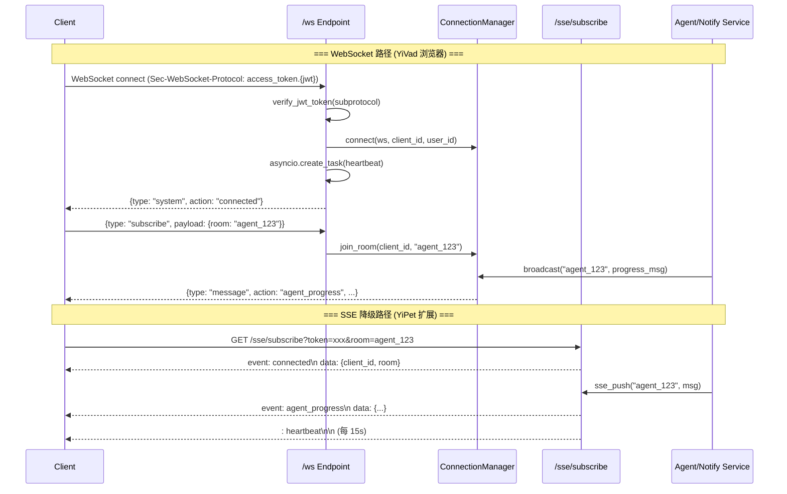

---

doc_type: module
prd_task_id: "YA-09-130"
title: "YA-09-130: WebSocket 实时通信 — FastAPI WS + 房间 + SSE 降级 — 开发方案"
status: 需求已编写
priority: P1
owner: 陈铭
roles: [engineer]
created: 2026-09-11
updated: 2026-09-23
project: YiAi
project_id: yiai
prd_month: "202609"
estimate_frontend: 1.5
source_prd: "136-需求-WebSocket实时通信.md"
source_okr: [yiai-001]

type: task
---

# YA-09-130: WebSocket 实时通信 — FastAPI WS + 房间 + SSE 降级 — 开发方案

> **文档职责**：本文档定义**怎么做、为什么这么做、实际做成什么样**（HOW），不含产品目标与测试用例。

> 来源 PRD：[136-需求-WebSocket实时通信.md](../../prds/2026-09/136-需求-WebSocket实时通信.md)
> 需求编号：YA-09-130 · 优先级：P1 · 人天：1.5d · 状态：需求已编写
> 依赖：无 · 前置需求：无

---

<a id="sec-1"></a>
## 一、架构概览 / Architecture Overview

YiAi 当前仅支持 HTTP 请求-响应模式（RPC 信封 + SSE 流式），无法服务端主动推送。本方案引入 FastAPI 原生 WebSocket 双向通信，配合房间路由和心跳检测，SSE 作为降级通道覆盖 YiPet content script 等不支持 WebSocket 的环境。

```mermaid
graph TD
    subgraph Clients["客户端"]
        YV["YiVad (浏览器)<br/>WebSocket 优先"]
        YP["YiPet (扩展)<br/>SSE 降级"]
    end

    subgraph WS["WebSocket 通道 (FastAPI 原生)"]
        AUTH["JWT 子协议认证<br/>Sec-WebSocket-Protocol"]
        CM["ConnectionManager<br/>连接/房间/心跳"]
        HB["心跳检测 30s<br/>超时 90s 断开"]
    end

    subgraph SSE["SSE 降级通道"]
        SSE_SUB["/sse/subscribe<br/>?token=xxx&room=xxx"]
        SSE_Q["asyncio.Queue<br/>消息队列推送"]
    end

    subgraph Biz["业务集成"]
        AGENT["Agent 进度推送<br/>agent_service._push_progress()"]
        NOTIFY["通知推送<br/>notify_service.push_notification()"]
    end

    YV -->|"ws://host/ws"| AUTH
    YP -->|"GET /sse/subscribe"| SSE_SUB
    AUTH --> CM
    CM --> HB
    CM -->|broadcast(room, msg)| AGENT
    CM -->|broadcast(room, msg)| NOTIFY
    SSE_Q -->|sse_push(room, msg)| AGENT
    SSE_Q -->|sse_push(room, msg)| NOTIFY

    style WS fill:#cce5ff,stroke:#004085
    style SSE fill:#e8daef,stroke:#6c3483
    style Biz fill:#d4edda,stroke:#28a745
```

**设计决策**：
- 实现方式：**FastAPI 原生 WebSocket**（非 socket.io），零额外依赖，消息格式完全自定义
- 认证：**Sec-WebSocket-Protocol 子协议**传递 JWT，不暴露 token 在 URL
- 消息格式：**自定义 JSON** `{type, action, payload, timestamp, seq}`，兼容 RPC 信封风格
- 降级：**自动降级**（WebSocket 3s 超时 → SSE），YiPet 默认 SSE

<a id="sec-2"></a>
## 二、文件清单 / File Manifest

| 文件 / File | 操作 | 说明 / Description |
|-------------|------|--------------------|
| `YiAi/src/services/websocket/__init__.py` | 新增 | WebSocket 模块包 |
| `YiAi/src/services/websocket/connection_manager.py` | 新增 | ConnectionManager：连接管理、房间路由、心跳检测、消息广播 |
| `YiAi/src/services/websocket/ws_routes.py` | 新增 | WebSocket 端点 `/ws`：JWT 子协议认证、消息路由 |
| `YiAi/src/services/websocket/sse_routes.py` | 新增 | SSE 降级端点 `/sse/subscribe`：事件流推送 |
| `YiAi/src/services/ai/agent_service.py` | 修改 | Agent 进度推送集成（`_push_agent_progress()`） |
| `YiAi/src/services/notification/notify_service.py` | 修改 | 实时通知推送集成（`push_notification()`） |
| `YiAi/src/shared/config.py` | 修改 | 添加 `ws_max_connections`、`ws_heartbeat_interval` 配置 |
| `YiAi/main.py` | 修改 | 注册 WebSocket 和 SSE 路由 |
| `YiVad/src/composables/useWebSocket.ts` | 新增 | 前端 ConnectionManager（WS 优先 + SSE 降级） |
| `YiPet/src/services/RealtimeClient.ts` | 新增 | YiPet SSE 客户端（content script 不支持 WS） |

```
YiAi/src/services/websocket/
├── __init__.py                     # 新增: 模块包
├── connection_manager.py           # 新增: 连接/房间/心跳管理
├── ws_routes.py                    # 新增: WebSocket 端点 + 认证
└── sse_routes.py                   # 新增: SSE 降级端点
YiAi/src/services/ai/
└── agent_service.py                # 修改: Agent 进度推送
YiAi/src/services/notification/
└── notify_service.py               # 修改: 实时通知推送
```

<a id="sec-3"></a>
## 三、Python 签名与核心组件 / Python Signatures

### 3.1 ConnectionManager

```python
# YiAi/src/services/websocket/connection_manager.py
from dataclasses import dataclass, field
from fastapi import WebSocket

@dataclass
class WSConnection:
    ws: WebSocket
    client_id: str
    user_id: str
    rooms: set[str] = field(default_factory=set)
    connected_at: float = field(default_factory=time.time)
    last_heartbeat: float = field(default_factory=time.time)
    seq: int = 0

class ConnectionManager:
    """WebSocket 连接管理器——全局单例。
    职责: connect/disconnect, join_room/leave_room, broadcast/send_personal, heartbeat, max_connections=1000.
    """
    def __init__(self):
        """max_connections=1000, heartbeat_interval=30s, timeout=90s."""

    async def connect(self, ws: WebSocket, client_id: str, user_id: str) -> WSConnection:
        """接受连接。超 max_connections 返回 1013 关闭码。"""
    async def disconnect(self, client_id: str): ...
    async def join_room(self, client_id: str, room: str): ...
    async def leave_room(self, client_id: str, room: str): ...
    async def broadcast(self, room: str, message: dict, exclude: Optional[str] = None):
        """单客户端异常标记 dead 并异步清理。"""
    async def send_personal(self, client_id: str, message: dict): ...
    async def start_heartbeat(self, client_id: str):
        """每 30s 发 ping，90s 无响应断开。"""
    @property
    def active_connections(self) -> int: ...
    @property
    def active_rooms(self) -> int: ...

manager = ConnectionManager()  # 全局单例
```

### 3.2 WebSocket 端点

```python
# YiAi/src/services/websocket/ws_routes.py
from fastapi import APIRouter, WebSocket, WebSocketDisconnect

router = APIRouter()

# 消息类型常量
MSG_SUBSCRIBE = "subscribe"    # 加入房间
MSG_UNSUBSCRIBE = "unsubscribe"  # 离开房间
MSG_MESSAGE = "message"        # 业务消息
MSG_PING = "ping"              # 心跳请求
MSG_PONG = "pong"              # 心跳响应
MSG_ERROR = "error"            # 错误消息
MSG_SYSTEM = "system"          # 系统消息

async def _extract_token_from_subprotocol(ws: WebSocket) -> Optional[str]:
    """从 Sec-WebSocket-Protocol 头部提取 JWT token。"""
    ...

@router.websocket("/ws")
async def websocket_endpoint(ws: WebSocket):
    """WebSocket 主端点。
    1. JWT 子协议认证 (verify_jwt_token)
    2. ws.accept(subprotocol=token)
    3. 发送 connected 确认
    4. asyncio.create_task(heartbeat)
    5. 消息循环: subscribe/unsubscribe/ping/message
    6. finally: heartbeat.cancel() + disconnect
    """
    ...
```

### 3.3 SSE 降级端点

```python
# YiAi/src/services/websocket/sse_routes.py
router = APIRouter()
_sse_clients: dict[str, asyncio.Queue] = {}

@router.get("/sse/subscribe")
async def sse_subscribe(
    request: Request,
    token: str = Query(...),   # JWT token (URL 参数)
    room: str = Query(...),    # 房间名
) -> StreamingResponse:
    """SSE 订阅端点（WebSocket 降级方案）。
    返回 text/event-stream，每 15s 发 heartbeat 保持连接。
    """
    ...

async def sse_push(room: str, message: dict):
    """向房间的 SSE 客户端推送消息。Queue.put_nowait() 非阻塞。"""
    ...
```

### 3.4 Agent 进度推送集成

```python
# agent_service.py 中新增
async def _push_agent_progress(self, session_id: str, step: dict):
    """推送 Agent 执行进度到 WebSocket 房间 agent_{session_id}。
    同时推送到 WebSocket (manager.broadcast) 和 SSE (sse_push)。
    """
    room = f"agent_{session_id}"
    message = {
        "type": "message", "action": "agent_progress",
        "payload": {"session_id": session_id, "step": step["step_num"],
                     "action": step["action"], "tool": step.get("tool")},
        "timestamp": time.time(),
    }
    await manager.broadcast(room, message)
    await sse_push(room, message)
```

<a id="sec-4"></a>
## 四、数据流 / Data Flow



**消息格式规范**: `{type, action, payload, sender?, timestamp, seq?}` —— `type` 区分系统/业务/错误；`action` 标识具体动作（subscribe/agent_progress/notification）；`sender` 为 client_id 用于去重；`seq` 为递增序号用于顺序保证。

<a id="sec-5"></a>
## 五、实施路线图 / Roadmap

**预估人天**: 1.5d

| 步骤 | 操作 | 路径 | 验证 | 人天 |
|------|------|------|------|------|
| 1 | 实现 ConnectionManager（连接/房间/心跳） | `connection_manager.py` | 单元测试：connect/disconnect/join/broadcast | 0.3 |
| 2 | 实现 WebSocket 端点 + JWT 子协议认证 | `ws_routes.py` | websockets 库测试连接/认证/消息收发 | 0.25 |
| 3 | 实现 SSE 降级端点 | `sse_routes.py` | curl 测试 SSE 订阅和推送 | 0.15 |
| 4 | Agent 进度推送集成 | `agent_service.py` | Agent 执行时前端实时收到进度 | 0.2 |
| 5 | 通知推送集成 | `notify_service.py` | 触发通知后前端实时收到 | 0.15 |
| 6 | 前端 WebSocket Manager (YiVad) | `useWebSocket.ts` | WS 连接/重连/SSE 降级正常 | 0.15 |
| 7 | 前端 SSE Client (YiPet) | `RealtimeClient.ts` | SSE 订阅正常，消息推送可接收 | 0.15 |
| 8 | 连接监控指标 + 告警 | `connection_manager.py` | 连接数/消息量可采集，超限告警 | 0.1 |
| 9 | 全链路集成测试 | 全模块 | WS + SSE 双通道消息收发正常 | 0.05 |

<a id="sec-6"></a>
## 六、代码审查检查清单 / Review Checklist

- [ ] ConnectionManager 使用 `asyncio.Lock` 保护 `_connections` 和 `_rooms` 并发访问
- [ ] `connect()` 检查 `_max_connections` 限制，超限返回 1013 关闭码
- [ ] `disconnect()` 清理所有房间中的 client_id，防止内存泄漏
- [ ] `broadcast()` 捕获单客户端异常，标记 dead 并异步清理，不影响其他客户端
- [ ] 心跳检测 `asyncio.create_task`，在 `finally` 中 `cancel()` + `await` 等待取消完成
- [ ] JWT 认证从 `sec-websocket-protocol` 头部提取，不暴露在 URL 中
- [ ] 消息解析 `try/except json.JSONDecodeError`，失败返回 error 消息非断开连接
- [ ] SSE 端点正确处理 `request.is_disconnected()` 检测客户端断开
- [ ] SSE 推送使用 `queue.put_nowait()` 避免阻塞，QueueFull 时静默丢弃
- [ ] 消息格式包含 `timestamp` 字段供前端排序去重
- [ ] `ws_max_connections` 和 `ws_heartbeat_interval` 从 config 读取（非硬编码）
- [ ] 前端 `useWebSocket` 支持 WS 优先 + 3s 超时降级 SSE
- [ ] 前端处理 `token_expired` 消息，自动刷新 token 重连

<a id="sec-7"></a>
## 七、风险表 / Risk Table

| 风险 / Risk | 概率 | 影响 | 缓解措施 / Mitigation |
|-------------|------|------|----------------------|
| WS 连接耗尽服务器资源 | 中 | 高 | max_connections=1000，单用户最多 5 连接 |
| 心跳 task 泄漏 | 中 | 中 | finally 中 cancel() + await CancelledError |
| JWT 在长连接期间过期 | 高 | 低 | 握手时校验；过期后主动关闭 + token_expired 通知重连 |
| SSE 连接数过多 | 中 | 中 | 异步队列；max_sse_clients=2000；超限 503 |
| 消息广播阻塞事件循环 | 低 | 高 | broadcast 单客户端 5s 超时；dead client 异步清理 |
| YiPet content script 不支持 WS | 高 | 中 | 默认 SSE；SSE 不可用时降级 HTTP 轮询 |
| send_json 缓冲区满 | 低 | 中 | send_json 加 5s 超时，超时断开连接 |