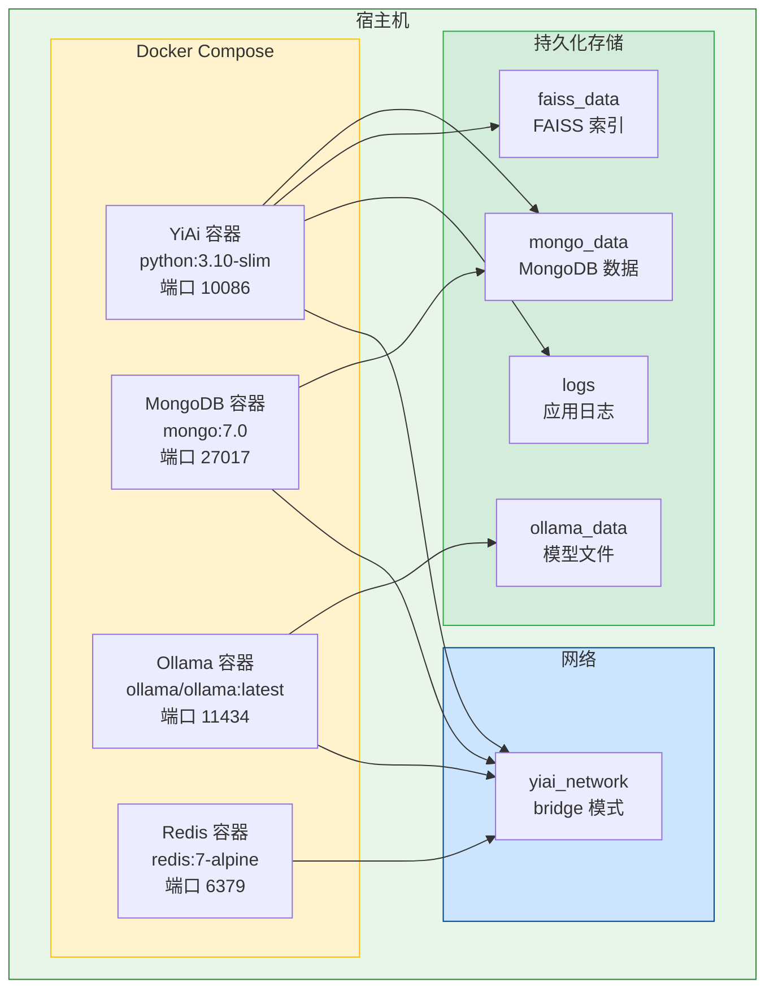
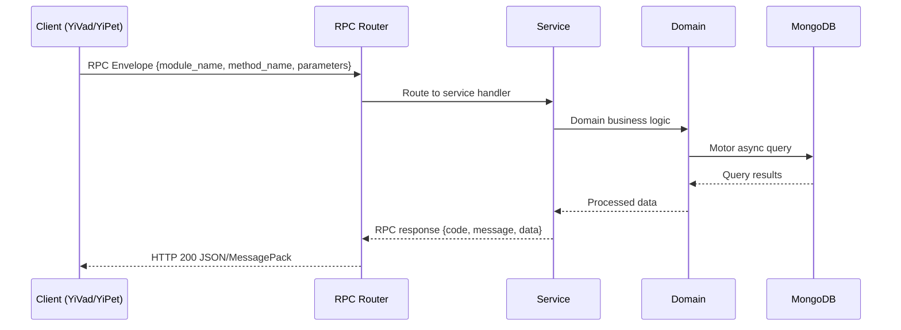

---

doc_type: module
prd_task_id: "YA-09-56"
title: "YA-09-56: 容器化与 Docker 部署 — 全栈一键启动 — 开发方案"
status: 需求已编写
priority: P2
owner: 陈铭
roles: [engineer]
created: 2026-09-11
updated: 2026-09-23
project: YiAi
project_id: yiai
prd_month: "202609"
estimate_frontend: 3.0
source_prd: "137-需求-容器化与Docker部署.md"
source_okr: [yiai-001]
related_tests: ["137-prd-test-容器化与Docker部署"]

type: task
---

# YA-09-56: 容器化与 Docker 部署 — 全栈一键启动

> **文档职责**：本文档定义**怎么做、为什么这么做、实际做成什么样**（HOW），不含产品目标与测试用例。

> 来源 PRD：[137-需求-容器化与Docker部署.md](../../prds/2026-09/137-需求-容器化与Docker部署.md)
> 需求编号：YA-09-56 · 优先级：P2 · 人天：3.0 · 状态：需求已编写
> 类型：功能 · 依赖：无 · 前置需求：无

---

<a id="sec-1"></a>
## 一、架构概览 / Architecture Overview

YA-09-131: 容器化与 Docker 部署 — 多阶段构建 + Docker Compose + 健康检查 + 镜像优化



<a id="sec-2"></a>
## 二、文件清单 / File Manifest

| 文件 / File | 操作 | 说明 / Description |
|-------------|------|--------------------|
| `YiAi/src/services/xxx/service.py` | 新增 | Core service logic
| `YiAi/src/services/xxx/rpc_handler.py` | 新增 | RPC route handler
| `YiAi/tests/test_xxx.py` | 新增 | Unit tests

> Source PRD: 137-需求-容器化与Docker部署.md

<a id="sec-3"></a>
## 三、Python 签名与核心组件 / Python Signatures

### 3.1 核心组件

```python
from fastapi import APIRouter
from motor.motor_asyncio import AsyncIOMotorClient
from shared.config import settings
from shared.logging import get_logger
@router.get("/health")
async def health_check():
    """综合健康检查端点。"""
    # MongoDB 连接检查
    # Redis 连接检查（如果配置了 Redis）
    if settings.redis_url:
            import redis.asyncio as redis
    return checks
@router.get("/health/live")
async def liveness_check():
    """存活探针（仅检查进程是否存活）。"""
    return {"status": "alive"}
@router.get("/health/ready")
async def readiness_check():
    """就绪探针（检查所有依赖是否就绪）。"""
    # 简化版健康检查，用于 K8s readiness probe
```

<a id="sec-4"></a>
## 四、数据流 / Data Flow



**Call chain**: `Client -> RPC Router -> Service -> Domain -> MongoDB`  
**Response format**: `{code: 0, message: "ok", data: ...}`  
**Async model**: Full-chain `async/await`, Motor async MongoDB driver.  
**Error propagation**: Service exceptions caught by middleware -> standard error codes (1001-9999).

<a id="sec-5"></a>
## 五、实施路线图 / Roadmap

**预估人天 / Estimated**: 3.0

| 步骤 / Step | 操作 / Action | 路径 / Path | 验证 / Verification | 人天 / Days |
|-------------|---------------|-------------|---------------------|-------------|
| 1 | 编写 `requirements.in` + `pip-compile` 生成 `requirements.lock` | `requirements.in`, `requirements.lock` | `pip install -r requirements.lock` 成功，无版本冲突 | 0.1 |
| 2 | 编写多阶段 Dockerfile（builder + runtime） | `Dockerfile` | `docker build -t yiai .` 成功，镜像 < 500MB | 0.3 |
| 3 | 编写 `.dockerignore` 和 `.env.example` | `.dockerignore`, `.env.example` | 构建上下文 < 10MB，环境变量可正常读取 | 0.05 |
| 4 | 编写 Docker Compose 编排（4 个服务） | `docker-compose.yml` | `docker compose up -d` 所有服务健康 | 0.25 |
| 5 | 实现健康检查端点（/health, /health/live, /health/ready） | `services/health/health_routes.py` | `curl /health` 返回服务状态，依赖检查正确 | 0.15 |
| 6 | 编写 MongoDB 初始化脚本 | `scripts/mongo-init.js` | 容器启动后数据库和集合自动创建 | 0.1 |
| 7 | 编写多架构构建脚本 | `scripts/build-multiarch.sh` | `./scripts/build-multiarch.sh` 生成 amd64+arm64 镜像 | 0.15 |
| 8 | 配置资源限制（CPU/内存） | `docker-compose.yml` | `docker stats` 确认资源限制生效 | 0.1 |
| 9 | 镜像安全扫描（Trivy） | CI 配置 | 无 HIGH/CRITICAL 漏洞 | 0.15 |
| 10 | 全链路集成测试 | Docker Compose 环境 | 所有服务启动，API 可正常调用 | 0.15 |
| 风险 | 概率 | 影响 | 等级 | 缓解措施 | 应急预案 |
| Ollama 镜像体积过大（> 5GB） | 高 | 中 | 中 | Ollama 镜像已包含运行时，模型文件通过 volume 挂载，首次拉取时间长但后续不变 | 预拉取 Ollama 镜像到宿主机，或使用宿主机的 Ollama 服务 |

<a id="sec-6"></a>
## 六、代码审查检查清单 / Review Checklist

- [ ] Dockerfile 使用多阶段构建（builder + runtime），builder 阶段安装编译依赖，runtime 阶段仅保留运行时
- [ ] 最终镜像以非 root 用户运行（`USER yiai`）
- [ ] `HEALTHCHECK` 指令配置正确（interval=30s, timeout=10s, retries=3）
- [ ] `.dockerignore` 排除 `.git`、`__pycache__`、`tests/`、`.env` 等无关文件
- [ ] Docker Compose 中所有服务配置了 `restart: unless-stopped`
- [ ] Docker Compose 中 YiAi 使用 `depends_on: condition: service_healthy` 等待依赖就绪
- [ ] 所有持久化数据使用 named volumes（`mongo_data`, `faiss_data`, `logs`）
- [ ] 敏感信息通过环境变量传入，不在镜像中硬编码
- [ ] `.env.example` 提供所有必需的环境变量模板
- [ ] 资源限制（`deploy.resources.limits`）对每个服务合理配置
- [ ] 健康检查端点 `/health` 在依赖不可用时返回 `degraded` 而非 `unhealthy`
- [ ] 多架构构建脚本支持 `linux/amd64` 和 `linux/arm64`
- [ ] `ruff` 代码规范通过
- [ ] `mypy` 类型检查通过
---
## 十二、回归问题预测
| # | 问题 | 发现场景 | 根因 | 修复方式 |

<a id="sec-7"></a>
## 七、风险表 / Risk Table

| 风险 / Risk | 影响 / Impact | 缓解措施 / Mitigation | 应急预案 / Contingency |
|-------------|---------------|----------------------|------------------------|
| Ollama 镜像体积过大（> 5GB） | 高 | 中 | 中 |
| 多架构构建在 CI 中耗时过长 | 中 | 低 | 中 |
| 生产环境容器内文件权限问题 | 中 | 中 | 中 |
| Docker Compose 网络冲突 | 低 | 中 | 低 |
| 健康检查端点被外部利用 | 低 | 低 | 低 |
| 镜像安全漏洞 | 中 | 中 | 中 |
| 场景 | 回滚方式 | 回滚时间 | 风险 |
| Docker 部署失败 | 停止容器 `docker compose down`，恢复手动启动 `python main.py` | < 2min | 低：手动启动方式不受影响 |
| 镜像构建失败 | 使用上一个成功的镜像版本 `docker compose up -d`（指定旧版本） | < 1min | 低：旧镜像可用 |
| Docker Compose 配置错误 | 回退 `docker-compose.yml` 到上一个版本，重新 `docker compose up -d` | < 1min | 低：git 回退即可 |
