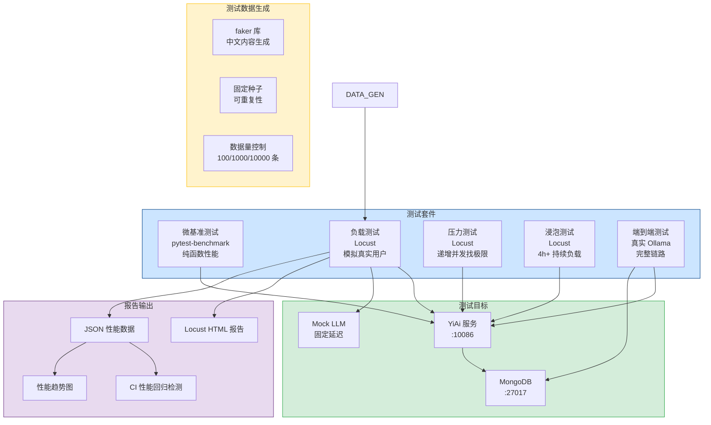
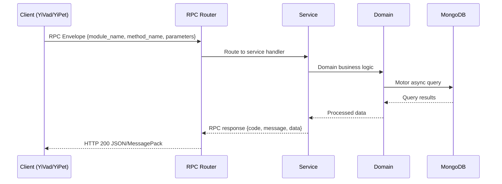

---

doc_type: module
prd_task_id: "YA-09-80"
title: "YA-09-80: 负载与压力测试 — Locust + CI 回归检测 — 开发方案"
status: 需求已编写
priority: P2
owner: 陈铭
roles: [engineer]
created: 2026-09-11
updated: 2026-09-14
project: YiAi
project_id: yiai
prd_month: "202609"
estimate_frontend: 1.5
source_prd: "138-需求-负载与压力测试.md"
source_okr: [yiai-001]

type: task
---

# YA-09-80: 负载与压力测试 — Locust + CI 回归检测

> **文档职责**：本文档定义**怎么做、为什么这么做、实际做成什么样**（HOW），不含产品目标与测试用例。

> 来源 PRD：[138-需求-负载与压力测试.md](../../prds/2026-09/138-需求-负载与压力测试.md)
> 需求编号：YA-09-80 · 优先级：P2 · 人天：1.5 · 状态：需求已编写
> 类型：功能 · 依赖：无 · 前置需求：YA-09-131（Docker 部署，可选）

---

<a id="sec-1"></a>
## 一、架构概览 / Architecture Overview

YA-09-132: 负载与压力测试 — Locust 性能基准 + 压力测试 + 长时浸泡 + CI 回归检测



<a id="sec-2"></a>
## 二、文件清单 / File Manifest

| 文件 / File | 操作 | 说明 / Description |
|-------------|------|--------------------|
| `YiAi/src/services/xxx/service.py` | 新增 | Core service logic
| `YiAi/src/services/xxx/rpc_handler.py` | 新增 | RPC route handler
| `YiAi/tests/test_xxx.py` | 新增 | Unit tests

> Source PRD: 138-需求-负载与压力测试.md

<a id="sec-3"></a>
## 三、Python 签名与核心组件 / Python Signatures

### 3.1 核心组件

```python
import random
import time
import json
from locust import HttpUser, task, between, events
from locust.exception import StopUser
class YiAiUser(HttpUser):
    """模拟真实用户行为。"""
    def on_start(self):
        """用户初始化：登录获取 token。"""
        self.token = "test_token_perf_test"
        self.session_id = f"perf_{random.randint(1, 10000)}"
        self.headers = {"X-Token": self.token, "Content-Type": "application/json"}
    def _rpc(self, module_name: str, method_name: str, parameters: dict) -> dict:
        """发送 RPC 信封请求。"""
            if resp.status_code != 200:
            return resp.json()
    # ============================================================
    # 任务组（权重控制请求比例）
    # ============================================================
    @task(10)
    def chat_query(self):
    @task(8)
    def data_query(self):
    @task(5)
    def rag_search(self):
```
### 3.2 组件 2

```python
import time
from locust import HttpUser, task, between
class SSEUser(HttpUser):
    """SSE 流式聊天测试用户。"""
    def on_start(self):
        self.token = "test_token_perf_test"
    @task
    def sse_chat_stream(self):
        """SSE 流式聊天。"""
            if resp.status_code != 200:
                return
                if line and line.startswith("data:"):
```
### 3.3 组件 3

```python
import random
import json
from datetime import datetime, timedelta
from faker import Faker
# 知识库文档模板
def generate_knowledge_files(count: int = 1000) -> list[dict]:
    """生成知识库文档数据。"""
    return docs
def generate_sessions(count: int = 500) -> list[dict]:
    """生成聊天会话数据。"""
    return sessions
def generate_bugs(count: int = 200) -> list[dict]:
    """生成缺陷追踪数据。"""
    return bugs
def seed_test_data():
    """生成并保存测试数据。"""
    import os
if __name__ == "__main__":
```

<a id="sec-4"></a>
## 四、数据流 / Data Flow



**Call chain**: `Client -> RPC Router -> Service -> Domain -> MongoDB`  
**Response format**: `{code: 0, message: "ok", data: ...}`  
**Async model**: Full-chain `async/await`, Motor async MongoDB driver.  
**Error propagation**: Service exceptions caught by middleware -> standard error codes (1001-9999).

<a id="sec-5"></a>
## 五、实施路线图 / Roadmap

**预估人天 / Estimated**: 1.5

| 步骤 / Step | 操作 / Action | 路径 / Path | 验证 / Verification | 人天 / Days |
|-------------|---------------|-------------|---------------------|-------------|
| 1 | 编写测试数据生成器 | `data_generator.py` | 生成 1000 条知识库 + 500 条会话 + 200 条缺陷数据 | 0.1 |
| 2 | 编写 Locust 主测试脚本（7 个 task） | `locustfile.py` | `locust --headless -u 10 -r 5 -t 1m` 全部通过 | 0.2 |
| 3 | 编写 SSE 流式测试脚本 | `locust_sse.py` | SSE 流式请求正常接收，chunk 计数正确 | 0.1 |
| 4 | 编写微基准测试 | `test_micro_benchmarks.py` | `pytest --benchmark-only` 通过，输出基准数据 | 0.1 |
| 5 | 建立性能基线 | 手动执行负载测试 | 生成 `baseline.json`，记录 P50/P95/P99 | 0.1 |
| 6 | 执行压力测试找 breaking point | `locustfile.py` | 确定最大并发用户数，记录 breaking point | 0.1 |
| 7 | 执行浸泡测试（4h+） | `locustfile.py` | 内存使用稳定，无持续增长趋势 | 0.1 |
| 8 | 编写 CI 流水线配置 | `.github/workflows/perf-test.yml` | CI 定时触发，报告可查看 | 0.1 |
| 9 | 编写性能回归检测脚本 | `scripts/check_perf_regression.py` | 性能退化时 CI 失败，输出退化详情 | 0.1 |
| 风险 | 概率 | 影响 | 等级 | 缓解措施 | 应急预案 |
| CI 环境性能波动导致误报 | 高 | 中 | 中 | 使用固定资源的 CI runner，多次运行取中位数，设置合理的退化阈值（1.5x） | 手动在本地复现确认，误报时更新基线 |
| 真实 Ollama 调用导致测试不稳定 | 高 | 中 | 中 | 负载测试使用 Mock LLM，端到端测试独立运行 | Mock LLM 不可用时跳过 LLM 相关测试 |

<a id="sec-6"></a>
## 六、代码审查检查清单 / Review Checklist

- [ ] Locust 测试脚本覆盖所有主要 API 端点（聊天、数据查询、RAG、知识库、Agent）
- [ ] Task 权重合理反映真实用户行为比例
- [ ] SSE 流式测试正确处理 `stream=True` 和 `iter_lines`
- [ ] 测试数据生成器使用固定随机种子（`random.seed(42)`）
- [ ] 测试数据生成器生成的数据量可配置（100/1000/10000）
- [ ] 微基准测试覆盖纯函数（响应构建、JSON 序列化、JWT 解码）
- [ ] CI 流水线配置了定时触发（`schedule: cron`）和手动触发（`workflow_dispatch`）
- [ ] 性能回归检测脚本正确处理无基线的情况（首次运行）
- [ ] 性能回归阈值可配置（`THRESHOLD_P95`, `THRESHOLD_FAILURE`）
- [ ] Mock LLM 服务在负载测试中启用，避免依赖真实 Ollama
- [ ] `ruff` 代码规范通过
- [ ] `mypy` 类型检查通过
---
## 十二、回归问题预测
| # | 问题 | 发现场景 | 根因 | 修复方式 |
|---|------|---------|------|---------|
| 1 | Locust `--headless` 模式下 `stream=True` 的 `iter_lines` 阻塞导致测试超时 | SSE 流式测试中，`resp.iter_lines()` 在流未结束时一直等待，Locust 的 `wait_time` 被绕过，所有用户卡在 SSE 请求上 | SSE 是长连接，`iter_lines` 在服务端关闭连接前不会返回，Locust 用户无法释放去执行其他任务 | 在 SSE 测试中使用 `with gevent.Timeout(30)` 或 `resp.iter_lines(timeout=30)` 限制等待时间，或在 Locust 的 `wait_time` 中设置最大等待时间 |

<a id="sec-7"></a>
## 七、风险表 / Risk Table

| 风险 / Risk | 影响 / Impact | 缓解措施 / Mitigation | 应急预案 / Contingency |
|-------------|---------------|----------------------|------------------------|
| CI 环境性能波动导致误报 | 高 | 中 | 中 |
| 真实 Ollama 调用导致测试不稳定 | 高 | 中 | 中 |
| 测试数据生成与实际数据分布差异大 | 中 | 中 | 中 |
| Locust 单进程无法模拟高并发 | 中 | 低 | 低 |
| 性能测试影响 CI 运行时间 | 中 | 低 | 低 |
| 场景 | 回滚方式 | 回滚时间 | 风险 |
| Locust 测试导致服务崩溃 | 停止 Locust（Ctrl+C），重启 YiAi 服务 | < 1min | 低：测试环境，不影响生产 |
| 性能基线文件损坏 | 删除 `baseline.json`，重新运行负载测试生成新基线 | < 10min | 低：仅影响 CI 性能回归检测 |
| CI 性能测试频繁误报 | 提高退化阈值（1.5x → 2.0x），或临时禁用 CI 性能测试 | < 1min | 低：不影响功能测试 |
| 测试数据生成脚本异常 | 回退到上一个版本的 `data_generator.py` | < 1min | 低：仅影响测试数据 |
