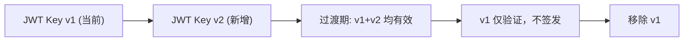

# YA-09-22: 密钥管理与凭证轮换 — JWT + MongoDB + 泄露检测 — 开发方案

> **文档职责**：本文档定义**怎么做、为什么这么做、实际做成什么样**（HOW），不含产品目标与测试用例。

> 来源 PRD：[139-需求-密钥管理与凭证轮换.md](../../prds/2026-09/139-需求-密钥管理与凭证轮换.md)
> 需求编号：YA-09-22 · 优先级：P1 · 人天：1.5d · 状态：需求已编写

---

<a id="sec-1"></a>
## 一、方案

解决 JWT Secret 硬编码和凭证长期不变的问题。支持密钥轮换、多版本并存、泄露检测。

### 轮换策略



### 实现

```python
class KeyManager:
    def __init__(self):
        self._keys: dict[str, str] = {}  # kid → secret

    def get_active_key(self) -> tuple[str, str]:
        """返回 (kid, secret) 用于签发"""
        ...

    def get_verification_keys(self) -> list[str]:
        """返回所有有效 secret 用于验证"""
        ...
```

JWT payload 中增加 `kid` 字段标识签名密钥版本。

---

<a id="sec-2"></a>
## 二、实施步骤

| 步骤 | 验证 | 人天 |
|------|------|------|
| 1 | KeyManager + JWT kid 支持 | 多版本密钥共存验证 | 0.5 |
| 2 | 自动轮换定时任务 + 泄露检测 | 模拟泄露 → 自动轮换 + 告警 | 0.5 |
| 3 | MongoDB 凭证轮换 + 测试 | 凭证变更后重连成功 | 0.5 |

**合计：1.5d**。

---

<a id="sec-3"></a>
## 三、关联模块

- 修复：[JWT Secret 硬编码](../../bugs/2026-09/认证/01-认证-JWT-Secret硬编码默认值.md)
- 关联：[YA-09-18 敏感信息加密](./43-prd-task-敏感信息加密.md)